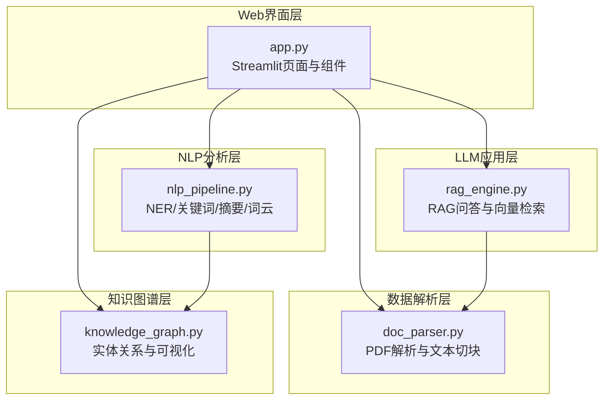
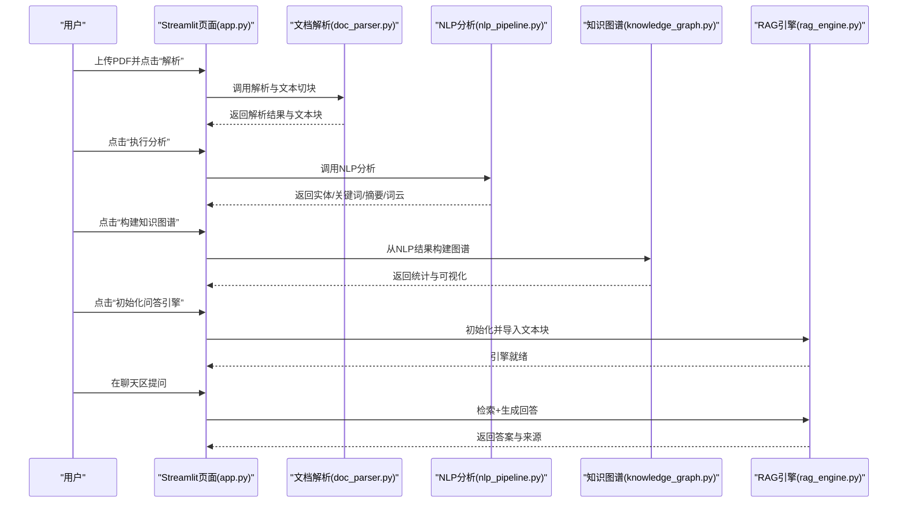
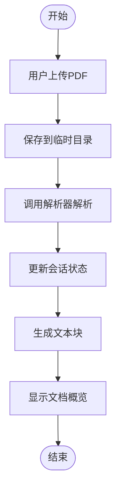
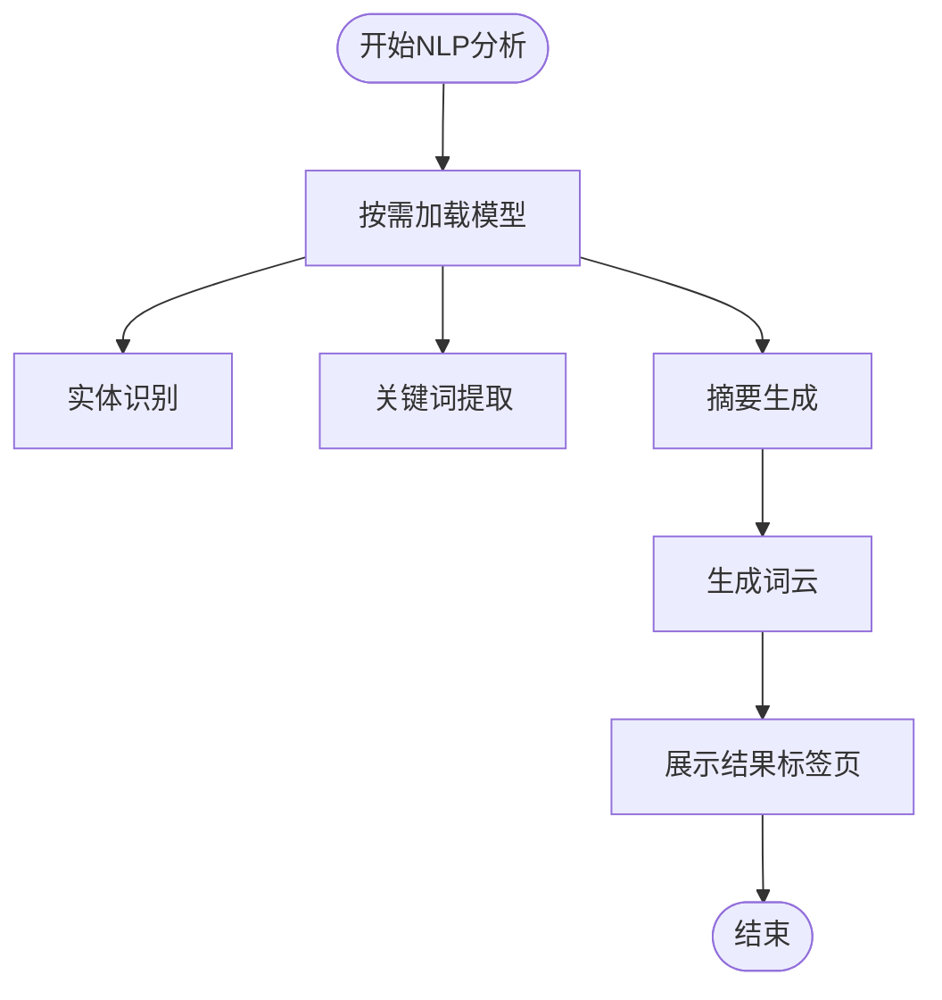
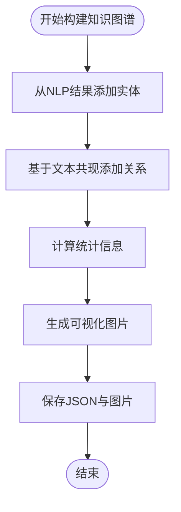
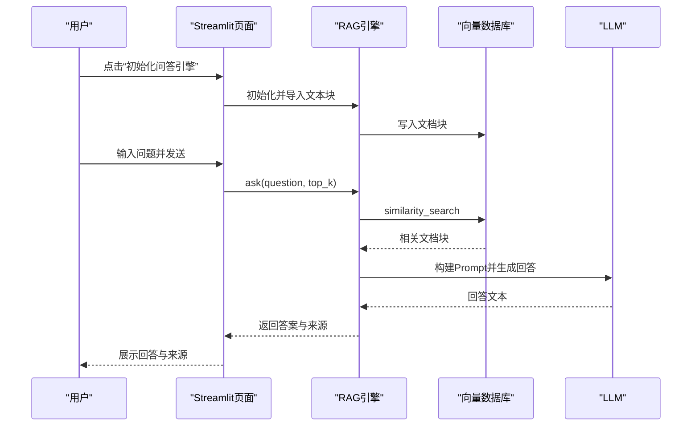
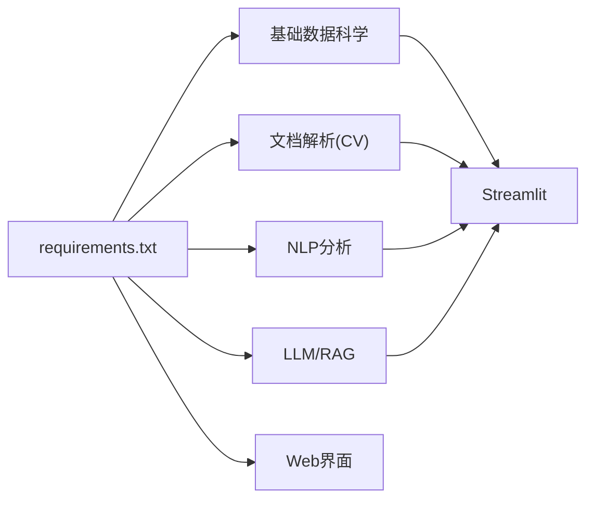

# Web应用界面

<cite>
**本文引用的文件**
- [app.py](file://zhixi/src/app.py)
- [doc_parser.py](file://zhixi/src/doc_parser.py)
- [nlp_pipeline.py](file://zhixi/src/nlp_pipeline.py)
- [knowledge_graph.py](file://zhixi/src/knowledge_graph.py)
- [rag_engine.py](file://zhixi/src/rag_engine.py)
- [requirements.txt](file://zhixi/requirements.txt)
- [.gitignore](file://zhixi/.gitignore)
- [test_core.py](file://zhixi/tests/test_core.py)
</cite>

## 目录
1. [简介](#简介)
2. [项目结构](#项目结构)
3. [核心组件](#核心组件)
4. [架构总览](#架构总览)
5. [详细组件分析](#详细组件分析)
6. [依赖分析](#依赖分析)
7. [性能考虑](#性能考虑)
8. [故障排查指南](#故障排查指南)
9. [结论](#结论)
10. [附录](#附录)

## 简介
本项目是“智析（ZhiXi）”多模态文档智能分析与知识问答平台的Web前端应用，基于Streamlit构建。应用提供从PDF文档上传、解析、NLP分析、知识图谱构建到RAG智能问答的完整工作流。界面采用宽屏布局与侧边栏配置，支持OpenAI API与本地Ollama两种LLM运行模式，并通过自定义CSS实现美观的视觉风格。

## 项目结构
应用采用模块化分层设计：
- Web界面层：Streamlit页面与组件渲染
- 数据解析层：PDF文本/表格/图像提取
- NLP分析层：实体识别、关键词提取、摘要生成、词云
- 知识图谱层：实体关系抽取与可视化
- LLM应用层：RAG问答与向量检索

图表来源
- [app.py:463-491](file://zhixi/src/app.py#L463-L491)
- [doc_parser.py:98-144](file://zhixi/src/doc_parser.py#L98-L144)
- [nlp_pipeline.py:106-145](file://zhixi/src/nlp_pipeline.py#L106-L145)
- [knowledge_graph.py:137-151](file://zhixi/src/knowledge_graph.py#L137-L151)
- [rag_engine.py:154-191](file://zhixi/src/rag_engine.py#L154-L191)

章节来源
- [app.py:29-60](file://zhixi/src/app.py#L29-L60)
- [requirements.txt:1-45](file://zhixi/requirements.txt#L1-L45)

## 核心组件
- 页面配置与样式：设置页面标题、图标、布局与自定义CSS样式
- 会话状态管理：统一维护文档路径、解析结果、NLP结果、知识图谱状态、RAG引擎状态与聊天历史
- 侧边栏配置：LLM模式切换（OpenAI API/Ollama）、模型参数、RAG参数（文本块大小、重叠、检索数量）
- 主内容区：四个标签页分别承载“文档解析”“NLP分析”“知识图谱”“智能问答”

章节来源
- [app.py:63-76](file://zhixi/src/app.py#L63-L76)
- [app.py:78-132](file://zhixi/src/app.py#L78-L132)
- [app.py:463-491](file://zhixi/src/app.py#L463-L491)

## 架构总览
应用采用“模块化+分层”的架构，前端通过Streamlit渲染UI，后端各模块通过函数调用与数据传递协作。整体流程如下：

图表来源
- [app.py:176-195](file://zhixi/src/app.py#L176-L195)
- [app.py:240-262](file://zhixi/src/app.py#L240-L262)
- [app.py:322-347](file://zhixi/src/app.py#L322-L347)
- [app.py:423-446](file://zhixi/src/app.py#L423-L446)
- [app.py:448-461](file://zhixi/src/app.py#L448-L461)

## 详细组件分析

### 页面与布局设计
- 页面配置：宽屏布局、展开侧边栏、页面标题与图标
- 自定义样式：主标题渐变色、副标题说明、指标卡片样式
- 响应式设计：使用Streamlit列布局与标签页，适配不同屏幕宽度
- 用户体验：通过提示信息、成功/错误消息、加载动画提升交互反馈

章节来源
- [app.py:29-60](file://zhixi/src/app.py#L29-L60)
- [app.py:463-491](file://zhixi/src/app.py#L463-L491)

### 文档上传与解析
- 上传区域：支持PDF文件上传，显示文件名与大小
- 解析流程：保存到临时目录，触发解析，更新会话状态，自动切分文本块
- 结果展示：指标卡片（页数、字符数、表格数、图像数），可展开查看文本预览

图表来源
- [app.py:144-174](file://zhixi/src/app.py#L144-L174)
- [app.py:176-195](file://zhixi/src/app.py#L176-L195)
- [doc_parser.py:212-268](file://zhixi/src/doc_parser.py#L212-L268)

章节来源
- [app.py:144-174](file://zhixi/src/app.py#L144-L174)
- [doc_parser.py:98-144](file://zhixi/src/doc_parser.py#L98-L144)

### NLP智能分析
- 功能：实体识别、关键词提取、摘要生成、词云生成
- 触发：点击“执行分析”，首次运行需下载模型
- 展示：四个标签页分别展示关键词、实体、摘要、词云
- 优化：延迟加载模型、限制输入长度避免显存溢出

图表来源
- [app.py:223-262](file://zhixi/src/app.py#L223-L262)
- [nlp_pipeline.py:106-145](file://zhixi/src/nlp_pipeline.py#L106-L145)
- [nlp_pipeline.py:235-262](file://zhixi/src/nlp_pipeline.py#L235-L262)

章节来源
- [app.py:223-262](file://zhixi/src/app.py#L223-L262)
- [nlp_pipeline.py:45-75](file://zhixi/src/nlp_pipeline.py#L45-L75)

### 知识图谱构建与可视化
- 构建来源：优先使用NLP分析结果，也可直接从文本共现关系构建
- 统计信息：节点数、边数、实体类型分布、度数最高的节点
- 可视化：根据实体类型着色、节点大小反映度数、保存PNG图片
- 数据持久化：保存为JSON，便于后续加载与分析

图表来源
- [app.py:306-347](file://zhixi/src/app.py#L306-L347)
- [knowledge_graph.py:137-151](file://zhixi/src/knowledge_graph.py#L137-L151)
- [knowledge_graph.py:224-313](file://zhixi/src/knowledge_graph.py#L224-L313)

章节来源
- [app.py:306-347](file://zhixi/src/app.py#L306-L347)
- [knowledge_graph.py:44-66](file://zhixi/src/knowledge_graph.py#L44-L66)

### 智能问答（RAG）
- 引擎初始化：根据侧边栏配置选择OpenAI或Ollama，导入文本块到向量数据库
- 问答流程：检索top-k相关文档块，构造Prompt，调用LLM生成回答，返回来源
- 聊天界面：记录历史，支持查看来源片段
- 参数控制：检索数量top_k由侧边栏滑条控制

图表来源
- [app.py:370-421](file://zhixi/src/app.py#L370-L421)
- [app.py:423-446](file://zhixi/src/app.py#L423-L446)
- [app.py:448-461](file://zhixi/src/app.py#L448-L461)
- [rag_engine.py:192-263](file://zhixi/src/rag_engine.py#L192-L263)

章节来源
- [app.py:370-421](file://zhixi/src/app.py#L370-L421)
- [rag_engine.py:47-94](file://zhixi/src/rag_engine.py#L47-L94)

## 依赖分析
- 基础依赖：NumPy、Pandas、Matplotlib、Scikit-learn
- 文档解析：PyMuPDF、pdfplumber、OpenCV、PaddleOCR
- NLP分析：Transformers、PyTorch、spaCy、KeyBERT、Wordcloud
- LLM/RAG：LangChain、ChromaDB、OpenAI、tiktoken
- Web界面：Streamlit、python-dotenv、tqdm、Pillow

图表来源
- [requirements.txt:6-39](file://zhixi/requirements.txt#L6-L39)

章节来源
- [requirements.txt:1-45](file://zhixi/requirements.txt#L1-L45)

## 性能考虑
- 模型延迟加载：NLP与RAG模块在首次使用时才加载模型，减少初始启动时间
- 输入长度限制：NER与摘要模块对输入长度进行限制，避免显存溢出
- 文本切块策略：按段落优先切分，结合重叠，平衡召回与重复
- 可视化裁剪：知识图谱可视化对节点数量进行上限控制，保证渲染效率
- 向量数据库批处理：RAG导入文档时采用批量写入，提高吞吐量

章节来源
- [nlp_pipeline.py:162-163](file://zhixi/src/nlp_pipeline.py#L162-L163)
- [nlp_pipeline.py:220-221](file://zhixi/src/nlp_pipeline.py#L220-L221)
- [doc_parser.py:212-268](file://zhixi/src/doc_parser.py#L212-L268)
- [knowledge_graph.py:249-252](file://zhixi/src/knowledge_graph.py#L249-L252)
- [rag_engine.py:184-188](file://zhixi/src/rag_engine.py#L184-L188)

## 故障排查指南
- 首次运行模型下载缓慢：NLP分析首次需要下载模型，建议在网络较好的环境下运行
- OpenAI API报错：检查API Key是否正确设置，确认网络可达
- Ollama连接失败：确认Ollama服务地址与模型名称配置正确
- 知识图谱无法可视化：检查matplotlib字体配置与依赖安装
- RAG无结果：确认已导入文档块，检查向量数据库是否正常
- 文件过大导致内存不足：适当增大文本块大小与重叠，或降低top_k

章节来源
- [app.py:260-261](file://zhixi/src/app.py#L260-L261)
- [app.py:444-445](file://zhixi/src/app.py#L444-L445)
- [knowledge_graph.py:242-246](file://zhixi/src/knowledge_graph.py#L242-L246)
- [rag_engine.py:217-223](file://zhixi/src/rag_engine.py#L217-L223)

## 结论
本应用通过清晰的模块划分与友好的界面设计，实现了从文档上传到智能问答的全链路体验。侧边栏配置灵活、标签页布局直观，配合响应式与加载反馈，提升了用户体验。建议在生产环境中关注模型缓存、向量数据库持久化与并发访问的稳定性。

## 附录

### 配置选项与自定义参数
- LLM运行模式
  - OpenAI API：需配置API Key与模型名称
  - 本地Ollama：需配置服务地址与模型名称
- RAG参数
  - 文本块大小：范围200–1000，默认500
  - 重叠大小：范围0–200，默认50
  - 检索数量：范围1–10，默认4
- 其他
  - 页面布局：宽屏
  - 侧边栏状态：默认展开

章节来源
- [app.py:83-128](file://zhixi/src/app.py#L83-L128)
- [app.py:29-35](file://zhixi/src/app.py#L29-L35)

### 界面定制与主题修改
- 自定义CSS：可在页面配置处扩展样式类，如指标卡片、按钮样式等
- 主题色彩：通过CSS变量或类名调整主色调与背景
- 响应式布局：利用Streamlit列布局与标签页适配不同屏幕尺寸

章节来源
- [app.py:38-60](file://zhixi/src/app.py#L38-L60)

### 使用示例
- 启动应用：在项目根目录执行Streamlit运行命令
- 上传并解析：选择PDF文件，点击“解析文档”
- 执行NLP分析：点击“执行分析”，等待完成后查看结果
- 构建知识图谱：点击“构建知识图谱”，查看统计与可视化
- 智能问答：点击“初始化问答引擎”，在聊天区提问并查看来源

章节来源
- [app.py:6-8](file://zhixi/src/app.py#L6-L8)
- [app.py:167-169](file://zhixi/src/app.py#L167-L169)
- [app.py:231-233](file://zhixi/src/app.py#L231-L233)
- [app.py:314-316](file://zhixi/src/app.py#L314-L316)
- [app.py:380-400](file://zhixi/src/app.py#L380-L400)

### 测试与验证
- 单元测试覆盖：知识图谱、文档解析、NLP、RAG的数据结构与基本行为
- 测试运行：在项目根目录执行pytest命令

章节来源
- [test_core.py:1-168](file://zhixi/tests/test_core.py#L1-L168)