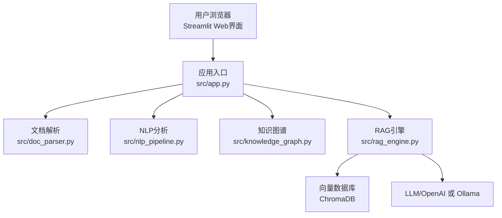
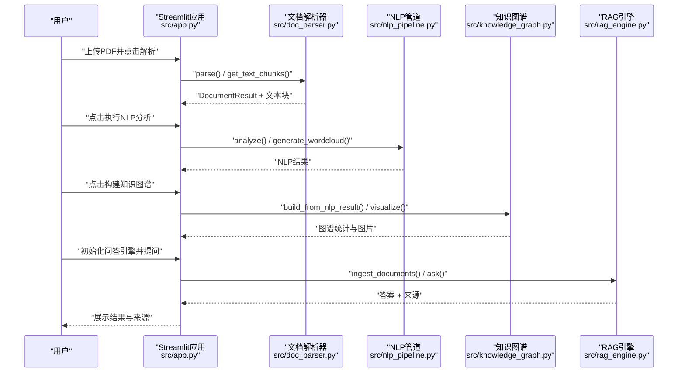
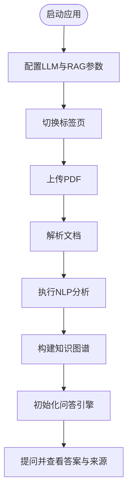
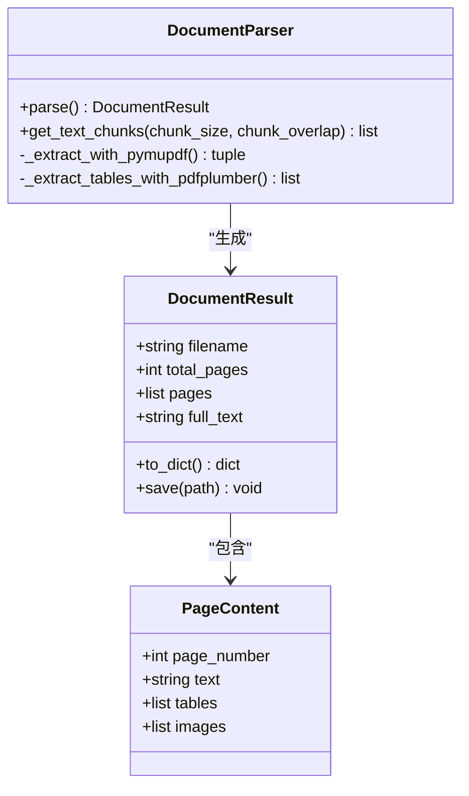
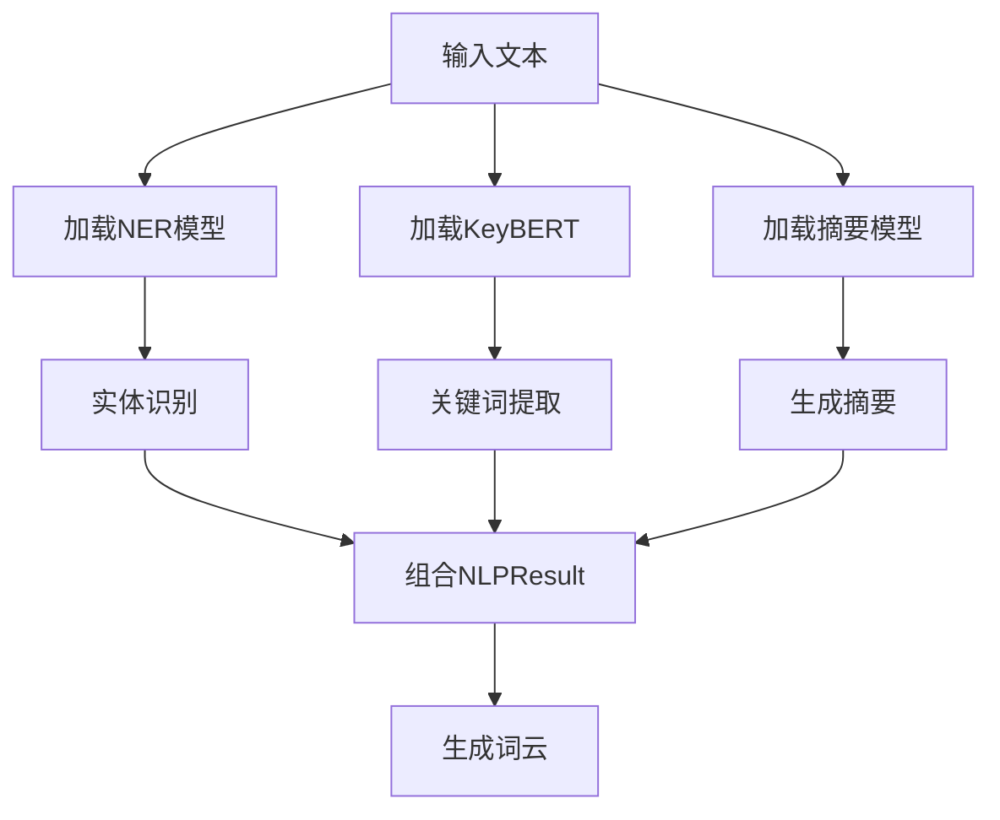
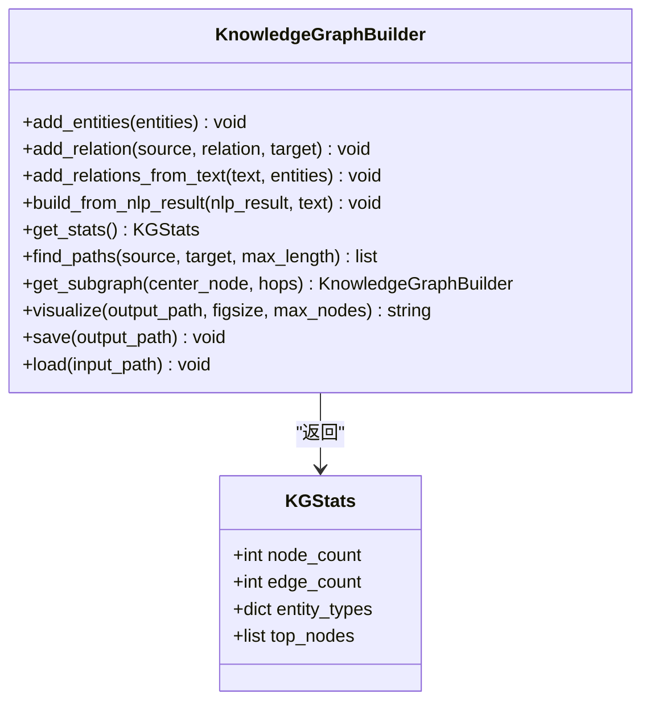
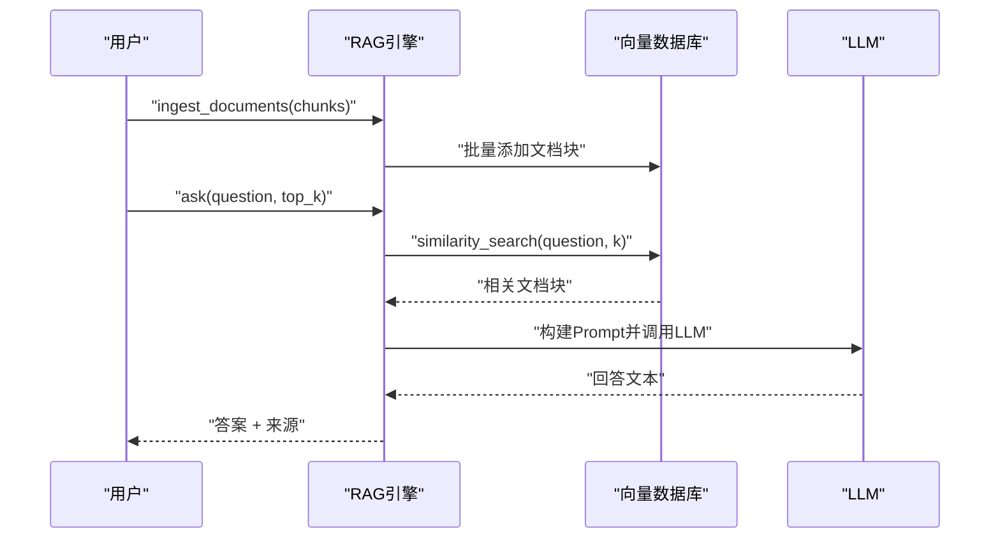

# 快速开始

<cite>
**本文引用的文件**
- [requirements.txt](file://zhixi/requirements.txt)
- [app.py](file://zhixi/src/app.py)
- [doc_parser.py](file://zhixi/src/doc_parser.py)
- [nlp_pipeline.py](file://zhixi/src/nlp_pipeline.py)
- [knowledge_graph.py](file://zhixi/src/knowledge_graph.py)
- [rag_engine.py](file://zhixi/src/rag_engine.py)
- [test_core.py](file://zhixi/tests/test_core.py)
</cite>

## 目录
1. [简介](#简介)
2. [项目结构](#项目结构)
3. [核心组件](#核心组件)
4. [架构总览](#架构总览)
5. [详细组件分析](#详细组件分析)
6. [依赖分析](#依赖分析)
7. [性能考虑](#性能考虑)
8. [故障排除指南](#故障排除指南)
9. [结论](#结论)
10. [附录](#附录)

## 简介
本指南面向首次使用者，帮助你在30分钟内完成智析平台（ZhiXi）的环境准备、安装与运行，并完成第一个PDF文档的解析与分析。平台提供多模态文档解析、NLP智能分析、知识图谱构建与RAG智能问答的完整工作流。

## 项目结构
- 根目录位于 zhixi，包含源码、测试、依赖清单与示例数据目录。
- Web应用入口为 src/app.py，采用 Streamlit 构建交互界面。
- 核心功能模块：
  - 文档解析：src/doc_parser.py（PDF文本/表格/图像提取）
  - NLP分析：src/nlp_pipeline.py（NER、关键词、摘要、词云）
  - 知识图谱：src/knowledge_graph.py（实体关系抽取与可视化）
  - RAG引擎：src/rag_engine.py（向量检索+LLM问答）

图表来源
- [app.py:463-492](file://zhixi/src/app.py#L463-L492)
- [doc_parser.py:98-144](file://zhixi/src/doc_parser.py#L98-L144)
- [nlp_pipeline.py:106-145](file://zhixi/src/nlp_pipeline.py#L106-L145)
- [knowledge_graph.py:137-151](file://zhixi/src/knowledge_graph.py#L137-L151)
- [rag_engine.py:154-191](file://zhixi/src/rag_engine.py#L154-L191)

章节来源
- [app.py:1-492](file://zhixi/src/app.py#L1-L492)

## 核心组件
- Streamlit Web应用：提供上传PDF、执行解析、NLP分析、知识图谱构建、RAG问答的交互界面。
- 文档解析器：从PDF提取文本、表格、图像，支持文本分块用于RAG。
- NLP管道：实体识别、关键词提取、自动摘要、词云生成。
- 知识图谱构建器：从实体与共现关系构建图谱，支持统计与可视化。
- RAG引擎：支持OpenAI API与本地Ollama两种模式，向量检索+LLM生成回答。

章节来源
- [app.py:176-461](file://zhixi/src/app.py#L176-L461)
- [doc_parser.py:98-268](file://zhixi/src/doc_parser.py#L98-L268)
- [nlp_pipeline.py:106-262](file://zhixi/src/nlp_pipeline.py#L106-L262)
- [knowledge_graph.py:137-321](file://zhixi/src/knowledge_graph.py#L137-L321)
- [rag_engine.py:154-263](file://zhixi/src/rag_engine.py#L154-L263)

## 架构总览
下图展示了从用户上传PDF到最终问答的端到端流程：

图表来源
- [app.py:176-461](file://zhixi/src/app.py#L176-L461)
- [doc_parser.py:98-268](file://zhixi/src/doc_parser.py#L98-L268)
- [nlp_pipeline.py:106-262](file://zhixi/src/nlp_pipeline.py#L106-L262)
- [knowledge_graph.py:137-321](file://zhixi/src/knowledge_graph.py#L137-L321)
- [rag_engine.py:154-263](file://zhixi/src/rag_engine.py#L154-L263)

## 详细组件分析

### Web应用与启动
- 启动方式：在 zhixi 目录下运行 Streamlit 应用入口。
- 功能模块：文档解析、NLP分析、知识图谱、智能问答四个标签页。
- 配置项：侧边栏支持选择LLM模式（OpenAI API 或 本地Ollama）、RAG参数（文本块大小、重叠、检索数量）。

图表来源
- [app.py:463-492](file://zhixi/src/app.py#L463-L492)
- [app.py:78-132](file://zhixi/src/app.py#L78-L132)
- [app.py:144-195](file://zhixi/src/app.py#L144-L195)
- [app.py:223-262](file://zhixi/src/app.py#L223-L262)
- [app.py:306-368](file://zhixi/src/app.py#L306-L368)
- [app.py:370-421](file://zhixi/src/app.py#L370-L421)

章节来源
- [app.py:1-60](file://zhixi/src/app.py#L1-L60)
- [app.py:78-132](file://zhixi/src/app.py#L78-L132)
- [app.py:144-195](file://zhixi/src/app.py#L144-L195)
- [app.py:223-262](file://zhixi/src/app.py#L223-L262)
- [app.py:306-368](file://zhixi/src/app.py#L306-L368)
- [app.py:370-421](file://zhixi/src/app.py#L370-L421)

### 文档解析器
- 能力：从PDF提取文本、表格、图像；将全文切分为重叠文本块，供RAG使用。
- 数据结构：PageContent、DocumentResult；支持保存JSON结果。
- 错误降级：表格提取失败时返回空表格列表，保证流程继续。

图表来源
- [doc_parser.py:64-144](file://zhixi/src/doc_parser.py#L64-L144)
- [doc_parser.py:32-56](file://zhixi/src/doc_parser.py#L32-L56)
- [doc_parser.py:41-56](file://zhixi/src/doc_parser.py#L41-L56)

章节来源
- [doc_parser.py:64-268](file://zhixi/src/doc_parser.py#L64-L268)

### NLP分析管道
- 能力：命名实体识别（NER）、关键词提取（KeyBERT）、自动摘要（Transformers/BART）、词云生成（WordCloud）。
- 设计：延迟加载模型，按需初始化，减少内存占用。
- 结果：NLPResult包含实体、关键词、摘要、词数；支持转字典序列化。

图表来源
- [nlp_pipeline.py:106-145](file://zhixi/src/nlp_pipeline.py#L106-L145)
- [nlp_pipeline.py:147-233](file://zhixi/src/nlp_pipeline.py#L147-L233)
- [nlp_pipeline.py:235-262](file://zhixi/src/nlp_pipeline.py#L235-L262)

章节来源
- [nlp_pipeline.py:45-262](file://zhixi/src/nlp_pipeline.py#L45-L262)

### 知识图谱构建器
- 能力：添加实体、添加关系、从NLP结果与原文构建图谱、统计分析、路径查找、子图提取、可视化。
- 可视化：支持节点颜色按实体类型、节点大小按度数、图例与布局优化。
- 数据持久化：支持保存/加载JSON格式图谱。

图表来源
- [knowledge_graph.py:44-173](file://zhixi/src/knowledge_graph.py#L44-L173)
- [knowledge_graph.py:27-42](file://zhixi/src/knowledge_graph.py#L27-L42)

章节来源
- [knowledge_graph.py:44-321](file://zhixi/src/knowledge_graph.py#L44-L321)

### RAG问答引擎
- 能力：支持OpenAI API与本地Ollama两种模式；文档块导入向量库（ChromaDB）；相似检索+LLM生成回答。
- 流程：初始化LLM与Embedding → 导入文档块 → 相似检索 → 构建Prompt → LLM回答 → 返回答案与来源。
- 便捷函数：quick_rag一键完成解析、导入、问答。

图表来源
- [rag_engine.py:154-263](file://zhixi/src/rag_engine.py#L154-L263)
- [rag_engine.py:265-281](file://zhixi/src/rag_engine.py#L265-L281)

章节来源
- [rag_engine.py:47-263](file://zhixi/src/rag_engine.py#L47-L263)

## 依赖分析
- 基础数据科学：numpy、pandas、matplotlib、seaborn、scikit-learn
- 文档解析（CV层）：PyMuPDF、pdfplumber、opencv-python、paddleocr、paddlepaddle
- NLP分析：transformers、torch、spacy、keybert、wordcloud
- LLM应用/RAG：langchain、langchain-community、langchain-openai、chromadb、openai、tiktoken
- 知识图谱：networkx
- Web界面：streamlit
- 工具：python-dotenv、tqdm、Pillow

章节来源
- [requirements.txt:1-45](file://zhixi/requirements.txt#L1-L45)

## 性能考虑
- 模型延迟加载：NLP与RAG均采用按需初始化，首次运行会下载模型，耗时较长，建议提前运行以缓存模型。
- 文本切分策略：RAG导入前对文档进行重叠切分，平衡召回与上下文连贯性。
- 可视化裁剪：知识图谱可视化默认限制节点数量，避免渲染开销过大。
- 进度反馈：解析与分析过程使用进度条与状态提示，提升交互体验。

## 故障排除指南
- Python版本与虚拟环境
  - 建议使用Python 3.10–3.11，确保兼容性。
  - 在项目根目录创建并激活虚拟环境后，再安装依赖。
- pip安装失败
  - 若网络受限，优先使用国内镜像源安装。
  - 遇到编译错误（如vc++、OpenCV、PaddleOCR），请先安装对应系统依赖包或使用预编译wheel。
- OpenAI API相关
  - 缺少OPENAI_API_KEY或密钥无效会导致RAG初始化失败。
  - 确认模型名称正确（如gpt-4o-mini/gpt-4o/gpt-3.5-turbo）。
- 本地Ollama模式
  - 确认Ollama服务运行在默认端口，模型名称与本地可用模型一致。
- ChromaDB与向量库
  - 若之前导入过旧集合导致冲突，可调用清空接口删除集合后重新导入。
- 首次运行慢
  - 首次下载模型与依赖包需要时间，建议在安静环境下等待。
- Streamlit页面空白或报错
  - 确保在 zhixi 目录下运行应用入口，且依赖已完整安装。
- 测试验证
  - 可通过运行基础测试验证核心模块逻辑是否正常（不依赖外部API）。

章节来源
- [app.py:84-118](file://zhixi/src/app.py#L84-L118)
- [rag_engine.py:109-115](file://zhixi/src/rag_engine.py#L109-L115)
- [rag_engine.py:305-312](file://zhixi/src/rag_engine.py#L305-L312)
- [test_core.py:1-168](file://zhixi/tests/test_core.py#L1-L168)

## 结论
按照本指南，你可以在30分钟内完成环境准备、安装依赖、启动Web应用，并成功上传PDF文档执行解析、NLP分析、知识图谱构建与RAG问答。若遇到问题，可参考故障排除章节逐项排查。

## 附录

### 环境准备与安装步骤
- 步骤1：准备Python环境（建议3.10–3.11），在项目根目录创建并激活虚拟环境。
- 步骤2：进入 zhixi 目录，安装依赖：pip install -r requirements.txt。
- 步骤3：启动Web应用：streamlit run src/app.py。
- 步骤4：在浏览器中访问应用，按提示完成配置与使用。

章节来源
- [requirements.txt:4-5](file://zhixi/requirements.txt#L4-L5)
- [app.py:6-9](file://zhixi/src/app.py#L6-L9)

### 首个使用示例：上传PDF并执行基本分析
- 在“文档解析”标签页上传PDF，点击“解析文档”，查看页数、字符数、表格数、图像数等指标。
- 在“NLP智能分析”标签页点击“执行分析”，查看关键词、实体、摘要与词云。
- 在“知识图谱”标签页点击“构建知识图谱”，查看统计与可视化图片。
- 在“智能问答”标签页点击“初始化问答引擎”，然后输入问题，查看答案与来源。

章节来源
- [app.py:144-195](file://zhixi/src/app.py#L144-L195)
- [app.py:223-304](file://zhixi/src/app.py#L223-L304)
- [app.py:306-368](file://zhixi/src/app.py#L306-L368)
- [app.py:370-421](file://zhixi/src/app.py#L370-L421)