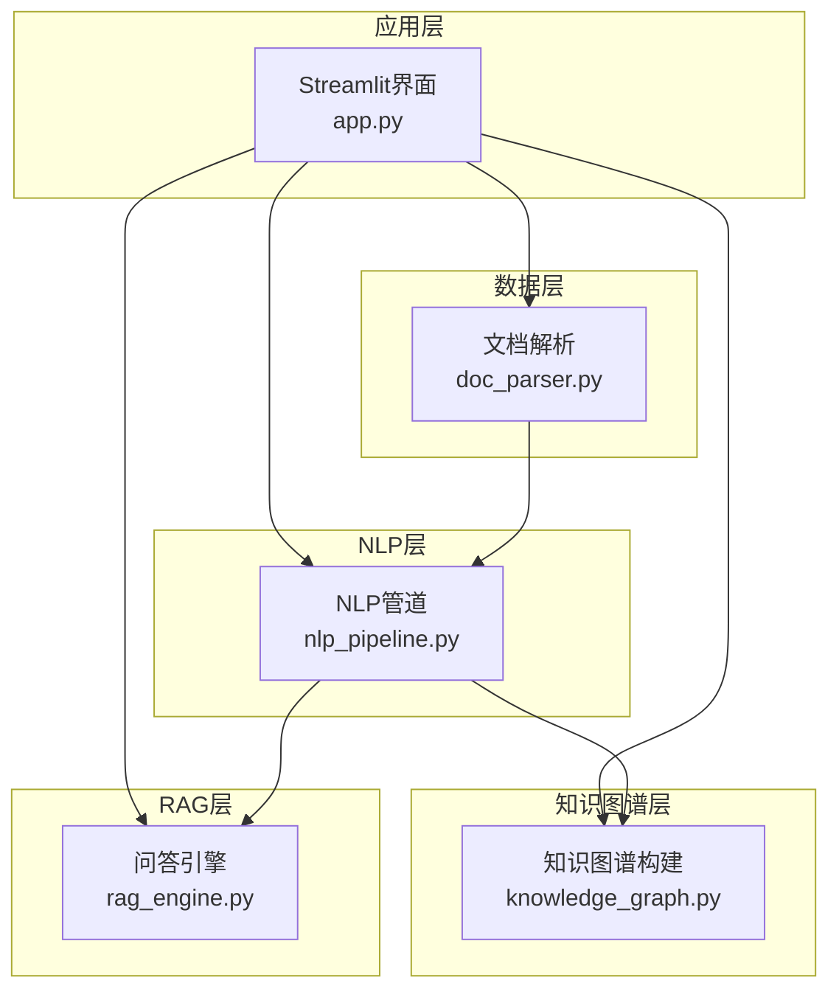
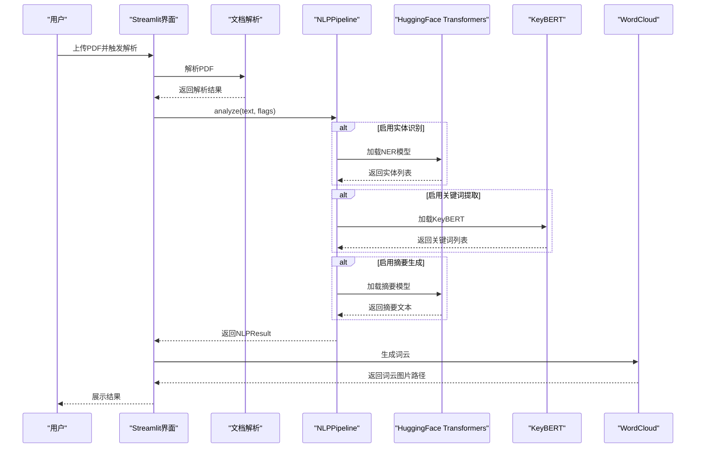
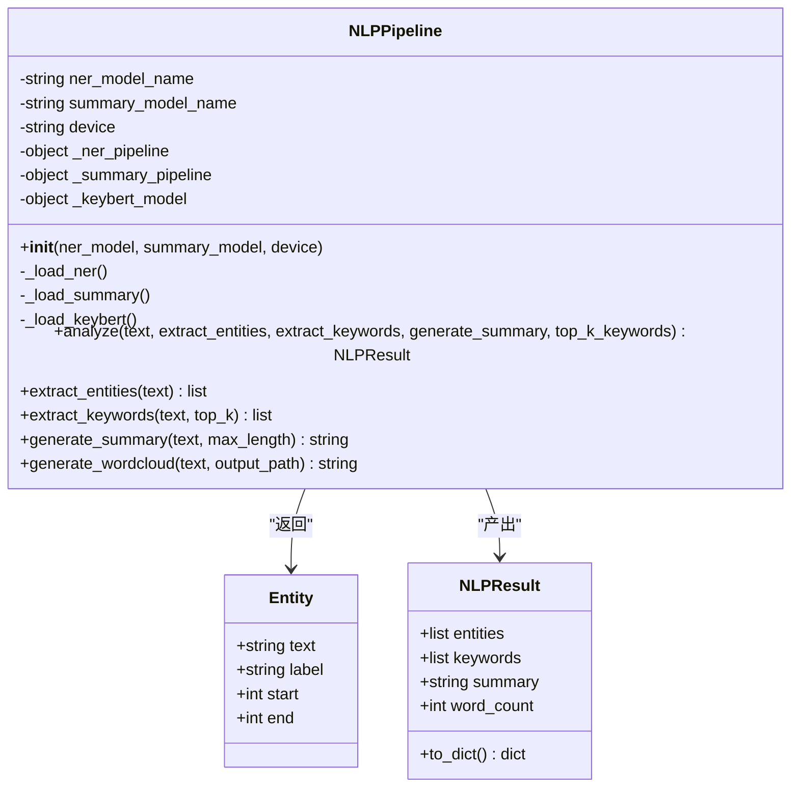
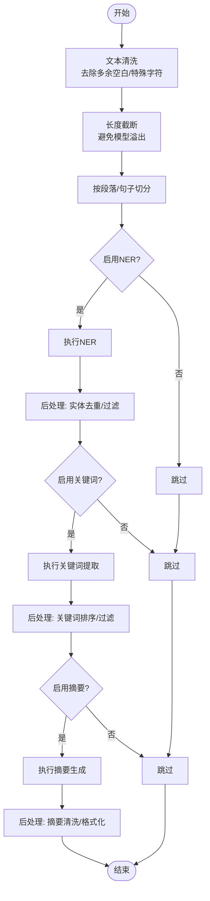
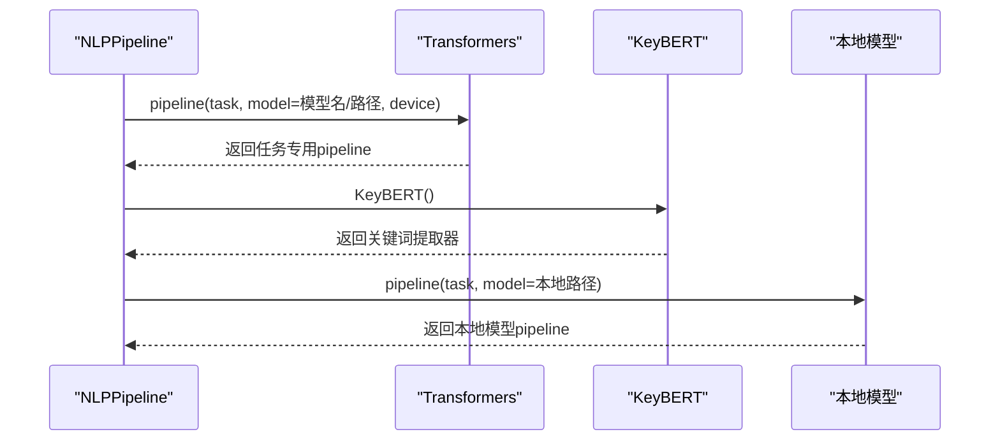
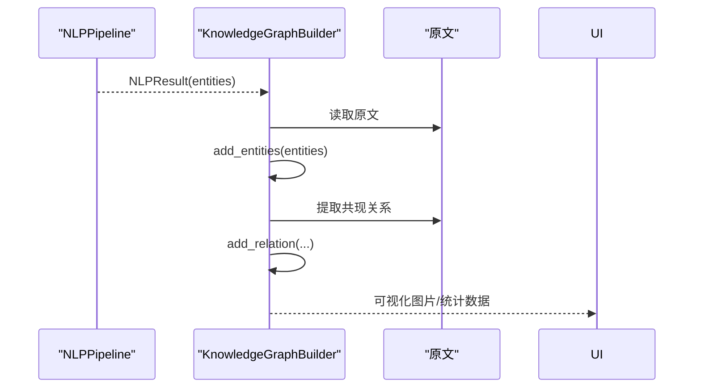
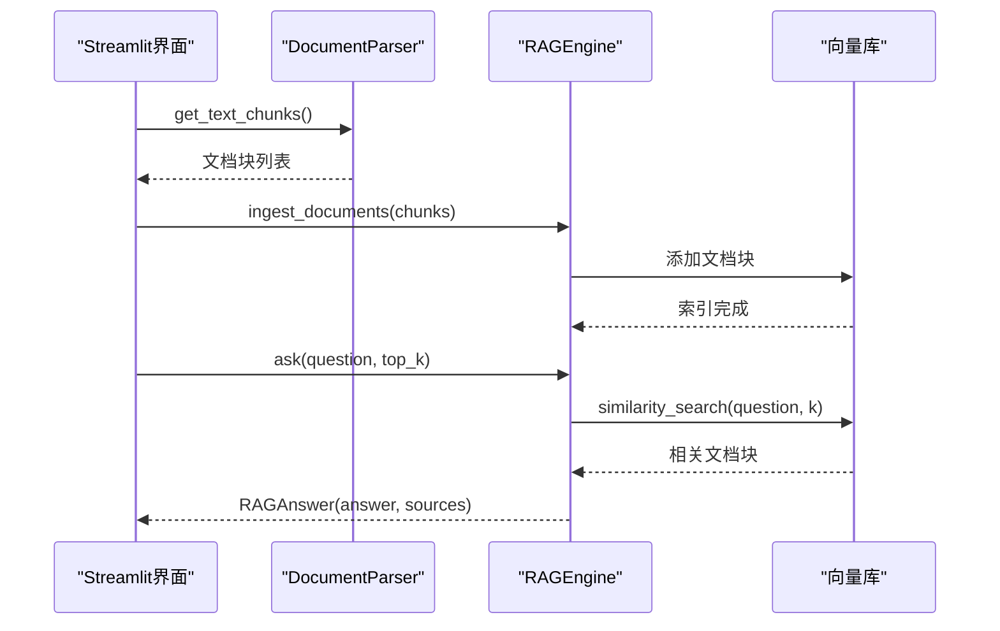
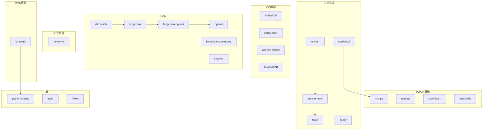

# NLP分析功能扩展

<cite>
**本文档引用的文件**
- [nlp_pipeline.py](file://zhixi/src/nlp_pipeline.py)
- [app.py](file://zhixi/src/app.py)
- [doc_parser.py](file://zhixi/src/doc_parser.py)
- [knowledge_graph.py](file://zhixi/src/knowledge_graph.py)
- [rag_engine.py](file://zhixi/src/rag_engine.py)
- [requirements.txt](file://zhixi/requirements.txt)
- [test_core.py](file://zhixi/tests/test_core.py)
</cite>

## 目录
1. [简介](#简介)
2. [项目结构](#项目结构)
3. [核心组件](#核心组件)
4. [架构总览](#架构总览)
5. [详细组件分析](#详细组件分析)
6. [依赖关系分析](#依赖关系分析)
7. [性能考虑](#性能考虑)
8. [故障排查指南](#故障排查指南)
9. [结论](#结论)
10. [附录](#附录)

## 简介
本指南面向希望扩展NLP分析功能的开发者，重点讲解如何在现有NLPPipeline基础上新增文本分析算法（如自定义实体识别、关键词提取、情感分析），以及如何替换或扩展现有算法。同时提供自定义模型（HuggingFace模型、本地模型）的集成方式，扩展文本预处理与后处理功能，并给出性能优化与内存管理的最佳实践。文中所有实现细节均基于仓库现有代码进行分析与总结。

## 项目结构
项目采用分层架构：
- 应用层：Streamlit Web界面，负责用户交互与结果展示
- 数据层：文档解析（PDF文本/表格/图像提取）
- NLP层：NLPPipeline集中管理多种NLP算法
- 知识图谱层：基于实体关系构建知识图谱
- RAG层：检索增强生成问答引擎

图表来源
- [app.py:1-492](file://zhixi/src/app.py#L1-L492)
- [doc_parser.py:1-319](file://zhixi/src/doc_parser.py#L1-L319)
- [nlp_pipeline.py:1-312](file://zhixi/src/nlp_pipeline.py#L1-L312)
- [knowledge_graph.py:1-412](file://zhixi/src/knowledge_graph.py#L1-L412)
- [rag_engine.py:1-362](file://zhixi/src/rag_engine.py#L1-L362)

章节来源
- [app.py:1-492](file://zhixi/src/app.py#L1-L492)
- [doc_parser.py:1-319](file://zhixi/src/doc_parser.py#L1-L319)
- [nlp_pipeline.py:1-312](file://zhixi/src/nlp_pipeline.py#L1-L312)
- [knowledge_graph.py:1-412](file://zhixi/src/knowledge_graph.py#L1-L412)
- [rag_engine.py:1-362](file://zhixi/src/rag_engine.py#L1-L362)

## 核心组件
- NLPPipeline：统一的NLP分析入口，封装实体识别、关键词提取、摘要生成、词云生成等能力
- Entity/NLPResult：标准化的数据结构，便于跨模块传递
- Streamlit应用：提供Web界面，调用NLPPipeline并展示结果
- 文档解析器：提供文本切块，为RAG提供输入
- 知识图谱构建器：基于NLP结果构建实体关系图
- RAG引擎：基于向量检索与LLM生成回答

章节来源
- [nlp_pipeline.py:24-43](file://zhixi/src/nlp_pipeline.py#L24-L43)
- [nlp_pipeline.py:45-145](file://zhixi/src/nlp_pipeline.py#L45-L145)
- [app.py:223-304](file://zhixi/src/app.py#L223-L304)
- [doc_parser.py:64-144](file://zhixi/src/doc_parser.py#L64-L144)
- [knowledge_graph.py:44-173](file://zhixi/src/knowledge_graph.py#L44-L173)
- [rag_engine.py:47-94](file://zhixi/src/rag_engine.py#L47-L94)

## 架构总览
NLPPipeline通过延迟加载策略按需初始化各算法组件，避免一次性加载全部模型导致内存压力。分析流程如下：
- 输入文本
- 可选执行：实体识别、关键词提取、摘要生成
- 输出标准化结果对象

图表来源
- [app.py:240-261](file://zhixi/src/app.py#L240-L261)
- [nlp_pipeline.py:106-145](file://zhixi/src/nlp_pipeline.py#L106-L145)
- [nlp_pipeline.py:147-262](file://zhixi/src/nlp_pipeline.py#L147-L262)

## 详细组件分析

### NLPPipeline扩展指南
NLPPipeline当前集成了NER、关键词提取、摘要生成与词云生成。扩展新算法的关键在于：
- 在构造函数中预留配置项
- 新增私有加载方法（延迟加载）
- 在analyze中添加开关控制
- 在相应方法中实现算法逻辑
- 保持NLPResult数据结构不变，便于下游模块复用

图表来源
- [nlp_pipeline.py:24-43](file://zhixi/src/nlp_pipeline.py#L24-L43)
- [nlp_pipeline.py:45-145](file://zhixi/src/nlp_pipeline.py#L45-L145)

章节来源
- [nlp_pipeline.py:61-75](file://zhixi/src/nlp_pipeline.py#L61-L75)
- [nlp_pipeline.py:106-145](file://zhixi/src/nlp_pipeline.py#L106-L145)

#### 新增自定义实体识别
- 在构造函数中新增实体识别模型配置项
- 新增私有加载方法，按需初始化
- 在analyze中添加开关
- 在实体识别方法中返回标准化Entity列表

参考实现位置
- [nlp_pipeline.py:61-75](file://zhixi/src/nlp_pipeline.py#L61-L75)
- [nlp_pipeline.py:147-176](file://zhixi/src/nlp_pipeline.py#L147-L176)

#### 新增关键词提取算法
- 在构造函数中新增关键词提取模型配置项
- 新增私有加载方法
- 在analyze中添加开关
- 在关键词提取方法中返回(关键词, 分数)列表

参考实现位置
- [nlp_pipeline.py:61-75](file://zhixi/src/nlp_pipeline.py#L61-L75)
- [nlp_pipeline.py:177-204](file://zhixi/src/nlp_pipeline.py#L177-L204)

#### 新增情感分析
- 在构造函数中新增情感分析模型配置项
- 新增私有加载方法
- 在analyze中添加开关
- 在情感分析方法中返回情感标签与置信度

参考实现位置
- [nlp_pipeline.py:61-75](file://zhixi/src/nlp_pipeline.py#L61-L75)
- [nlp_pipeline.py:106-145](file://zhixi/src/nlp_pipeline.py#L106-L145)

#### 替换现有算法
- 修改构造函数默认模型名称
- 调整加载方法中的pipeline参数
- 保持接口签名一致，确保下游模块无需修改

参考实现位置
- [nlp_pipeline.py:61-75](file://zhixi/src/nlp_pipeline.py#L61-L75)
- [nlp_pipeline.py:76-97](file://zhixi/src/nlp_pipeline.py#L76-L97)

### 文本预处理与后处理扩展
- 预处理：在analyze入口处对输入文本进行清洗、截断、分段
- 后处理：在各算法输出后进行过滤、去重、格式化

图表来源
- [nlp_pipeline.py:127-145](file://zhixi/src/nlp_pipeline.py#L127-L145)
- [nlp_pipeline.py:161-175](file://zhixi/src/nlp_pipeline.py#L161-L175)
- [nlp_pipeline.py:192-203](file://zhixi/src/nlp_pipeline.py#L192-L203)
- [nlp_pipeline.py:218-233](file://zhixi/src/nlp_pipeline.py#L218-L233)

章节来源
- [nlp_pipeline.py:127-145](file://zhixi/src/nlp_pipeline.py#L127-L145)
- [nlp_pipeline.py:161-175](file://zhixi/src/nlp_pipeline.py#L161-L175)
- [nlp_pipeline.py:192-203](file://zhixi/src/nlp_pipeline.py#L192-L203)
- [nlp_pipeline.py:218-233](file://zhixi/src/nlp_pipeline.py#L218-L233)

### 自定义模型集成
- HuggingFace模型：通过transformers.pipeline加载，支持CPU/GPU
- 本地模型：可通过本地路径加载，或在pipeline中指定本地模型目录
- KeyBERT：通过KeyBERT类加载，支持自定义词汇表与停用词

图表来源
- [nlp_pipeline.py:76-97](file://zhixi/src/nlp_pipeline.py#L76-L97)
- [nlp_pipeline.py:99-104](file://zhixi/src/nlp_pipeline.py#L99-L104)

章节来源
- [nlp_pipeline.py:76-97](file://zhixi/src/nlp_pipeline.py#L76-L97)
- [nlp_pipeline.py:99-104](file://zhixi/src/nlp_pipeline.py#L99-L104)

### 与知识图谱的集成
- 通过NLP结果构建实体节点
- 基于文本共现关系添加边
- 可视化与统计分析

图表来源
- [knowledge_graph.py:137-151](file://zhixi/src/knowledge_graph.py#L137-L151)
- [knowledge_graph.py:109-136](file://zhixi/src/knowledge_graph.py#L109-L136)

章节来源
- [knowledge_graph.py:137-151](file://zhixi/src/knowledge_graph.py#L137-L151)
- [knowledge_graph.py:109-136](file://zhixi/src/knowledge_graph.py#L109-L136)

### 与RAG的集成
- 文档切块后导入向量库
- 问答时检索相关片段并结合LLM生成回答

图表来源
- [app.py:423-461](file://zhixi/src/app.py#L423-L461)
- [doc_parser.py:212-268](file://zhixi/src/doc_parser.py#L212-L268)
- [rag_engine.py:154-191](file://zhixi/src/rag_engine.py#L154-L191)
- [rag_engine.py:192-263](file://zhixi/src/rag_engine.py#L192-L263)

章节来源
- [app.py:423-461](file://zhixi/src/app.py#L423-L461)
- [doc_parser.py:212-268](file://zhixi/src/doc_parser.py#L212-L268)
- [rag_engine.py:154-191](file://zhixi/src/rag_engine.py#L154-L191)
- [rag_engine.py:192-263](file://zhixi/src/rag_engine.py#L192-L263)

## 依赖关系分析
- Python基础库：numpy、pandas、matplotlib、scikit-learn
- 文档解析：PyMuPDF、pdfplumber、opencv-python、PaddleOCR
- NLP分析：transformers、torch、spacy、keybert、wordcloud
- RAG：langchain、langchain-community、langchain-openai、chromadb、openai、tiktoken
- 知识图谱：networkx
- Web界面：streamlit
- 工具：python-dotenv、tqdm、Pillow

图表来源
- [requirements.txt:1-45](file://zhixi/requirements.txt#L1-L45)

章节来源
- [requirements.txt:1-45](file://zhixi/requirements.txt#L1-L45)

## 性能考虑
- 延迟加载：仅在首次使用时加载模型，减少内存占用
- 输入截断：对超长文本进行截断，避免模型溢出
- 设备选择：优先使用GPU（CUDA），无GPU时回退CPU
- 批量处理：在导入向量库时采用批量写入
- 缓存与持久化：向量库持久化，避免重复导入
- 可视化优化：限制词云最大词数与图谱节点数

章节来源
- [nlp_pipeline.py:76-97](file://zhixi/src/nlp_pipeline.py#L76-L97)
- [nlp_pipeline.py:162](file://zhixi/src/nlp_pipeline.py#L162)
- [nlp_pipeline.py:220](file://zhixi/src/nlp_pipeline.py#L220)
- [rag_engine.py:184-189](file://zhixi/src/rag_engine.py#L184-L189)
- [knowledge_graph.py:248-252](file://zhixi/src/knowledge_graph.py#L248-L252)

## 故障排查指南
- 模型加载失败：检查网络连接与模型名称是否正确
- 内存不足：降低批大小、关闭不必要的功能、使用CPU
- 输出为空：确认输入文本长度与质量
- 可视化异常：检查输出路径权限与依赖库版本

章节来源
- [nlp_pipeline.py:173-175](file://zhixi/src/nlp_pipeline.py#L173-L175)
- [nlp_pipeline.py:201-203](file://zhixi/src/nlp_pipeline.py#L201-L203)
- [nlp_pipeline.py:230-233](file://zhixi/src/nlp_pipeline.py#L230-L233)
- [knowledge_graph.py:310-312](file://zhixi/src/knowledge_graph.py#L310-L312)

## 结论
通过NLPPipeline的模块化设计与延迟加载机制，可以方便地扩展新的文本分析算法，并与知识图谱、RAG等模块无缝集成。建议在新增算法时遵循现有接口规范，保持数据结构一致性，充分利用缓存与设备优化策略，确保系统的稳定性与性能。

## 附录
- 测试用例覆盖了核心数据结构与基本逻辑，便于验证扩展功能
- Streamlit界面提供了端到端的使用体验，便于快速验证新功能

章节来源
- [test_core.py:124-146](file://zhixi/tests/test_core.py#L124-L146)
- [app.py:223-304](file://zhixi/src/app.py#L223-L304)