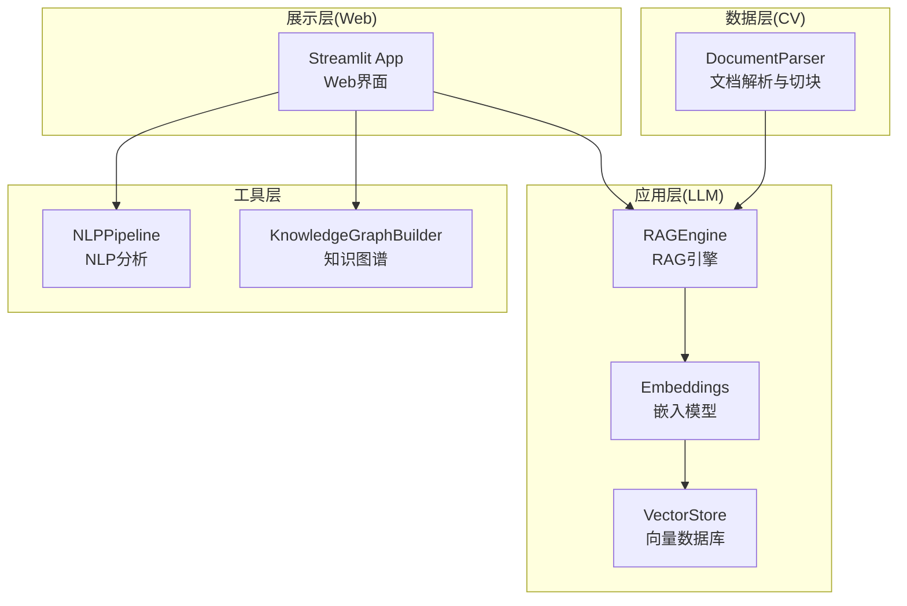
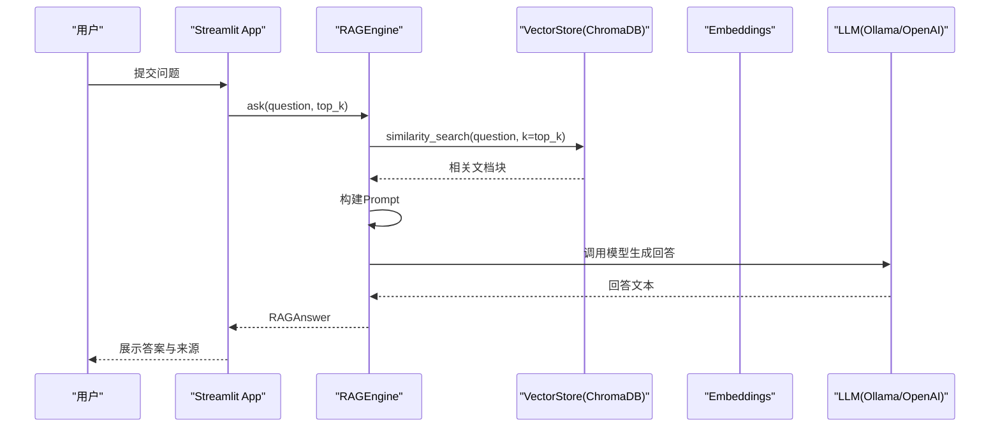
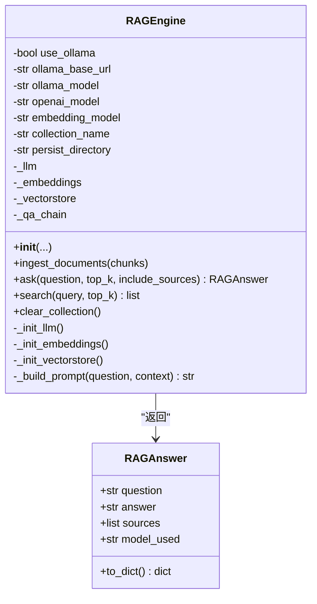
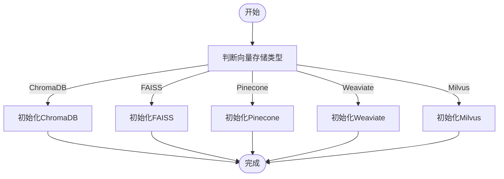
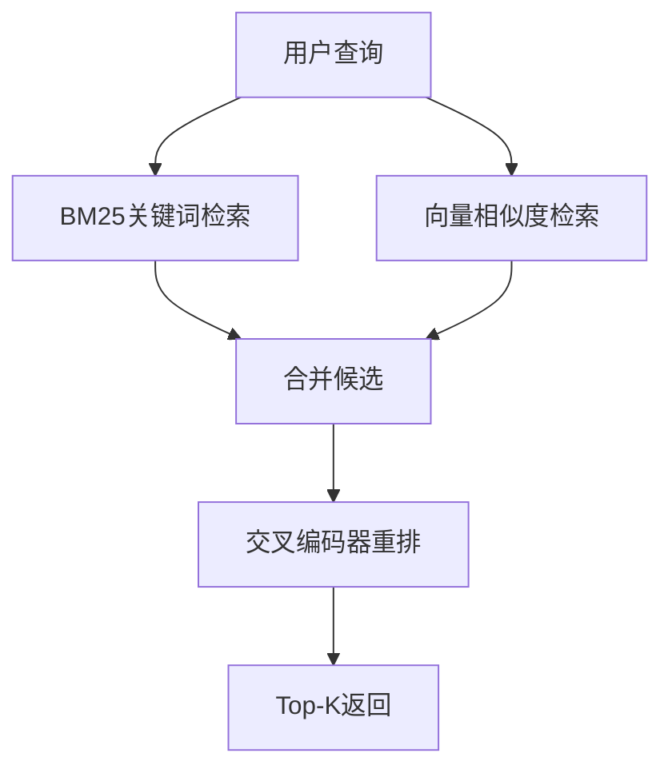
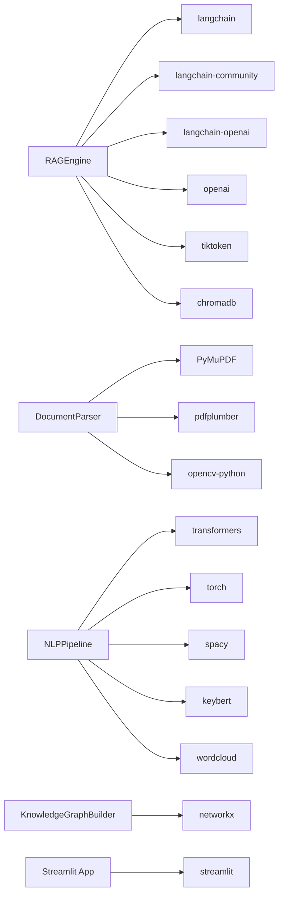

# RAG引擎定制化

<cite>
**本文档引用的文件**
- [rag_engine.py](file://zhixi/src/rag_engine.py)
- [app.py](file://zhixi/src/app.py)
- [doc_parser.py](file://zhixi/src/doc_parser.py)
- [nlp_pipeline.py](file://zhixi/src/nlp_pipeline.py)
- [knowledge_graph.py](file://zhixi/src/knowledge_graph.py)
- [test_core.py](file://zhixi/tests/test_core.py)
- [requirements.txt](file://zhixi/requirements.txt)
</cite>

## 目录
1. [简介](#简介)
2. [项目结构](#项目结构)
3. [核心组件](#核心组件)
4. [架构总览](#架构总览)
5. [详细组件分析](#详细组件分析)
6. [依赖关系分析](#依赖关系分析)
7. [性能考虑](#性能考虑)
8. [故障排查指南](#故障排查指南)
9. [结论](#结论)
10. [附录](#附录)

## 简介
本指南面向希望对现有RAG引擎进行定制化的开发者，重点涵盖以下目标：
- 新增大语言模型支持：OpenAI、本地Ollama及其他模型服务的集成方法
- 扩展RAGEngine类：新增检索策略与生成策略
- 向量数据库扩展：除ChromaDB外的其他向量存储方案接入
- 检索算法定制：语义相似度计算与混合检索策略
- 性能优化与缓存策略：提升检索与生成效率
- 具体代码示例：展示新模型集成与配置方法

## 项目结构
项目采用分层架构，围绕RAG引擎为核心，配合文档解析、NLP分析、知识图谱与Web界面：
- 数据层（CV层）：文档解析与文本切块
- 应用层（LLM层）：RAG引擎与模型集成
- 展示层：Streamlit Web界面
- 工具与测试：NLP分析、知识图谱、单元测试

图表来源
- [doc_parser.py:64-268](file://zhixi/src/doc_parser.py#L64-L268)
- [rag_engine.py:47-312](file://zhixi/src/rag_engine.py#L47-L312)
- [app.py:423-446](file://zhixi/src/app.py#L423-L446)
- [nlp_pipeline.py:45-262](file://zhixi/src/nlp_pipeline.py#L45-L262)
- [knowledge_graph.py:44-329](file://zhixi/src/knowledge_graph.py#L44-L329)

章节来源
- [doc_parser.py:1-319](file://zhixi/src/doc_parser.py#L1-L319)
- [rag_engine.py:1-362](file://zhixi/src/rag_engine.py#L1-L362)
- [app.py:1-492](file://zhixi/src/app.py#L1-L492)
- [nlp_pipeline.py:1-312](file://zhixi/src/nlp_pipeline.py#L1-L312)
- [knowledge_graph.py:1-412](file://zhixi/src/knowledge_graph.py#L1-L412)

## 核心组件
- RAGEngine：RAG问答引擎，负责LLM初始化、嵌入模型初始化、向量数据库初始化、文档导入、检索与生成
- DocumentParser：PDF解析与文本切块，输出供RAG使用的文档块
- NLPPipeline：NLP分析（实体识别、关键词、摘要、词云）
- KnowledgeGraphBuilder：知识图谱构建与可视化
- Streamlit App：Web界面，集成上述组件

章节来源
- [rag_engine.py:47-312](file://zhixi/src/rag_engine.py#L47-L312)
- [doc_parser.py:64-268](file://zhixi/src/doc_parser.py#L64-L268)
- [nlp_pipeline.py:45-262](file://zhixi/src/nlp_pipeline.py#L45-L262)
- [knowledge_graph.py:44-329](file://zhixi/src/knowledge_graph.py#L44-L329)
- [app.py:423-446](file://zhixi/src/app.py#L423-L446)

## 架构总览
RAG引擎工作流：
1) 文档切块 → 2) 嵌入 → 3) 存入向量数据库 → 4) 用户提问 → 5) 检索相关文档块 → 6) 构建Prompt → 7) LLM生成回答

图表来源
- [rag_engine.py:192-263](file://zhixi/src/rag_engine.py#L192-L263)
- [rag_engine.py:282-303](file://zhixi/src/rag_engine.py#L282-L303)
- [app.py:448-461](file://zhixi/src/app.py#L448-L461)

## 详细组件分析

### RAGEngine类扩展指南
RAGEngine是RAG的核心，支持OpenAI与Ollama两种模式，延迟初始化LLM、嵌入与向量数据库。扩展方向包括：
- 新增模型服务：通过替换LLM与Embeddings初始化逻辑实现
- 新增检索策略：在similarity_search前后增加过滤、重排序或混合检索
- 新增生成策略：自定义Prompt模板、消息角色、上下文拼接逻辑

图表来源
- [rag_engine.py:47-312](file://zhixi/src/rag_engine.py#L47-L312)
- [rag_engine.py:30-44](file://zhixi/src/rag_engine.py#L30-L44)

章节来源
- [rag_engine.py:69-152](file://zhixi/src/rag_engine.py#L69-L152)
- [rag_engine.py:154-191](file://zhixi/src/rag_engine.py#L154-L191)
- [rag_engine.py:192-263](file://zhixi/src/rag_engine.py#L192-L263)
- [rag_engine.py:265-281](file://zhixi/src/rag_engine.py#L265-L281)
- [rag_engine.py:282-303](file://zhixi/src/rag_engine.py#L282-L303)
- [rag_engine.py:305-312](file://zhixi/src/rag_engine.py#L305-L312)

### 新大语言模型集成（OpenAI、Ollama、其他模型服务）

- OpenAI模式
  - 初始化：通过ChatOpenAI与OpenAIEmbeddings，读取环境变量OPENAI_API_KEY
  - 适用场景：云端API，质量稳定，适合生产
  - 配置要点：设置OPENAI_API_KEY与模型名称，如gpt-4o-mini/gpt-4o
  - 示例参考：[rag_engine.py:108-115](file://zhixi/src/rag_engine.py#L108-L115)、[rag_engine.py:129-135](file://zhixi/src/rag_engine.py#L129-L135)

- 本地Ollama模式
  - 初始化：通过Ollama与OllamaEmbeddings，指定base_url与模型名称
  - 适用场景：离线部署，零成本，适合开发与小规模使用
  - 配置要点：确保Ollama服务运行，设置模型名称与base_url
  - 示例参考：[rag_engine.py:100-107](file://zhixi/src/rag_engine.py#L100-L107)、[rag_engine.py:122-129](file://zhixi/src/rag_engine.py#L122-L129)

- 其他模型服务（通用扩展思路）
  - 步骤：
    1) 在RAGEngine._init_llm中新增分支，根据use_ollama或其他标志选择模型类
    2) 在RAGEngine._init_embeddings中新增分支，选择对应嵌入模型类
    3) 在Web界面或调用处传入新模型参数
  - 注意事项：
    - 确保LangChain适配器可用（如langchain-community/langchain-openai）
    - 处理认证与超时，必要时封装为独立配置类
    - 测试不同模型的温度、最大tokens等参数差异

章节来源
- [rag_engine.py:95-135](file://zhixi/src/rag_engine.py#L95-L135)
- [app.py:83-118](file://zhixi/src/app.py#L83-L118)

### 向量数据库扩展（除ChromaDB外）

当前实现使用ChromaDB作为向量数据库，可通过替换向量存储初始化逻辑扩展到其他方案：
- 替换位置：RAGEngine._init_vectorstore
- 可选方案：
  - FAISS：本地高效相似度检索，适合大规模向量
  - Pinecone：云端托管，支持分布式与弹性扩缩容
  - Weaviate：支持向量与图混合检索
  - Milvus：企业级向量数据库，支持多种索引
- 扩展步骤：
  1) 引入对应LangChain适配器（如FAISSVectorStore）
  2) 在RAGEngine._init_vectorstore中根据配置选择实现
  3) 保持接口一致：add_documents、similarity_search等
  4) 考虑持久化策略与集群部署

图表来源
- [rag_engine.py:137-152](file://zhixi/src/rag_engine.py#L137-L152)

章节来源
- [rag_engine.py:137-152](file://zhixi/src/rag_engine.py#L137-L152)

### 检索算法定制（语义相似度与混合检索）

- 当前检索
  - 使用向量相似度检索（similarity_search），默认k=4
  - 可通过top_k参数调整召回数量
  - 参考：[rag_engine.py:212-215](file://zhixi/src/rag_engine.py#L212-L215)、[rag_engine.py:282-303](file://zhixi/src/rag_engine.py#L282-L303)

- 语义相似度计算扩展
  - 可替换为自定义距离度量（余弦、内积、归一化等）
  - 可引入重排序器（如交叉编码器rerankers）提升准确性
  - 可结合BM25与向量混合检索，提高召回多样性

- 混合检索策略
  - 结构：BM25检索候选 + 向量检索候选 + 交叉编码器重排
  - 优点：兼顾关键词匹配与语义相似
  - 实现建议：在RAGEngine.search或ask中插入混合检索逻辑

图表来源
- [rag_engine.py:212-215](file://zhixi/src/rag_engine.py#L212-L215)
- [rag_engine.py:282-303](file://zhixi/src/rag_engine.py#L282-L303)

章节来源
- [rag_engine.py:192-263](file://zhixi/src/rag_engine.py#L192-L263)
- [rag_engine.py:282-303](file://zhixi/src/rag_engine.py#L282-L303)

### 生成策略定制

- 当前Prompt构建
  - 固定规则：要求基于文档回答、不编造信息、简洁准确
  - 可扩展：支持多轮对话上下文、角色设定、领域约束
  - 参考：[rag_engine.py:265-281](file://zhixi/src/rag_engine.py#L265-L281)

- 生成策略扩展
  - 多角色消息：System/Human消息组合
  - 上下文截断与压缩：避免超出模型上下文窗口
  - 多模型对比：在同一任务上比较不同模型输出质量

章节来源
- [rag_engine.py:242-254](file://zhixi/src/rag_engine.py#L242-L254)
- [rag_engine.py:265-281](file://zhixi/src/rag_engine.py#L265-L281)

### 文档解析与文本切块

- 文档解析
  - 使用PyMuPDF提取文本与图像，pdfplumber提取表格
  - 输出DocumentResult，包含每页文本、表格、图像路径
  - 参考：[doc_parser.py:98-144](file://zhixi/src/doc_parser.py#L98-L144)

- 文本切块
  - 按段落优先切分，控制chunk_size与chunk_overlap
  - 输出包含text、page、chunk_id的块列表
  - 参考：[doc_parser.py:212-268](file://zhixi/src/doc_parser.py#L212-L268)

章节来源
- [doc_parser.py:64-268](file://zhixi/src/doc_parser.py#L64-L268)

### NLP分析与知识图谱

- NLP分析
  - 实体识别（NER）、关键词提取（KeyBERT）、摘要生成（BART）
  - 词云可视化，支持延迟加载模型
  - 参考：[nlp_pipeline.py:106-146](file://zhixi/src/nlp_pipeline.py#L106-L146)

- 知识图谱
  - 从实体与文本共现关系构建图谱，支持路径查找、子图提取、可视化
  - 参考：[knowledge_graph.py:137-151](file://zhixi/src/knowledge_graph.py#L137-L151)

章节来源
- [nlp_pipeline.py:45-262](file://zhixi/src/nlp_pipeline.py#L45-L262)
- [knowledge_graph.py:44-329](file://zhixi/src/knowledge_graph.py#L44-L329)

## 依赖关系分析

图表来源
- [requirements.txt:27-33](file://zhixi/requirements.txt#L27-L33)
- [requirements.txt:13-25](file://zhixi/requirements.txt#L13-L25)
- [requirements.txt:35-36](file://zhixi/requirements.txt#L35-L36)
- [requirements.txt:39](file://zhixi/requirements.txt#L39)

章节来源
- [requirements.txt:1-45](file://zhixi/requirements.txt#L1-L45)

## 性能考虑
- 延迟初始化：LLM、嵌入与向量数据库均采用延迟初始化，减少冷启动开销
- 批量导入：向量数据库批量写入，提升导入吞吐
- 检索参数：合理设置top_k，平衡召回与速度
- 缓存策略建议：
  - 向量数据库：启用持久化，避免重复导入
  - 模型调用：对相同问题进行缓存（需考虑隐私与一致性）
  - NLP模型：延迟加载，避免同时加载多个大模型
- 资源限制：控制输入长度，避免超出模型上下文窗口

章节来源
- [rag_engine.py:95-116](file://zhixi/src/rag_engine.py#L95-L116)
- [rag_engine.py:183-189](file://zhixi/src/rag_engine.py#L183-L189)
- [nlp_pipeline.py:76-105](file://zhixi/src/nlp_pipeline.py#L76-L105)

## 故障排查指南
- 常见问题
  - OpenAI API Key错误：检查OPENAI_API_KEY是否正确设置
  - Ollama连接失败：确认Ollama服务运行与base_url正确
  - 向量数据库异常：检查persist_directory权限与磁盘空间
  - 模型加载失败：确认transformers/torch/keybert等依赖版本兼容
- 单元测试
  - 知识图谱：节点/边添加、路径查找、保存/加载
  - 文档解析：文本切块数据结构验证
  - NLP：数据结构to_dict、关键词提取
  - RAG：RAGAnswer数据结构
  - 参考：[test_core.py:18-163](file://zhixi/tests/test_core.py#L18-L163)

章节来源
- [test_core.py:18-163](file://zhixi/tests/test_core.py#L18-L163)

## 结论
本指南提供了RAG引擎的定制化扩展路径，包括模型服务集成、向量数据库扩展、检索与生成策略定制以及性能优化建议。通过遵循模块化设计与延迟初始化原则，可在不破坏现有功能的前提下平滑引入新特性与第三方服务。

## 附录

### 新模型集成配置示例（路径参考）
- OpenAI模式配置
  - 设置OPENAI_API_KEY与模型名称：[rag_engine.py:108-115](file://zhixi/src/rag_engine.py#L108-L115)
  - Web界面参数传递：[app.py:91-106](file://zhixi/src/app.py#L91-L106)
- Ollama模式配置
  - base_url与模型名称：[rag_engine.py:100-107](file://zhixi/src/rag_engine.py#L100-L107)
  - Web界面参数传递：[app.py:106-118](file://zhixi/src/app.py#L106-L118)
- 向量数据库扩展
  - 替换初始化逻辑：[rag_engine.py:137-152](file://zhixi/src/rag_engine.py#L137-L152)
- 检索与生成策略
  - 检索参数top_k：[rag_engine.py:194-197](file://zhixi/src/rag_engine.py#L194-L197)
  - Prompt构建：[rag_engine.py:265-281](file://zhixi/src/rag_engine.py#L265-L281)