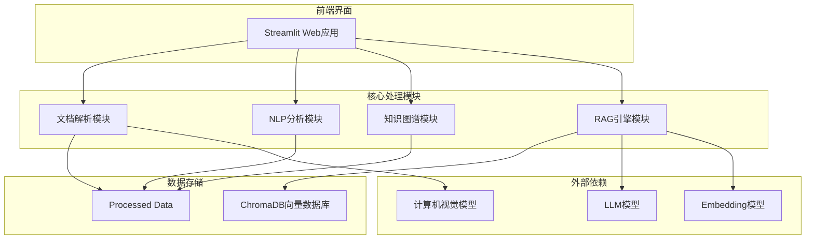
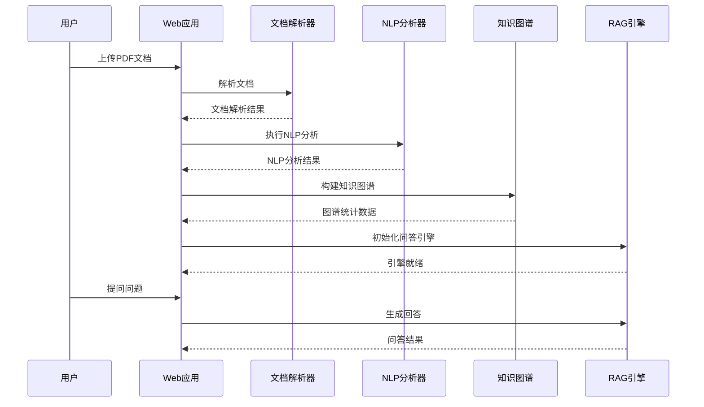
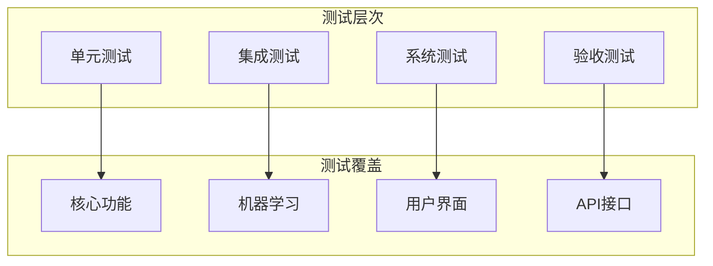
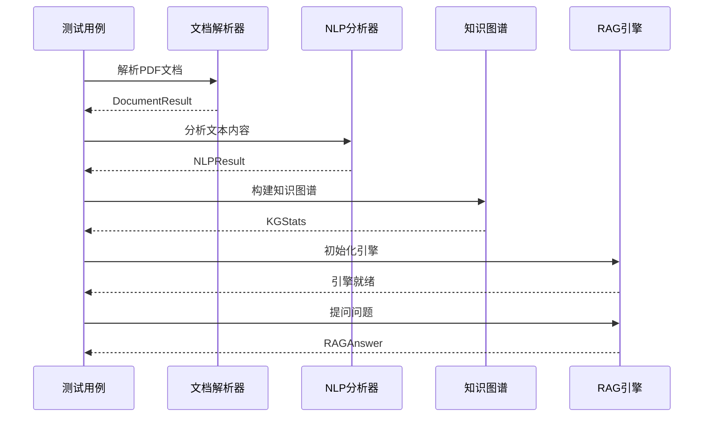

# 代码贡献指南

<cite>
**本文档引用的文件**
- [requirements.txt](file://zhixi/requirements.txt)
- [__init__.py](file://zhixi/src/__init__.py)
- [app.py](file://zhixi/src/app.py)
- [doc_parser.py](file://zhixi/src/doc_parser.py)
- [nlp_pipeline.py](file://zhixi/src/nlp_pipeline.py)
- [knowledge_graph.py](file://zhixi/src/knowledge_graph.py)
- [rag_engine.py](file://zhixi/src/rag_engine.py)
- [test_core.py](file://zhixi/tests/test_core.py)
- [.gitignore](file://zhixi/.gitignore)
</cite>

## 目录
1. [简介](#简介)
2. [项目结构](#项目结构)
3. [开发环境搭建](#开发环境搭建)
4. [代码规范](#代码规范)
5. [Pull Request提交流程](#pull-request提交流程)
6. [测试策略](#测试策略)
7. [命名约定](#命名约定)
8. [代码风格](#代码风格)
9. [注释规范](#注释规范)
10. [单元测试编写](#单元测试编写)
11. [集成测试编写](#集成测试编写)
12. [问题报告模板](#问题报告模板)
13. [功能请求模板](#功能请求模板)
14. [最佳实践](#最佳实践)
15. [故障排除指南](#故障排除指南)
16. [结论](#结论)

## 简介

智析（ZhiXi）是一个多模态文档智能分析与知识问答平台，集成了文档解析、自然语言处理、知识图谱构建和RAG（检索增强生成）问答系统。该项目采用模块化架构设计，支持多种AI模型和算法的组合使用。

本贡献指南旨在帮助开发者快速理解项目结构、开发环境配置和代码贡献流程，确保代码质量和团队协作效率。

## 项目结构

智析平台采用清晰的模块化架构，主要包含以下核心组件：



**图表来源**
- [app.py:1-492](file://zhixi/src/app.py#L1-L492)
- [doc_parser.py:1-319](file://zhixi/src/doc_parser.py#L1-L319)
- [nlp_pipeline.py:1-312](file://zhixi/src/nlp_pipeline.py#L1-L312)
- [knowledge_graph.py:1-412](file://zhixi/src/knowledge_graph.py#L1-L412)
- [rag_engine.py:1-362](file://zhixi/src/rag_engine.py#L1-L362)

**章节来源**
- [__init__.py:1-14](file://zhixi/src/__init__.py#L1-L14)
- [requirements.txt:1-45](file://zhixi/requirements.txt#L1-L45)

## 开发环境搭建

### 系统要求

- Python 3.8+
- Windows/Linux/macOS
- 至少8GB RAM（推荐16GB+）
- GPU显卡（可选，用于加速AI模型）

### 环境准备步骤

1. **克隆仓库**
   ```bash
   git clone https://github.com/your-repo/zhixi.git
   cd zhixi
   ```

2. **创建虚拟环境**
   ```bash
   python -m venv .venv
   source .venv/bin/activate  # Linux/Mac
   # 或
   .venv\Scripts\activate     # Windows
   ```

3. **安装依赖包**
   ```bash
   pip install -r requirements.txt
   ```

4. **验证安装**
   ```bash
   python -c "import zhixi; print('智析平台安装成功')"
   ```

### 环境变量配置

创建 `.env` 文件配置API密钥：
```
OPENAI_API_KEY=your_api_key_here
CHAT_MODEL=gpt-4o-mini
EMBEDDING_MODEL=text-embedding-3-small
```

**章节来源**
- [requirements.txt:1-45](file://zhixi/requirements.txt#L1-L45)
- [.gitignore:1-41](file://zhixi/.gitignore#L1-L41)

## 代码规范

### 项目编码规范

智析平台遵循以下编码规范：

#### 1. 代码组织原则
- **模块化设计**：每个功能模块独立封装
- **单一职责**：每个类和函数只负责特定功能
- **接口统一**：模块间通过明确定义的接口交互
- **错误处理**：完善的异常处理和错误恢复机制

#### 2. 数据流设计


**图表来源**
- [app.py:176-461](file://zhixi/src/app.py#L176-L461)
- [doc_parser.py:98-144](file://zhixi/src/doc_parser.py#L98-L144)
- [nlp_pipeline.py:106-145](file://zhixi/src/nlp_pipeline.py#L106-L145)
- [knowledge_graph.py:137-151](file://zhixi/src/knowledge_graph.py#L137-L151)
- [rag_engine.py:192-263](file://zhixi/src/rag_engine.py#L192-L263)

**章节来源**
- [app.py:1-492](file://zhixi/src/app.py#L1-L492)

## Pull Request提交流程

### PR提交标准

1. **分支策略**
   - 基准分支：`main`
   - 功能分支：`feature/功能名称`
   - 修复分支：`fix/问题描述`
   - 文档分支：`docs/修改内容`

2. **PR要求**
   - 包含完整的功能描述
   - 提供测试用例
   - 更新相关文档
   - 通过所有检查

3. **代码审查标准**
   - 代码质量：无语法错误，符合规范
   - 功能正确性：通过单元测试
   - 性能影响：无显著性能下降
   - 兼容性：不影响现有功能

### PR模板

```markdown
## 变更描述

### 主要变更
- [ ] 功能新增
- [ ] Bug修复  
- [ ] 性能优化
- [ ] 文档更新

### 相关问题
Fixes #[Issue Number]

## 测试计划
- [ ] 单元测试通过
- [ ] 集成测试通过
- [ ] 性能测试通过

## 影响范围
- [ ] 前端界面
- [ ] 后端服务
- [ ] 数据库结构
- [ ] API接口
```

**章节来源**
- [test_core.py:1-168](file://zhixi/tests/test_core.py#L1-L168)

## 测试策略

### 测试层次结构

智析平台采用多层次测试策略：



### 测试执行

1. **运行所有测试**
   ```bash
   cd zhixi
   python -m pytest tests/ -v
   ```

2. **运行特定测试**
   ```bash
   python -m pytest tests/test_core.py::TestKnowledgeGraph -v
   ```

3. **测试覆盖率**
   ```bash
   python -m pytest tests/ --cov=src --cov-report=html
   ```

**章节来源**
- [test_core.py:1-168](file://zhixi/tests/test_core.py#L1-L168)

## 命名约定

### Python命名规范

智析平台严格遵循PEP 8命名规范：

#### 1. 类命名
- 使用 `CamelCase` 格式
- 例如：`DocumentParser`, `KnowledgeGraphBuilder`

#### 2. 函数命名
- 使用 `snake_case` 格式
- 例如：`analyze_text`, `get_text_chunks`

#### 3. 变量命名
- 使用 `snake_case` 格式
- 例如：`chunk_size`, `entity_types`

#### 4. 常量命名
- 使用 `UPPER_CASE` 格式
- 例如：`MAX_CHUNK_SIZE`, `DEFAULT_MODEL`

#### 5. 私有成员
- 使用 `_` 前缀
- 例如：`_load_model`, `_process_data`

### 模块命名

- 模块文件：`snake_case.py`
- 包目录：`snake_case/`
- 示例：`doc_parser.py`, `knowledge_graph.py`

**章节来源**
- [doc_parser.py:32-48](file://zhixi/src/doc_parser.py#L32-L48)
- [nlp_pipeline.py:24-43](file://zhixi/src/nlp_pipeline.py#L24-L43)
- [knowledge_graph.py:27-42](file://zhixi/src/knowledge_graph.py#L27-L42)
- [rag_engine.py:30-45](file://zhixi/src/rag_engine.py#L30-L45)

## 代码风格

### 缩进和空格

- 使用4个空格进行缩进
- 不使用制表符
- 函数和类之间留两个空行
- 方法之间留一个空行

### 注释风格

#### 1. 模块级注释
```python
"""
模块功能描述
详细的技术说明
使用示例:
    # 代码示例
"""
```

#### 2. 函数级注释
```python
def analyze_text(text: str, entities: bool = True) -> NLPResult:
    """
    对文本执行完整的NLP分析
    
    Args:
        text: 输入文本
        entities: 是否提取实体
        
    Returns:
        NLPResult: 分析结果对象
        
    Raises:
        ValueError: 当输入文本为空时
    """
```

#### 3. 行内注释
- 仅在必要时使用
- 注释与代码保持适当间距

### 导入规范

1. **标准库导入**
   ```python
   import os
   import sys
   from pathlib import Path
   ```

2. **第三方库导入**
   ```python
   import numpy as np
   import pandas as pd
   from transformers import pipeline
   ```

3. **项目内部导入**
   ```python
   from src.doc_parser import DocumentParser
   from src.nlp_pipeline import NLPPipeline
   ```

**章节来源**
- [app.py:1-492](file://zhixi/src/app.py#L1-L492)
- [doc_parser.py:1-319](file://zhixi/src/doc_parser.py#L1-L319)

## 注释规范

### 文档字符串格式

所有公共函数、类和模块都必须包含详细的文档字符串：

#### 1. 模块文档字符串
```python
"""
文档解析模块 (CV层)
===================
负责从PDF文档中提取文本、表格和图像。

技术栈:
    - PyMuPDF (fitz): PDF文本和图像提取
    - pdfplumber: PDF表格提取
    - PaddleOCR: 图像中的文字识别 (降级方案)
    - OpenCV: 图像预处理

使用示例:
    parser = DocumentParser("path/to/document.pdf")
    result = parser.parse()
    print(result["text"])        # 提取的全文
    print(result["tables"])      # 提取的表格列表
    print(result["images"])      # 提取的图像路径列表
"""
```

#### 2. 类文档字符串
```python
class DocumentParser:
    """
    PDF文档解析器
    
    从PDF中提取:
    1. 文本内容 (PyMuPDF)
    2. 表格数据 (pdfplumber)
    3. 嵌入图像 (PyMuPDF)
    
    Args:
        pdf_path: PDF文件路径
        output_dir: 输出目录 (存放提取的图像和JSON结果)
        extract_images: 是否提取图像，默认True
    """
```

#### 3. 方法文档字符串
```python
def parse(self) -> DocumentResult:
    """
    执行完整的文档解析流程
    
    Returns:
        DocumentResult: 包含文本、表格、图像的解析结果
        
    Example:
        >>> parser = DocumentParser("test.pdf")
        >>> result = parser.parse()
        >>> print(f"总页数: {result.total_pages}")
    """
```

### 错误处理注释

```python
def _extract_with_pymupdf(self) -> tuple:
    """使用PyMuPDF提取文本和图像
    
    注意:
        - 大文件可能需要较长时间
        - 内存使用与文档大小成正比
        - 图像提取可能失败，返回空列表
    """
```

**章节来源**
- [doc_parser.py:1-319](file://zhixi/src/doc_parser.py#L1-L319)
- [nlp_pipeline.py:1-312](file://zhixi/src/nlp_pipeline.py#L1-L312)
- [knowledge_graph.py:1-412](file://zhixi/src/knowledge_graph.py#L1-L412)
- [rag_engine.py:1-362](file://zhixi/src/rag_engine.py#L1-L362)

## 单元测试编写

### 测试框架

智析平台使用pytest作为测试框架，所有测试都位于 `tests/` 目录下。

### 测试分类

#### 1. 知识图谱测试
```python
class TestKnowledgeGraph:
    """知识图谱模块测试"""
    
    def test_add_entities(self):
        """测试实体添加功能"""
        kg = KnowledgeGraphBuilder()
        kg.add_entities([("Google", "ORG"), ("AI", "TECH")])
        
        assert kg.graph.number_of_nodes() == 2
        assert "Google" in kg.graph
        assert kg.graph.nodes["Google"]["entity_type"] == "ORG"
    
    def test_add_relation(self):
        """测试关系添加功能"""
        kg = KnowledgeGraphBuilder()
        kg.add_relation("Google", "develops", "AI")
        
        assert kg.graph.number_of_nodes() == 2
        assert kg.graph.number_of_edges() == 1
        assert kg.graph.edges["Google", "AI"]["relation"] == "develops"
```

#### 2. 文档解析测试
```python
class TestDocumentParser:
    """文档解析模块测试 (仅测试文本切块逻辑)"""
    
    def test_text_chunking_logic(self):
        """测试文本切块的数据结构"""
        # 模拟chunks结构
        chunks = [
            {"text": "这是第一段文本", "page": 1, "chunk_id": 0},
            {"text": "这是第二段文本", "page": 1, "chunk_id": 1},
            {"text": "这是第三段文本", "page": 2, "chunk_id": 2},
        ]
        
        assert len(chunks) == 3
        assert chunks[0]["page"] == 1
        assert chunks[2]["page"] == 2
```

#### 3. NLP管道测试
```python
class TestNLPPipeline:
    """NLP模块测试 (数据结构测试，不依赖模型)"""
    
    def test_entity_dataclass(self):
        """测试实体数据类"""
        entity = Entity(text="Google", label="ORG", start=0, end=6)
        assert entity.text == "Google"
        assert entity.label == "ORG"
    
    def test_nlp_result_to_dict(self):
        """测试NLP结果转字典"""
        result = NLPResult(
            entities=[],
            keywords=[("AI", 0.9), ("ML", 0.8)],
            summary="A summary",
            word_count=100,
        )
        d = result.to_dict()
        assert d["word_count"] == 100
        assert len(d["keywords"]) == 2
```

#### 4. RAG引擎测试
```python
class TestRAGEngine:
    """RAG引擎测试 (数据结构测试，不依赖API)"""
    
    def test_rag_answer_dataclass(self):
        """测试RAG答案数据类"""
        answer = RAGAnswer(
            question="What is AI?",
            answer="AI is artificial intelligence.",
            sources=[{"content": "...", "page": 1}],
            model_used="gpt-4o-mini",
        )
        d = answer.to_dict()
        assert d["question"] == "What is AI?"
        assert len(d["sources"]) == 1
```

### 测试最佳实践

1. **测试隔离**
   - 每个测试方法独立运行
   - 避免测试之间的相互依赖

2. **断言清晰**
   - 使用有意义的断言语句
   - 提供清晰的错误信息

3. **边界条件**
   - 测试正常情况
   - 测试异常情况
   - 测试边界值

**章节来源**
- [test_core.py:1-168](file://zhixi/tests/test_core.py#L1-L168)

## 集成测试编写

### 端到端测试流程



### 集成测试示例

```python
def test_end_to_end_workflow():
    """测试完整的文档处理工作流"""
    # 准备测试数据
    test_pdf = "data/sample_docs/test.pdf"
    
    # 步骤1: 文档解析
    parser = DocumentParser(test_pdf)
    doc_result = parser.parse()
    
    # 断言解析结果
    assert doc_result.total_pages > 0
    assert len(doc_result.full_text) > 0
    
    # 步骤2: NLP分析
    nlp = NLPPipeline()
    nlp_result = nlp.analyze(
        doc_result.full_text,
        extract_entities=True,
        extract_keywords=True,
        generate_summary=True,
    )
    
    # 断言分析结果
    assert len(nlp_result.entities) > 0
    assert len(nlp_result.keywords) > 0
    assert len(nlp_result.summary) > 0
    
    # 步骤3: 知识图谱构建
    kg = KnowledgeGraphBuilder()
    kg.build_from_nlp_result(nlp_result, doc_result.full_text)
    kg_stats = kg.get_stats()
    
    # 断言图谱统计
    assert kg_stats.node_count > 0
    assert kg_stats.edge_count > 0
    
    # 步骤4: RAG问答
    chunks = parser.get_text_chunks()
    rag = RAGEngine()
    rag.ingest_documents(chunks)
    
    # 断言问答结果
    answer = rag.ask("测试问题")
    assert len(answer.answer) > 0
```

**图表来源**
- [app.py:176-461](file://zhixi/src/app.py#L176-L461)
- [doc_parser.py:212-268](file://zhixi/src/doc_parser.py#L212-L268)
- [nlp_pipeline.py:106-145](file://zhixi/src/nlp_pipeline.py#L106-L145)
- [knowledge_graph.py:137-151](file://zhixi/src/knowledge_graph.py#L137-L151)
- [rag_engine.py:192-263](file://zhixi/src/rag_engine.py#L192-L263)

**章节来源**
- [app.py:1-492](file://zhixi/src/app.py#L1-L492)

## 问题报告模板

### Bug报告模板

```markdown
## Bug报告

### 环境信息
- 操作系统: [例如: Windows 11, Ubuntu 20.04, macOS 12.0]
- Python版本: [例如: 3.9.7]
- 智析版本: [例如: 0.1.0]
- GPU: [是/否] [例如: 是, NVIDIA RTX 3080]

### 重现步骤
1. [第一步]
2. [第二步]
3. [第三步]
4. [得到预期结果]

### 预期行为
[描述期望看到的行为]

### 实际行为
[描述实际发生的情况]

### 日志信息
```
[粘贴相关的错误日志]
```

### 截图/视频
[如有相关截图或视频，请在此处提供]

### 附加信息
[任何其他有助于诊断的信息]
```

## 功能请求模板

### 功能请求

### 功能描述
[清晰地描述想要的功能]

### 使用场景
[描述在什么情况下会使用这个功能]

### 技术要求
[如果有的话，描述技术实现要求]

### 优先级
- [ ] 低
- [ ] 中
- [ ] 高
- [ ] 紧急

### 相关链接
[如果有相关的issue或其他链接，请在此处提供]

### 附加信息
[任何其他有助于实现的信息]
```

## 最佳实践

### 代码重构实践

1. **渐进式重构**
   - 小步快跑，避免大规模重构
   - 每次重构后运行完整测试套件

2. **代码审查**
   - 重要变更必须经过代码审查
   - 审查重点：可读性、性能、安全性

3. **文档同步**
   - 代码变更时同步更新文档
   - 保持API文档与实现一致

### 性能优化

1. **延迟加载**
   - AI模型采用延迟加载策略
   - 减少启动时间

2. **缓存机制**
   - 模型结果缓存
   - 中间结果缓存

3. **内存管理**
   - 及时释放不需要的对象
   - 大文件处理时注意内存使用

### 错误处理

1. **异常分类**
   - 明确区分可恢复和不可恢复错误
   - 提供有意义的错误信息

2. **降级策略**
   - 模型加载失败时的降级方案
   - 网络异常时的本地处理

3. **监控告警**
   - 关键错误自动记录
   - 性能指标监控

**章节来源**
- [doc_parser.py:146-L176](file://zhixi/src/doc_parser.py#L146-L176)
- [nlp_pipeline.py:76-L104](file://zhixi/src/nlp_pipeline.py#L76-L104)
- [rag_engine.py:95-L135](file://zhixi/src/rag_engine.py#L95-L135)

## 故障排除指南

### 常见问题解决

#### 1. 依赖安装问题

**问题**: 安装依赖时出现编译错误
**解决方案**:
```bash
# 清理pip缓存
pip cache purge

# 升级pip版本
pip install --upgrade pip

# 使用国内镜像源
pip install -r requirements.txt -i https://pypi.tuna.tsinghua.edu.cn/simple/
```

#### 2. 模型下载失败

**问题**: 首次运行时模型下载超时
**解决方案**:
```bash
# 设置huggingface缓存目录
export HF_HOME=/path/to/cache/directory

# 或者手动下载模型到指定目录
```

#### 3. ChromaDB权限问题

**问题**: 向量数据库无法写入
**解决方案**:
```bash
# 检查目录权限
chmod -R 755 data/processed/

# 清理chroma_db目录
rm -rf chroma_db/
```

#### 4. Streamlit界面问题

**问题**: Web界面无法访问
**解决方案**:
```bash
# 检查端口占用
netstat -an | grep 8501

# 更换端口运行
streamlit run src/app.py --server.port 8502
```

### 调试技巧

1. **启用详细日志**
   ```python
   import logging
   logging.basicConfig(level=logging.DEBUG)
   ```

2. **分步调试**
   - 在关键位置添加断点
   - 检查中间结果
   - 验证数据结构

3. **性能分析**
   ```python
   import cProfile
   cProfile.run('your_function()')
   ```

**章节来源**
- [.gitignore:18-41](file://zhixi/.gitignore#L18-L41)

## 结论

智析平台的代码贡献指南提供了完整的开发和协作框架。通过遵循这些规范和流程，开发者可以：

1. **快速上手**：按照标准流程搭建开发环境
2. **保证质量**：通过严格的测试和代码审查
3. **提升效率**：遵循统一的代码风格和命名约定
4. **促进协作**：使用标准化的PR流程和沟通模板

我们鼓励所有贡献者积极参与项目改进，共同打造优秀的多模态文档智能分析平台。感谢您对智析项目的关注和支持！