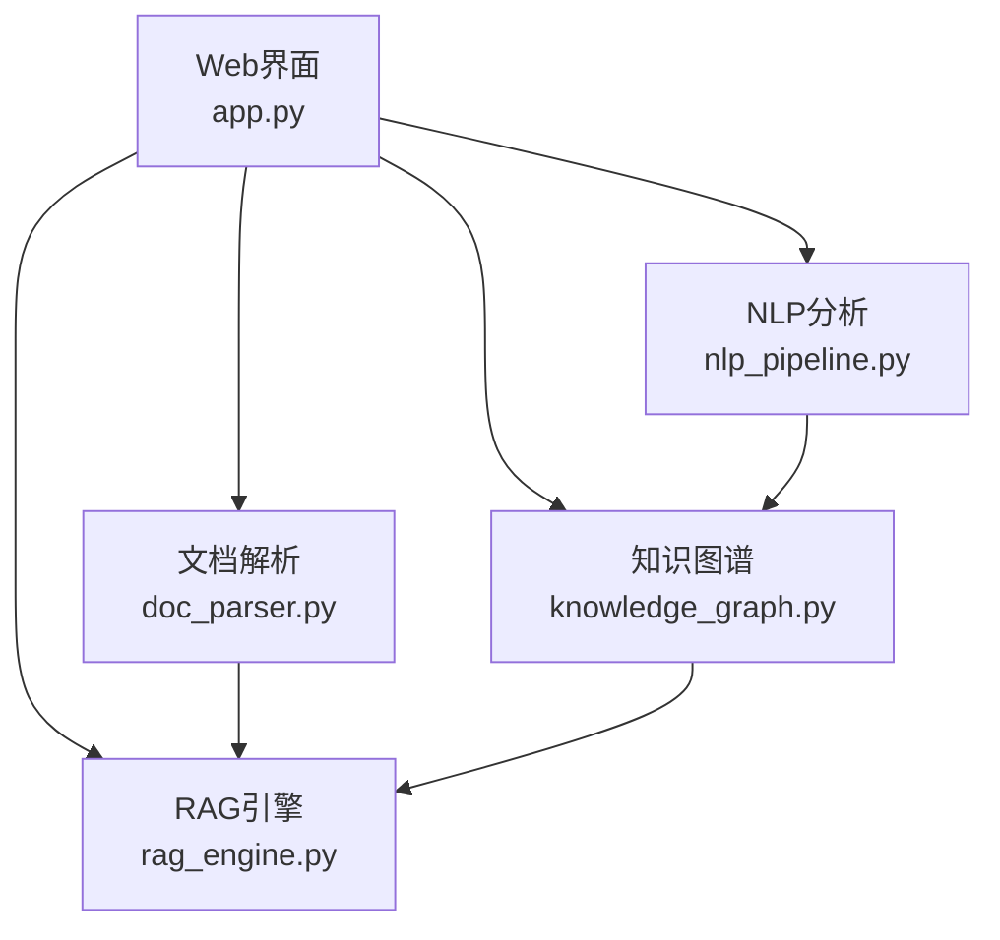
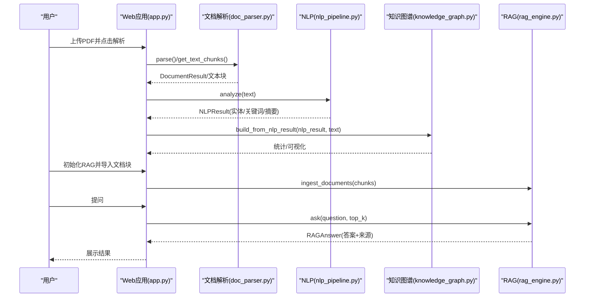
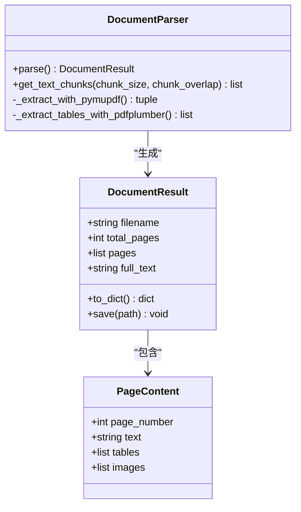
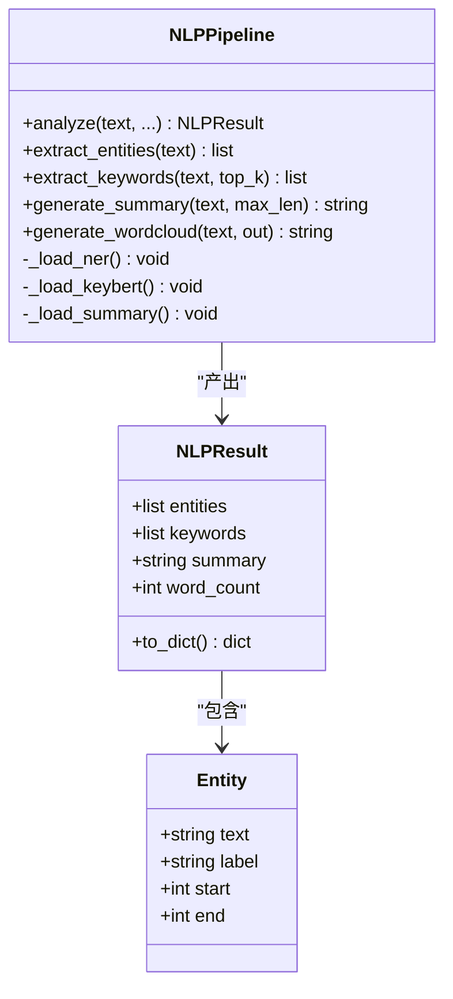
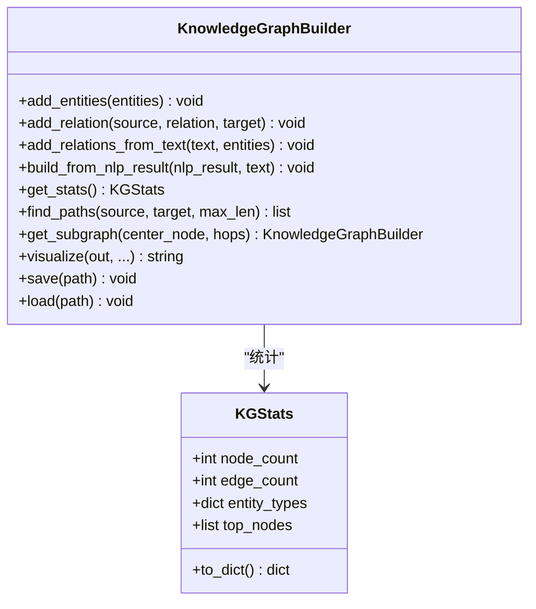
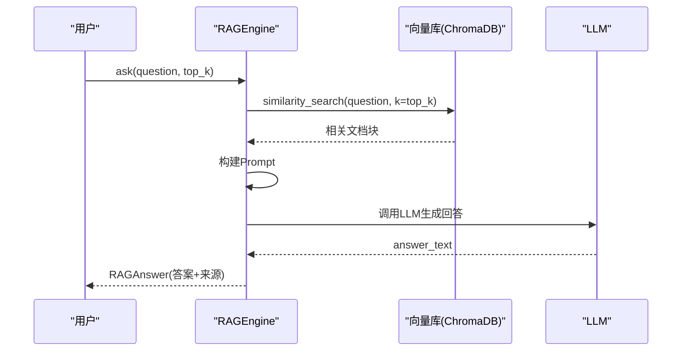
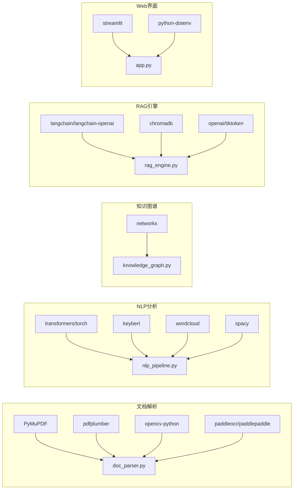

# 扩展开发

<cite>
**本文引用的文件**
- [__init__.py](file://zhixi/src/__init__.py)
- [app.py](file://zhixi/src/app.py)
- [doc_parser.py](file://zhixi/src/doc_parser.py)
- [knowledge_graph.py](file://zhixi/src/knowledge_graph.py)
- [nlp_pipeline.py](file://zhixi/src/nlp_pipeline.py)
- [rag_engine.py](file://zhixi/src/rag_engine.py)
- [test_core.py](file://zhixi/tests/test_core.py)
- [requirements.txt](file://zhixi/requirements.txt)
</cite>

## 目录
1. [简介](#简介)
2. [项目结构](#项目结构)
3. [核心组件](#核心组件)
4. [架构总览](#架构总览)
5. [详细组件分析](#详细组件分析)
6. [依赖关系分析](#依赖关系分析)
7. [性能考量](#性能考量)
8. [故障排查指南](#故障排查指南)
9. [结论](#结论)
10. [附录：扩展开发指南](#附录扩展开发指南)

## 简介
本指南面向希望在智析（ZhiXi）平台上进行扩展开发的工程师，围绕四大核心模块：文档解析、NLP分析、知识图谱、RAG引擎，系统讲解如何：
- 新增文档格式解析器（适配新格式）
- 扩展NLP分析能力（新算法/模型替换）
- 扩展知识图谱（新增实体/关系类型）
- 定制RAG引擎（新模型接入/检索策略调整）
- 设计模块扩展的架构原则与代码规范
- 提供完整示例与测试方法
- 给出贡献代码的最佳实践

## 项目结构
项目采用“分层+模块化”的组织方式：
- 展示层：Streamlit Web应用，负责交互与流程编排
- 数据层：文档解析器，负责从PDF等格式提取文本/表格/图像
- 分析层：NLP分析管线，负责实体识别、关键词、摘要等
- 知识层：知识图谱构建与分析
- 应用层：RAG引擎，负责检索增强问答

图表来源
- [app.py:176-195](file://zhixi/src/app.py#L176-L195)
- [app.py:240-261](file://zhixi/src/app.py#L240-L261)
- [app.py:322-346](file://zhixi/src/app.py#L322-L346)
- [app.py:423-445](file://zhixi/src/app.py#L423-L445)

章节来源
- [__init__.py:1-14](file://zhixi/src/__init__.py#L1-L14)
- [requirements.txt:1-45](file://zhixi/requirements.txt#L1-L45)

## 核心组件
- 文档解析器：负责从PDF提取文本、表格、图像，并提供文本切块接口供RAG使用
- NLP分析管线：封装NER、关键词提取、摘要生成、词云生成
- 知识图谱：基于NetworkX构建实体-关系图，支持统计、可视化、路径查找
- RAG引擎：基于LangChain+ChromaDB，支持OpenAI/Ollama双模式
- Web应用：统一调度上述模块，提供交互流程

章节来源
- [doc_parser.py:64-144](file://zhixi/src/doc_parser.py#L64-L144)
- [nlp_pipeline.py:45-145](file://zhixi/src/nlp_pipeline.py#L45-L145)
- [knowledge_graph.py:44-173](file://zhixi/src/knowledge_graph.py#L44-L173)
- [rag_engine.py:47-92](file://zhixi/src/rag_engine.py#L47-L92)
- [app.py:176-195](file://zhixi/src/app.py#L176-L195)

## 架构总览
下图展示了Web应用如何串联四大模块，并给出关键数据流与控制流。

图表来源
- [app.py:176-195](file://zhixi/src/app.py#L176-L195)
- [app.py:240-261](file://zhixi/src/app.py#L240-L261)
- [app.py:322-346](file://zhixi/src/app.py#L322-L346)
- [app.py:423-461](file://zhixi/src/app.py#L423-L461)
- [doc_parser.py:212-268](file://zhixi/src/doc_parser.py#L212-L268)
- [nlp_pipeline.py:106-145](file://zhixi/src/nlp_pipeline.py#L106-L145)
- [knowledge_graph.py:137-151](file://zhixi/src/knowledge_graph.py#L137-L151)
- [rag_engine.py:154-191](file://zhixi/src/rag_engine.py#L154-L191)
- [rag_engine.py:192-263](file://zhixi/src/rag_engine.py#L192-L263)

## 详细组件分析

### 文档解析器（新增格式适配与插件机制）
- 当前实现：基于PyMuPDF提取文本/图像，pdfplumber提取表格，提供统一的DocumentResult与文本切块接口
- 扩展方向：
  - 新增格式适配：通过继承/组合的方式引入新的解析器（如Word、Excel、HTML），并在Web应用中注册
  - 插件机制：定义统一的解析器接口，允许动态加载不同格式的解析器
  - 输出标准化：保证所有解析器输出一致的数据结构（如包含pages/full_text/chunks）

图表来源
- [doc_parser.py:64-144](file://zhixi/src/doc_parser.py#L64-L144)
- [doc_parser.py:32-62](file://zhixi/src/doc_parser.py#L32-L62)

章节来源
- [doc_parser.py:64-144](file://zhixi/src/doc_parser.py#L64-L144)
- [doc_parser.py:212-268](file://zhixi/src/doc_parser.py#L212-L268)

### NLP分析（新算法集成与模型替换）
- 当前实现：NER、关键词提取、摘要生成、词云生成，均采用延迟加载策略
- 扩展方向：
  - 新算法集成：在现有数据结构基础上，新增分析步骤（如情感分析、主题建模）
  - 模型替换：通过构造函数注入模型名称或配置，支持本地/云端模型切换
  - 结果标准化：保持NLPResult结构不变，便于上层模块复用

图表来源
- [nlp_pipeline.py:45-145](file://zhixi/src/nlp_pipeline.py#L45-L145)
- [nlp_pipeline.py:24-43](file://zhixi/src/nlp_pipeline.py#L24-L43)

章节来源
- [nlp_pipeline.py:45-145](file://zhixi/src/nlp_pipeline.py#L45-L145)

### 知识图谱（新增实体/关系类型）
- 当前实现：支持实体节点、关系边、统计信息、可视化、路径查找、子图裁剪
- 扩展方向：
  - 新实体类型：在实体类型映射表中新增类别，并更新可视化颜色
  - 新关系类型：在关系构建逻辑中识别新模式（如共现、因果、时序等）
  - 分析能力：新增中心性、社区检测、路径分析等

图表来源
- [knowledge_graph.py:44-173](file://zhixi/src/knowledge_graph.py#L44-L173)
- [knowledge_graph.py:27-42](file://zhixi/src/knowledge_graph.py#L27-L42)

章节来源
- [knowledge_graph.py:44-173](file://zhixi/src/knowledge_graph.py#L44-L173)

### RAG引擎（新模型支持与检索策略）
- 当前实现：支持OpenAI与Ollama两种模式，向量检索+Prompt工程，支持清空集合
- 扩展方向：
  - 新模型支持：在LLM初始化处扩展更多后端（如DashScope、Claude等）
  - 检索策略：调整top_k、重排序、多路召回、混合检索
  - Prompt优化：模板化Prompt、Few-shot示例、上下文压缩

图表来源
- [rag_engine.py:192-263](file://zhixi/src/rag_engine.py#L192-L263)
- [rag_engine.py:154-191](file://zhixi/src/rag_engine.py#L154-L191)

章节来源
- [rag_engine.py:47-92](file://zhixi/src/rag_engine.py#L47-L92)
- [rag_engine.py:192-263](file://zhixi/src/rag_engine.py#L192-L263)

## 依赖关系分析
- Python生态依赖集中在数据科学、文档解析、NLP、RAG、知识图谱、Web界面等模块
- 关键外部库：PyMuPDF/pdfplumber、Transformers/KeyBERT、LangChain/ChromaDB、NetworkX、Streamlit

图表来源
- [requirements.txt:6-45](file://zhixi/requirements.txt#L6-L45)
- [doc_parser.py:26-29](file://zhixi/src/doc_parser.py#L26-L29)
- [nlp_pipeline.py:76-104](file://zhixi/src/nlp_pipeline.py#L76-L104)
- [knowledge_graph.py:24](file://zhixi/src/knowledge_graph.py#L24)
- [rag_engine.py:100-135](file://zhixi/src/rag_engine.py#L100-L135)
- [app.py:24-27](file://zhixi/src/app.py#L24-L27)

章节来源
- [requirements.txt:6-45](file://zhixi/requirements.txt#L6-L45)

## 性能考量
- 延迟加载：NLP与RAG均采用按需初始化，减少内存占用
- 文本切块：合理设置chunk_size与overlap，平衡召回与上下文长度
- 向量检索：top_k影响召回质量与响应时间，建议结合业务场景调优
- 可视化裁剪：知识图谱可视化时对节点数量做上限控制，避免渲染开销过大

## 故障排查指南
- 文档解析失败：检查PDF路径是否存在、是否被占用；确认PyMuPDF/pdfplumber版本兼容
- NLP模型加载失败：首次运行需下载模型，确保网络可达；检查transformers/keybert版本
- RAG无结果：确认已成功导入文档块；检查向量库是否为空；核对模型配置
- 知识图谱可视化异常：matplotlib字体配置、节点过多导致渲染缓慢

章节来源
- [doc_parser.py:89-91](file://zhixi/src/doc_parser.py#L89-L91)
- [nlp_pipeline.py:76-104](file://zhixi/src/nlp_pipeline.py#L76-L104)
- [rag_engine.py:154-191](file://zhixi/src/rag_engine.py#L154-L191)
- [knowledge_graph.py:241-312](file://zhixi/src/knowledge_graph.py#L241-312)

## 结论
本指南提供了在智析平台上的扩展开发蓝图：以标准化数据结构为核心，通过延迟加载与模块解耦实现可插拔扩展；以Web应用为入口统一编排四大模块。遵循本文的架构原则与代码规范，即可安全地新增格式解析器、集成新算法/模型、扩展知识图谱类型与定制RAG策略。

## 附录：扩展开发指南

### 一、新增文档解析器（适配新格式）
目标：在不破坏现有流程的前提下，接入新的文档格式（如DOCX/HTML/CSV等）。

- 设计思路
  - 定义统一接口：解析器应提供parse()与get_text_chunks()方法，返回DocumentResult与文本块列表
  - 输出标准化：确保字段与现有结构一致（如pages/full_text/chunks）
  - 在Web应用中注册：在侧边栏或解析流程中新增选项，按格式选择对应解析器

- 实施要点
  - 保持错误处理：解析失败时返回空结果或抛出明确异常
  - 控制资源：对图像/表格等资源进行必要裁剪与缓存
  - 测试覆盖：编写单元测试验证输出结构与边界条件

章节来源
- [doc_parser.py:64-144](file://zhixi/src/doc_parser.py#L64-L144)
- [doc_parser.py:212-268](file://zhixi/src/doc_parser.py#L212-L268)
- [app.py:176-195](file://zhixi/src/app.py#L176-L195)

### 二、扩展NLP分析（新算法/模型替换）
目标：在不改变上层调用方式的前提下，替换或新增分析能力。

- 设计思路
  - 保持NLPResult结构稳定，新增分析步骤只需扩展NLPPipeline的analyze()分支
  - 模型替换：通过构造函数注入模型名称或配置，支持本地/云端切换
  - 延迟加载：继续沿用按需初始化策略，避免冷启动开销

- 实施要点
  - 新增算法：在analyze()中新增分支，调用相应工具并填充NLPResult
  - 模型替换：提供环境变量或配置项，优先读取用户配置
  - 可观测性：记录模型加载与推理耗时，便于性能监控

章节来源
- [nlp_pipeline.py:45-145](file://zhixi/src/nlp_pipeline.py#L45-L145)
- [nlp_pipeline.py:106-145](file://zhixi/src/nlp_pipeline.py#L106-L145)

### 三、扩展知识图谱（新增实体/关系类型）
目标：支持更多实体类型与关系类型，提升图谱表达力。

- 设计思路
  - 实体类型：在实体类型映射表中新增类别，并更新可视化颜色与统计维度
  - 关系类型：在add_relations_from_text()中识别新模式（如共现、因果、时序等）
  - 分析能力：新增中心性、社区检测、路径分析等指标

- 实施要点
  - 可视化一致性：新增类型需配套颜色与标签
  - 统计口径：确保KGStats能正确统计新类型的分布
  - 子图裁剪：对新类型节点同样适用度阈值与跳数限制

章节来源
- [knowledge_graph.py:44-173](file://zhixi/src/knowledge_graph.py#L44-L173)
- [knowledge_graph.py:224-312](file://zhixi/src/knowledge_graph.py#L224-L312)

### 四、定制RAG引擎（新模型/检索策略）
目标：支持更多LLM后端与更灵活的检索策略。

- 设计思路
  - LLM后端：在LLM初始化处扩展更多后端（如DashScope、Claude等），统一接口
  - 检索策略：支持top_k、重排序、多路召回、混合检索
  - Prompt工程：模板化Prompt、Few-shot示例、上下文压缩

- 实施要点
  - 模型配置：优先读取环境变量或用户配置，提供默认值
  - 向量库：支持批量导入与增量更新，提供清空集合能力
  - 错误兜底：LLM调用失败时返回明确提示，避免中断流程

章节来源
- [rag_engine.py:47-92](file://zhixi/src/rag_engine.py#L47-L92)
- [rag_engine.py:192-263](file://zhixi/src/rag_engine.py#L192-L263)

### 五、模块扩展的架构设计原则与代码规范
- 单一职责：每个模块聚焦一个领域（解析/NLP/图谱/RAG）
- 接口稳定：对外暴露的数据结构保持稳定，便于上层复用
- 延迟加载：大模型/向量库按需初始化，降低启动成本
- 可观测性：记录关键步骤与耗时，便于调试与性能评估
- 可测试性：提供最小可运行示例与单元测试，覆盖关键路径

章节来源
- [nlp_pipeline.py:76-104](file://zhixi/src/nlp_pipeline.py#L76-L104)
- [rag_engine.py:117-135](file://zhixi/src/rag_engine.py#L117-L135)

### 六、新功能开发的完整示例与测试方法
- 示例流程
  - 新增解析器：实现parse()/get_text_chunks()，在Web应用中注册
  - 新增NLP算法：在NLPPipeline中新增分支，填充NLPResult
  - 新增实体/关系：在知识图谱中新增类型映射与关系识别逻辑
  - 新增RAG模型：在LLM初始化处扩展后端，统一接口
- 测试方法
  - 单元测试：针对数据结构与关键逻辑编写pytest
  - 集成测试：模拟Web应用流程，验证端到端链路
  - 性能测试：对比不同配置下的吞吐与延迟

章节来源
- [test_core.py:18-105](file://zhixi/tests/test_core.py#L18-L105)
- [test_core.py:107-146](file://zhixi/tests/test_core.py#L107-L146)
- [test_core.py:148-163](file://zhixi/tests/test_core.py#L148-L163)

### 七、贡献代码的指导与最佳实践
- 提交规范
  - 分支命名：feature/xxx、fix/xxx、docs/xxx
  - 提交信息：简明描述变更内容与动机
- 代码审查
  - 保持模块边界清晰，避免循环依赖
  - 新增功能必须附带测试用例
  - 注意性能与资源消耗，避免引入瓶颈
- 文档与注释
  - 为新增模块/函数补充必要的文档字符串
  - 对复杂逻辑添加注释说明设计权衡