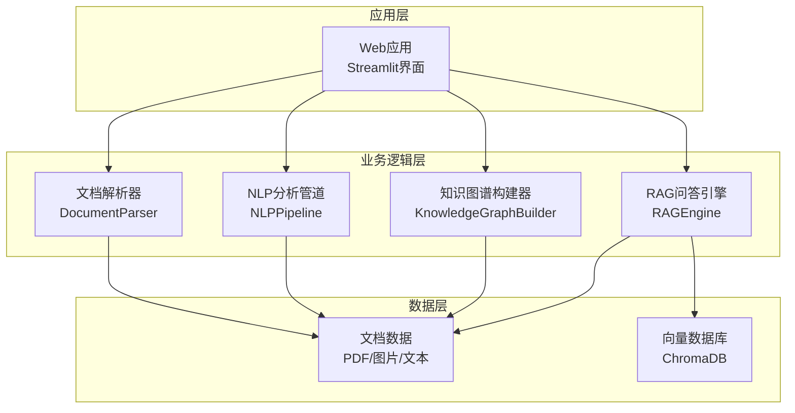
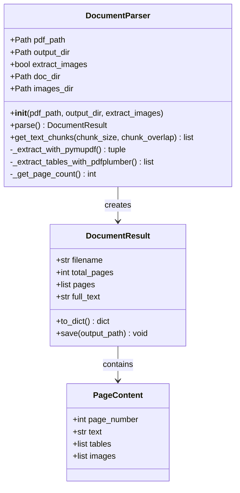
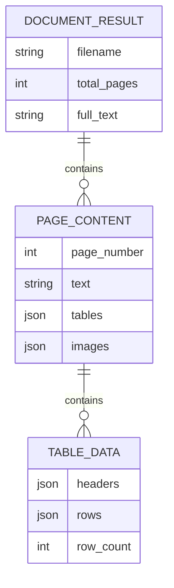
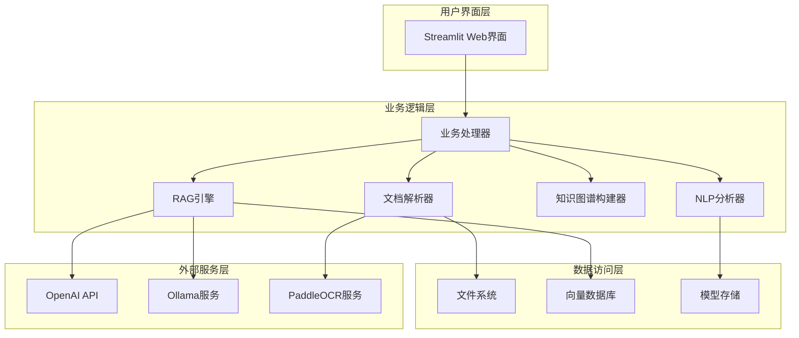
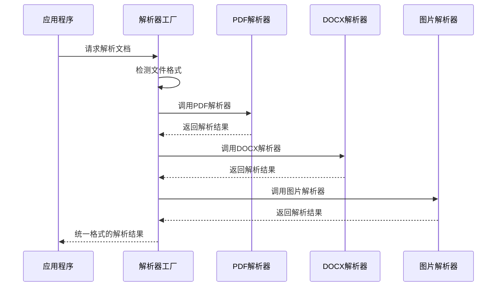
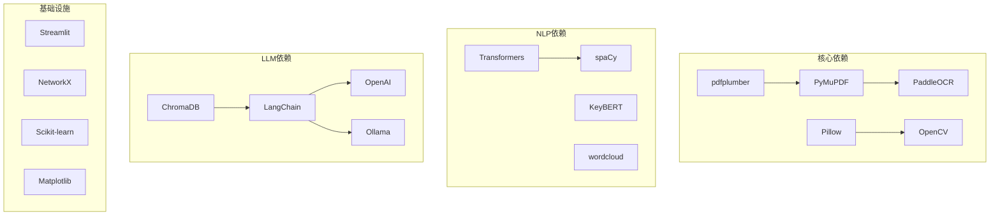
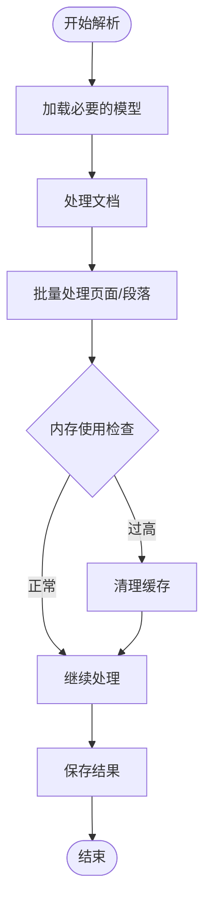
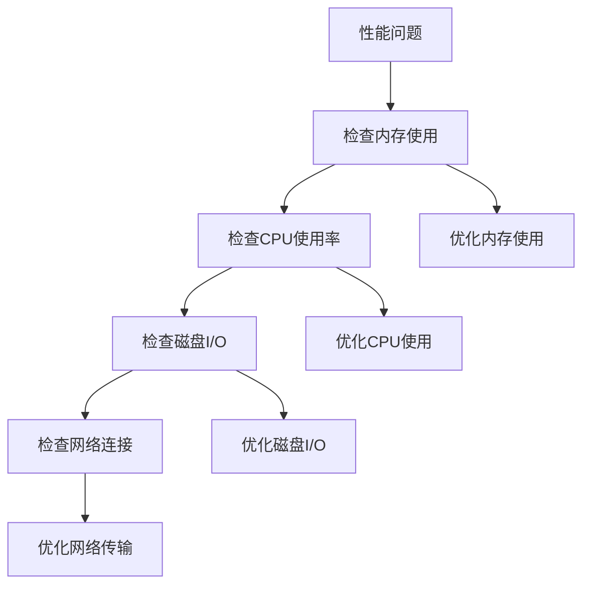
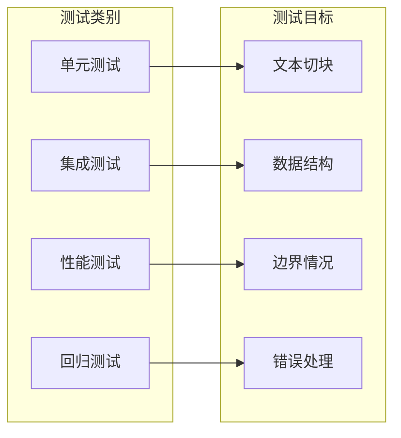

# 文档解析器扩展

<cite>
**本文档引用的文件**
- [doc_parser.py](file://zhixi/src/doc_parser.py)
- [app.py](file://zhixi/src/app.py)
- [nlp_pipeline.py](file://zhixi/src/nlp_pipeline.py)
- [knowledge_graph.py](file://zhixi/src/knowledge_graph.py)
- [rag_engine.py](file://zhixi/src/rag_engine.py)
- [test_core.py](file://zhixi/tests/test_core.py)
- [requirements.txt](file://zhixi/requirements.txt)
</cite>

## 目录
1. [简介](#简介)
2. [项目结构](#项目结构)
3. [核心组件](#核心组件)
4. [架构概览](#架构概览)
5. [详细组件分析](#详细组件分析)
6. [依赖分析](#依赖分析)
7. [性能考虑](#性能考虑)
8. [故障排除指南](#故障排除指南)
9. [结论](#结论)
10. [附录](#附录)

## 简介

智析（ZhiXi）是一个多模态文档智能分析与知识问答平台，专注于为用户提供全面的文档处理能力。本文档解析器扩展开发指南旨在帮助开发者理解和扩展系统的文档解析功能，特别是如何添加新的文档格式支持（如Word、Excel、图片等），以及如何扩展DocumentParser类来支持更多格式的解析。

该系统采用模块化设计，通过清晰的接口和扩展机制，使得添加新的文档格式解析器变得简单而可靠。系统当前主要支持PDF文档解析，但其架构设计允许轻松扩展到其他文档格式。

## 项目结构

智析项目采用清晰的分层架构，每个模块都有特定的职责和边界：



**图表来源**
- [app.py:1-492](file://zhixi/src/app.py#L1-L492)
- [doc_parser.py:64-319](file://zhixi/src/doc_parser.py#L64-L319)

**章节来源**
- [app.py:1-492](file://zhixi/src/app.py#L1-L492)
- [doc_parser.py:1-319](file://zhixi/src/doc_parser.py#L1-L319)

## 核心组件

### DocumentParser类架构

DocumentParser是系统的核心解析器，负责从各种文档格式中提取文本、表格和图像信息。其设计采用了模块化和可扩展的架构：



**图表来源**
- [doc_parser.py:64-319](file://zhixi/src/doc_parser.py#L64-L319)

### 数据结构设计

系统使用精心设计的数据结构来表示解析结果，确保数据的一致性和可扩展性：



**图表来源**
- [doc_parser.py:32-61](file://zhixi/src/doc_parser.py#L32-L61)

**章节来源**
- [doc_parser.py:64-319](file://zhixi/src/doc_parser.py#L64-L319)

## 架构概览

智析系统采用分层架构设计，每层都有明确的职责和接口：



**图表来源**
- [app.py:176-492](file://zhixi/src/app.py#L176-L492)
- [doc_parser.py:1-319](file://zhixi/src/doc_parser.py#L1-L319)

## 详细组件分析

### 文档解析器扩展机制

#### 当前支持的格式

系统当前主要支持PDF格式，通过以下技术栈实现：
- **PyMuPDF**: PDF文本和图像提取
- **pdfplumber**: PDF表格提取  
- **Pillow**: 图像处理
- **OpenCV**: 图像预处理

#### 扩展新格式的支持

要添加新的文档格式支持，需要遵循以下步骤：

1. **创建新的解析器类**：继承基础解析器接口
2. **实现格式特定的解析逻辑**
3. **保持统一的数据结构输出**
4. **集成到主应用流程**

#### 插件式设计模式

系统采用插件式设计，允许动态加载和注册新的解析器：



**图表来源**
- [app.py:176-195](file://zhixi/src/app.py#L176-L195)
- [doc_parser.py:98-144](file://zhixi/src/doc_parser.py#L98-L144)

### Word文档解析器开发

#### 设计要点

Word文档（.doc/.docx）解析需要考虑以下特性：
- **文本提取**: 保持段落和格式信息
- **表格处理**: 提取表格结构和内容
- **样式信息**: 保留字体、加粗、斜体等样式
- **元数据**: 文档标题、作者、创建时间等

#### 实现步骤

1. **依赖安装**: 添加python-docx库支持
2. **类继承**: 继承DocumentParser基类
3. **格式检测**: 自动识别DOC和DOCX格式
4. **解析实现**: 实现特定的解析逻辑

#### 元数据处理

Word文档包含丰富的元数据信息：
- 文档属性：标题、作者、主题、关键词
- 统计信息：页数、字数、段落数
- 版本信息：创建时间、修改时间
- 自定义属性：用户定义的元数据

### Excel电子表格解析器开发

#### 技术实现

Excel文档解析的关键挑战在于处理复杂的表格结构：
- **多工作表支持**: 处理工作簿中的多个工作表
- **单元格类型**: 数值、文本、公式、日期等
- **格式保持**: 保留原始格式和样式
- **数据验证**: 确保数据的完整性和准确性

#### 数据结构设计

Excel解析结果应该包含：
- **工作表列表**: 每个工作表的独立数据
- **单元格信息**: 坐标、值、格式、注释
- **表格结构**: 合并单元格、冻结窗格等
- **元数据**: 工作簿属性、计算设置

### 图片文档解析器开发

#### OCR集成

图片文档解析主要依赖OCR技术：
- **PaddleOCR**: 支持多语言的高性能OCR
- **图像预处理**: 提升OCR识别准确率
- **版面分析**: 识别文本区域和布局结构

#### 支持的图片格式

系统应支持常见的图片格式：
- **位图格式**: JPEG、PNG、BMP、TIFF
- **矢量格式**: SVG、EPS（需要转换）
- **专业格式**: PDF扫描件、截图等

#### 元数据提取

图片文档的元数据包括：
- **EXIF信息**: 相机型号、拍摄时间、GPS坐标
- **文件属性**: 大小、分辨率、色彩空间
- **版权信息**: 版权声明、水印检测

**章节来源**
- [doc_parser.py:146-203](file://zhixi/src/doc_parser.py#L146-L203)
- [doc_parser.py:212-268](file://zhixi/src/doc_parser.py#L212-L268)

## 依赖分析

### 核心依赖关系

系统依赖关系清晰且层次分明：



**图表来源**
- [requirements.txt:1-45](file://zhixi/requirements.txt#L1-L45)

### 扩展依赖考虑

当添加新的文档格式时，需要考虑额外的依赖：

| 格式 | 新增依赖 | 用途 |
|------|----------|------|
| Word (.doc/.docx) | python-docx | 文档解析 |
| Excel (.xlsx/.xls) | openpyxl | 表格处理 |
| 图片 | tesseract | OCR识别 |
| PowerPoint | python-pptx | 幻灯片解析 |
| HTML | beautifulsoup4 | 网页内容提取 |

**章节来源**
- [requirements.txt:1-45](file://zhixi/requirements.txt#L1-L45)

## 性能考虑

### 解析性能优化

系统在设计时充分考虑了性能优化：

1. **延迟加载**: 模型和资源按需加载
2. **批量处理**: 支持批量文档处理
3. **缓存机制**: 结果缓存减少重复计算
4. **内存管理**: 及时释放不需要的资源

### 内存使用控制



**图表来源**
- [doc_parser.py:98-144](file://zhixi/src/doc_parser.py#L98-L144)

### 并发处理策略

系统支持并发处理以提升性能：
- **多进程**: 不同文档的并行解析
- **异步IO**: 文件读写和网络请求
- **GPU加速**: 支持CUDA加速的OCR处理

## 故障排除指南

### 常见问题及解决方案

#### 解析错误

| 问题类型 | 症状 | 解决方案 |
|----------|------|----------|
| PDF损坏 | 解析失败或异常中断 | 使用修复工具修复PDF |
| 缺少依赖 | 导入错误或功能不可用 | 安装缺失的Python包 |
| 内存不足 | 处理大型文档时崩溃 | 增加内存或分批处理 |
| OCR失败 | 文字识别准确率低 | 调整图像质量或参数 |

#### 性能问题



**图表来源**
- [app.py:176-195](file://zhixi/src/app.py#L176-L195)

### 测试验证标准

系统提供了完善的测试框架来验证解析器的功能：

#### 单元测试覆盖



**图表来源**
- [test_core.py:107-168](file://zhixi/tests/test_core.py#L107-L168)

**章节来源**
- [test_core.py:1-168](file://zhixi/tests/test_core.py#L1-L168)

## 结论

智析文档解析器扩展开发指南为开发者提供了一个完整的框架来扩展系统对新文档格式的支持。通过遵循本文档的设计原则和实现步骤，可以轻松地添加Word、Excel、图片等格式的解析器。

系统的核心优势在于其模块化设计和插件式架构，这使得扩展新功能变得简单而可靠。同时，完善的测试框架和性能优化策略确保了扩展功能的质量和稳定性。

未来的发展方向包括：
- 支持更多文档格式
- 集成云端OCR服务
- 实现增量解析功能
- 优化大规模文档处理性能

## 附录

### 开发最佳实践

1. **保持向后兼容**: 新增功能不影响现有接口
2. **错误处理**: 完善的异常捕获和错误恢复
3. **日志记录**: 详细的处理过程记录
4. **配置管理**: 灵活的参数配置选项
5. **文档更新**: 及时更新相关文档和示例

### 扩展开发模板

```python
class NewFormatParser(DocumentParser):
    """
    新格式文档解析器模板
    继承自DocumentParser基类
    """
    
    def __init__(self, file_path: str, output_dir: str = "data/processed"):
        super().__init__(file_path, output_dir)
        # 初始化格式特定的配置
        self.format_config = self._load_format_config()
    
    def _detect_format(self) -> bool:
        """检测文件格式"""
        # 实现格式检测逻辑
        pass
    
    def _extract_text(self) -> list:
        """提取文本内容"""
        # 实现文本提取逻辑
        pass
    
    def _extract_metadata(self) -> dict:
        """提取元数据信息"""
        # 实现元数据提取逻辑
        pass
    
    def _extract_attachments(self) -> list:
        """提取附件文件"""
        # 实现附件提取逻辑
        pass
```

### 部署注意事项

1. **环境准备**: 确保所有依赖正确安装
2. **配置文件**: 设置必要的环境变量
3. **权限设置**: 文件系统和网络访问权限
4. **监控设置**: 性能指标和错误日志监控
5. **备份策略**: 重要数据的定期备份