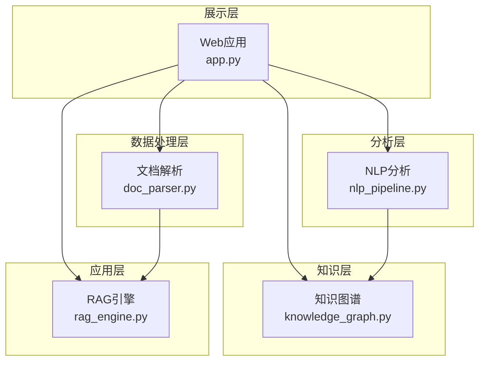
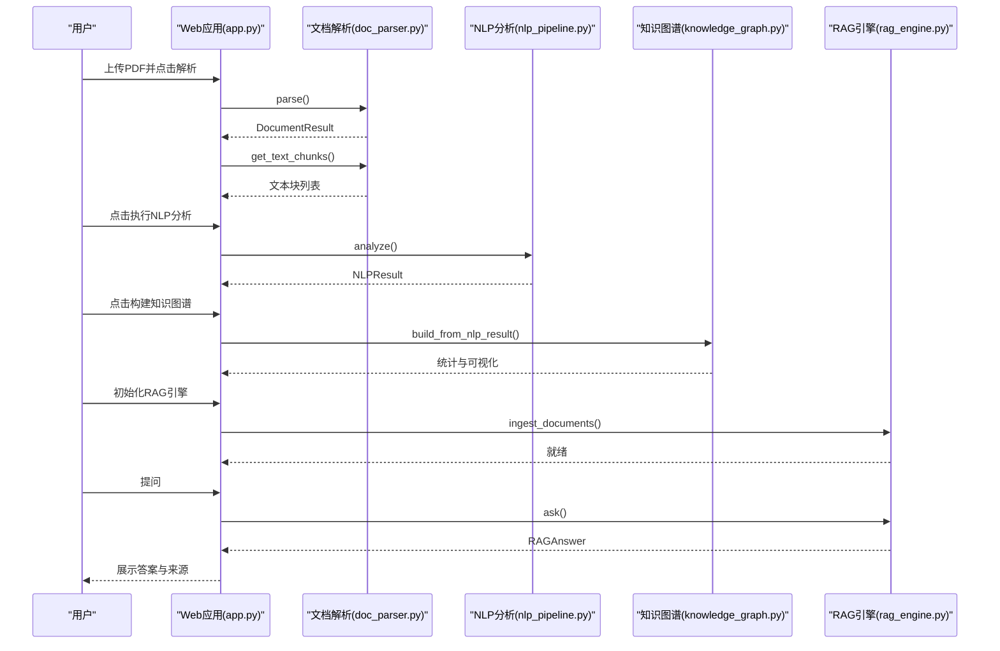
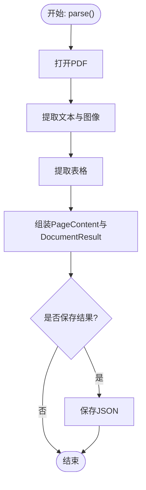
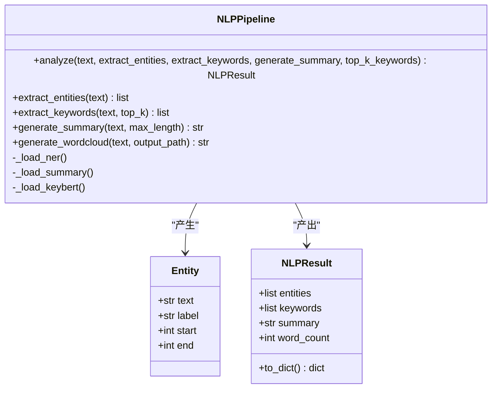
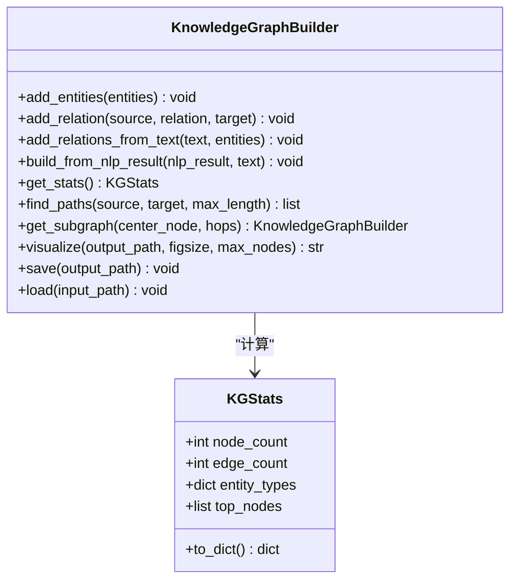
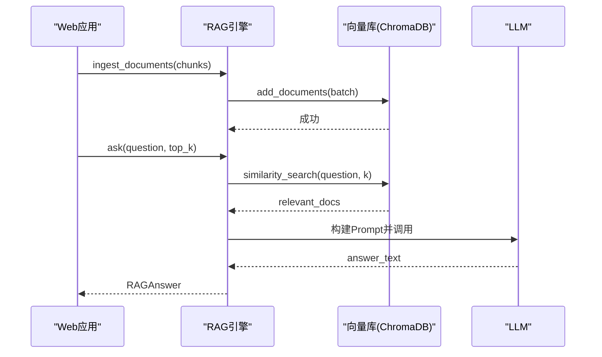
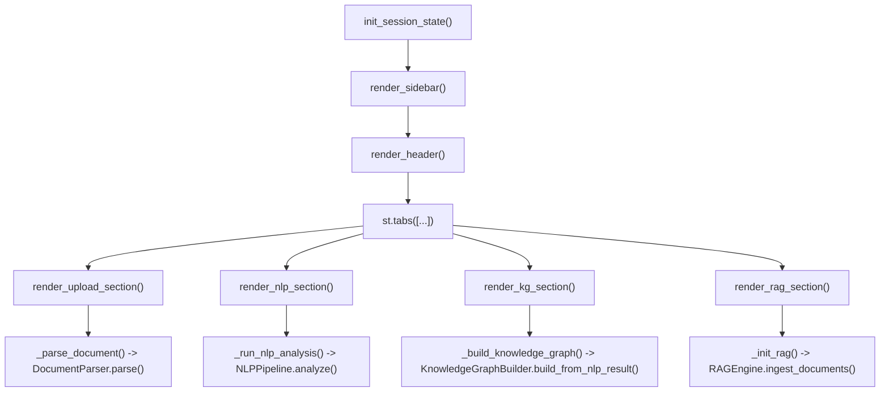
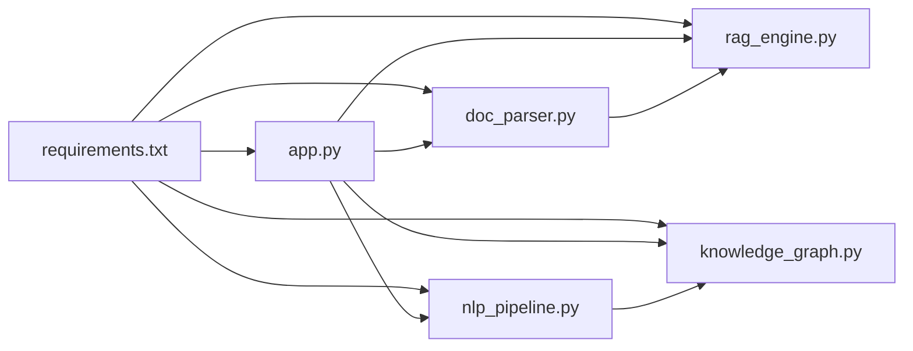

# 模块架构设计原则

<cite>
**本文档引用的文件**
- [zhixi/src/__init__.py](file://zhixi/src/__init__.py)
- [zhixi/src/app.py](file://zhixi/src/app.py)
- [zhixi/src/doc_parser.py](file://zhixi/src/doc_parser.py)
- [zhixi/src/nlp_pipeline.py](file://zhixi/src/nlp_pipeline.py)
- [zhixi/src/knowledge_graph.py](file://zhixi/src/knowledge_graph.py)
- [zhixi/src/rag_engine.py](file://zhixi/src/rag_engine.py)
- [zhixi/tests/test_core.py](file://zhixi/tests/test_core.py)
- [zhixi/requirements.txt](file://zhixi/requirements.txt)
</cite>

## 目录
1. [引言](#引言)
2. [项目结构](#项目结构)
3. [核心组件](#核心组件)
4. [架构总览](#架构总览)
5. [详细组件分析](#详细组件分析)
6. [依赖关系分析](#依赖关系分析)
7. [性能考量](#性能考量)
8. [故障排除指南](#故障排除指南)
9. [结论](#结论)
10. [附录](#附录)

## 引言
本指南面向智析（ZhiXi）平台的模块化架构设计，系统阐述模块化理念、架构模式、模块间依赖与接口规范、数据与状态管理、扩展设计原则（单一职责与开闭原则）、松耦合与高内聚策略，并结合实际代码示例展示正确设计模式。同时提供模块测试与验证方法论，帮助开发者在保持系统稳定的同时实现可演进的模块化体系。

## 项目结构
智析平台采用“分层模块化”组织方式：
- 展示层：Streamlit Web应用，负责用户交互与状态管理
- 数据处理层：文档解析（CV层），负责PDF文本/表格/图像提取与文本切块
- 分析层：NLP分析（数据挖掘层），负责实体识别、关键词提取、摘要生成、词云
- 知识层：知识图谱（数据挖掘层），负责实体关系抽取、图谱构建与可视化
- 应用层：RAG问答引擎（LLM应用层），负责向量检索与LLM生成

**图表来源**
- [zhixi/src/app.py:462-492](file://zhixi/src/app.py#L462-L492)
- [zhixi/src/doc_parser.py:63-144](file://zhixi/src/doc_parser.py#L63-L144)
- [zhixi/src/nlp_pipeline.py:45-145](file://zhixi/src/nlp_pipeline.py#L45-L145)
- [zhixi/src/knowledge_graph.py:44-173](file://zhixi/src/knowledge_graph.py#L44-L173)
- [zhixi/src/rag_engine.py:47-94](file://zhixi/src/rag_engine.py#L47-L94)

**章节来源**
- [zhixi/src/__init__.py:1-14](file://zhixi/src/__init__.py#L1-L14)

## 核心组件
- 文档解析模块（CV层）
  - 职责：从PDF提取文本、表格、图像；生成文本块（用于RAG）
  - 关键类：DocumentParser、PageContent、DocumentResult
  - 接口：parse()、get_text_chunks()

- NLP分析模块（数据挖掘层）
  - 职责：NER、关键词提取、摘要生成、词云
  - 关键类：NLPPipeline、Entity、NLPResult
  - 接口：analyze()、extract_entities()、extract_keywords()、generate_summary()、generate_wordcloud()

- 知识图谱模块（数据挖掘层）
  - 职责：实体节点与关系构建、统计分析、路径查找、可视化
  - 关键类：KnowledgeGraphBuilder、KGStats
  - 接口：add_entities()、add_relation()、build_from_nlp_result()、visualize()、save()/load()

- RAG引擎模块（LLM应用层）
  - 职责：向量数据库导入、相似检索、Prompt构造、LLM问答
  - 关键类：RAGEngine、RAGAnswer
  - 接口：ingest_documents()、ask()、search()、clear_collection()

- Web应用模块（展示层）
  - 职责：用户界面、参数配置、状态管理、工作流编排
  - 关键函数：main()、render_*()、_init_rag()、_ask_question()

**章节来源**
- [zhixi/src/doc_parser.py:32-144](file://zhixi/src/doc_parser.py#L32-L144)
- [zhixi/src/nlp_pipeline.py:24-145](file://zhixi/src/nlp_pipeline.py#L24-L145)
- [zhixi/src/knowledge_graph.py:27-173](file://zhixi/src/knowledge_graph.py#L27-L173)
- [zhixi/src/rag_engine.py:30-94](file://zhixi/src/rag_engine.py#L30-L94)
- [zhixi/src/app.py:62-492](file://zhixi/src/app.py#L62-L492)

## 架构总览
智析平台遵循“展示层-数据处理层-分析层-知识层-应用层”的分层架构，模块间通过清晰的数据结构与函数接口进行解耦协作。Web应用作为编排者，按步骤驱动各模块完成端到端任务。

**图表来源**
- [zhixi/src/app.py:175-461](file://zhixi/src/app.py#L175-L461)
- [zhixi/src/doc_parser.py:97-144](file://zhixi/src/doc_parser.py#L97-L144)
- [zhixi/src/nlp_pipeline.py:106-145](file://zhixi/src/nlp_pipeline.py#L106-L145)
- [zhixi/src/knowledge_graph.py:137-173](file://zhixi/src/knowledge_graph.py#L137-L173)
- [zhixi/src/rag_engine.py:154-263](file://zhixi/src/rag_engine.py#L154-L263)

## 详细组件分析

### 文档解析模块（CV层）
- 设计要点
  - 单一职责：专注PDF解析与文本切块，不直接参与下游分析
  - 数据结构：PageContent、DocumentResult封装页面级与整体结果
  - 可扩展性：支持禁用图像提取、可配置输出目录
- 关键流程
  - parse()：顺序调用PyMuPDF提取文本/图像、pdfplumber提取表格，组装DocumentResult
  - get_text_chunks()：按段落与重叠策略切分文本，便于RAG导入
- 错误处理
  - 表格提取异常时降级为空表，保证流程继续
  - 文件不存在抛出异常，由上层UI捕获并提示

**图表来源**
- [zhixi/src/doc_parser.py:97-144](file://zhixi/src/doc_parser.py#L97-L144)

**章节来源**
- [zhixi/src/doc_parser.py:32-144](file://zhixi/src/doc_parser.py#L32-L144)

### NLP分析模块（数据挖掘层）
- 设计要点
  - 延迟加载：按需初始化NER、摘要、KeyBERT，降低内存占用
  - 数据结构：Entity、NLPResult统一实体、关键词、摘要与统计
  - 可扩展性：支持不同模型与设备选择
- 关键流程
  - analyze()：串行执行实体识别、关键词提取、摘要生成
  - generate_wordcloud()：对清洗后的文本生成词云
- 错误处理
  - 模型加载失败或输入过短时返回空结果或降级摘要

**图表来源**
- [zhixi/src/nlp_pipeline.py:45-262](file://zhixi/src/nlp_pipeline.py#L45-L262)

**章节来源**
- [zhixi/src/nlp_pipeline.py:24-262](file://zhixi/src/nlp_pipeline.py#L24-L262)

### 知识图谱模块（数据挖掘层）
- 设计要点
  - 单一职责：专注于实体与关系的构建、分析与可视化
  - 数据结构：KGStats封装统计指标
  - 可扩展性：支持有向/无向图、路径查找、子图裁剪
- 关键流程
  - build_from_nlp_result()：从NLP结果批量添加实体，再基于文本共现建立关系
  - visualize()：按实体类型着色、按度数调整节点大小
- 错误处理
  - 节点不存在时抛出异常，可视化失败返回None

**图表来源**
- [zhixi/src/knowledge_graph.py:44-329](file://zhixi/src/knowledge_graph.py#L44-L329)

**章节来源**
- [zhixi/src/knowledge_graph.py:27-329](file://zhixi/src/knowledge_graph.py#L27-L329)

### RAG引擎模块（LLM应用层）
- 设计要点
  - 单一职责：封装RAG完整流程，支持OpenAI与Ollama双模式
  - 数据结构：RAGAnswer统一问答与来源
  - 可扩展性：延迟初始化LLM与Embedding，支持不同模型与向量库
- 关键流程
  - ingest_documents()：将文本块批量写入ChromaDB
  - ask()：相似检索+Prompt+LLM生成，返回带来源的答案
- 错误处理
  - LLM调用异常时返回错误提示；无相关文档时返回提示信息

**图表来源**
- [zhixi/src/rag_engine.py:154-263](file://zhixi/src/rag_engine.py#L154-L263)

**章节来源**
- [zhixi/src/rag_engine.py:30-312](file://zhixi/src/rag_engine.py#L30-L312)

### Web应用模块（展示层）
- 设计要点
  - 单一职责：界面渲染、参数配置、状态管理、工作流编排
  - 状态管理：使用st.session_state维护PDF路径、解析结果、NLP结果、图谱状态、RAG状态与聊天历史
  - 可扩展性：通过函数拆分实现模块化渲染与事件处理
- 关键流程
  - main()：初始化侧边栏与标签页，分别渲染文档解析、NLP分析、知识图谱、RAG问答
  - _init_rag()：根据配置初始化RAG引擎并导入文本块
  - _ask_question()：调用RAG引擎并记录历史

**图表来源**
- [zhixi/src/app.py:62-492](file://zhixi/src/app.py#L62-L492)

**章节来源**
- [zhixi/src/app.py:62-492](file://zhixi/src/app.py#L62-L492)

## 依赖关系分析
- 模块内聚与耦合
  - 内聚：各模块职责单一，内部类与函数围绕特定任务组织
  - 耦合：通过清晰的数据结构（如DocumentResult、NLPResult、RAGAnswer）进行弱耦合传递
- 外部依赖
  - 基础库：numpy/pandas/matplotlib/scikit-learn
  - 文档解析：PyMuPDF/pdfplumber/opencv-python/Pillow
  - NLP：transformers/torch/spacy/keybert/wordcloud
  - LLM/RAG：langchain/langchain-community/langchain-openai/chromadb/openai/tiktoken
  - 知识图谱：networkx
  - 展示：streamlit/python-dotenv/tqdm
- 依赖方向
  - Web应用依赖所有模块（编排）
  - 文档解析与NLP结果被知识图谱消费
  - 文档解析结果被RAG消费
  - 知识图谱与NLP结果可独立存在，互不直接依赖

**图表来源**
- [zhixi/requirements.txt:6-45](file://zhixi/requirements.txt#L6-L45)
- [zhixi/src/app.py:175-461](file://zhixi/src/app.py#L175-L461)
- [zhixi/src/doc_parser.py:97-144](file://zhixi/src/doc_parser.py#L97-L144)
- [zhixi/src/nlp_pipeline.py:106-145](file://zhixi/src/nlp_pipeline.py#L106-L145)
- [zhixi/src/knowledge_graph.py:137-173](file://zhixi/src/knowledge_graph.py#L137-L173)
- [zhixi/src/rag_engine.py:154-263](file://zhixi/src/rag_engine.py#L154-L263)

**章节来源**
- [zhixi/requirements.txt:1-45](file://zhixi/requirements.txt#L1-L45)

## 性能考量
- 延迟加载与按需初始化
  - NLP与RAG均采用延迟加载，避免一次性加载大型模型导致内存压力
- 批量导入与分批处理
  - RAG导入文档块采用批量写入，减少IO次数
- 可视化裁剪
  - 知识图谱可视化时按度数筛选节点，控制渲染复杂度
- 输入长度限制
  - NER/摘要等对输入长度有限制，避免OOM与超时
- 缓存与持久化
  - 向量库持久化到磁盘，避免重复导入
  - 结果保存为JSON，便于复用与调试

[本节为通用指导，无需列出具体文件来源]

## 故障排除指南
- 常见问题与定位
  - 模型首次加载缓慢：NLP与RAG模块首次初始化需要下载模型，建议提前触发或离线准备
  - OpenAI API报错：检查OPENAI_API_KEY与网络连通性
  - Ollama不可用：确认Ollama服务地址与模型名称配置正确
  - 表格提取失败：pdfplumber兼容性问题，模块已降级为空表
  - 知识图谱可视化失败：matplotlib字体或依赖缺失，检查环境
- 测试验证
  - 单元测试覆盖数据结构与关键流程，确保模块边界行为稳定
  - 建议新增集成测试：端到端工作流（解析→NLP→图谱→RAG）

**章节来源**
- [zhixi/tests/test_core.py:18-163](file://zhixi/tests/test_core.py#L18-L163)

## 结论
智析平台通过清晰的分层与模块化设计，实现了从文档解析到知识图谱再到RAG问答的完整链路。模块间以数据结构为契约，遵循单一职责与开闭原则，既保证了高内聚，又维持了松耦合。配合延迟加载、批量处理与可视化裁剪等性能优化策略，以及完善的测试与故障排除机制，平台具备良好的可维护性与可扩展性。

## 附录
- 模块扩展设计原则
  - 单一职责：每个模块聚焦一个核心领域，避免跨层耦合
  - 开闭原则：对扩展开放（新增模型/算法），对修改关闭（不破坏既有接口）
  - 接口契约：以数据类（如NLPResult、RAGAnswer）作为跨模块通信协议
  - 状态管理：前端使用会话状态集中管理流程状态，后端模块保持无状态或可重入
- 模块测试与验证方法论
  - 单元测试：针对数据结构与关键函数进行断言
  - 集成测试：模拟端到端工作流，验证模块协作
  - 回归测试：在新增功能后回归核心流程，确保稳定性
  - 性能测试：评估延迟加载、批量处理、可视化裁剪的效果

[本节为通用指导，无需列出具体文件来源]