# 知识图谱功能扩展开发指南

<cite>
**本文档引用的文件**
- [knowledge_graph.py](file://zhixi/src/knowledge_graph.py)
- [nlp_pipeline.py](file://zhixi/src/nlp_pipeline.py)
- [app.py](file://zhixi/src/app.py)
- [doc_parser.py](file://zhixi/src/doc_parser.py)
- [rag_engine.py](file://zhixi/src/rag_engine.py)
- [test_core.py](file://zhixi/tests/test_core.py)
- [requirements.txt](file://zhixi/requirements.txt)
</cite>

## 目录
1. [简介](#简介)
2. [项目结构](#项目结构)
3. [核心组件](#核心组件)
4. [架构概览](#架构概览)
5. [详细组件分析](#详细组件分析)
6. [依赖关系分析](#依赖关系分析)
7. [性能考虑](#性能考虑)
8. [故障排除指南](#故障排除指南)
9. [结论](#结论)

## 简介

智析(ZhiXi)是一个多模态文档智能分析与知识问答平台，专注于从PDF文档中提取实体关系，构建知识图谱，并提供智能问答功能。本指南详细说明如何扩展知识图谱功能，包括添加新的实体类型和关系类型、自定义实体识别规则、关系抽取算法扩展、图算法集成以及存储和查询功能的扩展。

## 项目结构

智析项目采用模块化设计，主要包含四个核心模块：

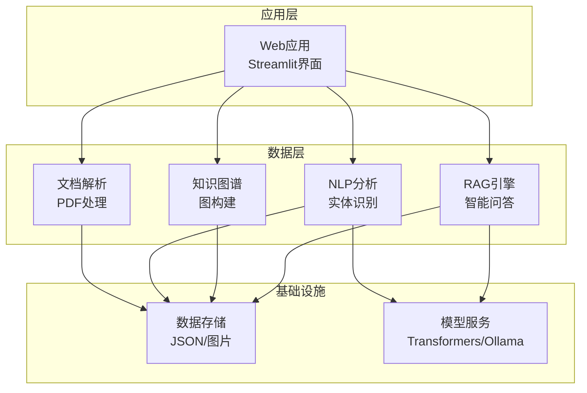

**图表来源**
- [app.py:1-492](file://zhixi/src/app.py#L1-L492)
- [doc_parser.py:64-319](file://zhixi/src/doc_parser.py#L64-L319)
- [nlp_pipeline.py:45-312](file://zhixi/src/nlp_pipeline.py#L45-L312)
- [knowledge_graph.py:44-412](file://zhixi/src/knowledge_graph.py#L44-L412)
- [rag_engine.py:47-362](file://zhixi/src/rag_engine.py#L47-L362)

**章节来源**
- [app.py:1-492](file://zhixi/src/app.py#L1-L492)
- [requirements.txt:1-45](file://zhixi/requirements.txt#L1-L45)

## 核心组件

### KnowledgeGraphBuilder 类

KnowledgeGraphBuilder 是知识图谱模块的核心类，负责从实体列表构建图谱节点、添加实体间关系、自动提取关系以及图谱分析和可视化。

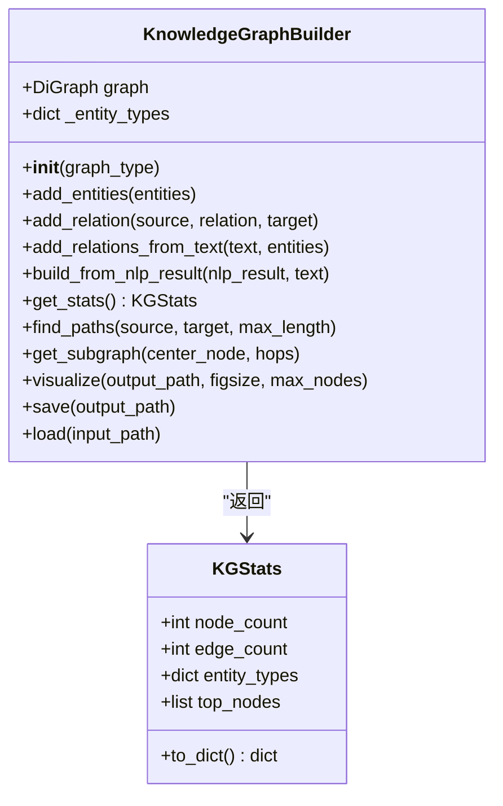

**图表来源**
- [knowledge_graph.py:44-412](file://zhixi/src/knowledge_graph.py#L44-L412)

### NLPPipeline 类

NLPPipeline 提供完整的自然语言处理功能，包括命名实体识别、关键词提取、自动摘要和词云生成。

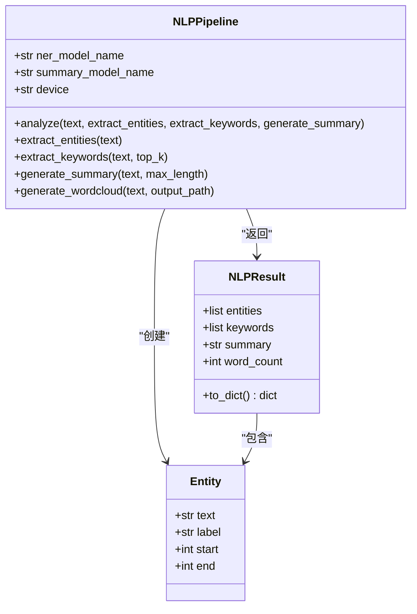

**图表来源**
- [nlp_pipeline.py:45-312](file://zhixi/src/nlp_pipeline.py#L45-L312)

**章节来源**
- [knowledge_graph.py:44-412](file://zhixi/src/knowledge_graph.py#L44-L412)
- [nlp_pipeline.py:45-312](file://zhixi/src/nlp_pipeline.py#L45-L312)

## 架构概览

智析采用分层架构设计，各模块职责清晰分离：

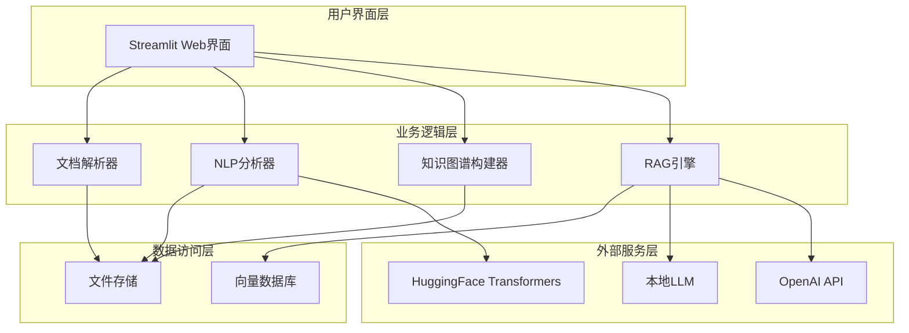

**图表来源**
- [app.py:1-492](file://zhixi/src/app.py#L1-L492)
- [doc_parser.py:64-319](file://zhixi/src/doc_parser.py#L64-L319)
- [nlp_pipeline.py:45-312](file://zhixi/src/nlp_pipeline.py#L45-L312)
- [knowledge_graph.py:44-412](file://zhixi/src/knowledge_graph.py#L44-L412)
- [rag_engine.py:47-362](file://zhixi/src/rag_engine.py#L47-L362)

## 详细组件分析

### 知识图谱构建器扩展机制

#### 新实体类型的添加

要添加新的实体类型，需要修改实体类型映射和可视化配置：

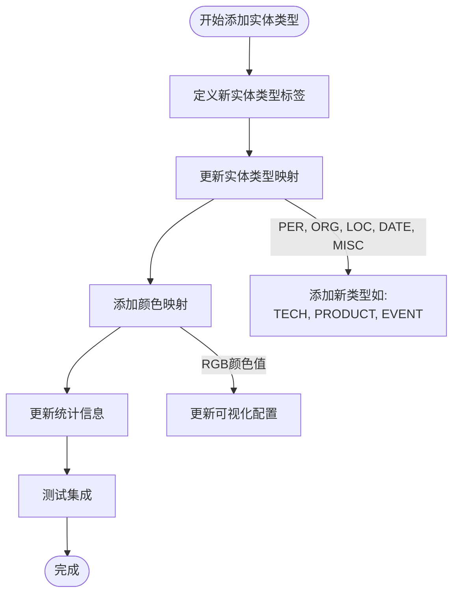

**图表来源**
- [knowledge_graph.py:224-313](file://zhixi/src/knowledge_graph.py#L224-L313)

#### 自定义实体识别规则

扩展实体识别功能可以通过以下方式实现：

1. **修改实体标签映射**：在 NLPPipeline 中调整实体识别结果的后处理逻辑
2. **添加领域特定规则**：通过正则表达式匹配特定模式
3. **集成外部实体识别服务**：支持更多实体类型

#### 关系抽取算法扩展

当前的关系抽取基于简单的共现分析，可以扩展为：

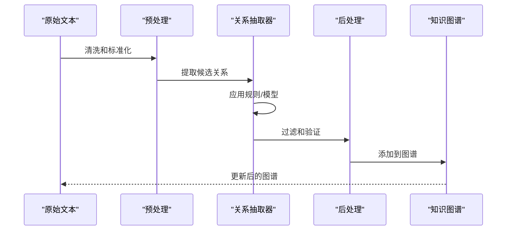

**图表来源**
- [knowledge_graph.py:109-151](file://zhixi/src/knowledge_graph.py#L109-L151)

**章节来源**
- [knowledge_graph.py:67-151](file://zhixi/src/knowledge_graph.py#L67-L151)
- [nlp_pipeline.py:147-234](file://zhixi/src/nlp_pipeline.py#L147-L234)

### 自定义图算法集成

#### 社区检测算法

可以集成多种社区检测算法：

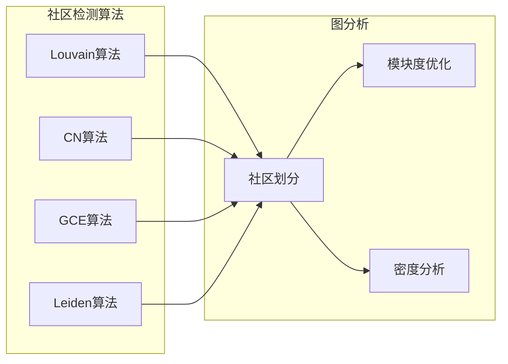

#### 中心性分析

扩展中心性分析功能：

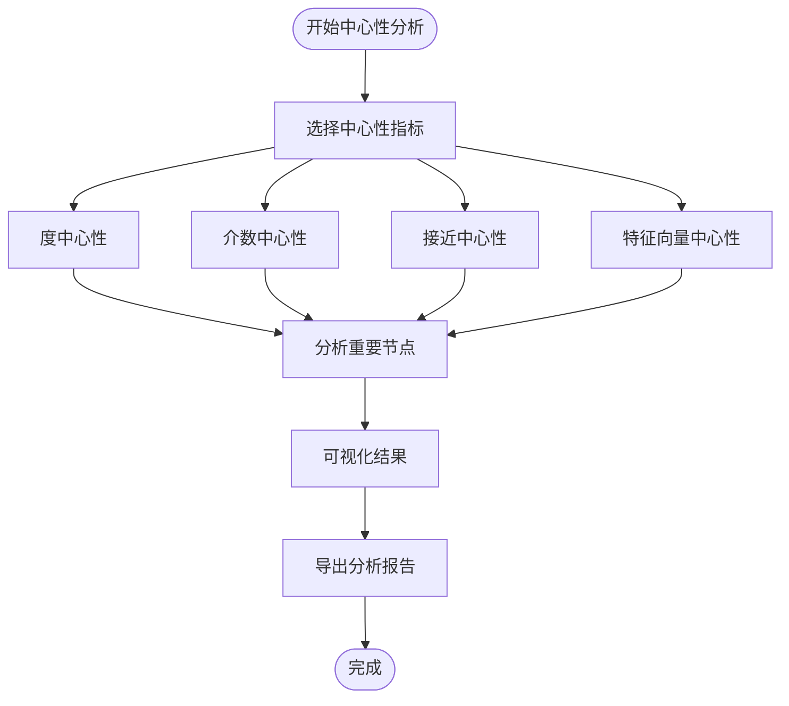

**图表来源**
- [knowledge_graph.py:152-222](file://zhixi/src/knowledge_graph.py#L152-L222)

### 图数据存储和查询扩展

#### 存储格式扩展

当前支持 JSON 格式存储，可以扩展为：

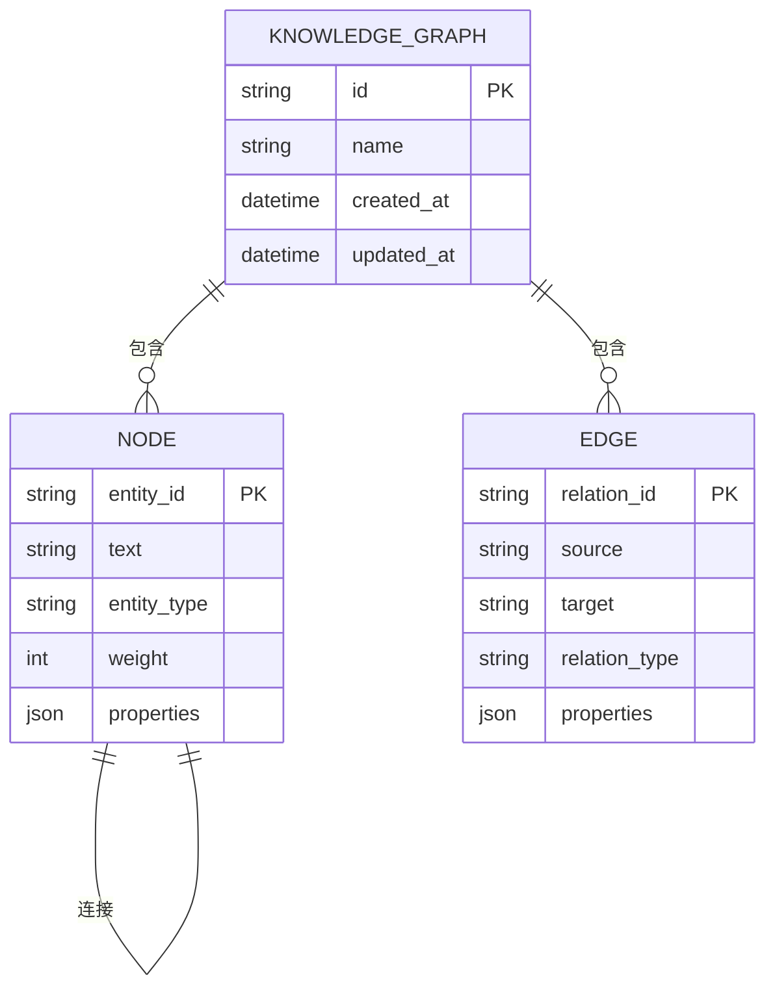

#### 查询接口扩展

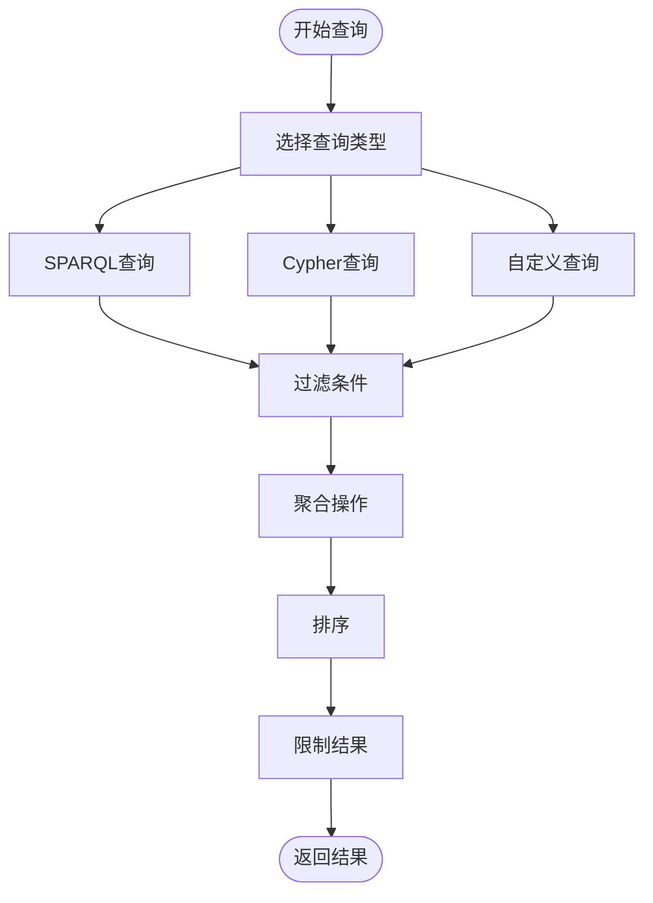

**图表来源**
- [knowledge_graph.py:314-328](file://zhixi/src/knowledge_graph.py#L314-L328)

**章节来源**
- [knowledge_graph.py:314-377](file://zhixi/src/knowledge_graph.py#L314-L377)

### 图可视化和统计分析扩展

#### 可视化增强

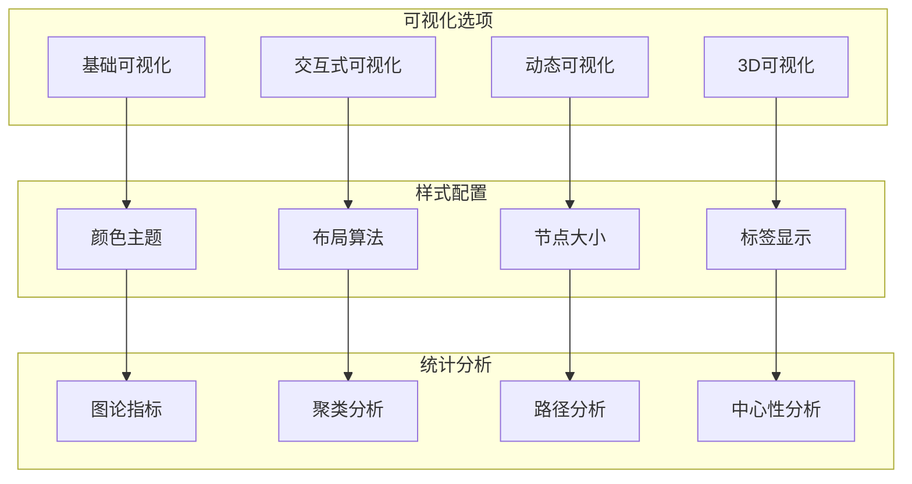

#### 统计分析功能

扩展统计分析功能包括：

1. **图论指标计算**：度分布、聚类系数、路径长度等
2. **社区结构分析**：模块度、社区密度、边界节点识别
3. **动态分析**：时间序列图谱分析、演化趋势预测
4. **网络鲁棒性分析**：关键节点识别、攻击测试

**章节来源**
- [knowledge_graph.py:224-313](file://zhixi/src/knowledge_graph.py#L224-L313)
- [knowledge_graph.py:28-41](file://zhixi/src/knowledge_graph.py#L28-L41)

## 依赖关系分析

### 技术栈依赖

```mermaid
graph TB
subgraph "核心依赖"
NetworkX[NetworkX 3.1+]
ScikitLearn[Scikit-learn 1.3+]
NumPy[NumPy 1.24+]
Pandas[Pandas 2.0+]
end
subgraph "NLP依赖"
Transformers[Transformers 4.35+]
KeyBERT[KeyBERT 0.8+]
spaCy[spaCy 3.7+]
Torch[Torch 2.1+]
end
subgraph "LLM依赖"
LangChain[LangChain 0.1+]
ChromaDB[ChromaDB 0.4+]
OpenAI[OpenAI 1.6+]
Ollama[本地模型]
end
subgraph "Web依赖"
Streamlit[Streamlit 1.29+]
Matplotlib[Matplotlib 3.7+]
Pillow[Pillow 10.0+]
end
NetworkX --> KnowledgeGraph[知识图谱模块]
ScikitLearn --> KnowledgeGraph
Transformers --> NLPPipeline[NLP模块]
KeyBERT --> NLPPipeline
LangChain --> RAGEngine[RAG模块]
ChromaDB --> RAGEngine
Streamlit --> WebApp[Web应用]
Matplotlib --> Visualization[可视化]
```

**图表来源**
- [requirements.txt:1-45](file://zhixi/requirements.txt#L1-L45)

### 模块间依赖关系

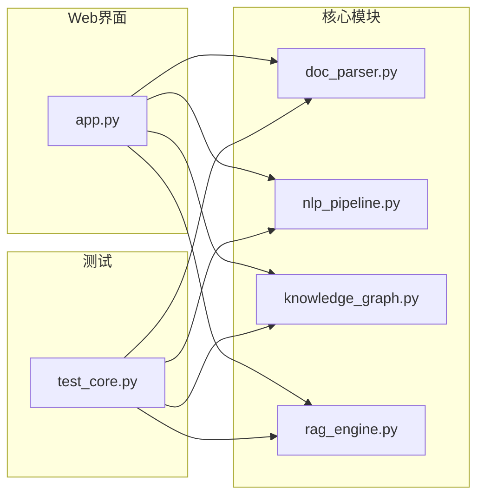

**图表来源**
- [app.py:1-492](file://zhixi/src/app.py#L1-L492)
- [test_core.py:1-168](file://zhixi/tests/test_core.py#L1-L168)

**章节来源**
- [requirements.txt:1-45](file://zhixi/requirements.txt#L1-L45)
- [test_core.py:1-168](file://zhixi/tests/test_core.py#L1-L168)

## 性能考虑

### 内存优化策略

1. **延迟加载模型**：NLPPipeline 和 RAGEngine 采用延迟加载机制
2. **批量处理**：向量数据库导入使用批量处理减少内存占用
3. **图谱压缩**：大型图谱支持子图提取和节点过滤

### 并行处理

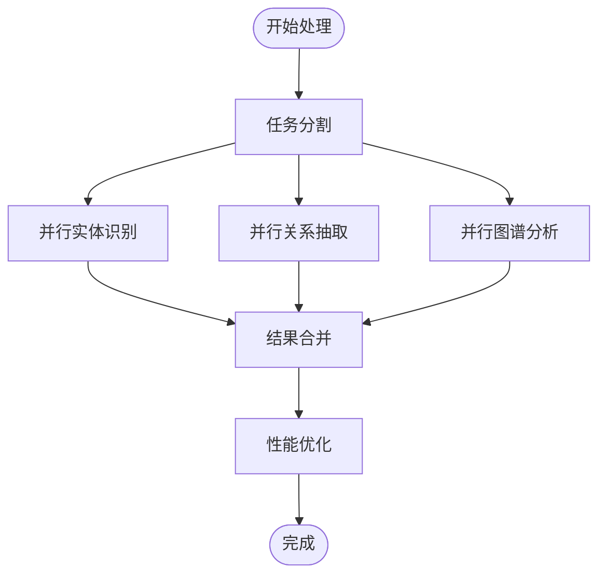

### 缓存机制

1. **模型缓存**：加载的模型保持在内存中避免重复加载
2. **中间结果缓存**：NLP分析结果和图谱数据缓存
3. **向量数据库缓存**：ChromaDB本地持久化存储

## 故障排除指南

### 常见问题及解决方案

#### NLP模型加载失败

**问题描述**：首次运行时模型下载失败或加载超时

**解决方案**：
1. 检查网络连接和代理设置
2. 预先下载模型到本地缓存目录
3. 调整模型下载源为国内镜像

#### 图谱构建异常

**问题描述**：添加实体或关系时报错

**解决方案**：
1. 确保实体文本不为空且长度合理
2. 检查实体类型是否在支持列表中
3. 验证关系类型的有效性

#### 可视化渲染问题

**问题描述**：图谱可视化无法正常显示

**解决方案**：
1. 检查matplotlib字体配置
2. 确认输出目录权限
3. 调整图形大小和节点数量限制

**章节来源**
- [nlp_pipeline.py:76-105](file://zhixi/src/nlp_pipeline.py#L76-L105)
- [knowledge_graph.py:224-313](file://zhixi/src/knowledge_graph.py#L224-L313)

## 结论

智析平台提供了完整的企业级知识图谱解决方案，具有良好的扩展性和可维护性。通过本文档的指导，开发者可以：

1. **轻松添加新的实体类型**：通过修改实体类型映射和可视化配置
2. **扩展关系抽取算法**：从简单的共现分析扩展到复杂的语义关系抽取
3. **集成高级图算法**：社区检测、中心性分析等复杂算法
4. **扩展存储和查询功能**：支持多种存储格式和查询接口
5. **增强可视化和统计分析**：提供更丰富的分析工具和可视化选项

平台采用模块化设计，各组件职责清晰，便于独立开发和测试。同时提供了完善的测试用例和错误处理机制，确保系统的稳定性和可靠性。

通过遵循本文档的扩展指南，开发者可以根据具体业务需求定制知识图谱功能，构建更加智能化的文档分析和问答系统。