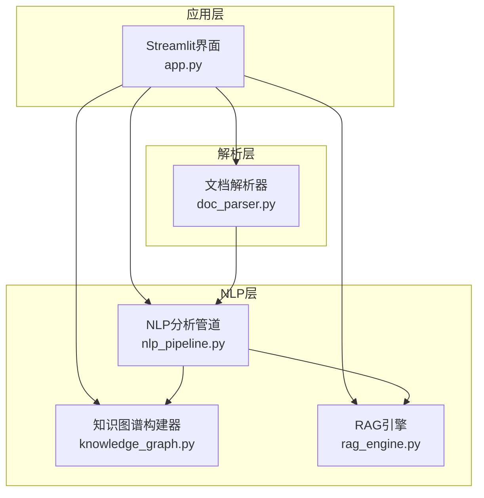
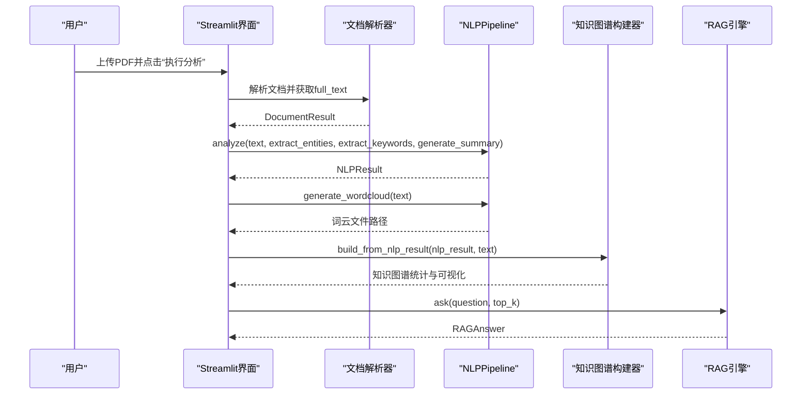
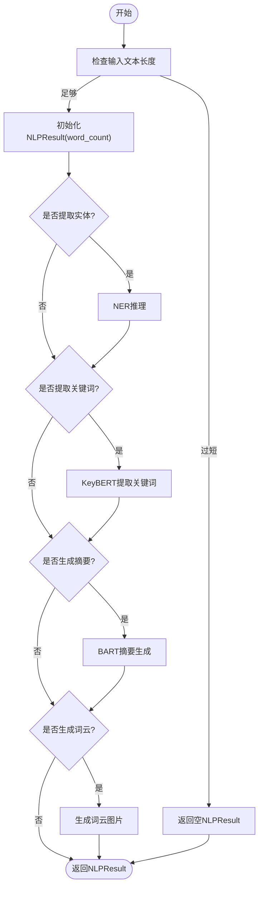
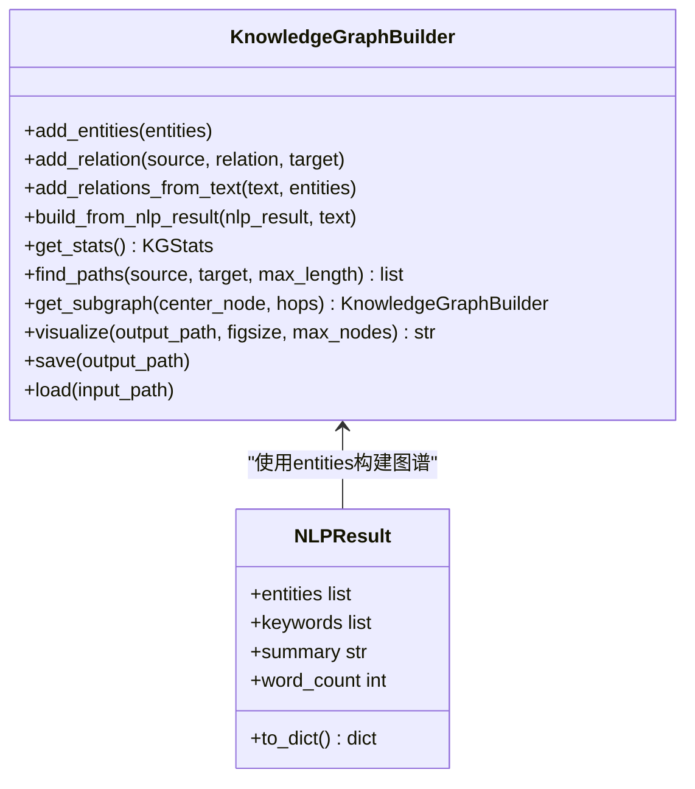
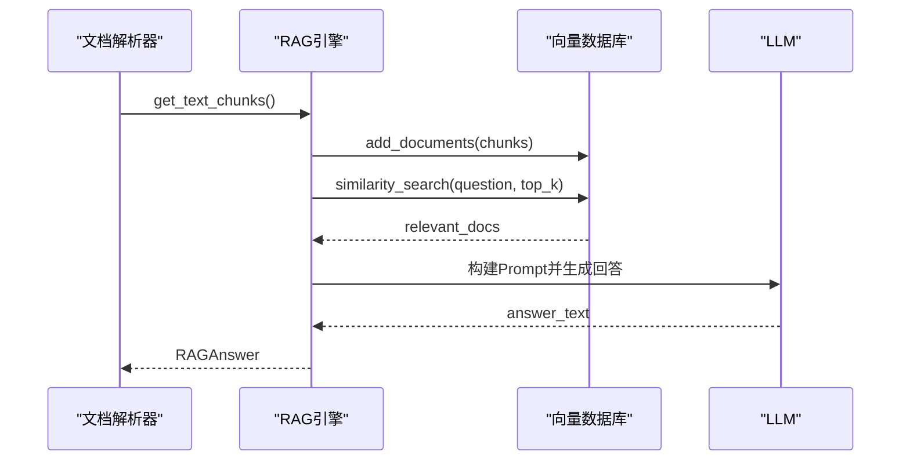
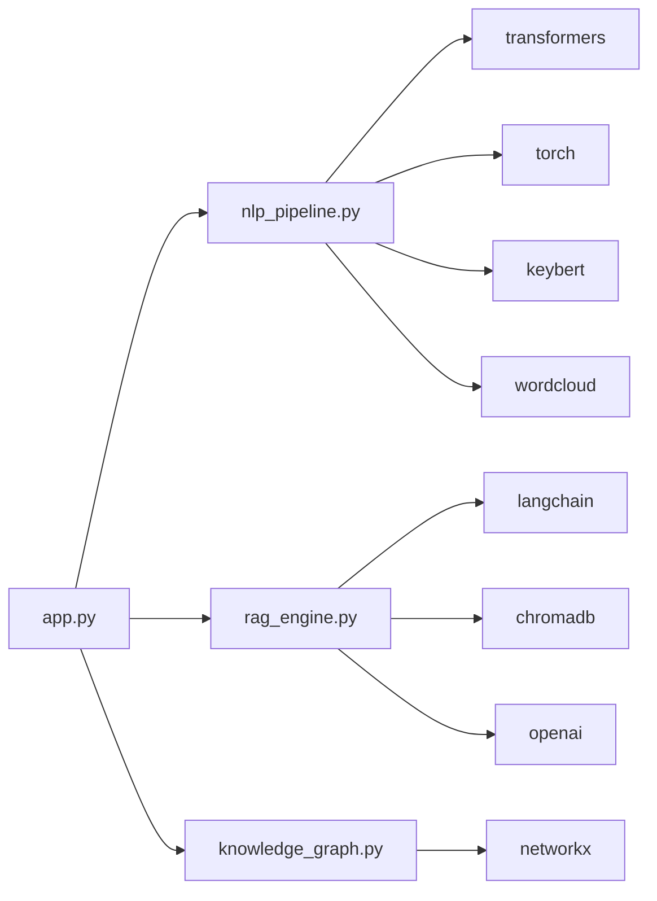

# NLP分析管道API

<cite>
**本文档引用的文件**
- [nlp_pipeline.py](file://zhixi/src/nlp_pipeline.py)
- [app.py](file://zhixi/src/app.py)
- [doc_parser.py](file://zhixi/src/doc_parser.py)
- [knowledge_graph.py](file://zhixi/src/knowledge_graph.py)
- [rag_engine.py](file://zhixi/src/rag_engine.py)
- [requirements.txt](file://zhixi/requirements.txt)
- [test_core.py](file://zhixi/tests/test_core.py)
</cite>

## 目录
1. [简介](#简介)
2. [项目结构](#项目结构)
3. [核心组件](#核心组件)
4. [架构总览](#架构总览)
5. [详细组件分析](#详细组件分析)
6. [依赖分析](#依赖分析)
7. [性能考虑](#性能考虑)
8. [故障排查指南](#故障排查指南)
9. [结论](#结论)
10. [附录](#附录)

## 简介
本文件为“NLP分析管道”模块的API文档，聚焦于NLPPipeline类及其相关数据结构与方法签名，涵盖命名实体识别（NER）、关键词提取、自动摘要、词云可视化等能力，并说明与Web界面、文档解析、知识图谱、RAG引擎的集成接口与数据交换格式。文档同时提供参数说明、返回值格式、异常处理策略、使用示例与性能优化建议。

## 项目结构
该项目采用分层架构：
- 数据采集与解析层：文档解析器负责从PDF提取文本、表格与图像
- NLP分析层：NLPPipeline提供NER、关键词提取、摘要与词云
- 知识图谱层：从NLP结果与原文构建实体关系图
- 应用层：Streamlit Web界面集成上述模块
- RAG层：基于向量检索与LLM的问答引擎

图表来源
- [app.py:223-258](file://zhixi/src/app.py#L223-L258)
- [doc_parser.py:98-144](file://zhixi/src/doc_parser.py#L98-L144)
- [nlp_pipeline.py:106-145](file://zhixi/src/nlp_pipeline.py#L106-L145)
- [knowledge_graph.py:137-151](file://zhixi/src/knowledge_graph.py#L137-L151)
- [rag_engine.py:154-191](file://zhixi/src/rag_engine.py#L154-L191)

章节来源
- [app.py:176-261](file://zhixi/src/app.py#L176-L261)
- [doc_parser.py:64-144](file://zhixi/src/doc_parser.py#L64-L144)
- [nlp_pipeline.py:45-145](file://zhixi/src/nlp_pipeline.py#L45-L145)
- [knowledge_graph.py:44-151](file://zhixi/src/knowledge_graph.py#L44-L151)
- [rag_engine.py:47-191](file://zhixi/src/rag_engine.py#L47-L191)

## 核心组件
- NLPPipeline：NLP分析管道，提供NER、关键词提取、摘要生成、词云生成等方法
- Entity：命名实体数据结构
- NLPResult：统一的分析结果容器
- KnowledgeGraphBuilder：从NLP结果与原文构建知识图谱
- RAGEngine：RAG问答引擎，支持OpenAI与本地Ollama模式

章节来源
- [nlp_pipeline.py:24-43](file://zhixi/src/nlp_pipeline.py#L24-L43)
- [knowledge_graph.py:27-42](file://zhixi/src/knowledge_graph.py#L27-L42)
- [rag_engine.py:30-45](file://zhixi/src/rag_engine.py#L30-L45)

## 架构总览
NLP分析管道在Web界面触发后，从解析层获取文本，调用NLPPipeline执行多项分析，随后可选地生成词云并进入知识图谱与RAG流程。

图表来源
- [app.py:240-261](file://zhixi/src/app.py#L240-L261)
- [doc_parser.py:98-144](file://zhixi/src/doc_parser.py#L98-L144)
- [nlp_pipeline.py:106-145](file://zhixi/src/nlp_pipeline.py#L106-L145)
- [knowledge_graph.py:137-151](file://zhixi/src/knowledge_graph.py#L137-L151)
- [rag_engine.py:192-263](file://zhixi/src/rag_engine.py#L192-L263)

## 详细组件分析

### NLPPipeline 类
NLPPipeline是NLP分析的核心类，提供延迟加载模型、统一分析入口与多种分析能力。

- 公共接口
  - __init__(ner_model: str = "dslim/bert-base-NER", summary_model: str = "facebook/bart-large-cnn", device: Optional[str] = None)
    - 初始化时仅记录模型名称与设备，不立即加载模型
    - 参数
      - ner_model: NER模型名称，默认多语言模型
      - summary_model: 摘要模型名称
      - device: 运行设备("cpu"或"cudA")
    - 返回: 无
  - analyze(text: str, extract_entities: bool = True, extract_keywords: bool = True, generate_summary: bool = True, top_k_keywords: int = 10) -> NLPResult
    - 统一分析入口，按需执行NER、关键词提取、摘要生成
    - 参数
      - text: 输入文本
      - extract_entities: 是否提取实体
      - extract_keywords: 是否提取关键词
      - generate_summary: 是否生成摘要
      - top_k_keywords: 关键词数量
    - 返回: NLPResult
    - 异常: 内部捕获模型调用异常并打印日志，返回空结果或降级摘要
  - extract_entities(text: str) -> list
    - 命名实体识别（NER）
    - 参数: text
    - 返回: list of Entity
    - 异常: 捕获并返回空列表
  - extract_keywords(text: str, top_k: int = 10) -> list
    - 基于KeyBERT的关键词提取
    - 参数: text, top_k
    - 返回: list of tuple(keyword, score)
    - 异常: 捕获并返回空列表
  - generate_summary(text: str, max_length: int = 150) -> str
    - 基于BART的抽取式/生成式摘要
    - 参数: text, max_length
    - 返回: str
    - 异常: 捕获并返回前200字符的降级摘要
  - generate_wordcloud(text: str, output_path: str = "data/processed/wordcloud.png")
    - 词云生成
    - 参数: text, output_path
    - 返回: str（输出路径）或None
    - 异常: 捕获并返回None
  - analyze_text(text: str, entities: bool = True, keywords: bool = True, summary: bool = True) -> NLPResult
    - 便捷函数：一次性分析并返回NLPResult

- 数据结构
  - Entity
    - 字段: text, label, start, end
  - NLPResult
    - 字段: entities, keywords, summary, word_count
    - 方法: to_dict()

- 使用示例
  - 在Web界面中通过按钮触发分析，获取NLPResult并展示关键词、实体、摘要与词云
  - 直接调用NLPPipeline().analyze(...)获取统一结果

- 错误处理
  - 模型加载与推理均在try-except中执行，失败时打印错误并返回安全默认值（如空列表、空字符串或降级摘要）

- 性能与内存
  - 延迟加载：仅在首次调用对应方法时加载相应模型，减少内存占用
  - 输入截断：对输入文本进行长度限制，避免OOM
  - 降级策略：摘要失败时返回前200字符

章节来源
- [nlp_pipeline.py:61-145](file://zhixi/src/nlp_pipeline.py#L61-L145)
- [nlp_pipeline.py:147-262](file://zhixi/src/nlp_pipeline.py#L147-L262)
- [nlp_pipeline.py:267-291](file://zhixi/src/nlp_pipeline.py#L267-L291)
- [nlp_pipeline.py:24-43](file://zhixi/src/nlp_pipeline.py#L24-L43)

### NLP处理流程与数据流
- 输入: 文本（通常来自文档解析器的full_text）
- 流程:
  1) analyze入口根据开关决定是否执行NER、关键词提取、摘要生成
  2) NER: 使用Transformers pipeline，返回实体列表
  3) 关键词: 使用KeyBERT提取语义关键词
  4) 摘要: 使用BART模型生成摘要，失败时降级
  5) 词云: 基于清理后的文本生成图片
- 输出: NLPResult（包含entities、keywords、summary、word_count），可转为字典

图表来源
- [nlp_pipeline.py:106-145](file://zhixi/src/nlp_pipeline.py#L106-L145)
- [nlp_pipeline.py:147-262](file://zhixi/src/nlp_pipeline.py#L147-L262)

### 与知识图谱的集成
- 知识图谱构建器可直接从NLPResult的entities批量添加节点
- 可从原文本中提取共现关系，形成实体间关联
- 提供统计信息、路径查找、子图提取与可视化

图表来源
- [knowledge_graph.py:44-151](file://zhixi/src/knowledge_graph.py#L44-L151)
- [nlp_pipeline.py:33-43](file://zhixi/src/nlp_pipeline.py#L33-L43)

### 与RAG引擎的集成
- RAG引擎接收由文档解析器切分的文本块（chunks），导入向量数据库
- 问答时检索相关文档块并结合LLM生成回答
- 支持OpenAI API与本地Ollama两种模式

图表来源
- [doc_parser.py:212-268](file://zhixi/src/doc_parser.py#L212-L268)
- [rag_engine.py:154-263](file://zhixi/src/rag_engine.py#L154-L263)

## 依赖分析
- 运行时依赖（来自requirements.txt）
  - transformers、torch：NER与摘要模型
  - keybert：关键词提取
  - wordcloud：词云生成
  - langchain、chromadb、openai：RAG与向量检索
  - networkx：知识图谱
  - streamlit：Web界面
  - numpy、pandas、matplotlib、scikit-learn：数据分析与可视化

图表来源
- [requirements.txt:20-36](file://zhixi/requirements.txt#L20-L36)
- [nlp_pipeline.py:76-104](file://zhixi/src/nlp_pipeline.py#L76-L104)
- [rag_engine.py:95-152](file://zhixi/src/rag_engine.py#L95-L152)
- [knowledge_graph.py:44-66](file://zhixi/src/knowledge_graph.py#L44-L66)
- [app.py:240-261](file://zhixi/src/app.py#L240-L261)

章节来源
- [requirements.txt:6-45](file://zhixi/requirements.txt#L6-L45)

## 性能考虑
- 延迟加载模型：仅在首次调用时加载，降低初始内存占用
- 输入长度限制：对输入文本进行截断，避免超长文本导致显存溢出
- 降级策略：摘要失败时返回固定长度的前缀文本，保证可用性
- 批量写入：RAG导入文档块时采用批处理，提升导入效率
- 可视化裁剪：知识图谱可视化时按节点度数筛选，控制渲染复杂度

[本节为通用性能建议，无需特定文件引用]

## 故障排查指南
- 模型加载失败
  - 现象：首次运行提示模型下载或加载错误
  - 排查：确认网络连通性、CUDA环境与依赖版本匹配
  - 参考: [nlp_pipeline.py:76-97](file://zhixi/src/nlp_pipeline.py#L76-L97), [rag_engine.py:95-152](file://zhixi/src/rag_engine.py#L95-L152)
- 文本过短
  - 现象：analyze返回空结果
  - 处理：确保输入文本长度≥10字符
  - 参考: [nlp_pipeline.py:127-129](file://zhixi/src/nlp_pipeline.py#L127-L129)
- 摘要生成异常
  - 现象：返回降级摘要
  - 处理：检查输入长度与模型可用性
  - 参考: [nlp_pipeline.py:218-233](file://zhixi/src/nlp_pipeline.py#L218-L233)
- 词云生成失败
  - 现象：返回None
  - 处理：检查输出目录权限与正则清理逻辑
  - 参考: [nlp_pipeline.py:243-262](file://zhixi/src/nlp_pipeline.py#L243-L262)
- RAG检索无结果
  - 现象：返回提示未找到相关信息
  - 处理：确认已成功导入文档块
  - 参考: [rag_engine.py:217-223](file://zhixi/src/rag_engine.py#L217-L223)

章节来源
- [nlp_pipeline.py:76-97](file://zhixi/src/nlp_pipeline.py#L76-L97)
- [nlp_pipeline.py:127-129](file://zhixi/src/nlp_pipeline.py#L127-L129)
- [nlp_pipeline.py:218-233](file://zhixi/src/nlp_pipeline.py#L218-L233)
- [nlp_pipeline.py:243-262](file://zhixi/src/nlp_pipeline.py#L243-L262)
- [rag_engine.py:217-223](file://zhixi/src/rag_engine.py#L217-L223)

## 结论
NLPPipeline提供了统一的NLP分析入口，具备延迟加载、输入截断与降级策略等工程化特性，适配Web界面与后续知识图谱、RAG流程。通过合理配置模型与参数，可在不同硬件环境下实现稳定高效的文本分析。

[本节为总结性内容，无需特定文件引用]

## 附录

### API参考：NLPPipeline
- __init__(ner_model: str, summary_model: str, device: Optional[str])
  - 初始化模型名称与设备，不加载模型
- analyze(text: str, extract_entities: bool, extract_keywords: bool, generate_summary: bool, top_k_keywords: int) -> NLPResult
  - 统一分析入口，返回NLPResult
- extract_entities(text: str) -> list[Entity]
  - 返回实体列表
- extract_keywords(text: str, top_k: int) -> list[tuple[str, float]]
  - 返回关键词与分数
- generate_summary(text: str, max_length: int) -> str
  - 返回摘要文本
- generate_wordcloud(text: str, output_path: str) -> Optional[str]
  - 返回输出路径或None
- analyze_text(text: str, entities: bool, keywords: bool, summary: bool) -> NLPResult
  - 便捷函数

章节来源
- [nlp_pipeline.py:61-145](file://zhixi/src/nlp_pipeline.py#L61-L145)
- [nlp_pipeline.py:147-262](file://zhixi/src/nlp_pipeline.py#L147-L262)
- [nlp_pipeline.py:267-291](file://zhixi/src/nlp_pipeline.py#L267-L291)

### 数据结构参考
- Entity
  - 字段: text, label, start, end
- NLPResult
  - 字段: entities, keywords, summary, word_count
  - 方法: to_dict()

章节来源
- [nlp_pipeline.py:24-43](file://zhixi/src/nlp_pipeline.py#L24-L43)

### Web界面集成要点
- 触发分析：点击“执行分析”，内部调用NLPPipeline.analyze
- 展示结果：tabs分别展示关键词、实体、摘要、词云
- 词云输出：默认保存至"data/processed/wordcloud.png"

章节来源
- [app.py:223-304](file://zhixi/src/app.py#L223-L304)

### 测试与验证
- 单元测试覆盖了NLP结果数据结构、知识图谱实体与关系、RAG答案结构等
- 建议在集成测试中验证各模块之间的数据交换格式一致性

章节来源
- [test_core.py:124-163](file://zhixi/tests/test_core.py#L124-L163)