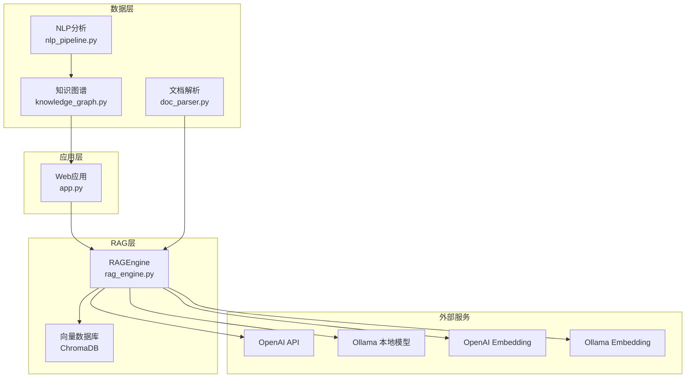
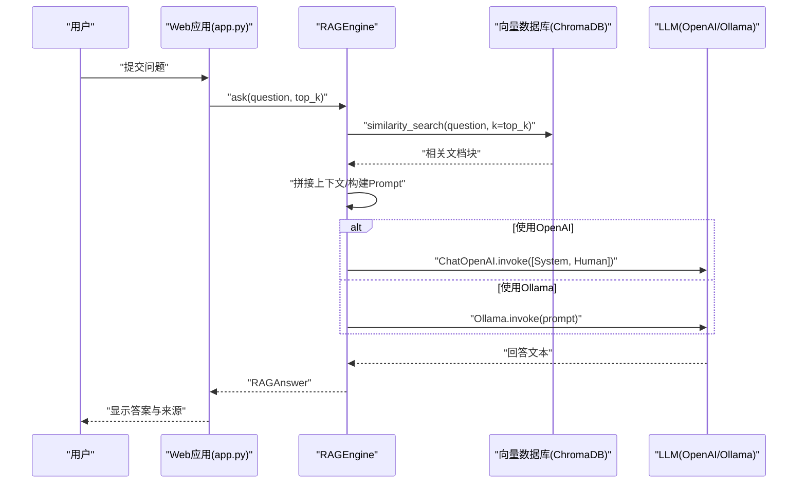
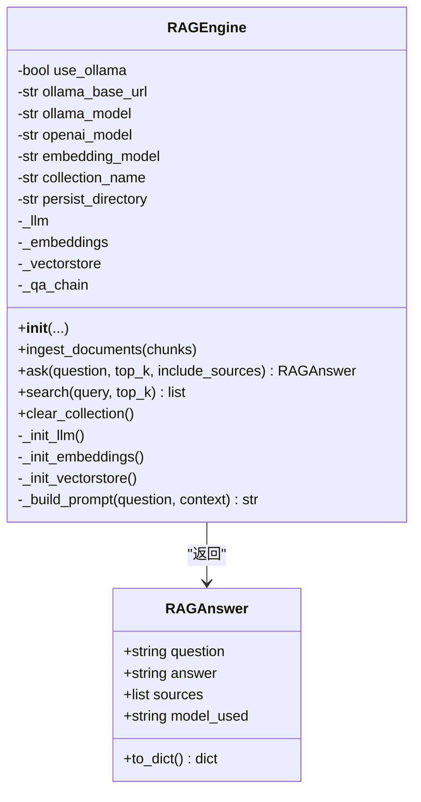
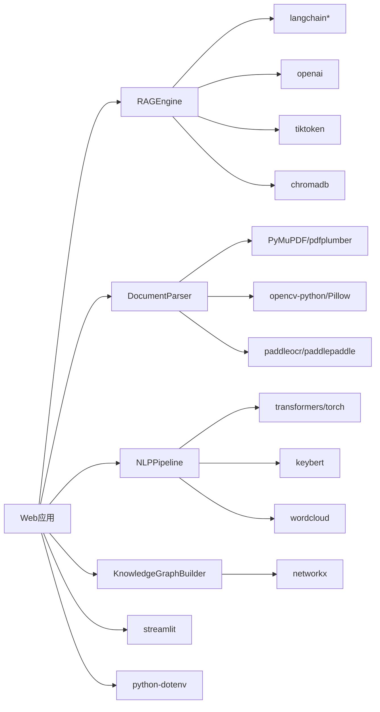

# RAG问答引擎API

<cite>
**本文引用的文件**
- [rag_engine.py](file://zhixi/src/rag_engine.py)
- [doc_parser.py](file://zhixi/src/doc_parser.py)
- [knowledge_graph.py](file://zhixi/src/knowledge_graph.py)
- [nlp_pipeline.py](file://zhixi/src/nlp_pipeline.py)
- [app.py](file://zhixi/src/app.py)
- [requirements.txt](file://zhixi/requirements.txt)
- [test_core.py](file://zhixi/tests/test_core.py)
</cite>

## 目录
1. [简介](#简介)
2. [项目结构](#项目结构)
3. [核心组件](#核心组件)
4. [架构总览](#架构总览)
5. [详细组件分析](#详细组件分析)
6. [依赖关系分析](#依赖关系分析)
7. [性能考量](#性能考量)
8. [故障排查指南](#故障排查指南)
9. [结论](#结论)
10. [附录](#附录)

## 简介
本文件为“RAG问答引擎”模块的API文档，面向开发者与产品使用者，系统性地说明RAGEngine类的公共接口、数据结构、工作流程、配置项、错误处理、性能优化与与文档解析、知识图谱模块的协作方式，并提供可复用的使用示例与调优建议。RAG引擎基于LangChain与ChromaDB，支持OpenAI API与本地Ollama两种LLM运行模式，提供文档导入、相似性检索、上下文构建与LLM生成回答的完整链路。

## 项目结构
- 核心模块
  - RAG引擎：负责LLM初始化、向量数据库、文档导入、问答与检索接口
  - 文档解析：负责PDF文本/表格/图像提取与文本切块
  - NLP分析：提供NER、关键词、摘要、词云等文本分析能力
  - 知识图谱：从实体关系构建图谱并可视化
  - Web应用：Streamlit前端，集成上述模块
- 依赖与环境
  - 通过requirements.txt声明各组件依赖
  - 通过环境变量控制OpenAI API Key、模型名称等

图表来源
- [app.py:1-492](file://zhixi/src/app.py#L1-L492)
- [rag_engine.py:1-362](file://zhixi/src/rag_engine.py#L1-L362)
- [doc_parser.py:1-319](file://zhixi/src/doc_parser.py#L1-L319)
- [knowledge_graph.py:1-412](file://zhixi/src/knowledge_graph.py#L1-L412)
- [nlp_pipeline.py:1-312](file://zhixi/src/nlp_pipeline.py#L1-L312)

章节来源
- [requirements.txt:1-45](file://zhixi/requirements.txt#L1-L45)

## 核心组件
- RAGEngine：RAG问答引擎的核心类，封装LLM、Embedding、向量数据库、检索与问答流程
- RAGAnswer：问答结果数据结构，包含问题、答案、来源、所用模型
- DocumentParser：PDF解析与文本切块
- KnowledgeGraphBuilder：知识图谱构建与可视化
- NLPPipeline：NLP分析（NER、关键词、摘要、词云）
- Web应用：Streamlit界面，集成RAG、NLP、KG与文档解析

章节来源
- [rag_engine.py:30-45](file://zhixi/src/rag_engine.py#L30-L45)
- [doc_parser.py:32-62](file://zhixi/src/doc_parser.py#L32-L62)
- [knowledge_graph.py:27-42](file://zhixi/src/knowledge_graph.py#L27-L42)
- [nlp_pipeline.py:24-43](file://zhixi/src/nlp_pipeline.py#L24-L43)

## 架构总览
RAG引擎采用“延迟初始化+链式调用”的设计：
- 初始化阶段：根据use_ollama选择LLM与Embedding后端，准备ChromaDB向量集合
- 文档导入：将切分后的文本块批量写入向量数据库
- 问答流程：相似性检索→拼接上下文→构造Prompt→调用LLM→封装结果
- 检索接口：仅返回相关文档块，不生成回答

图表来源
- [app.py:448-461](file://zhixi/src/app.py#L448-L461)
- [rag_engine.py:192-263](file://zhixi/src/rag_engine.py#L192-L263)

## 详细组件分析

### RAGEngine 类 API

- 类概述
  - 支持OpenAI与Ollama两种运行模式
  - 内置延迟初始化，按需加载LLM、Embedding与向量数据库
  - 提供文档导入、问答、检索、清空集合等接口

- 公共接口

  - 构造函数
    - 参数
      - use_ollama: bool，是否使用Ollama本地模型
      - ollama_base_url: str，Ollama服务地址
      - ollama_model: str，Ollama模型名称
      - openai_model: Optional[str]，OpenAI模型名称，未传入时读取环境变量CHAT_MODEL
      - embedding_model: Optional[str]，Embedding模型名称，未传入时读取环境变量EMBEDDING_MODEL
      - collection_name: str，ChromaDB集合名称
      - persist_directory: str，ChromaDB持久化目录
    - 返回值：无
    - 异常：无显式抛出，内部通过print输出日志
    - 示例：参见“使用示例”

    章节来源
    - [rag_engine.py:69-94](file://zhixi/src/rag_engine.py#L69-L94)

  - ingest_documents(chunks: list)
    - 功能：将文档块导入向量数据库
    - 参数
      - chunks: list，元素为字典，包含text、page、chunk_id、source等字段
    - 返回值：无
    - 异常：无显式抛出，内部通过print输出进度
    - 性能：按批处理（默认100），减少单次写入压力
    - 示例：参见“使用示例”

    章节来源
    - [rag_engine.py:154-191](file://zhixi/src/rag_engine.py#L154-L191)

  - ask(question: str, top_k: int = 4, include_sources: bool = True) -> RAGAnswer
    - 功能：基于知识库回答问题
    - 参数
      - question: str，用户问题
      - top_k: int，检索的文档块数量
      - include_sources: bool，是否返回来源信息
    - 返回值：RAGAnswer实例，包含question、answer、sources、model_used
    - 异常：LLM调用异常时返回错误提示字符串
    - 流程要点
      - 延迟初始化LLM与向量数据库
      - similarity_search检索相关文档
      - 拼接上下文并构建Prompt
      - OpenAI模式使用System/Human消息；Ollama模式直接invoke
    - 示例：参见“使用示例”

    章节来源
    - [rag_engine.py:192-263](file://zhixi/src/rag_engine.py#L192-L263)

  - search(query: str, top_k: int = 5) -> list
    - 功能：仅检索相关文档块（不生成回答）
    - 参数
      - query: str，搜索查询
      - top_k: int，返回数量
    - 返回值：list of dict，包含content、page、chunk_id
    - 异常：无显式抛出
    - 示例：参见“使用示例”

    章节来源
    - [rag_engine.py:282-303](file://zhixi/src/rag_engine.py#L282-L303)

  - clear_collection()
    - 功能：清空向量数据库集合
    - 参数：无
    - 返回值：无
    - 异常：无显式抛出
    - 注意：清空后会重新初始化向量数据库

    章节来源
    - [rag_engine.py:305-312](file://zhixi/src/rag_engine.py#L305-L312)

- 数据结构

  - RAGAnswer
    - 字段
      - question: str
      - answer: str
      - sources: list，默认[]
      - model_used: str，默认空字符串
    - 方法
      - to_dict() -> dict：序列化为字典

    章节来源
    - [rag_engine.py:30-45](file://zhixi/src/rag_engine.py#L30-L45)

- 使用示例
  - 基本流程
    - 使用DocumentParser解析PDF并切分文本块
    - 初始化RAGEngine并导入chunks
    - 调用ask获取答案与来源
  - 一键RAG
    - 使用quick_rag(pdf_path, question, use_ollama)完成解析→导入→问答全流程

    章节来源
    - [rag_engine.py:316-344](file://zhixi/src/rag_engine.py#L316-L344)
    - [doc_parser.py:212-268](file://zhixi/src/doc_parser.py#L212-L268)

- 错误处理
  - LLM调用异常：捕获异常并返回错误提示字符串
  - 无相关文档：返回默认提示并返回空来源
  - 环境变量缺失：OpenAI模式下若未设置OPENAI_API_KEY，将导致调用失败

    章节来源
    - [rag_engine.py:253-255](file://zhixi/src/rag_engine.py#L253-L255)
    - [rag_engine.py:217-223](file://zhixi/src/rag_engine.py#L217-L223)

- 类图（代码级）

图表来源
- [rag_engine.py:30-94](file://zhixi/src/rag_engine.py#L30-L94)
- [rag_engine.py:154-312](file://zhixi/src/rag_engine.py#L154-L312)

### 文档解析模块 API

- DocumentParser
  - parse() -> DocumentResult：执行完整解析流程，返回文本、表格、图像与汇总
  - get_text_chunks(chunk_size: int = 500, chunk_overlap: int = 50) -> list：将文本切分为重叠块，供RAG导入
  - save(output_path: str)：保存解析结果为JSON
  - 其他便捷函数：parse_pdf()

- 数据结构
  - PageContent：单页内容（page_number、text、tables、images）
  - DocumentResult：文档解析总结果（filename、total_pages、pages、full_text）

- 使用示例
  - 解析PDF并切分文本块，传给RAGEngine.ingest_documents

章节来源
- [doc_parser.py:64-144](file://zhixi/src/doc_parser.py#L64-L144)
- [doc_parser.py:212-268](file://zhixi/src/doc_parser.py#L212-L268)

### 知识图谱模块 API

- KnowledgeGraphBuilder
  - add_entities(entities: list)：批量添加实体节点
  - add_relation(source: str, relation: str, target: str)：添加关系边
  - add_relations_from_text(text: str, entities: list)：基于共现关系自动添加边
  - build_from_nlp_result(nlp_result, text: str)：从NLP结果构建图谱
  - get_stats() -> KGStats：统计信息（节点数、边数、实体类型分布、度最高节点）
  - find_paths(source: str, target: str, max_length: int = 5) -> list：查找路径
  - get_subgraph(center_node: str, hops: int = 2) -> KnowledgeGraphBuilder：获取子图
  - visualize(output_path: str, figsize: tuple, max_nodes: int) -> Optional[str]：可视化并保存
  - save/load：保存与加载图谱

- 数据结构
  - KGStats：统计信息数据类

- 使用示例
  - 在Web应用中，先执行NLP分析，再用build_from_nlp_result构建图谱并可视化

章节来源
- [knowledge_graph.py:44-174](file://zhixi/src/knowledge_graph.py#L44-L174)
- [knowledge_graph.py:314-329](file://zhixi/src/knowledge_graph.py#L314-L329)

### NLP分析模块 API

- NLPPipeline
  - analyze(text, extract_entities, extract_keywords, generate_summary, top_k_keywords) -> NLPResult
  - extract_entities(text) -> list：NER识别实体
  - extract_keywords(text, top_k) -> list：关键词提取
  - generate_summary(text, max_length) -> str：摘要生成
  - generate_wordcloud(text, output_path)：词云生成

- 数据结构
  - Entity：实体数据类（text、label、start、end）
  - NLPResult：分析结果数据类（entities、keywords、summary、word_count）

- 使用示例
  - 在Web应用中，对解析后的全文执行NLP分析，并生成词云

章节来源
- [nlp_pipeline.py:45-146](file://zhixi/src/nlp_pipeline.py#L45-L146)
- [nlp_pipeline.py:147-234](file://zhixi/src/nlp_pipeline.py#L147-L234)

### Web应用与RAG集成

- Streamlit界面
  - 侧边栏配置：LLM模式（OpenAI API或Ollama）、模型参数、RAG参数（文本块大小、重叠、top_k）
  - 文档解析：上传PDF→解析→文本预览
  - NLP分析：执行NER、关键词、摘要、词云
  - 知识图谱：构建并可视化
  - 智能问答：初始化RAG→问答对话→显示来源

- 与RAG引擎的交互
  - 初始化RAG：根据侧边栏配置创建RAGEngine并导入chunks
  - 提问：调用engine.ask(question, top_k)，并在UI中展示答案与来源

章节来源
- [app.py:78-132](file://zhixi/src/app.py#L78-L132)
- [app.py:423-461](file://zhixi/src/app.py#L423-L461)

## 依赖关系分析

- 组件耦合
  - RAGEngine依赖LangChain（OpenAI/Ollama）、ChromaDB、dotenv
  - Web应用依赖RAGEngine、DocumentParser、NLPPipeline、KnowledgeGraphBuilder
  - 文档解析与NLP模块独立，可单独使用

- 外部依赖
  - requirements.txt列出numpy、pandas、matplotlib、PyMuPDF、pdfplumber、transformers、torch、keybert、wordcloud、langchain、chromadb、openai、networkx、streamlit、python-dotenv、tqdm、Pillow等

图表来源
- [requirements.txt:6-45](file://zhixi/requirements.txt#L6-L45)
- [rag_engine.py:20-31](file://zhixi/src/rag_engine.py#L20-L31)
- [app.py:17-28](file://zhixi/src/app.py#L17-L28)

章节来源
- [requirements.txt:1-45](file://zhixi/requirements.txt#L1-L45)

## 性能考量

- 向量数据库与检索
  - 批量导入：ingest_documents按批写入，降低单次写入开销
  - top_k调优：增大top_k提升召回但增加LLM上下文长度与延迟
  - 清空集合：clear_collection用于重建索引，适合数据更新场景

- LLM调用
  - OpenAI模式：使用System/Human消息，便于约束回答风格
  - Ollama模式：本地推理，零API成本，但吞吐受限
  - 温度参数：RAGEngine固定temperature=0.1，保证稳定性

- 文本切块
  - chunk_size与chunk_overlap影响召回与上下文长度，需结合文档密度与任务目标权衡
  - 切块逻辑按段落优先，保留重叠以增强跨段落连贯性

- 缓存与持久化
  - ChromaDB持久化目录：重启后仍可复用向量索引
  - Web应用会话状态：保存解析结果、NLP结果、图谱状态与问答历史

- 并发与资源
  - NLP分析（NER/摘要）建议在CPU上运行，必要时限制输入长度避免OOM
  - 首次加载模型可能耗时较长，建议在部署时预热

章节来源
- [rag_engine.py:154-191](file://zhixi/src/rag_engine.py#L154-L191)
- [rag_engine.py:192-263](file://zhixi/src/rag_engine.py#L192-L263)
- [doc_parser.py:212-268](file://zhixi/src/doc_parser.py#L212-L268)
- [nlp_pipeline.py:162-175](file://zhixi/src/nlp_pipeline.py#L162-L175)

## 故障排查指南

- 常见问题
  - 未设置OPENAI_API_KEY：OpenAI模式调用LLM会失败
  - Ollama未启动：use_ollama=True时需确保Ollama服务可用
  - 向量数据库为空：未导入文档或集合被清空
  - 文档过大导致内存不足：NLP分析限制输入长度，建议分段处理

- 排查步骤
  - 检查环境变量OPENAI_API_KEY、CHAT_MODEL、EMBEDDING_MODEL
  - 确认Ollama服务地址与模型名称正确
  - 使用search(query, top_k)验证向量数据库是否有命中
  - 使用clear_collection重建集合
  - 在Web应用中查看侧边栏配置与RAG参数

- 单元测试参考
  - 测试RAGAnswer数据结构、DocumentParser切块结构、KnowledgeGraph基本操作等

章节来源
- [test_core.py:148-163](file://zhixi/tests/test_core.py#L148-L163)
- [test_core.py:107-122](file://zhixi/tests/test_core.py#L107-L122)
- [test_core.py:18-105](file://zhixi/tests/test_core.py#L18-L105)

## 结论
RAG问答引擎提供了从文档解析、文本切块、向量索引、相似性检索到LLM生成回答的完整链路，支持OpenAI与Ollama两种运行模式。通过合理的参数调优（如chunk_size、chunk_overlap、top_k）与缓存策略（ChromaDB持久化、会话状态），可在不同规模与资源条件下实现稳定高效的问答体验。配合NLP与知识图谱模块，可进一步扩展为多模态的知识服务平台。

## 附录

### 环境变量与配置
- OPENAI_API_KEY：OpenAI API密钥
- CHAT_MODEL：默认OpenAI模型名称
- EMBEDDING_MODEL：默认Embedding模型名称

章节来源
- [rag_engine.py:81-83](file://zhixi/src/rag_engine.py#L81-L83)
- [app.py:92-105](file://zhixi/src/app.py#L92-L105)

### 使用示例（路径指引）
- 基本问答流程
  - 解析PDF并切分文本块：[doc_parser.py:212-268](file://zhixi/src/doc_parser.py#L212-L268)
  - 初始化RAG引擎并导入：[rag_engine.py:332-340](file://zhixi/src/rag_engine.py#L332-L340)
  - 问答：[rag_engine.py:342-343](file://zhixi/src/rag_engine.py#L342-L343)
- Web应用问答
  - 初始化与导入：[app.py:423-443](file://zhixi/src/app.py#L423-L443)
  - 提问与显示：[app.py:448-461](file://zhixi/src/app.py#L448-L461)