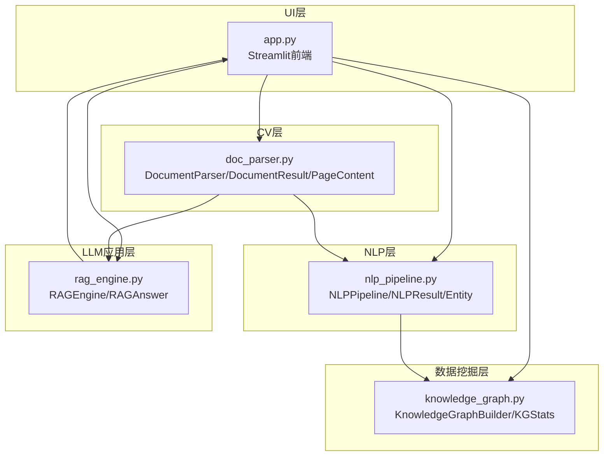
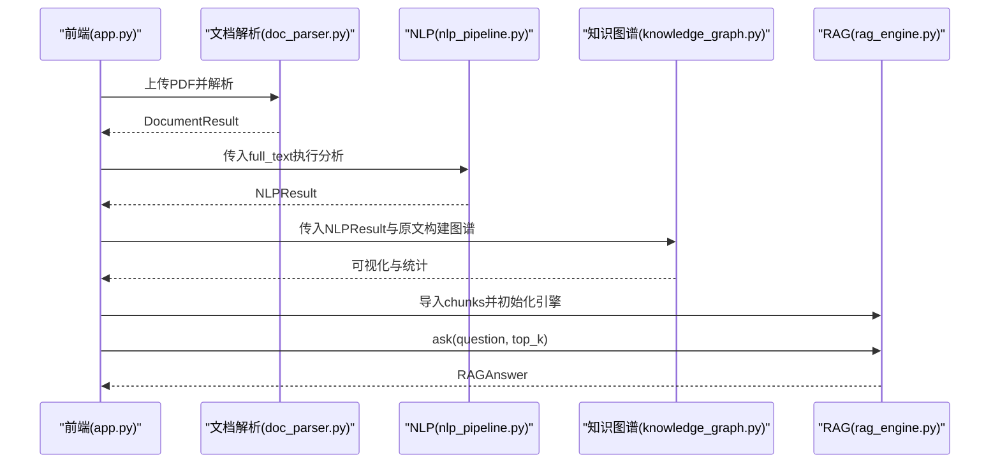
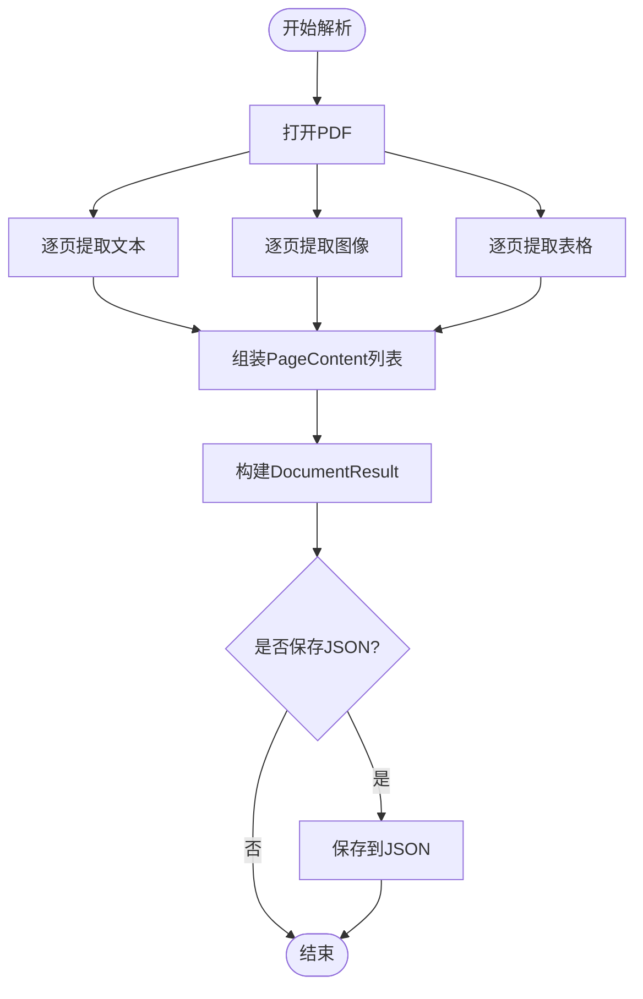
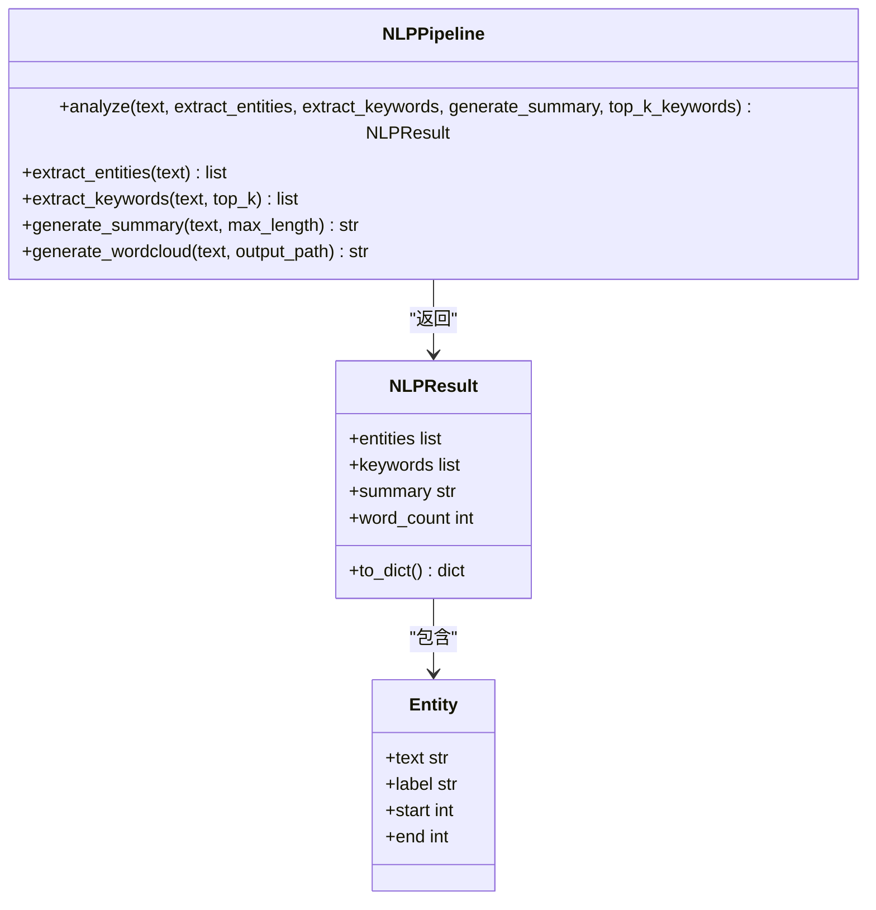
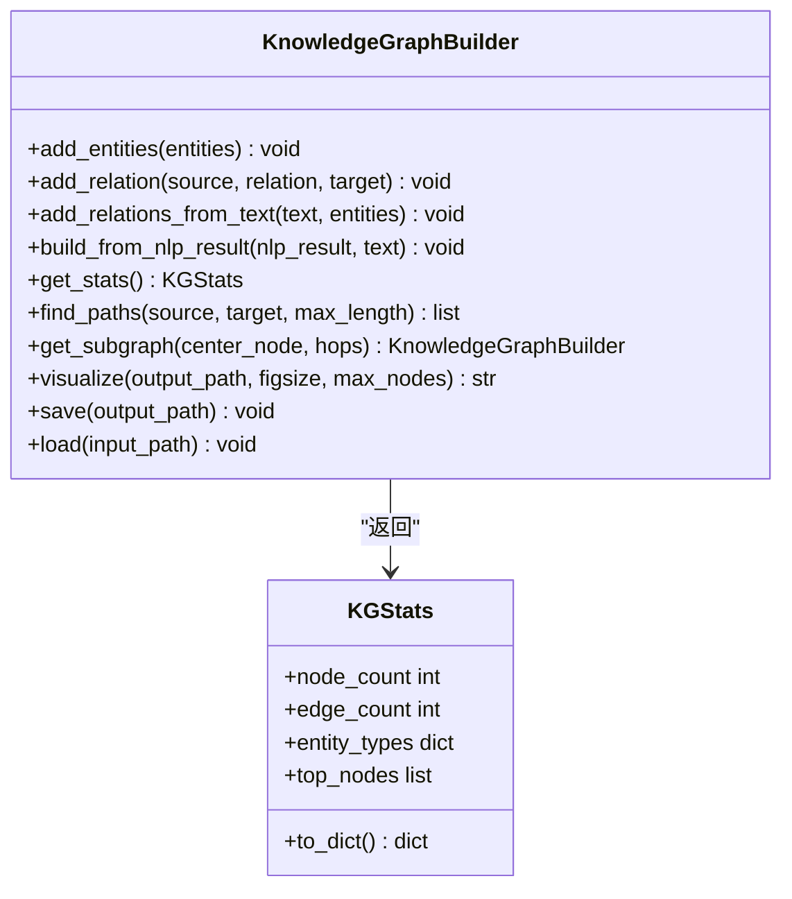
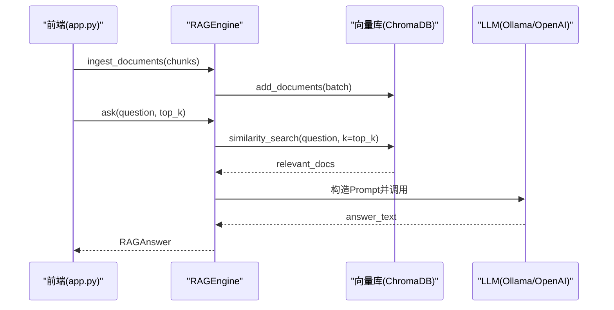
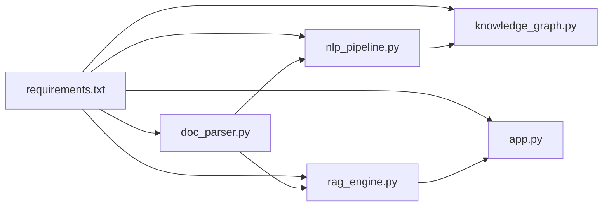

# 数据结构与API

<cite>
**本文引用的文件**
- [zhixi/src/__init__.py](file://zhixi/src/__init__.py)
- [zhixi/src/app.py](file://zhixi/src/app.py)
- [zhixi/src/doc_parser.py](file://zhixi/src/doc_parser.py)
- [zhixi/src/nlp_pipeline.py](file://zhixi/src/nlp_pipeline.py)
- [zhixi/src/knowledge_graph.py](file://zhixi/src/knowledge_graph.py)
- [zhixi/src/rag_engine.py](file://zhixi/src/rag_engine.py)
- [zhixi/tests/test_core.py](file://zhixi/tests/test_core.py)
- [zhixi/requirements.txt](file://zhixi/requirements.txt)
</cite>

## 目录
1. [简介](#简介)
2. [项目结构](#项目结构)
3. [核心数据类](#核心数据类)
4. [架构总览](#架构总览)
5. [详细组件分析](#详细组件分析)
6. [依赖关系分析](#依赖关系分析)
7. [性能与可用性考量](#性能与可用性考量)
8. [故障排查指南](#故障排查指南)
9. [结论](#结论)
10. [附录：API使用与最佳实践](#附录api使用与最佳实践)

## 简介
本文件面向开发者与使用者，系统化梳理“智析（ZhiXi）”平台的核心数据结构与API接口，覆盖文档解析、NLP分析、知识图谱、RAG问答四个模块。重点说明：
- 核心数据类（如 DocumentResult、NLPResult、Entity、RAGAnswer 等）的字段定义、数据类型与业务含义
- 各模块公共接口（方法签名、参数说明、返回值格式、异常处理）
- 数据流转过程中的格式转换与验证规则
- API使用示例与最佳实践
- 错误处理策略与调试技巧
- 向后兼容性与版本管理原则
- 模块间通信与数据交换指导

## 项目结构
项目采用分层模块化设计，围绕“文档解析（CV层）—NLP分析（NLP层）—知识图谱（数据挖掘层）—RAG应用（LLM应用层）—Web界面（UI层）”的流水线组织代码。核心模块与职责如下：
- 文档解析模块：负责从PDF中提取文本、表格、图像，并提供文本切块用于后续RAG
- NLP分析模块：提供实体识别、关键词提取、摘要生成、词云可视化
- 知识图谱模块：从实体与共现关系构建图谱，支持统计、路径查找、可视化与持久化
- RAG引擎模块：基于向量检索与LLM生成实现问答，支持OpenAI与本地Ollama两种模式
- Web应用模块：Streamlit前端，串联上述模块，提供交互式体验

图表来源
- [zhixi/src/app.py:176-461](file://zhixi/src/app.py#L176-L461)
- [zhixi/src/doc_parser.py:64-268](file://zhixi/src/doc_parser.py#L64-L268)
- [zhixi/src/nlp_pipeline.py:45-312](file://zhixi/src/nlp_pipeline.py#L45-L312)
- [zhixi/src/knowledge_graph.py:44-329](file://zhixi/src/knowledge_graph.py#L44-L329)
- [zhixi/src/rag_engine.py:47-313](file://zhixi/src/rag_engine.py#L47-L313)

章节来源
- [zhixi/src/__init__.py:1-14](file://zhixi/src/__init__.py#L1-L14)
- [zhixi/src/app.py:1-492](file://zhixi/src/app.py#L1-L492)

## 核心数据类
本节对关键数据类进行字段定义、数据类型与业务含义说明，并给出序列化/持久化接口。

- DocumentResult（文档解析结果）
  - 字段
    - filename: 字符串，原始文件名
    - total_pages: 整数，总页数
    - pages: 列表，元素为 PageContent
    - full_text: 字符串，拼接后的全文
  - 方法
    - to_dict(): 返回字典结构，便于JSON序列化
    - save(output_path): 保存为JSON文件
  - 业务含义
    - 描述一次完整PDF解析的产出，包含每页文本、表格、图像以及全文汇总

- PageContent（单页解析结果）
  - 字段
    - page_number: 整数，页码
    - text: 字符串，该页文本
    - tables: 列表，每项为表格字典（含headers、rows、row_count）
    - images: 列表，该页提取的图像文件路径
  - 业务含义
    - 单页层面的解析产物，支撑后续NLP与RAG

- NLPResult（NLP分析结果）
  - 字段
    - entities: 列表，元素为 Entity
    - keywords: 列表，元素为二元组（关键词，相关度分数）
    - summary: 字符串，摘要
    - word_count: 整数，词数
  - 方法
    - to_dict(): 返回字典结构
  - 业务含义
    - 描述文本的实体、关键词、摘要等分析结果

- Entity（命名实体）
  - 字段
    - text: 字符串，实体文本
    - label: 字符串，实体标签（如PER/ORG/LOC/DATE/MISC）
    - start: 整数，起始位置（可选）
    - end: 整数，结束位置（可选）
  - 业务含义
    - 结合NLP识别得到的实体信息

- RAGAnswer（RAG问答结果）
  - 字段
    - question: 字符串，原始问题
    - answer: 字符串，LLM生成的答案
    - sources: 列表，元素为字典（包含content、page、chunk_id等）
    - model_used: 字符串，实际使用的模型名
  - 方法
    - to_dict(): 返回字典结构
  - 业务含义
    - 描述RAG问答的最终结果及来源溯源

- KGStats（知识图谱统计）
  - 字段
    - node_count: 整数，节点数
    - edge_count: 整数，边数
    - entity_types: 字典，实体类型及其计数
    - top_nodes: 列表，度最高的节点（含类型）
  - 方法
    - to_dict(): 返回字典结构
  - 业务含义
    - 描述图谱规模与热点节点分布

章节来源
- [zhixi/src/doc_parser.py:32-61](file://zhixi/src/doc_parser.py#L32-L61)
- [zhixi/src/doc_parser.py:98-144](file://zhixi/src/doc_parser.py#L98-L144)
- [zhixi/src/nlp_pipeline.py:24-43](file://zhixi/src/nlp_pipeline.py#L24-L43)
- [zhixi/src/nlp_pipeline.py:106-145](file://zhixi/src/nlp_pipeline.py#L106-L145)
- [zhixi/src/rag_engine.py:30-45](file://zhixi/src/rag_engine.py#L30-L45)
- [zhixi/src/knowledge_graph.py:27-42](file://zhixi/src/knowledge_graph.py#L27-L42)

## 架构总览
下图展示从Web界面到各模块的调用链路与数据流。

图表来源
- [zhixi/src/app.py:176-461](file://zhixi/src/app.py#L176-L461)
- [zhixi/src/doc_parser.py:98-144](file://zhixi/src/doc_parser.py#L98-L144)
- [zhixi/src/nlp_pipeline.py:106-145](file://zhixi/src/nlp_pipeline.py#L106-L145)
- [zhixi/src/knowledge_graph.py:137-151](file://zhixi/src/knowledge_graph.py#L137-L151)
- [zhixi/src/rag_engine.py:154-263](file://zhixi/src/rag_engine.py#L154-L263)

## 详细组件分析

### 文档解析模块（CV层）
- 核心类
  - DocumentParser：负责PDF解析、表格提取、图像提取、文本切块
  - DocumentResult/PageContent：解析结果数据结构
- 关键方法
  - parse(): 返回DocumentResult
  - get_text_chunks(chunk_size, chunk_overlap): 返回用于RAG的文本块列表
- 数据流转
  - 从PDF读取文本与图像，逐页提取表格，组装为DocumentResult
  - 文本切块时按段落优先，保证语义完整性，并保留重叠以提升召回
- 异常处理
  - 表格提取失败时降级为空列表，避免中断整体流程
  - 文件不存在抛出FileNotFoundError
- 序列化
  - DocumentResult提供to_dict与save(JSON)能力

图表来源
- [zhixi/src/doc_parser.py:98-144](file://zhixi/src/doc_parser.py#L98-L144)
- [zhixi/src/doc_parser.py:178-203](file://zhixi/src/doc_parser.py#L178-L203)
- [zhixi/src/doc_parser.py:212-268](file://zhixi/src/doc_parser.py#L212-L268)

章节来源
- [zhixi/src/doc_parser.py:64-268](file://zhixi/src/doc_parser.py#L64-L268)

### NLP分析模块（NLP层）
- 核心类
  - NLPPipeline：统一的NLP分析管道，延迟加载模型
  - NLPResult/Entity：分析结果与实体数据结构
- 关键方法
  - analyze(text, extract_entities, extract_keywords, generate_summary, top_k_keywords)
  - extract_entities(text)
  - extract_keywords(text, top_k)
  - generate_summary(text, max_length)
  - generate_wordcloud(text, output_path)
- 数据流转
  - 先做NER，再做关键词提取，最后生成摘要
  - 词云基于清洗后的文本生成
- 异常处理
  - 各子任务失败时返回空或降级文本，保证流程继续
  - 文本过短直接返回空结果
- 序列化
  - NLPResult提供to_dict

图表来源
- [zhixi/src/nlp_pipeline.py:45-312](file://zhixi/src/nlp_pipeline.py#L45-L312)

章节来源
- [zhixi/src/nlp_pipeline.py:45-312](file://zhixi/src/nlp_pipeline.py#L45-L312)

### 知识图谱模块（数据挖掘层）
- 核心类
  - KnowledgeGraphBuilder：图谱构建与分析
  - KGStats：统计信息
- 关键方法
  - add_entities(entities)
  - add_relation(source, relation, target)
  - add_relations_from_text(text, entities)
  - build_from_nlp_result(nlp_result, text)
  - get_stats() -> KGStats
  - find_paths(source, target, max_length)
  - get_subgraph(center_node, hops)
  - visualize(output_path, figsize, max_nodes)
  - save/load(path)
- 数据流转
  - 从NLP实体构建节点，结合原文进行共现关系抽取
  - 支持路径查找、子图提取、统计与可视化
- 异常处理
  - 节点不存在时抛出异常；可视化失败返回None
- 序列化
  - save/load使用NetworkX的node-link格式

图表来源
- [zhixi/src/knowledge_graph.py:44-329](file://zhixi/src/knowledge_graph.py#L44-L329)

章节来源
- [zhixi/src/knowledge_graph.py:44-329](file://zhixi/src/knowledge_graph.py#L44-L329)

### RAG引擎模块（LLM应用层）
- 核心类
  - RAGEngine：RAG问答引擎
  - RAGAnswer：问答结果
- 关键方法
  - ingest_documents(chunks): 导入文档块到向量库
  - ask(question, top_k, include_sources) -> RAGAnswer
  - search(query, top_k): 仅检索
  - clear_collection(): 清空集合
- 数据流转
  - 文档块导入ChromaDB，用户提问时检索top_k上下文，构造Prompt并调用LLM生成答案
  - 支持OpenAI与Ollama两种模式
- 异常处理
  - LLM调用失败时返回错误提示文本
  - 无相关文档时返回默认提示
- 序列化
  - RAGAnswer提供to_dict

图表来源
- [zhixi/src/rag_engine.py:154-263](file://zhixi/src/rag_engine.py#L154-L263)
- [zhixi/src/app.py:423-461](file://zhixi/src/app.py#L423-L461)

章节来源
- [zhixi/src/rag_engine.py:47-313](file://zhixi/src/rag_engine.py#L47-L313)

## 依赖关系分析
- 模块内聚与耦合
  - 各模块通过清晰的数据类边界解耦：CV层产出DocumentResult，NLP层消费full_text，RAG层消费chunks，UI层协调
- 外部依赖
  - 文档解析：PyMuPDF、pdfplumber、OpenCV、Pillow
  - NLP分析：transformers、torch、keybert、wordcloud
  - 知识图谱：networkx、scikit-learn
  - RAG：langchain、langchain-community、langchain-openai、chromadb、openai、tiktoken
  - UI：streamlit、python-dotenv
- 版本与兼容性
  - requirements中给出最低版本约束，建议遵循以保证兼容性
  - 模块内部通过延迟初始化与降级策略提升鲁棒性

图表来源
- [zhixi/requirements.txt:1-45](file://zhixi/requirements.txt#L1-L45)
- [zhixi/src/doc_parser.py:26-29](file://zhixi/src/doc_parser.py#L26-L29)
- [zhixi/src/nlp_pipeline.py:79-104](file://zhixi/src/nlp_pipeline.py#L79-L104)
- [zhixi/src/knowledge_graph.py:24-25](file://zhixi/src/knowledge_graph.py#L24-L25)
- [zhixi/src/rag_engine.py:100-135](file://zhixi/src/rag_engine.py#L100-L135)
- [zhixi/src/app.py:24-27](file://zhixi/src/app.py#L24-L27)

章节来源
- [zhixi/requirements.txt:1-45](file://zhixi/requirements.txt#L1-L45)

## 性能与可用性考量
- 文本切块策略
  - 按段落优先切分，保留重叠以提升召回；适合RAG检索
- 模型加载策略
  - NLPPipeline与RAGEngine均采用延迟加载，按需初始化，减少内存占用
- 可视化与输出
  - 知识图谱可视化限制节点数量，避免渲染开销过大
- 错误降级
  - 表格提取失败、LLM调用失败、摘要生成失败均有降级策略，保证流程可用

[本节为通用性能讨论，无需特定文件引用]

## 故障排查指南
- 常见问题与定位
  - 文档解析失败：检查PDF路径是否存在；确认PyMuPDF/pdfplumber依赖安装
  - NLP分析报错：首次运行需下载模型，等待网络与磁盘IO；检查transformers/keybert安装
  - RAG问答无结果：确认已调用ingest_documents并成功导入；检查向量库持久化目录权限
  - LLM调用失败：检查OpenAI API Key或Ollama服务连通性
- 调试技巧
  - 在各模块打印中间结果（如解析页数、实体数量、检索命中数）
  - 使用to_dict导出中间数据，便于人工核验
  - 测试用例覆盖了数据结构与关键流程，可参考其断言思路
- 单元测试参考
  - 测试覆盖了实体添加、关系构建、统计、路径查找、保存/加载、文本切块、NLP结果序列化、RAG答案序列化等

章节来源
- [zhixi/tests/test_core.py:18-163](file://zhixi/tests/test_core.py#L18-L163)

## 结论
本文件系统化梳理了智析平台的数据结构与API，明确了各模块的职责边界、数据流转与异常处理策略。通过清晰的数据类定义与序列化接口，平台实现了从文档解析到知识图谱再到RAG问答的完整链路；通过延迟初始化与降级策略提升了可用性与稳定性。建议在扩展新功能时遵循现有数据类与接口风格，保持模块间低耦合与高内聚。

[本节为总结性内容，无需特定文件引用]

## 附录：API使用与最佳实践
- 文档解析
  - 使用DocumentParser.parse()获取DocumentResult；必要时调用get_text_chunks()生成chunks供RAG使用
  - 建议在生产环境保存JSON结果以便复用
- NLP分析
  - 通过NLPPipeline.analyze()一次性获取实体、关键词与摘要；也可单独调用对应方法
  - 关键词提取建议根据场景调整top_k；摘要生成建议控制max_length
- 知识图谱
  - 若已有NLP结果，优先使用build_from_nlp_result()；否则可手动add_entities/add_relation
  - 可视化前建议先get_stats()了解图谱规模
- RAG问答
  - 先调用ingest_documents导入chunks，再调用ask；可通过top_k调节召回数量
  - 使用RAGAnswer.to_dict()导出结果，便于日志与前端展示
- 最佳实践
  - 严格区分“数据类”与“方法”，数据类统一提供to_dict与持久化接口
  - 在UI层通过会话状态传递中间结果，避免重复计算
  - 对外暴露便捷函数（如quick_rag、parse_pdf）简化调用

[本节为通用实践建议，无需特定文件引用]