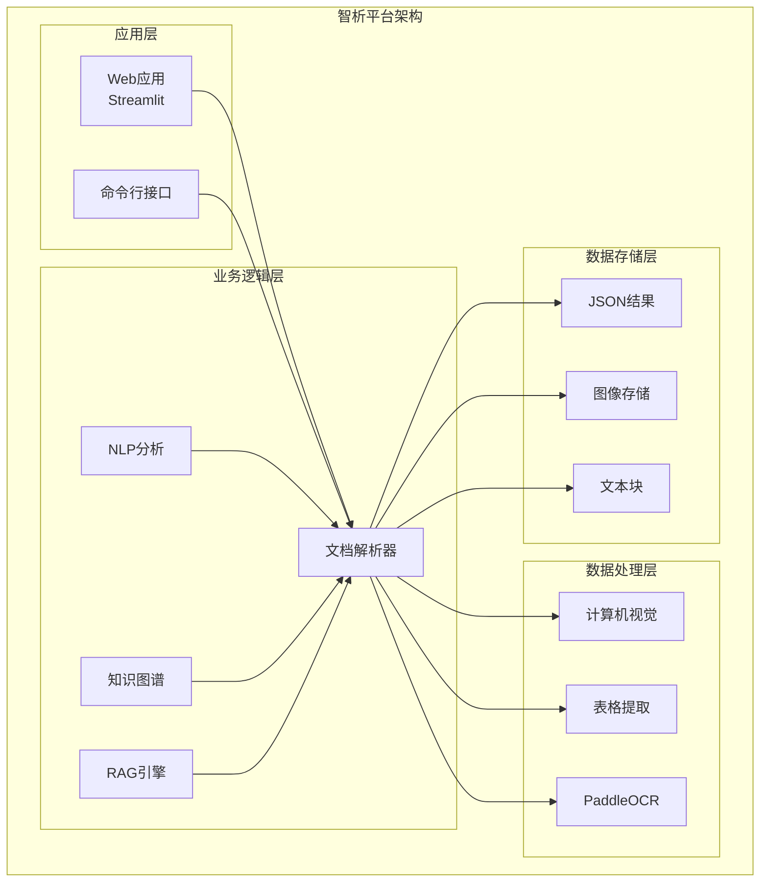
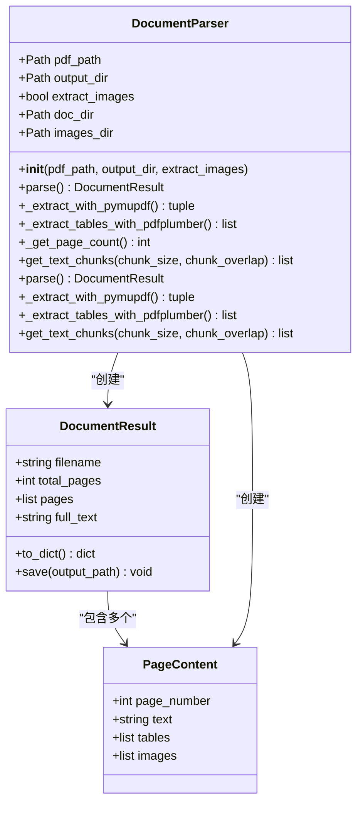
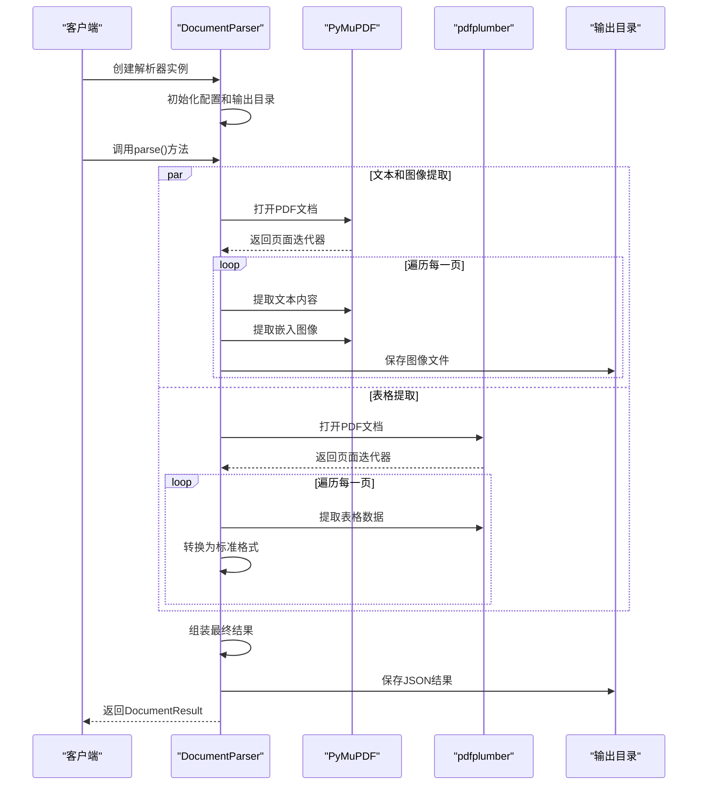
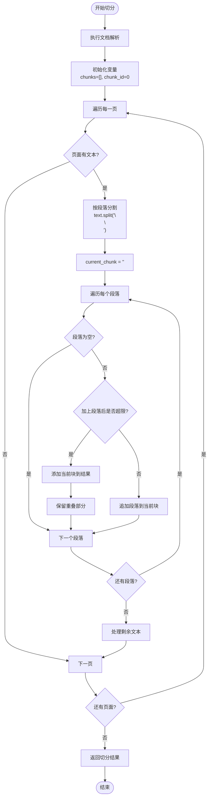
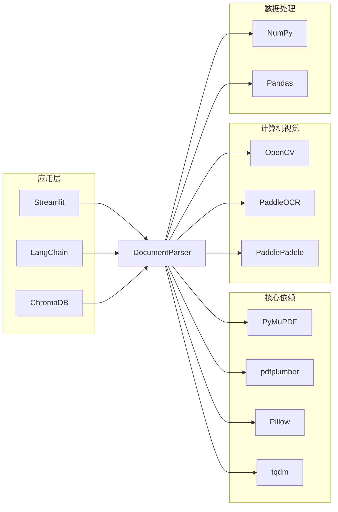
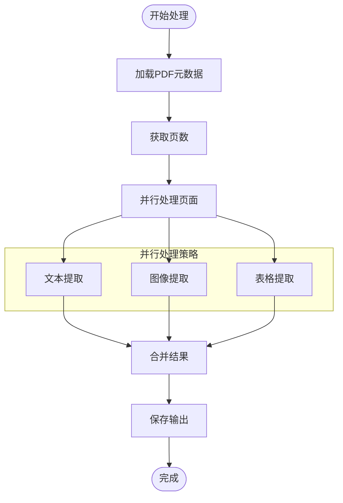

# 文档解析器API

<cite>
**本文档引用的文件**
- [doc_parser.py](file://zhixi/src/doc_parser.py)
- [app.py](file://zhixi/src/app.py)
- [requirements.txt](file://zhixi/requirements.txt)
- [test_core.py](file://zhixi/tests/test_core.py)
</cite>

## 目录
1. [简介](#简介)
2. [项目结构](#项目结构)
3. [核心组件](#核心组件)
4. [架构概览](#架构概览)
5. [详细组件分析](#详细组件分析)
6. [依赖关系分析](#依赖关系分析)
7. [性能考虑](#性能考虑)
8. [故障排除指南](#故障排除指南)
9. [结论](#结论)

## 简介

文档解析器模块是智析（ZhiXi）平台的核心组件之一，专门负责从PDF文档中提取文本、表格和图像内容。该模块采用多技术栈融合的设计理念，结合了PyMuPDF、pdfplumber、OpenCV和PaddleOCR等先进工具，为后续的NLP分析、知识图谱构建和RAG检索增强提供了高质量的原始数据。

该模块不仅提供了完整的面向对象API，还包含了便捷的函数式接口，支持批量处理和自动化工作流集成。通过精心设计的文本切分算法，为RAG（检索增强生成）应用提供了优化的文档片段。

## 项目结构

智析平台采用模块化的架构设计，文档解析器位于核心的数据处理层（CV层），为上层的NLP分析、知识图谱构建和RAG引擎提供基础数据支撑。



**图表来源**
- [doc_parser.py:1-319](file://zhixi/src/doc_parser.py#L1-L319)
- [app.py:1-492](file://zhixi/src/app.py#L1-L492)

**章节来源**
- [doc_parser.py:1-319](file://zhixi/src/doc_parser.py#L1-L319)
- [requirements.txt:1-45](file://zhixi/requirements.txt#L1-L45)

## 核心组件

文档解析器模块主要包含以下核心组件：

### 数据类结构

系统定义了两个核心数据类来封装解析结果：

1. **PageContent**: 单页解析结果的结构化表示
2. **DocumentResult**: 整个文档解析结果的聚合容器

### 主要类层次结构



**图表来源**
- [doc_parser.py:32-62](file://zhixi/src/doc_parser.py#L32-L62)
- [doc_parser.py:64-268](file://zhixi/src/doc_parser.py#L64-L268)

**章节来源**
- [doc_parser.py:32-62](file://zhixi/src/doc_parser.py#L32-L62)
- [doc_parser.py:64-268](file://zhixi/src/doc_parser.py#L64-L268)

## 架构概览

文档解析器采用流水线式的处理架构，通过三个主要阶段完成PDF内容的全面提取：



**图表来源**
- [doc_parser.py:98-144](file://zhixi/src/doc_parser.py#L98-L144)
- [doc_parser.py:146-176](file://zhixi/src/doc_parser.py#L146-L176)
- [doc_parser.py:178-203](file://zhixi/src/doc_parser.py#L178-L203)

## 详细组件分析

### DocumentParser 类

DocumentParser 是整个文档解析系统的核心类，提供了完整的PDF内容提取功能。

#### 构造函数 (__init__)

**方法签名**: `__init__(self, pdf_path: str, output_dir: str = "data/processed", extract_images: bool = True)`

**参数说明**:
- `pdf_path`: PDF文件的绝对或相对路径
- `output_dir`: 结果输出目录，默认为"data/processed"
- `extract_images`: 是否提取嵌入图像，默认为True

**异常处理**:
- 当PDF文件不存在时抛出 `FileNotFoundError`

**配置行为**:
- 自动创建输出子目录结构
- 设置文档专用的输出目录
- 创建图像存储子目录

**章节来源**
- [doc_parser.py:79-97](file://zhixi/src/doc_parser.py#L79-L97)

#### 主解析方法 (parse)

**方法签名**: `parse(self) -> DocumentResult`

**功能描述**: 执行完整的文档解析流程，包括文本图像提取、表格提取和结果组装。

**处理流程**:
1. 使用PyMuPDF提取文本内容和嵌入图像
2. 使用pdfplumber提取表格数据
3. 组装PageContent对象列表
4. 生成DocumentResult聚合结果

**返回值**: `DocumentResult` 对象，包含：
- 文件名信息
- 总页数统计
- 每页的详细内容
- 全文文本汇总

**性能特性**:
- 使用进度条显示处理进度
- 支持图像提取的可选开关
- 自动处理空页和无效内容

**章节来源**
- [doc_parser.py:98-144](file://zhixi/src/doc_parser.py#L98-L144)

#### 私有方法：文本和图像提取 (_extract_with_pymupdf)

**方法签名**: `_extract_with_pymupdf(self) -> tuple`

**功能描述**: 使用PyMuPDF从PDF中提取纯文本和嵌入图像。

**处理逻辑**:
- 遍历PDF的每一页面
- 提取页面文本内容并去除空白字符
- 可选地提取嵌入图像并保存到磁盘
- 支持不同图像格式（PNG、JPG等）

**返回值**: `(pages_text: list, pages_images: list)` 元组

**错误处理**: 
- 对于无法提取的图像进行容错处理
- 继续处理其他正常页面

**章节来源**
- [doc_parser.py:146-176](file://zhixi/src/doc_parser.py#L146-L176)

#### 私有方法：表格提取 (_extract_tables_with_pdfplumber)

**方法签名**: `_extract_tables_with_pdfplumber(self) -> list`

**功能描述**: 使用pdfplumber从PDF中提取表格数据。

**处理逻辑**:
- 打开PDF文档并逐页处理
- 提取表格内容并转换为标准格式
- 每个表格转换为包含表头和行数据的字典

**表格数据格式**:
```json
{
  "headers": ["列1", "列2", "列3"],
  "rows": [["数据1", "数据2", "数据3"]],
  "row_count": 1
}
```

**异常处理**: 
- 捕获所有提取异常
- 发生错误时返回空表格列表作为降级方案

**章节来源**
- [doc_parser.py:178-203](file://zhixi/src/doc_parser.py#L178-L203)

#### 文本切分方法 (get_text_chunks)

**方法签名**: `get_text_chunks(self, chunk_size: int = 500, chunk_overlap: int = 50) -> list`

**功能描述**: 将文档文本切分为重叠的文本块，专为RAG应用优化。

**算法原理**:
1. 首先执行完整的文档解析
2. 按段落（双换行符）进行初步分割
3. 使用滑动窗口算法创建重叠文本块
4. 保持语义完整性的同时控制块大小

**参数调优**:
- `chunk_size`: 每个块的理想字符数（默认500）
- `chunk_overlap`: 相邻块之间的重叠字符数（默认50）

**切分算法流程**:



**图表来源**
- [doc_parser.py:212-268](file://zhixi/src/doc_parser.py#L212-L268)

**返回值**: 文本块列表，每个元素包含：
- `text`: 文本内容
- `page`: 所属页面编号
- `chunk_id`: 块的唯一标识符

**章节来源**
- [doc_parser.py:212-268](file://zhixi/src/doc_parser.py#L212-L268)

### 便捷函数 (parse_pdf)

**函数签名**: `parse_pdf(pdf_path: str, output_dir: str = "data/processed", save_result: bool = True) -> DocumentResult`

**功能描述**: 提供简化的函数式接口，一键完成PDF解析和结果保存。

**参数说明**:
- `pdf_path`: PDF文件路径
- `output_dir`: 输出目录
- `save_result`: 是否保存JSON结果文件

**使用场景**:
- 快速脚本处理
- 批量处理任务
- 简单的命令行使用

**返回值**: `DocumentResult` 对象

**章节来源**
- [doc_parser.py:273-298](file://zhixi/src/doc_parser.py#L273-L298)

## 依赖关系分析

文档解析器模块依赖于多个第三方库，形成了完整的PDF处理生态系统。



**图表来源**
- [requirements.txt:6-45](file://zhixi/requirements.txt#L6-L45)
- [doc_parser.py:20-30](file://zhixi/src/doc_parser.py#L20-L30)

### 技术栈详解

**PDF处理技术栈**:
- **PyMuPDF**: 提供高性能的PDF读取、文本提取和图像处理能力
- **pdfplumber**: 专业的表格提取工具，支持复杂的表格结构识别

**计算机视觉技术栈**:
- **OpenCV**: 图像预处理和格式转换
- **PaddleOCR**: 中文文档识别的OCR解决方案

**数据处理技术栈**:
- **NumPy/Pandas**: 数值计算和数据结构处理
- **Pillow**: 图像格式转换和基本操作

**章节来源**
- [requirements.txt:6-45](file://zhixi/requirements.txt#L6-L45)
- [doc_parser.py:6-11](file://zhixi/src/doc_parser.py#L6-L11)

## 性能考虑

### 内存优化策略

1. **流式处理**: 使用生成器和迭代器避免一次性加载整个PDF
2. **渐进式解析**: 分阶段处理不同类型的内容，减少峰值内存占用
3. **图像缓存**: 控制同时处理的图像数量，避免内存溢出

### 并发处理



### 性能优化建议

1. **批处理策略**: 对于大量文档，建议分批处理以控制内存使用
2. **缓存机制**: 对于重复处理的文档，可以利用缓存避免重复计算
3. **异步处理**: 在Web应用中使用异步处理提升用户体验

## 故障排除指南

### 常见问题及解决方案

**PDF文件损坏**:
- 症状: 解析过程中出现异常
- 解决方案: 验证PDF文件完整性，尝试使用PDF修复工具

**内存不足**:
- 症状: 处理大型PDF时内存溢出
- 解决方案: 减少同时处理的页面数量，启用图像提取开关

**表格提取失败**:
- 症状: 表格数据为空
- 解决方案: 检查pdfplumber版本兼容性，尝试不同的表格提取参数

### 错误处理策略

文档解析器采用了多层次的错误处理机制：

1. **输入验证**: 在构造函数中检查文件存在性和有效性
2. **运行时保护**: 对每个提取步骤进行异常捕获和降级处理
3. **用户反馈**: 提供清晰的错误信息和处理建议

**章节来源**
- [doc_parser.py:89-90](file://zhixi/src/doc_parser.py#L89-L90)
- [doc_parser.py:198-201](file://zhixi/src/doc_parser.py#L198-L201)

## 结论

文档解析器模块为智析平台提供了强大的PDF内容处理能力。通过精心设计的架构和完善的错误处理机制，该模块能够稳定地处理各种类型的PDF文档，并为后续的NLP分析、知识图谱构建和RAG应用提供高质量的基础数据。

模块的主要优势包括：
- **多技术栈融合**: 结合多种专业工具的优势
- **灵活的配置选项**: 支持根据需求调整处理策略
- **完善的错误处理**: 提供健壮的容错机制
- **优化的性能表现**: 通过流式处理和内存优化提升效率

未来的发展方向包括：
- 支持更多文档格式（Word、Excel等）
- 增强表格结构识别能力
- 优化大文档的处理性能
- 提供更多的自定义配置选项