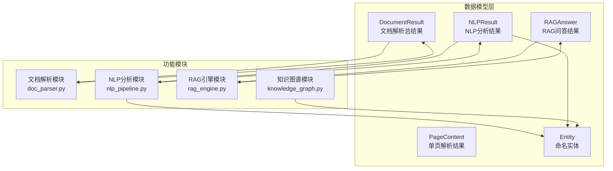
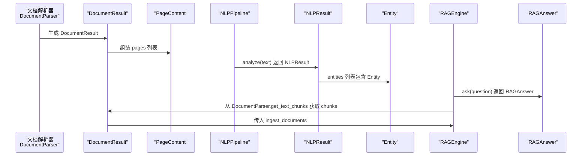
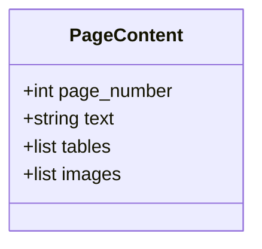
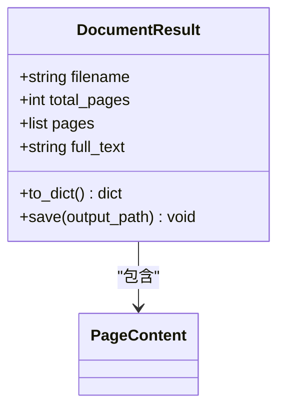
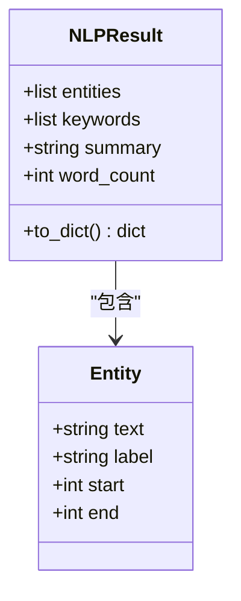
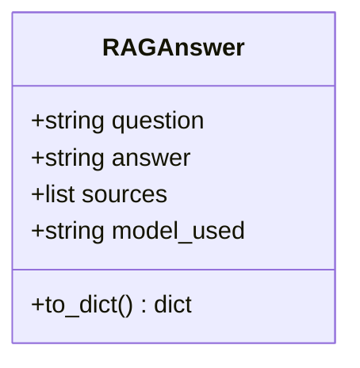
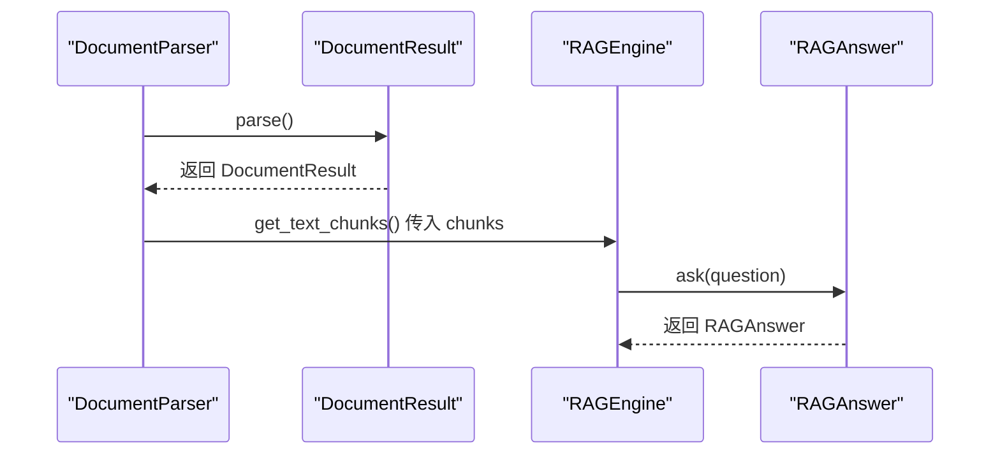
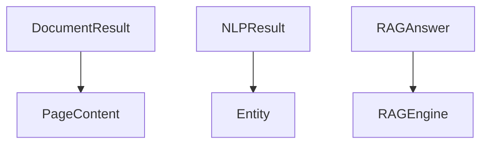

# 核心数据模型

<cite>
**本文引用的文件**
- [doc_parser.py](file://zhixi/src/doc_parser.py)
- [nlp_pipeline.py](file://zhixi/src/nlp_pipeline.py)
- [rag_engine.py](file://zhixi/src/rag_engine.py)
- [knowledge_graph.py](file://zhixi/src/knowledge_graph.py)
- [test_core.py](file://zhixi/tests/test_core.py)
</cite>

## 目录
1. [简介](#简介)
2. [项目结构](#项目结构)
3. [核心组件](#核心组件)
4. [架构总览](#架构总览)
5. [详细组件分析](#详细组件分析)
6. [依赖关系分析](#依赖关系分析)
7. [性能考量](#性能考量)
8. [故障排查指南](#故障排查指南)
9. [结论](#结论)
10. [附录](#附录)

## 简介
本文件聚焦智析平台的核心数据模型，系统性梳理并文档化以下关键数据类：DocumentResult、PageContent、NLPResult、Entity、RAGAnswer。内容涵盖：
- 字段定义、数据类型、默认值、业务含义与使用场景
- 数据类之间的组合关系与依赖链路
- 序列化与持久化方法（如 to_dict、save）
- 数据验证规则与约束条件
- 在不同模块间的传递与转换流程
- 实际示例的代码路径指引，便于快速上手

## 项目结构
智析平台采用“模块化+数据类驱动”的设计思路，核心数据模型位于 src 目录下，分别服务于文档解析、NLP 分析与 RAG 引擎三个主要阶段。测试用例位于 tests 目录，覆盖数据类的基本行为与结构。

图表来源
- [doc_parser.py:32-62](file://zhixi/src/doc_parser.py#L32-L62)
- [nlp_pipeline.py:24-43](file://zhixi/src/nlp_pipeline.py#L24-L43)
- [rag_engine.py:30-45](file://zhixi/src/rag_engine.py#L30-L45)
- [knowledge_graph.py:27-42](file://zhixi/src/knowledge_graph.py#L27-L42)

章节来源
- [doc_parser.py:1-319](file://zhixi/src/doc_parser.py#L1-L319)
- [nlp_pipeline.py:1-312](file://zhixi/src/nlp_pipeline.py#L1-L312)
- [rag_engine.py:1-362](file://zhixi/src/rag_engine.py#L1-L362)
- [knowledge_graph.py:1-412](file://zhixi/src/knowledge_graph.py#L1-L412)
- [test_core.py:1-168](file://zhixi/tests/test_core.py#L1-L168)

## 核心组件
本节对五个核心数据类进行逐项说明，包括字段、默认值、业务含义、使用场景以及序列化/持久化方法。

- PageContent（单页解析结果）
  - 字段
    - page_number: int，页码编号
    - text: str，页面文本内容，默认为空字符串
    - tables: list，页面内表格列表，默认空列表
    - images: list，页面内图像文件路径列表，默认空列表
  - 业务含义与使用场景
    - 描述单页解析后的文本、表格、图像等结构化信息，用于后续组装为 DocumentResult
  - 序列化/持久化
    - 通过 DocumentResult 的 to_dict 方法统一序列化，内部使用 asdict 转换
  - 验证与约束
    - 无显式校验；由上层解析器保证字段完整性

- DocumentResult（文档解析总结果）
  - 字段
    - filename: str，原始文档文件名
    - total_pages: int，总页数
    - pages: list，PageContent 列表，默认空列表
    - full_text: str，拼接后的全文本，默认空字符串
  - 业务含义与使用场景
    - 整合所有页面解析结果，提供统一的文档级视图；支持导出 JSON
  - 序列化/持久化
    - to_dict：返回包含 filename、total_pages、full_text、pages 的字典
    - save：将结果写入 JSON 文件，便于离线分析与调试
  - 验证与约束
    - 无显式校验；由 DocumentParser 保证 pages 与 full_text 的一致性

- Entity（命名实体）
  - 字段
    - text: str，实体文本
    - label: str，实体标签（如 PER、ORG、LOC、DATE 等）
    - start: int，默认 0，实体在原文中的起始位置
    - end: int，默认 0，实体在原文中的结束位置
  - 业务含义与使用场景
    - 描述 NLP 分析中识别到的命名实体及其在原文中的位置
  - 序列化/持久化
    - 通过 NLPResult.to_dict 统一序列化
  - 验证与约束
    - 无显式校验；由 NER 模型输出保证 label 合法性

- NLPResult（NLP分析结果）
  - 字段
    - entities: list，Entity 列表，默认空列表
    - keywords: list，关键词元组列表（keyword, score），默认空列表
    - summary: str，摘要文本，默认空字符串
    - word_count: int，词数，默认 0
  - 业务含义与使用场景
    - 统一承载 NLP 分析的多种产出（实体、关键词、摘要、统计）
  - 序列化/持久化
    - to_dict：使用 asdict 将自身转为字典
  - 验证与约束
    - 无显式校验；由 NLPPipeline 内部逻辑控制字段填充

- RAGAnswer（RAG问答结果）
  - 字段
    - question: str，用户问题
    - answer: str，LLM 生成的回答
    - sources: list，来源文档块列表，默认空列表
    - model_used: str，使用的模型名称，默认空字符串
  - 业务含义与使用场景
    - 描述 RAG 引擎的问答输出及来源信息
  - 序列化/持久化
    - to_dict：返回包含 question、answer、sources、model_used 的字典
  - 验证与约束
    - 无显式校验；由 RAGEngine 控制 sources 结构

章节来源
- [doc_parser.py:32-62](file://zhixi/src/doc_parser.py#L32-L62)
- [nlp_pipeline.py:24-43](file://zhixi/src/nlp_pipeline.py#L24-L43)
- [rag_engine.py:30-45](file://zhixi/src/rag_engine.py#L30-L45)

## 架构总览
下图展示了数据模型在各模块间的流转关系与职责边界。

图表来源
- [doc_parser.py:98-144](file://zhixi/src/doc_parser.py#L98-L144)
- [nlp_pipeline.py:106-145](file://zhixi/src/nlp_pipeline.py#L106-L145)
- [rag_engine.py:154-191](file://zhixi/src/rag_engine.py#L154-L191)
- [rag_engine.py:192-263](file://zhixi/src/rag_engine.py#L192-L263)

## 详细组件分析

### PageContent 类分析
- 设计要点
  - 使用 dataclass 简化字段声明与默认值设置
  - 通过 asdict 与上层统一序列化
- 字段与默认值
  - page_number: int
  - text: str 默认 ""
  - tables: list 默认 []
  - images: list 默认 []
- 使用场景
  - 单页文本、表格、图像的最小解析单元
- 序列化
  - 由 DocumentResult.to_dict 统一处理

图表来源
- [doc_parser.py:32-39](file://zhixi/src/doc_parser.py#L32-L39)

章节来源
- [doc_parser.py:32-62](file://zhixi/src/doc_parser.py#L32-L62)

### DocumentResult 类分析
- 设计要点
  - 组合 PageContent 列表，提供文档级聚合视图
  - 提供 to_dict 与 save 方法，便于持久化
- 字段与默认值
  - filename: str
  - total_pages: int
  - pages: list 默认 []
  - full_text: str 默认 ""
- 使用场景
  - 文档解析完成后的一站式结果载体
- 序列化与持久化
  - to_dict：返回包含 pages 的字典（内部使用 asdict）
  - save：将结果写入 JSON 文件

图表来源
- [doc_parser.py:41-62](file://zhixi/src/doc_parser.py#L41-L62)
- [doc_parser.py:32-39](file://zhixi/src/doc_parser.py#L32-L39)

章节来源
- [doc_parser.py:41-62](file://zhixi/src/doc_parser.py#L41-L62)

### NLPResult 与 Entity 类分析
- 设计要点
  - NLPResult 作为统一结果容器，聚合实体、关键词、摘要与统计
  - Entity 描述命名实体及其在原文中的位置
- 字段与默认值
  - NLPResult
    - entities: list 默认 []
    - keywords: list 默认 []
    - summary: str 默认 ""
    - word_count: int 默认 0
  - Entity
    - text: str
    - label: str
    - start: int 默认 0
    - end: int 默认 0
- 使用场景
  - NLP 分析后的一体化结果输出
- 序列化与持久化
  - NLPResult.to_dict：使用 asdict 转换
  - Entity 通过 NLPResult 的 entities 字段参与序列化

图表来源
- [nlp_pipeline.py:33-43](file://zhixi/src/nlp_pipeline.py#L33-L43)
- [nlp_pipeline.py:24-31](file://zhixi/src/nlp_pipeline.py#L24-L31)

章节来源
- [nlp_pipeline.py:24-43](file://zhixi/src/nlp_pipeline.py#L24-L43)

### RAGAnswer 类分析
- 设计要点
  - 描述 RAG 引擎的问答输出与来源信息
  - 提供 to_dict 以便统一序列化
- 字段与默认值
  - question: str
  - answer: str
  - sources: list 默认 []
  - model_used: str 默认 ""
- 使用场景
  - RAG 问答流程的最终输出载体
- 序列化与持久化
  - to_dict：返回包含 question、answer、sources、model_used 的字典

图表来源
- [rag_engine.py:30-45](file://zhixi/src/rag_engine.py#L30-L45)

章节来源
- [rag_engine.py:30-45](file://zhixi/src/rag_engine.py#L30-L45)

### 数据模型在模块间的传递与转换
- 文档解析阶段
  - DocumentParser.parse 生成 DocumentResult，内部组装 PageContent 列表
  - get_text_chunks 将 DocumentResult.full_text 切分为块，供 RAG 引擎使用
- NLP 分析阶段
  - NLPPipeline.analyze 返回 NLPResult，其中 entities 为 Entity 列表
- RAG 引擎阶段
  - RAGEngine.ingest_documents 接收来自 get_text_chunks 的块列表
  - RAGEngine.ask 返回 RAGAnswer，包含 answer 与 sources

图表来源
- [doc_parser.py:98-144](file://zhixi/src/doc_parser.py#L98-L144)
- [doc_parser.py:212-268](file://zhixi/src/doc_parser.py#L212-L268)
- [rag_engine.py:154-191](file://zhixi/src/rag_engine.py#L154-L191)
- [rag_engine.py:192-263](file://zhixi/src/rag_engine.py#L192-L263)

## 依赖关系分析
- 组合关系
  - DocumentResult 组合 PageContent
  - NLPResult 组合 Entity
  - RAGAnswer 与 RAGEngine 的 ask 流程耦合
- 外部依赖
  - dataclasses.asdict 用于序列化
  - json 用于持久化
  - langchain、chromadb、transformers 等第三方库在模块中延迟加载，不影响数据模型本身

图表来源
- [doc_parser.py:41-62](file://zhixi/src/doc_parser.py#L41-L62)
- [nlp_pipeline.py:33-43](file://zhixi/src/nlp_pipeline.py#L33-L43)
- [rag_engine.py:30-45](file://zhixi/src/rag_engine.py#L30-L45)

章节来源
- [doc_parser.py:41-62](file://zhixi/src/doc_parser.py#L41-L62)
- [nlp_pipeline.py:33-43](file://zhixi/src/nlp_pipeline.py#L33-L43)
- [rag_engine.py:30-45](file://zhixi/src/rag_engine.py#L30-L45)

## 性能考量
- 序列化开销
  - dataclass 的 asdict 转换在大型对象上可能带来额外开销；建议在批量导出时合并多次调用
- 文本切分策略
  - get_text_chunks 采用重叠窗口切分，兼顾召回与上下文连续性；可根据需求调整 chunk_size 与 overlap
- 模型延迟加载
  - NLP 与 RAG 模块均采用延迟初始化，减少内存占用；首次调用会有初始化开销

## 故障排查指南
- DocumentResult.save 失败
  - 检查输出路径权限与磁盘空间
  - 确认 to_dict 返回的字典结构完整
- NLP 分析结果为空
  - 确认输入文本长度是否满足 NLPPipeline.analyze 的阈值
  - 检查模型加载状态（NER、KeyBERT、Summary）
- RAG 未返回来源
  - 确认已成功执行 ingest_documents 并导入了 chunks
  - 检查向量数据库是否初始化成功

章节来源
- [doc_parser.py:57-61](file://zhixi/src/doc_parser.py#L57-L61)
- [nlp_pipeline.py:127-129](file://zhixi/src/nlp_pipeline.py#L127-L129)
- [rag_engine.py:154-191](file://zhixi/src/rag_engine.py#L154-L191)

## 结论
本文系统梳理了智析平台的核心数据模型，明确了各数据类的字段、默认值、业务含义与使用场景，并给出了序列化与持久化方法、依赖关系与模块间流转的可视化说明。通过 dataclass 的统一结构与 asdict 序列化，平台实现了清晰、可扩展的数据模型体系，便于在文档解析、NLP 分析与 RAG 引擎之间高效传递与转换。

## 附录
- 实际示例的代码路径（不含具体代码内容）
  - 创建并保存 DocumentResult：[doc_parser.py:57-61](file://zhixi/src/doc_parser.py#L57-L61)
  - 将 NLPResult 转为字典：[nlp_pipeline.py:41-42](file://zhixi/src/nlp_pipeline.py#L41-L42)
  - 将 RAGAnswer 转为字典：[rag_engine.py:38-44](file://zhixi/src/rag_engine.py#L38-L44)
  - 从文本切分为块（供 RAG 使用）：[doc_parser.py:212-268](file://zhixi/src/doc_parser.py#L212-L268)
  - 测试数据类结构（参考）：[test_core.py:127-162](file://zhixi/tests/test_core.py#L127-L162)