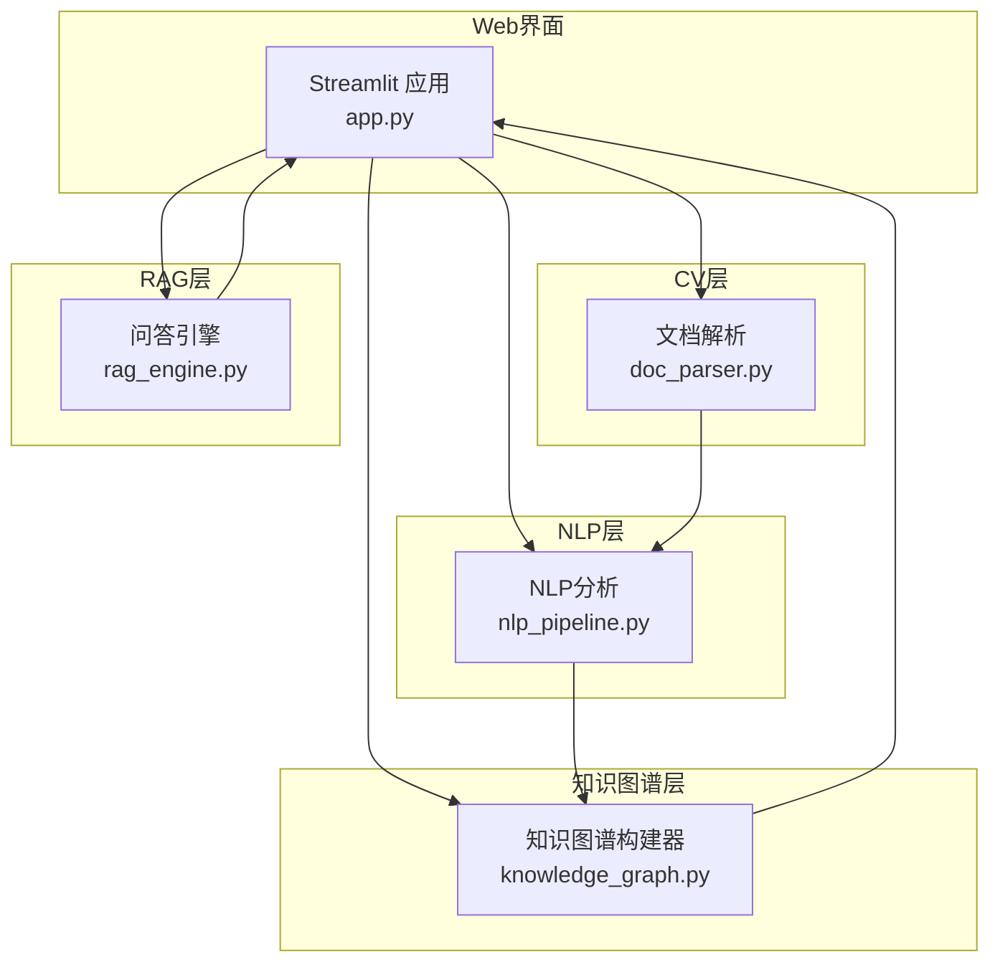
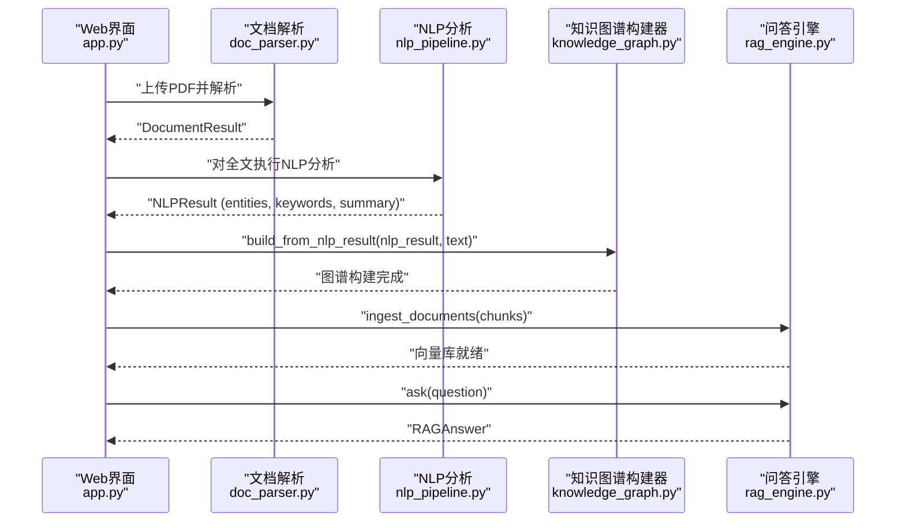
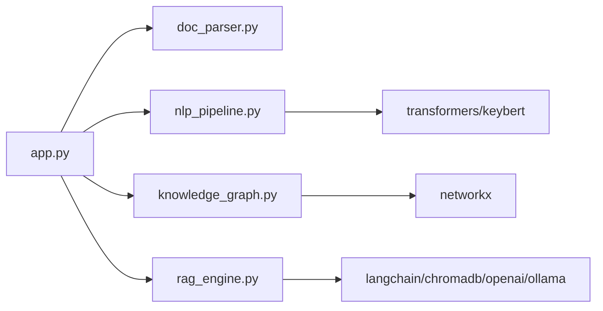

# 知识图谱API

<cite>
**本文引用的文件**
- [knowledge_graph.py](file://zhixi/src/knowledge_graph.py)
- [nlp_pipeline.py](file://zhixi/src/nlp_pipeline.py)
- [doc_parser.py](file://zhixi/src/doc_parser.py)
- [rag_engine.py](file://zhixi/src/rag_engine.py)
- [app.py](file://zhixi/src/app.py)
- [requirements.txt](file://zhixi/requirements.txt)
- [test_core.py](file://zhixi/tests/test_core.py)
</cite>

## 目录
1. [简介](#简介)
2. [项目结构](#项目结构)
3. [核心组件](#核心组件)
4. [架构总览](#架构总览)
5. [详细组件分析](#详细组件分析)
6. [依赖分析](#依赖分析)
7. [性能考虑](#性能考虑)
8. [故障排查指南](#故障排查指南)
9. [结论](#结论)
10. [附录](#附录)

## 简介
本文件为“知识图谱”模块的API文档，聚焦于 KnowledgeGraphBuilder 类的公共接口与实现细节，涵盖：
- 实体关系抽取与图结构构建
- 节点与边的操作方法
- 统计分析与可视化
- 数据结构设计与存储格式
- 与文档解析（CV层）和RAG模块的集成方式
- 实际使用示例与性能优化建议

## 项目结构
本项目采用分层架构：CV层负责文档解析，NLP层负责文本分析，知识图谱层负责实体关系抽取与图构建，RAG层负责检索增强问答。Web界面通过Streamlit整合各模块。

图表来源
- [app.py:1-492](file://zhixi/src/app.py#L1-L492)
- [doc_parser.py:1-319](file://zhixi/src/doc_parser.py#L1-L319)
- [nlp_pipeline.py:1-312](file://zhixi/src/nlp_pipeline.py#L1-L312)
- [knowledge_graph.py:1-412](file://zhixi/src/knowledge_graph.py#L1-L412)
- [rag_engine.py:1-362](file://zhixi/src/rag_engine.py#L1-L362)

章节来源
- [app.py:1-492](file://zhixi/src/app.py#L1-L492)
- [doc_parser.py:1-319](file://zhixi/src/doc_parser.py#L1-L319)
- [nlp_pipeline.py:1-312](file://zhixi/src/nlp_pipeline.py#L1-L312)
- [knowledge_graph.py:1-412](file://zhixi/src/knowledge_graph.py#L1-L412)
- [rag_engine.py:1-362](file://zhixi/src/rag_engine.py#L1-L362)

## 核心组件
- KnowledgeGraphBuilder：知识图谱构建与分析的核心类，支持批量添加实体、添加关系、从NLP结果构建、统计分析、路径查找、子图提取、可视化与序列化。
- KGStats：知识图谱统计信息的数据类，包含节点数、边数、实体类型分布、度最高节点等。
- cluster_documents：基于TF-IDF与KMeans的主题聚类工具，便于文档层面的图谱主题发现。

章节来源
- [knowledge_graph.py:27-42](file://zhixi/src/knowledge_graph.py#L27-L42)
- [knowledge_graph.py:44-378](file://zhixi/src/knowledge_graph.py#L44-L378)

## 架构总览
知识图谱模块与上游NLP模块、下游RAG模块的交互如下：

图表来源
- [app.py:322-347](file://zhixi/src/app.py#L322-L347)
- [doc_parser.py:98-144](file://zhixi/src/doc_parser.py#L98-L144)
- [nlp_pipeline.py:106-145](file://zhixi/src/nlp_pipeline.py#L106-L145)
- [knowledge_graph.py:137-151](file://zhixi/src/knowledge_graph.py#L137-L151)
- [rag_engine.py:154-191](file://zhixi/src/rag_engine.py#L154-L191)

## 详细组件分析

### KnowledgeGraphBuilder 类
- 功能概述
  - 构建有向/无向图，节点属性包括实体类型与权重，边属性包含关系标签。
  - 支持从NLP结果批量添加实体、基于文本的共现关系抽取、统计分析、路径查找、子图提取、可视化与JSON序列化/反序列化。

- 公共接口与参数说明
  - 构造函数
    - graph_type: 图类型，"directed" 或 "undirected"
  - add_entities(entities)
    - entities: 实体列表，元素为 (text, label) 或包含 text、label 属性的对象
  - add_relation(source, relation, target)
    - source/target: 源/目标实体名；relation: 关系类型字符串
  - add_relations_from_text(text, entities)
    - text: 原始文本；entities: 实体列表，用于共现关系抽取
  - build_from_nlp_result(nlp_result, text="")
    - nlp_result: NLPResult 对象；text: 原始文本，用于共现关系抽取
  - get_stats() -> KGStats
    - 返回统计信息对象
  - find_paths(source, target, max_length=5) -> list
    - 返回从 source 到 target 的简单路径列表
  - get_subgraph(center_node, hops=2) -> KnowledgeGraphBuilder
    - 返回以 center_node 为中心、跳数不超过 hops 的子图
  - visualize(output_path="data/processed/knowledge_graph.png", figsize=(12,8), max_nodes=50) -> Optional[str]
    - 可视化图谱并保存图片，返回输出路径或 None
  - save(output_path="data/processed/knowledge_graph.json")
    - 保存为 JSON（NetworkX node-link 格式）
  - load(input_path: str)
    - 从 JSON 加载图谱

- 异常处理与边界条件
  - find_paths 在节点不存在时返回空列表，避免抛出异常。
  - get_subgraph 若中心节点不存在，抛出 ValueError。
  - visualize 内部捕获异常并返回 None，同时打印错误信息。
  - add_entities 对重复实体仅去重并累加权重，避免重复节点。

- 使用示例（路径）
  - 基本用法与可视化：[knowledge_graph.py:380-412](file://zhixi/src/knowledge_graph.py#L380-L412)
  - Web界面集成：[app.py:322-347](file://zhixi/src/app.py#L322-L347)
  - 测试用例参考：[test_core.py:21-105](file://zhixi/tests/test_core.py#L21-L105)

- 数据结构与复杂度
  - 节点属性：entity_type、weight
  - 边属性：relation
  - 时间复杂度
    - add_entities: O(n)，n为实体数
    - add_relation: O(1) 平均
    - add_relations_from_text: O(n*m*s)，n为实体数，m为句子数，s为平均每句实体出现次数
    - find_paths: O(d^k)，d为平均出度，k为路径长度上限
    - get_subgraph: O(V+E)，V为节点数，E为边数
  - 空间复杂度：O(V+E)

- 可视化与统计
  - 可视化：基于 NetworkX 的 spring 布局，节点颜色按实体类型映射，节点大小按度数缩放，保存 PNG 图像。
  - 统计：统计节点数、边数、实体类型分布、度最高前10节点。

- 与NLP/RAG的集成
  - NLP集成：通过 build_from_nlp_result 接收 NLPResult，自动添加实体与基于文本的共现关系。
  - RAG集成：Web界面在“知识图谱”页构建完成后，保存图谱并触发可视化；RAG在“智能问答”页导入文档块后进行检索与问答。

章节来源
- [knowledge_graph.py:44-378](file://zhixi/src/knowledge_graph.py#L44-L378)
- [knowledge_graph.py:380-412](file://zhixi/src/knowledge_graph.py#L380-L412)
- [app.py:322-347](file://zhixi/src/app.py#L322-L347)
- [test_core.py:21-105](file://zhixi/tests/test_core.py#L21-L105)

### KGStats 数据类
- 字段
  - node_count: int
  - edge_count: int
  - entity_types: dict，实体类型到数量的映射
  - top_nodes: list，度最高的节点列表，每个元素包含节点名、度数与类型
- 方法
  - to_dict(): 转换为字典格式

章节来源
- [knowledge_graph.py:27-42](file://zhixi/src/knowledge_graph.py#L27-L42)

### cluster_documents 聚类工具
- 功能：对文档列表进行主题聚类，返回标签、主题词等。
- 参数
  - texts: 文档文本列表
  - n_clusters: 聚类数量
- 返回
  - 字典，包含 labels、n_clusters、top_words

章节来源
- [knowledge_graph.py:333-378](file://zhixi/src/knowledge_graph.py#L333-L378)

## 依赖分析
- 外部库
  - NetworkX：图结构存储与分析
  - scikit-learn：KMeans 聚类
  - matplotlib：可视化
  - numpy/pandas/seaborn：数据分析与绘图基础
- 模块间依赖
  - app.py 依赖 doc_parser、nlp_pipeline、knowledge_graph、rag_engine
  - knowledge_graph 依赖 networkx
  - nlp_pipeline 依赖 transformers、keybert、wordcloud
  - rag_engine 依赖 langchain、chromadb、openai/ollama

图表来源
- [app.py:1-492](file://zhixi/src/app.py#L1-L492)
- [knowledge_graph.py:24-24](file://zhixi/src/knowledge_graph.py#L24-L24)
- [nlp_pipeline.py:76-104](file://zhixi/src/nlp_pipeline.py#L76-L104)
- [rag_engine.py:100-152](file://zhixi/src/rag_engine.py#L100-L152)
- [requirements.txt:1-45](file://zhixi/requirements.txt#L1-L45)

章节来源
- [requirements.txt:1-45](file://zhixi/requirements.txt#L1-L45)

## 性能考虑
- 图规模过大时的可视化
  - visualize 会对节点数量进行限制，仅绘制度最高的节点子集，避免布局计算与渲染开销过大。
- 路径查找
  - find_paths 使用 NetworkX 的 all_simple_paths，并设置 cutoff 控制最大长度，避免指数爆炸。
- 文本共现关系抽取
  - add_relations_from_text 对句子进行分割并遍历实体共现，时间复杂度与句子数和实体密度相关，建议控制实体规模或采用更高效的窗口/滑动策略。
- 可视化布局
  - 使用 spring 布局，迭代次数与节点数相关，可通过调整参数平衡质量与速度。
- 存储与加载
  - 保存/加载采用 NetworkX node-link 格式，读写效率高，适合中等规模图谱。

[本节为通用性能建议，无需特定文件引用]

## 故障排查指南
- 可视化失败
  - 症状：visualize 返回 None 并打印错误信息。
  - 排查：确认 matplotlib、字体配置正常；检查输出路径权限；尝试减小 max_nodes。
- 节点不存在导致路径为空
  - 症状：find_paths 返回空列表。
  - 排查：确认 source/target 已被 add_entities/add_relation 正确添加。
- 子图提取报错
  - 症状：get_subgraph 抛出 ValueError。
  - 排查：确认 center_node 存在于图中。
- JSON保存/加载异常
  - 症状：save/load 抛出异常。
  - 排查：确认文件路径存在且可写；检查 JSON 文件格式是否被修改。

章节来源
- [knowledge_graph.py:175-194](file://zhixi/src/knowledge_graph.py#L175-L194)
- [knowledge_graph.py:195-222](file://zhixi/src/knowledge_graph.py#L195-L222)
- [knowledge_graph.py:224-313](file://zhixi/src/knowledge_graph.py#L224-L313)
- [knowledge_graph.py:314-329](file://zhixi/src/knowledge_graph.py#L314-L329)

## 结论
KnowledgeGraphBuilder 提供了从实体与关系抽取到图谱构建、分析与可视化的完整能力，结合 NLP 与 RAG 模块，形成端到端的文档智能分析与问答流程。通过合理的参数配置与性能优化，可在不同规模场景下稳定运行。

[本节为总结性内容，无需特定文件引用]

## 附录

### API 一览表
- KnowledgeGraphBuilder.__init__(graph_type="directed")
- KnowledgeGraphBuilder.add_entities(entities)
- KnowledgeGraphBuilder.add_relation(source, relation, target)
- KnowledgeGraphBuilder.add_relations_from_text(text, entities)
- KnowledgeGraphBuilder.build_from_nlp_result(nlp_result, text="")
- KnowledgeGraphBuilder.get_stats() -> KGStats
- KnowledgeGraphBuilder.find_paths(source, target, max_length=5) -> list
- KnowledgeGraphBuilder.get_subgraph(center_node, hops=2) -> KnowledgeGraphBuilder
- KnowledgeGraphBuilder.visualize(output_path, figsize, max_nodes) -> Optional[str]
- KnowledgeGraphBuilder.save(output_path)
- KnowledgeGraphBuilder.load(input_path)

章节来源
- [knowledge_graph.py:44-378](file://zhixi/src/knowledge_graph.py#L44-L378)

### 数据结构与存储格式
- 节点属性
  - entity_type: 实体类型（如 PER、ORG、LOC、DATE、MISC、UNKNOWN）
  - weight: 实体权重（重复实体累加）
- 边属性
  - relation: 关系类型（如 "develops"、"related_to" 等）
- 存储格式
  - JSON（NetworkX node-link 格式），包含 nodes、links、graph 字段

章节来源
- [knowledge_graph.py:67-107](file://zhixi/src/knowledge_graph.py#L67-L107)
- [knowledge_graph.py:314-329](file://zhixi/src/knowledge_graph.py#L314-L329)

### 与文档解析和RAG的数据集成
- 文档解析（CV层）
  - Web界面通过 DocumentParser 解析PDF并切分文本块，供RAG导入。
- NLP分析（NLP层）
  - NLPPipeline 提供实体、关键词、摘要等结果，供知识图谱构建。
- 知识图谱（KG层）
  - KnowledgeGraphBuilder 从 NLPResult 构建实体节点与关系，支持可视化与保存。
- RAG（LLM应用层）
  - RAGEngine 从 DocumentParser 的文本块导入向量库，支持检索与问答。

章节来源
- [app.py:176-347](file://zhixi/src/app.py#L176-L347)
- [doc_parser.py:98-144](file://zhixi/src/doc_parser.py#L98-L144)
- [nlp_pipeline.py:106-145](file://zhixi/src/nlp_pipeline.py#L106-L145)
- [knowledge_graph.py:137-151](file://zhixi/src/knowledge_graph.py#L137-L151)
- [rag_engine.py:154-191](file://zhixi/src/rag_engine.py#L154-L191)

### 实际使用示例（路径）
- 基本构建与可视化：[knowledge_graph.py:380-412](file://zhixi/src/knowledge_graph.py#L380-L412)
- Web界面一键构建：[app.py:322-347](file://zhixi/src/app.py#L322-L347)
- 测试用例（断言与行为验证）：[test_core.py:21-105](file://zhixi/tests/test_core.py#L21-L105)