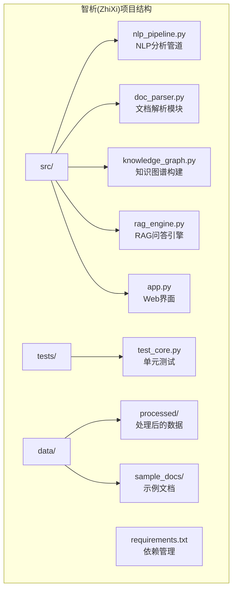
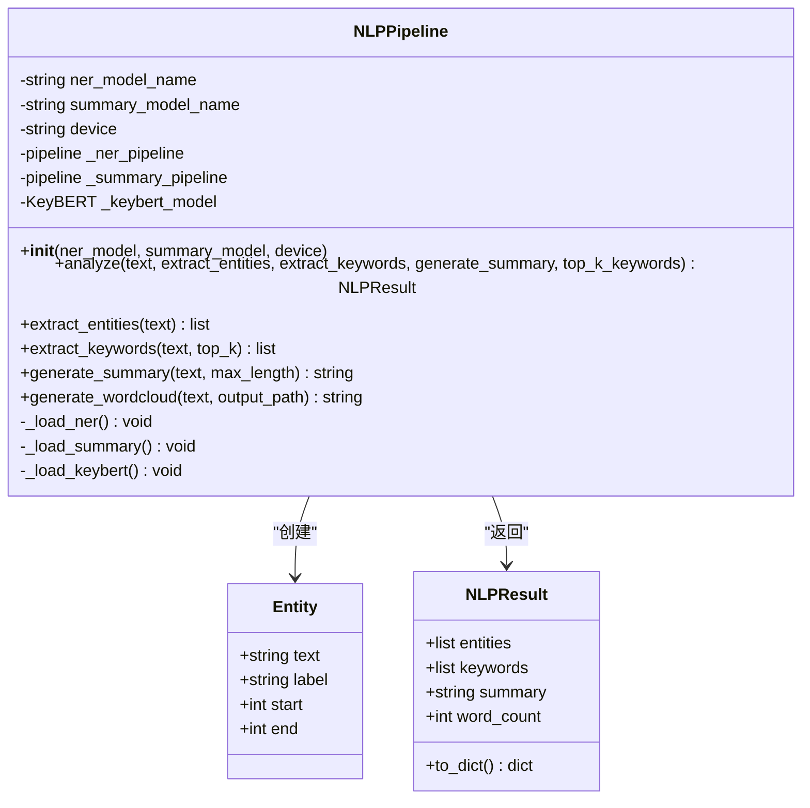
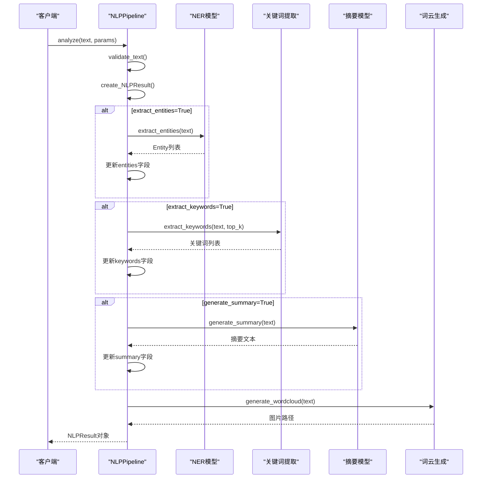
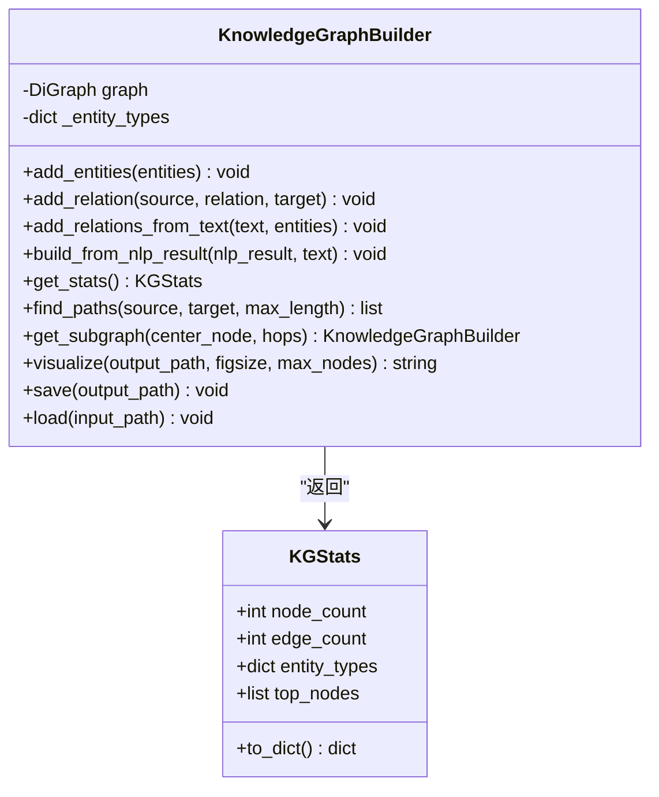
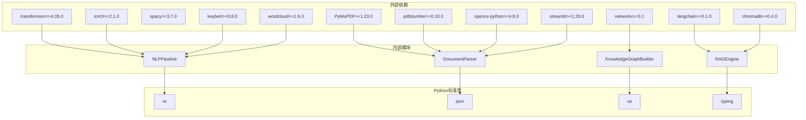
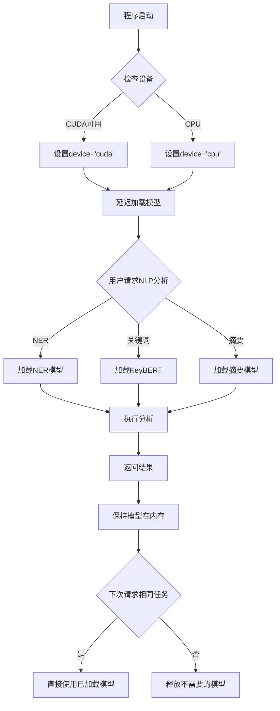
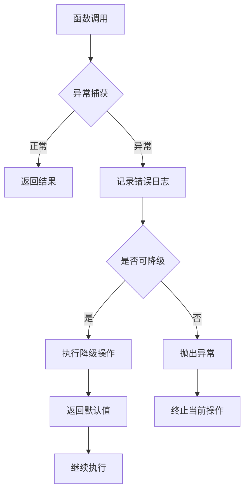

# NLP分析模块

<cite>
**本文档引用的文件**
- [nlp_pipeline.py](file://zhixi/src/nlp_pipeline.py)
- [doc_parser.py](file://zhixi/src/doc_parser.py)
- [app.py](file://zhixi/src/app.py)
- [knowledge_graph.py](file://zhixi/src/knowledge_graph.py)
- [rag_engine.py](file://zhixi/src/rag_engine.py)
- [requirements.txt](file://zhixi/requirements.txt)
- [test_core.py](file://zhixi/tests/test_core.py)
</cite>

## 目录
1. [简介](#简介)
2. [项目结构](#项目结构)
3. [核心组件](#核心组件)
4. [架构概览](#架构概览)
5. [详细组件分析](#详细组件分析)
6. [依赖关系分析](#依赖关系分析)
7. [性能考虑](#性能考虑)
8. [故障排除指南](#故障排除指南)
9. [结论](#结论)
10. [附录](#附录)

## 简介

NLP分析模块是智析(ZhiXi)多模态文档智能分析与知识问答平台的核心组件之一，专注于提供全面的自然语言处理功能。该模块集成了多种先进的NLP技术和算法，包括命名实体识别(NER)、关键词提取、自动摘要生成和词云可视化等核心功能。

本模块采用模块化设计，通过延迟加载机制优化资源使用，支持多种运行环境（CPU/GPU），并提供了完整的API接口和错误处理机制。模块与文档解析模块紧密协作，形成从文档提取到智能分析的完整工作流。

## 项目结构

智析项目采用清晰的分层架构设计，将不同功能模块分离到独立的文件中：



**图表来源**
- [nlp_pipeline.py:1-312](file://zhixi/src/nlp_pipeline.py#L1-L312)
- [doc_parser.py:1-319](file://zhixi/src/doc_parser.py#L1-L319)
- [app.py:1-492](file://zhixi/src/app.py#L1-L492)

**章节来源**
- [nlp_pipeline.py:1-312](file://zhixi/src/nlp_pipeline.py#L1-L312)
- [doc_parser.py:1-319](file://zhixi/src/doc_parser.py#L1-L319)
- [app.py:1-492](file://zhixi/src/app.py#L1-L492)

## 核心组件

NLP分析模块由四个主要组件构成，每个组件都实现了特定的NLP功能：

### 1. 命名实体识别(NER)组件
- **技术栈**: HuggingFace Transformers + BERT模型
- **功能**: 识别人名、组织、地点、日期等实体
- **特点**: 支持多语言模型，聚合策略优化实体边界

### 2. 关键词提取组件  
- **技术栈**: KeyBERT + 语义相似度
- **功能**: 基于语义的关键词/短语提取
- **特点**: 支持1-2词组合，停用词过滤，可配置返回数量

### 3. 自动摘要组件
- **技术栈**: HuggingFace Transformers + BART模型
- **功能**: 抽取式/生成式摘要生成
- **特点**: 输入长度限制，最小/最大长度控制，降级策略

### 4. 词云可视化组件
- **技术栈**: wordcloud + 正则表达式
- **功能**: 关键词可视化展示
- **特点**: 自定义颜色映射，最大词数限制，文件输出

**章节来源**
- [nlp_pipeline.py:45-263](file://zhixi/src/nlp_pipeline.py#L45-L263)

## 架构概览

NLP分析模块采用分层架构设计，实现了从底层模型加载到上层业务逻辑的完整抽象：

```mermaid
graph TB
subgraph "用户界面层"
UI[Streamlit Web界面]
end
subgraph "业务逻辑层"
AP[应用入口(app.py)]
NP[NLP管道(NLPPipeline)]
DP[文档解析(DocumentParser)]
KG[知识图谱(KnowledgeGraphBuilder)]
RAG[RAG引擎(RAGEngine)]
end
subgraph "数据访问层"
FS[文件系统]
DB[向量数据库(ChromaDB)]
end
subgraph "机器学习层"
HF[HuggingFace Transformers]
KB[KeyBERT]
WC[wordcloud]
NX[NetworkX]
end
UI --> AP
AP --> NP
AP --> DP
AP --> KG
AP --> RAG
NP --> HF
NP --> KB
NP --> WC
DP --> FS
KG --> NX
RAG --> DB
RAG --> HF
```

**图表来源**
- [app.py:240-262](file://zhixi/src/app.py#L240-L262)
- [nlp_pipeline.py:61-75](file://zhixi/src/nlp_pipeline.py#L61-L75)
- [doc_parser.py:79-88](file://zhixi/src/doc_parser.py#L79-L88)
- [rag_engine.py:69-94](file://zhixi/src/rag_engine.py#L69-L94)

## 详细组件分析

### NLPPipeline类分析

NLPPipeline是整个NLP分析模块的核心类，提供了统一的API接口和内部组件协调机制：



**图表来源**
- [nlp_pipeline.py:24-43](file://zhixi/src/nlp_pipeline.py#L24-L43)
- [nlp_pipeline.py:45-105](file://zhixi/src/nlp_pipeline.py#L45-L105)

#### NLP分析流程序列图



**图表来源**
- [nlp_pipeline.py:106-145](file://zhixi/src/nlp_pipeline.py#L106-L145)
- [nlp_pipeline.py:147-233](file://zhixi/src/nlp_pipeline.py#L147-L233)

**章节来源**
- [nlp_pipeline.py:45-263](file://zhixi/src/nlp_pipeline.py#L45-L263)

### 文档解析与NLP集成流程

NLP分析模块与文档解析模块的集成展示了完整的端到端工作流程：

```mermaid
flowchart TD
A[用户上传PDF文档] --> B[DocumentParser.parse()]
B --> C[提取文本内容]
B --> D[提取表格数据]
B --> E[提取嵌入图像]
B --> F[组装DocumentResult]
F --> G[NLPPipeline.analyze()]
G --> H[NER实体识别]
G --> I[KeyBERT关键词提取]
G --> J[BART摘要生成]
G --> K[wordcloud词云生成]
H --> L[NLPResult封装]
I --> L
J --> L
K --> L
L --> M[Streamlit界面展示]
subgraph "数据结构"
C --> F
D --> F
E --> F
F --> G
H --> L
I --> L
J --> L
K --> L
end
```

**图表来源**
- [doc_parser.py:98-144](file://zhixi/src/doc_parser.py#L98-L144)
- [nlp_pipeline.py:106-145](file://zhixi/src/nlp_pipeline.py#L106-L145)

**章节来源**
- [doc_parser.py:64-268](file://zhixi/src/doc_parser.py#L64-L268)

### 知识图谱构建组件

知识图谱模块从NLP分析结果中提取实体关系，构建结构化的知识表示：



**图表来源**
- [knowledge_graph.py:44-173](file://zhixi/src/knowledge_graph.py#L44-L173)
- [knowledge_graph.py:27-42](file://zhixi/src/knowledge_graph.py#L27-L42)

**章节来源**
- [knowledge_graph.py:44-329](file://zhixi/src/knowledge_graph.py#L44-L329)

## 依赖关系分析

NLP分析模块的依赖关系展现了清晰的层次化架构：



**图表来源**
- [requirements.txt:6-45](file://zhixi/requirements.txt#L6-L45)
- [nlp_pipeline.py:19-21](file://zhixi/src/nlp_pipeline.py#L19-L21)
- [doc_parser.py:20-30](file://zhixi/src/doc_parser.py#L20-L30)

**章节来源**
- [requirements.txt:1-45](file://zhixi/requirements.txt#L1-L45)

### 性能优化策略

NLP分析模块采用了多种性能优化策略：

1. **延迟加载机制**: 模型按需加载，减少内存占用
2. **输入长度限制**: 避免OOM错误，提高稳定性
3. **降级策略**: 模型加载失败时的回退机制
4. **批量处理**: 向量数据库的批量导入
5. **缓存机制**: 会话状态复用

**章节来源**
- [nlp_pipeline.py:71-104](file://zhixi/src/nlp_pipeline.py#L71-L104)
- [rag_engine.py:184-189](file://zhixi/src/rag_engine.py#L184-L189)

## 性能考虑

### 模型加载优化

NLP分析模块通过延迟加载机制显著减少了初始启动时间：

- **NER模型**: 首次使用时才加载，支持GPU加速
- **摘要模型**: BART模型按需加载，避免内存溢出
- **关键词模型**: KeyBERT模型延迟初始化

### 内存管理策略



**图表来源**
- [nlp_pipeline.py:61-97](file://zhixi/src/nlp_pipeline.py#L61-L97)

### 并发处理能力

模块支持多线程环境下的并发使用，通过会话状态管理避免竞态条件：

- **Streamlit会话状态**: 线程安全的状态管理
- **模型实例隔离**: 每个分析请求使用独立的模型实例
- **资源清理**: 自动释放不再使用的模型资源

## 故障排除指南

### 常见问题及解决方案

#### 1. 模型下载失败
**症状**: 首次运行时模型下载超时
**解决方案**: 
- 检查网络连接和代理设置
- 手动下载模型到本地缓存目录
- 调整下载超时参数

#### 2. 内存不足错误
**症状**: CUDA out of memory错误
**解决方案**:
- 设置`device='cpu'`参数
- 减少输入文本长度
- 降低关键词提取数量

#### 3. OCR识别失败
**症状**: 图像中文本识别不准确
**解决方案**:
- 确认PaddleOCR安装正确
- 检查图像质量
- 调整OCR参数

#### 4. 知识图谱可视化问题
**症状**: 图谱图片无法生成
**解决方案**:
- 检查matplotlib安装
- 确认输出目录权限
- 减少节点数量以避免渲染问题

**章节来源**
- [nlp_pipeline.py:173-175](file://zhixi/src/nlp_pipeline.py#L173-L175)
- [doc_parser.py:198-202](file://zhixi/src/doc_parser.py#L198-L202)

### 错误处理机制

NLP分析模块实现了完善的错误处理机制：



**图表来源**
- [nlp_pipeline.py:173-175](file://zhixi/src/nlp_pipeline.py#L173-L175)
- [nlp_pipeline.py:230-233](file://zhixi/src/nlp_pipeline.py#L230-L233)

**章节来源**
- [nlp_pipeline.py:173-233](file://zhixi/src/nlp_pipeline.py#L173-L233)

## 结论

NLP分析模块通过精心设计的架构和优化策略，成功地将多种先进的NLP技术整合到一个统一的平台中。模块具有以下优势：

1. **模块化设计**: 清晰的功能分离和职责划分
2. **性能优化**: 延迟加载、内存管理和并发处理
3. **稳定性保障**: 完善的错误处理和降级策略
4. **扩展性强**: 易于添加新的NLP功能和技术栈
5. **用户体验**: 友好的Web界面和直观的操作流程

该模块为智析平台提供了强大的文本分析能力，支持从简单的关键词提取到复杂的知识图谱构建等多种应用场景。通过持续的优化和改进，该模块将继续为用户提供高质量的NLP服务。

## 附录

### API接口文档

#### NLPPipeline类

**构造函数**
```python
NLPPipeline(
    ner_model: str = "dslim/bert-base-NER",
    summary_model: str = "facebook/bart-large-cnn", 
    device: Optional[str] = None
)
```

**方法**
- `analyze(text, extract_entities=True, extract_keywords=True, generate_summary=True, top_k_keywords=10)`: 主要分析接口
- `extract_entities(text)`: 命名实体识别
- `extract_keywords(text, top_k=10)`: 关键词提取
- `generate_summary(text, max_length=150)`: 摘要生成
- `generate_wordcloud(text, output_path="data/processed/wordcloud.png")`: 词云生成

**数据结构**
- `Entity`: 命名实体数据类
- `NLPResult`: 分析结果数据类

**章节来源**
- [nlp_pipeline.py:61-145](file://zhixi/src/nlp_pipeline.py#L61-L145)

### 测试覆盖范围

模块包含完整的单元测试，覆盖核心功能的各个方面：

- **知识图谱模块测试**: 实体添加、关系构建、路径查找、序列化
- **文档解析模块测试**: 文本切块逻辑验证
- **NLP管道测试**: 数据结构验证
- **RAG引擎测试**: 数据结构验证

**章节来源**
- [test_core.py:18-163](file://zhixi/tests/test_core.py#L18-L163)