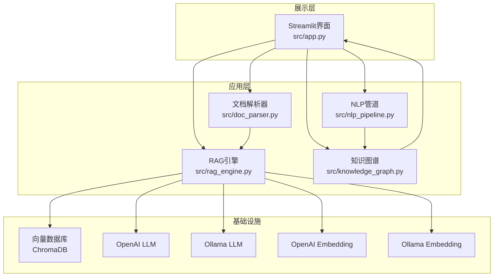
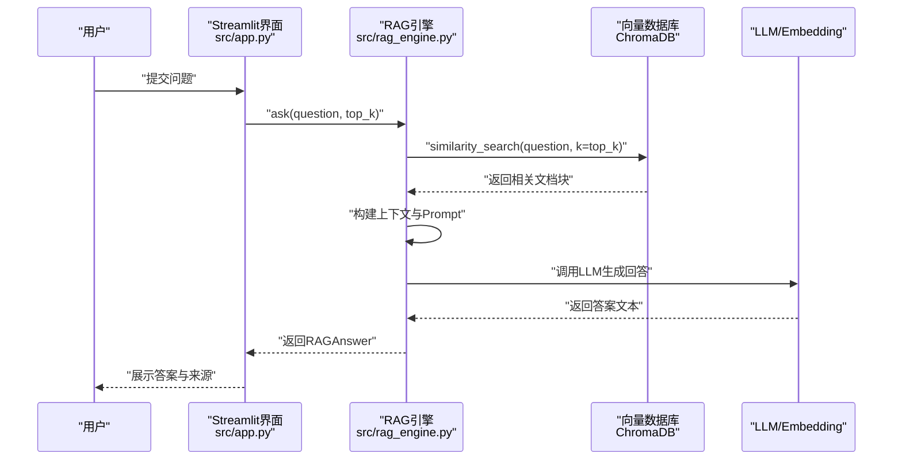
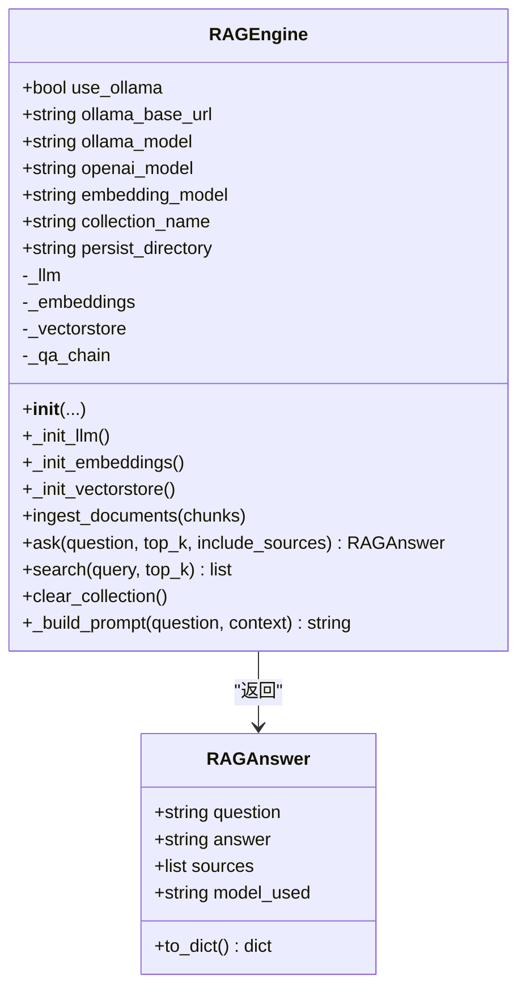
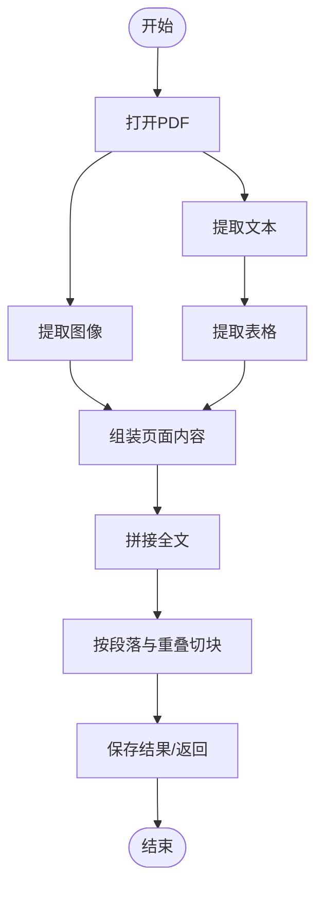
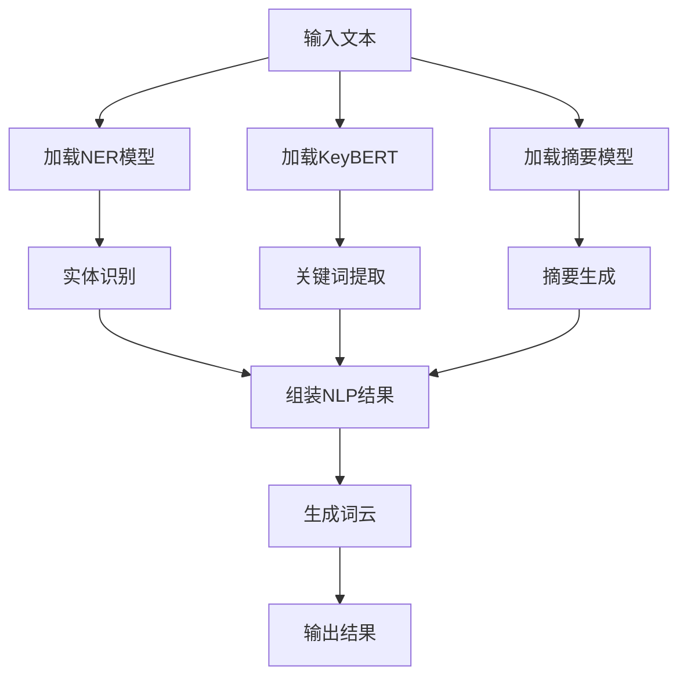
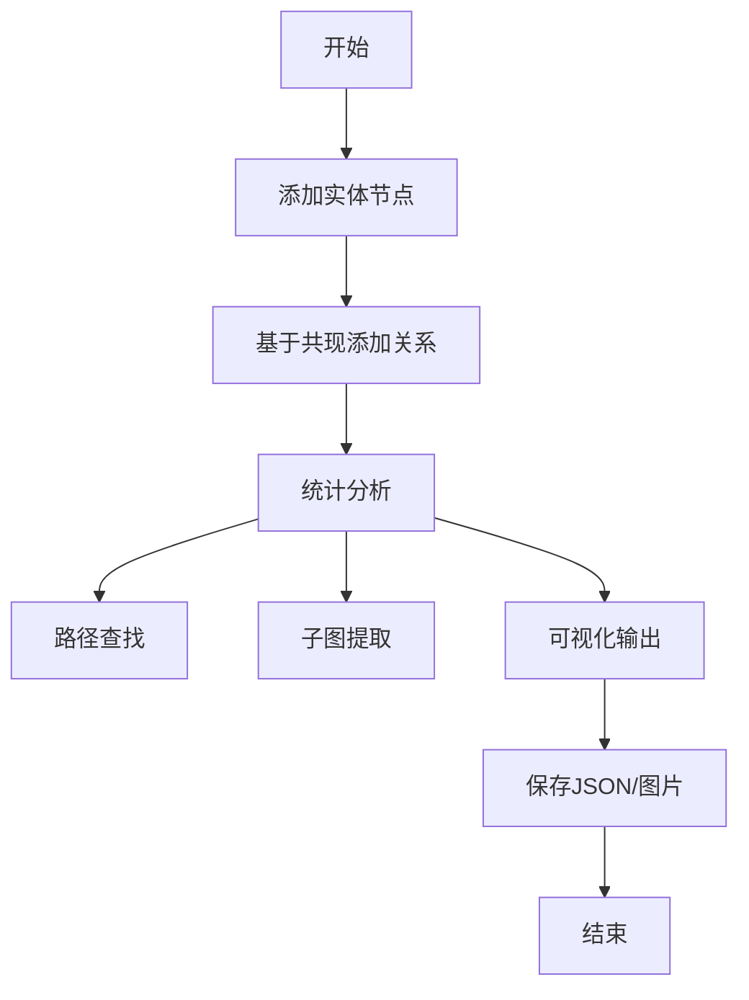
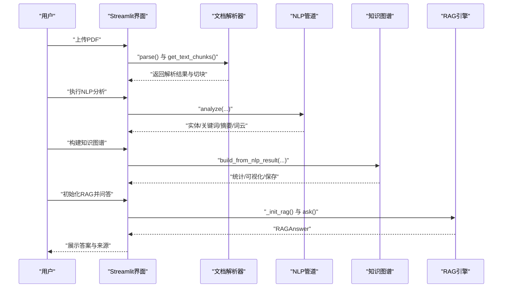
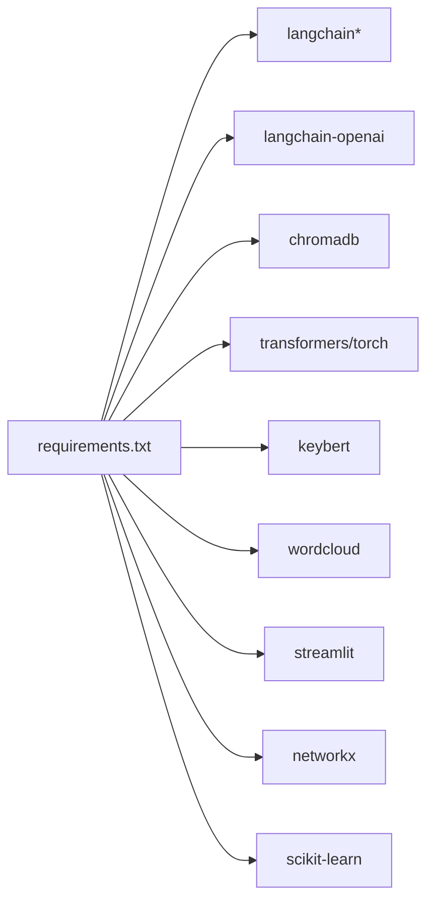

# RAG问答引擎

<cite>
**本文引用的文件**
- [rag_engine.py](file://src/rag_engine.py)
- [app.py](file://src/app.py)
- [doc_parser.py](file://src/doc_parser.py)
- [nlp_pipeline.py](file://src/nlp_pipeline.py)
- [knowledge_graph.py](file://src/knowledge_graph.py)
- [requirements.txt](file://requirements.txt)
- [test_core.py](file://tests/test_core.py)
</cite>

## 目录
1. [简介](#简介)
2. [项目结构](#项目结构)
3. [核心组件](#核心组件)
4. [架构总览](#架构总览)
5. [详细组件分析](#详细组件分析)
6. [依赖分析](#依赖分析)
7. [性能考虑](#性能考虑)
8. [故障排除指南](#故障排除指南)
9. [结论](#结论)
10. [附录](#附录)

## 简介
本项目是一个基于检索增强生成（RAG）的智能问答系统，结合文档解析、向量检索与大语言模型生成，提供从PDF文档到问答的完整工作流。系统支持两种运行模式：
- OpenAI API模式：使用云端GPT系列模型，适合高质量回答与稳定性需求。
- 本地Ollama模式：使用本地开源模型，零API成本，适合隐私与离线场景。

技术栈涵盖：
- LangChain：LLM应用编排与链式调用
- ChromaDB：嵌入式向量数据库，支持相似性检索
- Streamlit：Web交互界面
- Transformers/KeyBERT：NLP分析（实体识别、关键词提取、摘要）
- NetworkX：知识图谱构建与可视化

## 项目结构
项目采用“分层+功能模块”组织方式，核心模块如下：
- 数据采集与解析层：PDF文本/表格/图像提取与文本切块
- NLP分析层：命名实体识别、关键词提取、摘要生成、词云
- 知识图谱层：实体关系抽取与图谱可视化
- RAG应用层：文档嵌入、向量检索、上下文构建、答案生成
- 展示层：Streamlit Web界面

图表来源
- [app.py:463-492](file://src/app.py#L463-L492)
- [rag_engine.py:47-362](file://src/rag_engine.py#L47-L362)
- [doc_parser.py:64-319](file://src/doc_parser.py#L64-L319)
- [nlp_pipeline.py:45-312](file://src/nlp_pipeline.py#L45-L312)
- [knowledge_graph.py:44-412](file://src/knowledge_graph.py#L44-L412)

章节来源
- [requirements.txt:1-45](file://requirements.txt#L1-L45)
- [app.py:1-492](file://src/app.py#L1-L492)

## 核心组件
- RAG引擎：封装LLM初始化、Embedding初始化、向量数据库初始化、文档导入、问答流程与检索接口。
- 文档解析器：从PDF提取文本、表格、图像，支持文本切块用于RAG。
- NLP管道：NER、关键词提取、摘要生成、词云。
- 知识图谱：实体节点与关系构建、统计分析、可视化。
- Web界面：Streamlit页面，支持OpenAI/Ollama模式切换、参数调节、RAG问答。

章节来源
- [rag_engine.py:47-362](file://src/rag_engine.py#L47-L362)
- [doc_parser.py:64-319](file://src/doc_parser.py#L64-L319)
- [nlp_pipeline.py:45-312](file://src/nlp_pipeline.py#L45-L312)
- [knowledge_graph.py:44-412](file://src/knowledge_graph.py#L44-L412)
- [app.py:78-492](file://src/app.py#L78-L492)

## 架构总览
RAG问答的整体流程：
1. 文档解析与切块：PDF → 文本/表格/图像 → 文本切块
2. 向量嵌入与入库：文本块 → Embedding → ChromaDB
3. 查询检索：用户问题 → 相似性检索 → 上下文拼接
4. Prompt构建与生成：上下文 + 指令 → LLM生成回答
5. 结果返回：答案 + 来源元数据

图表来源
- [app.py:448-461](file://src/app.py#L448-L461)
- [rag_engine.py:192-263](file://src/rag_engine.py#L192-L263)
- [rag_engine.py:282-303](file://src/rag_engine.py#L282-L303)

## 详细组件分析

### RAG引擎（src/rag_engine.py）
职责与流程：
- 模型初始化：根据use_ollama选择Ollama或OpenAI，延迟加载LLM与Embedding
- 向量数据库：初始化ChromaDB，设置集合名与持久化目录
- 文档导入：批量写入文档块，支持分批导入
- 问答流程：检索→上下文构建→Prompt→LLM生成→结果封装
- 辅助接口：search仅检索，clear_collection清空集合

关键特性：
- 模式切换：通过use_ollama控制运行模式，环境变量优先级
- 温度控制：统一temperature=0.1提升确定性
- 错误兜底：LLM调用异常时返回错误提示
- 结果封装：RAGAnswer统一输出结构

图表来源
- [rag_engine.py:30-45](file://src/rag_engine.py#L30-L45)
- [rag_engine.py:47-362](file://src/rag_engine.py#L47-L362)

章节来源
- [rag_engine.py:69-153](file://src/rag_engine.py#L69-L153)
- [rag_engine.py:154-191](file://src/rag_engine.py#L154-L191)
- [rag_engine.py:192-263](file://src/rag_engine.py#L192-L263)
- [rag_engine.py:265-281](file://src/rag_engine.py#L265-L281)
- [rag_engine.py:282-303](file://src/rag_engine.py#L282-L303)
- [rag_engine.py:305-312](file://src/rag_engine.py#L305-L312)
- [rag_engine.py:316-344](file://src/rag_engine.py#L316-L344)

### 文档解析器（src/doc_parser.py）
职责与流程：
- PDF解析：使用PyMuPDF提取文本与图像，pdfplumber提取表格
- 文本切块：按段落与重叠策略切分为RAG可用的文本块，携带页码与chunk_id
- 结果保存：DocumentResult可序列化为JSON

图表来源
- [doc_parser.py:98-144](file://src/doc_parser.py#L98-L144)
- [doc_parser.py:146-211](file://src/doc_parser.py#L146-L211)
- [doc_parser.py:178-203](file://src/doc_parser.py#L178-L203)
- [doc_parser.py:212-268](file://src/doc_parser.py#L212-L268)

章节来源
- [doc_parser.py:64-144](file://src/doc_parser.py#L64-L144)
- [doc_parser.py:146-211](file://src/doc_parser.py#L146-L211)
- [doc_parser.py:212-268](file://src/doc_parser.py#L212-L268)

### NLP管道（src/nlp_pipeline.py）
职责与流程：
- NER：基于Transformers的多语言模型，识别PER/ORG/LOC等实体
- 关键词：KeyBERT语义关键词提取
- 摘要：BART抽取式摘要，带长度控制与降级
- 词云：清洗后生成词云图片

图表来源
- [nlp_pipeline.py:106-145](file://src/nlp_pipeline.py#L106-L145)
- [nlp_pipeline.py:147-176](file://src/nlp_pipeline.py#L147-L176)
- [nlp_pipeline.py:177-204](file://src/nlp_pipeline.py#L177-L204)
- [nlp_pipeline.py:205-234](file://src/nlp_pipeline.py#L205-L234)
- [nlp_pipeline.py:235-262](file://src/nlp_pipeline.py#L235-L262)

章节来源
- [nlp_pipeline.py:45-145](file://src/nlp_pipeline.py#L45-L145)
- [nlp_pipeline.py:147-262](file://src/nlp_pipeline.py#L147-L262)

### 知识图谱（src/knowledge_graph.py）
职责与流程：
- 实体节点：去重与权重累积
- 关系抽取：基于共现（同一句子内实体）建立“related_to”关系
- 统计分析：节点/边数、实体类型分布、度中心性排序
- 可视化：Spring布局，按实体类型着色，保存图片
- 序列化：保存/加载图谱JSON

图表来源
- [knowledge_graph.py:67-108](file://src/knowledge_graph.py#L67-L108)
- [knowledge_graph.py:109-151](file://src/knowledge_graph.py#L109-L151)
- [knowledge_graph.py:152-174](file://src/knowledge_graph.py#L152-L174)
- [knowledge_graph.py:175-223](file://src/knowledge_graph.py#L175-L223)
- [knowledge_graph.py:224-329](file://src/knowledge_graph.py#L224-L329)

章节来源
- [knowledge_graph.py:44-174](file://src/knowledge_graph.py#L44-L174)
- [knowledge_graph.py:175-329](file://src/knowledge_graph.py#L175-L329)

### Web界面（src/app.py）
职责与流程：
- 侧边栏配置：OpenAI API Key与模型选择，或Ollama地址与模型
- 文档解析：上传PDF → 解析 → 文本切块
- NLP分析：NER/关键词/摘要/词云
- 知识图谱：基于NLP结果构建与可视化
- RAG问答：初始化引擎 → 导入文档 → 问答对话

图表来源
- [app.py:176-195](file://src/app.py#L176-L195)
- [app.py:240-262](file://src/app.py#L240-L262)
- [app.py:322-347](file://src/app.py#L322-L347)
- [app.py:423-461](file://src/app.py#L423-L461)

章节来源
- [app.py:78-132](file://src/app.py#L78-L132)
- [app.py:176-347](file://src/app.py#L176-L347)
- [app.py:370-461](file://src/app.py#L370-L461)

## 依赖分析
- Python包管理：requirements.txt集中声明了数据科学、文档解析、NLP、RAG、知识图谱、Web界面与工具依赖
- LangChain生态：langchain、langchain-community、langchain-openai、chromadb
- 模型与嵌入：OpenAI API与Ollama双通道，Embedding随模式切换
- 可视化与分析：NetworkX、Matplotlib、Scikit-learn

图表来源
- [requirements.txt:6-45](file://requirements.txt#L6-L45)

章节来源
- [requirements.txt:1-45](file://requirements.txt#L1-L45)

## 性能考虑
- 向量检索优化
  - top_k参数控制召回规模，平衡速度与质量
  - ChromaDB集合名与持久化目录合理规划，避免跨项目冲突
- 文档导入批处理
  - 批量写入减少I/O次数，提高导入效率
- LLM调用优化
  - OpenAI模式：合理设置温度与模型，避免高成本
  - Ollama模式：本地部署，零API成本，注意显存与CPU占用
- 缓存与复用
  - 向量数据库持久化，避免重复导入
  - Streamlit会话状态缓存解析结果与NLP结果
- 并发与资源
  - NLP模型按需加载，降低内存占用
  - 知识图谱可视化限制节点数量，避免渲染开销过大

## 故障排除指南
常见问题与定位要点：
- OpenAI API Key缺失
  - 现象：初始化OpenAI LLM报错或调用失败
  - 排查：确认环境变量OPENAI_API_KEY是否设置
- Ollama连接失败
  - 现象：Ollama初始化失败或超时
  - 排查：确认Ollama服务地址与端口可达，模型名称正确
- ChromaDB导入异常
  - 现象：导入文档块时报错或无响应
  - 排查：检查persist_directory权限与磁盘空间，确认集合名唯一
- LLM调用异常
  - 现象：ask返回错误提示
  - 排查：检查网络连通性（OpenAI），或本地模型加载情况（Ollama）
- NLP模型首次加载慢
  - 现象：首次执行NER/摘要/关键词提取耗时较长
  - 排查：确保已安装对应依赖，等待模型下载与初始化
- 知识图谱可视化失败
  - 现象：保存图片失败或空白图
  - 排查：确认matplotlib字体配置与输出路径权限

章节来源
- [rag_engine.py:95-116](file://src/rag_engine.py#L95-L116)
- [rag_engine.py:117-136](file://src/rag_engine.py#L117-L136)
- [rag_engine.py:137-152](file://src/rag_engine.py#L137-L152)
- [app.py:83-118](file://src/app.py#L83-L118)

## 结论
本项目以清晰的分层架构实现了从文档解析到RAG问答的完整链路，具备良好的扩展性与可维护性。通过LangChain与ChromaDB的组合，系统在准确性与性能之间取得平衡；通过OpenAI与Ollama双模式支持，满足不同部署与成本诉求。配合Streamlit界面，用户可快速完成文档解析、NLP分析、知识图谱构建与智能问答。

## 附录
- 快速开始
  - 安装依赖：pip install -r requirements.txt
  - 启动Web界面：streamlit run src/app.py
  - 在侧边栏选择运行模式与参数，上传PDF并执行各模块功能
- 测试
  - 运行单元测试：python -m pytest tests/ -v
  - 测试覆盖：知识图谱、文档解析、NLP结果结构、RAG结果结构

章节来源
- [requirements.txt:1-45](file://requirements.txt#L1-L45)
- [test_core.py:1-168](file://tests/test_core.py#L1-L168)