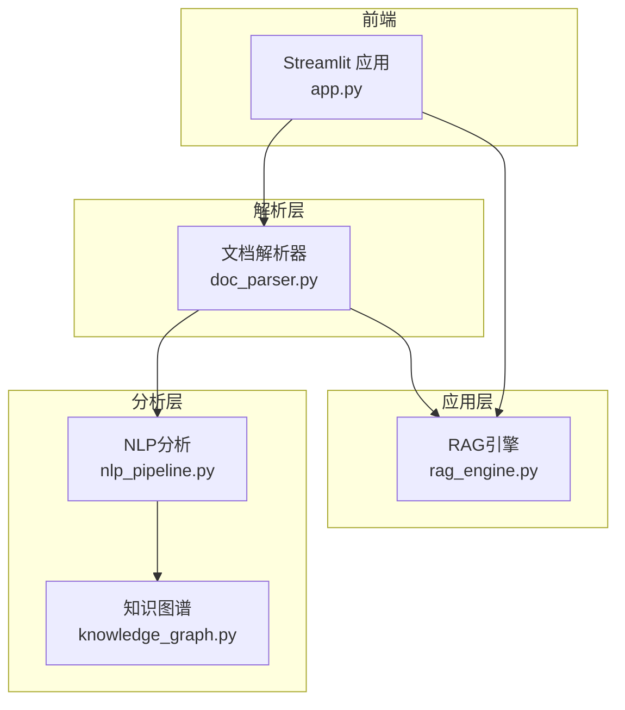
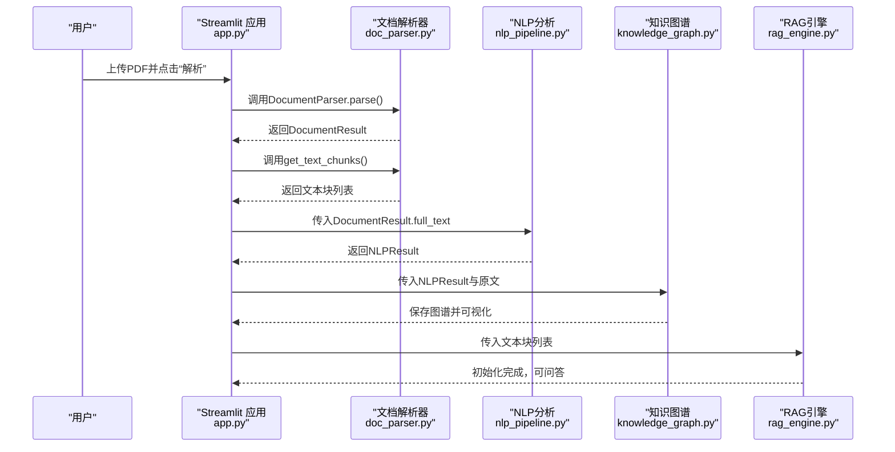
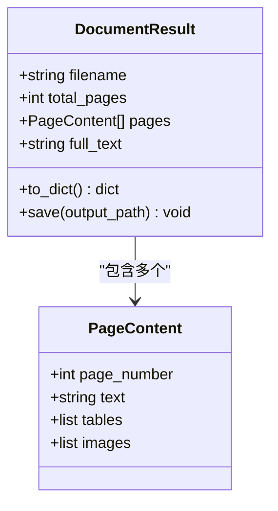
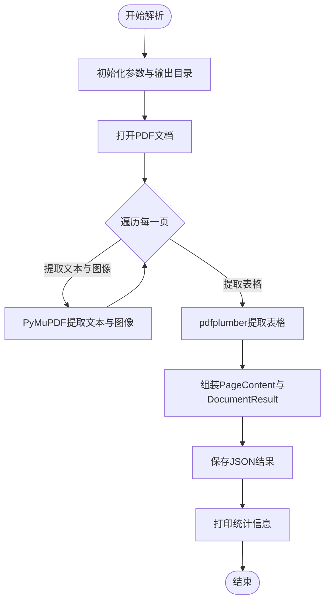
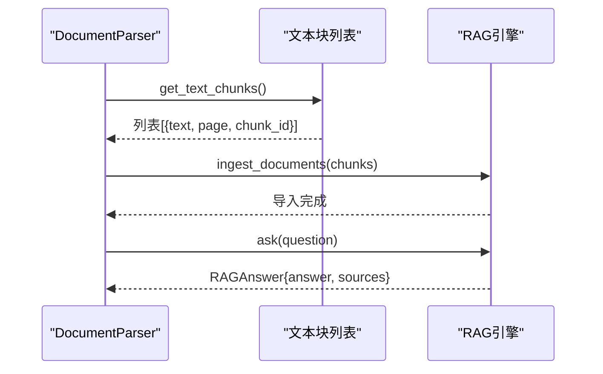
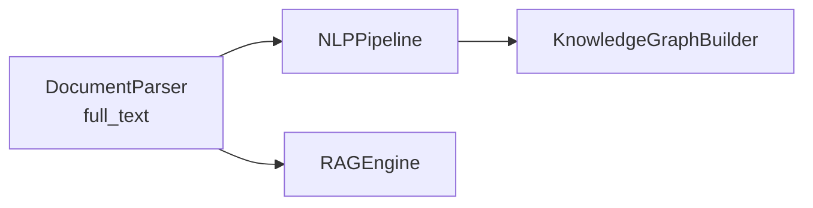
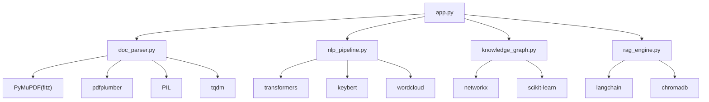

# 文档解析模块

<cite>
**本文引用的文件**
- [doc_parser.py](file://zhixi/src/doc_parser.py)
- [app.py](file://zhixi/src/app.py)
- [nlp_pipeline.py](file://zhixi/src/nlp_pipeline.py)
- [knowledge_graph.py](file://zhixi/src/knowledge_graph.py)
- [rag_engine.py](file://zhixi/src/rag_engine.py)
</cite>

## 目录
1. [简介](#简介)
2. [项目结构](#项目结构)
3. [核心组件](#核心组件)
4. [架构总览](#架构总览)
5. [详细组件分析](#详细组件分析)
6. [依赖分析](#依赖分析)
7. [性能考虑](#性能考虑)
8. [故障排查指南](#故障排查指南)
9. [结论](#结论)
10. [附录](#附录)

## 简介
文档解析模块负责从PDF文档中提取文本、表格和嵌入图像，并提供文本切分、结果持久化以及与NLP、知识图谱、RAG引擎的集成能力。该模块采用多技术栈协同：PyMuPDF用于文本与图像提取，pdfplumber用于表格提取，PIL/OpenCV用于图像处理（如需），并在表格提取失败时提供降级策略。

## 项目结构
模块位于 zhixi/src 下，核心文件如下：
- doc_parser.py：文档解析器实现，包含数据结构、解析流程与便捷函数
- app.py：Streamlit前端应用，调用解析器并将结果传递给后续模块
- nlp_pipeline.py：NLP分析模块，消费解析器输出的全文进行实体识别、关键词提取、摘要生成与词云
- knowledge_graph.py：知识图谱模块，消费NLP结果构建图谱并可视化
- rag_engine.py：RAG问答引擎，消费解析器的文本切块进行检索增强生成

图表来源
- [app.py:176-195](file://zhixi/src/app.py#L176-L195)
- [doc_parser.py:98-144](file://zhixi/src/doc_parser.py#L98-L144)
- [nlp_pipeline.py:106-145](file://zhixi/src/nlp_pipeline.py#L106-L145)
- [knowledge_graph.py:137-151](file://zhixi/src/knowledge_graph.py#L137-L151)
- [rag_engine.py:154-191](file://zhixi/src/rag_engine.py#L154-L191)

章节来源
- [doc_parser.py:12-18](file://zhixi/src/doc_parser.py#L12-L18)
- [app.py:176-195](file://zhixi/src/app.py#L176-L195)

## 核心组件
- 数据结构
  - PageContent：单页解析结果，包含页码、文本、表格列表、图像路径列表
  - DocumentResult：整篇文档解析结果，包含文件名、总页数、每页内容、全文
- 解析器
  - DocumentParser：封装PDF解析全流程，支持图像提取、表格提取、结果组装与持久化
- 便捷函数
  - parse_pdf：一键解析并可选保存JSON结果
  - get_text_chunks：将全文切分为重叠文本块，便于RAG

章节来源
- [doc_parser.py:32-62](file://zhixi/src/doc_parser.py#L32-L62)
- [doc_parser.py:64-144](file://zhixi/src/doc_parser.py#L64-L144)
- [doc_parser.py:273-299](file://zhixi/src/doc_parser.py#L273-L299)
- [doc_parser.py:212-268](file://zhixi/src/doc_parser.py#L212-L268)

## 架构总览
文档解析模块在整体系统中的位置与交互如下：

图表来源
- [app.py:176-195](file://zhixi/src/app.py#L176-L195)
- [doc_parser.py:98-144](file://zhixi/src/doc_parser.py#L98-L144)
- [doc_parser.py:212-268](file://zhixi/src/doc_parser.py#L212-L268)
- [nlp_pipeline.py:106-145](file://zhixi/src/nlp_pipeline.py#L106-L145)
- [knowledge_graph.py:137-151](file://zhixi/src/knowledge_graph.py#L137-L151)
- [rag_engine.py:154-191](file://zhixi/src/rag_engine.py#L154-L191)

## 详细组件分析

### 数据结构设计
- PageContent
  - 字段：page_number（整型）、text（字符串）、tables（列表）、images（列表）
  - 用途：承载单页解析结果，便于后续聚合
- DocumentResult
  - 字段：filename（字符串）、total_pages（整型）、pages（列表，元素为PageContent）、full_text（字符串）
  - 方法：to_dict（序列化为字典）、save（保存为JSON）
  - 用途：承载整篇文档解析结果，统一输出格式

图表来源
- [doc_parser.py:32-62](file://zhixi/src/doc_parser.py#L32-L62)

章节来源
- [doc_parser.py:32-62](file://zhixi/src/doc_parser.py#L32-L62)

### 解析流程详解
- 初始化配置
  - 接收PDF路径、输出目录、是否提取图像等参数
  - 创建文档专属输出目录与图像子目录
- 页面遍历与内容提取
  - 使用PyMuPDF逐页提取文本与图像元数据，必要时将图像写入磁盘
  - 使用pdfplumber逐页提取表格，异常时返回空表格列表作为降级
- 结果组装
  - 按页构造PageContent，拼接全文
  - 生成DocumentResult并打印统计信息
- 持久化存储
  - 将DocumentResult保存为JSON文件

图表来源
- [doc_parser.py:98-144](file://zhixi/src/doc_parser.py#L98-L144)
- [doc_parser.py:146-176](file://zhixi/src/doc_parser.py#L146-L176)
- [doc_parser.py:178-203](file://zhixi/src/doc_parser.py#L178-L203)

章节来源
- [doc_parser.py:79-97](file://zhixi/src/doc_parser.py#L79-L97)
- [doc_parser.py:98-144](file://zhixi/src/doc_parser.py#L98-L144)
- [doc_parser.py:146-176](file://zhixi/src/doc_parser.py#L146-L176)
- [doc_parser.py:178-203](file://zhixi/src/doc_parser.py#L178-L203)

### OCR降级方案说明
- 当前实现未直接调用OCR（如PaddleOCR）或OpenCV进行图像预处理
- 若表格提取失败，模块通过捕获异常并返回空表格列表作为降级
- 如需引入OCR，可在表格提取失败后对页面图像进行OCR识别，并将识别结果作为表格数据补充

章节来源
- [doc_parser.py:198-203](file://zhixi/src/doc_parser.py#L198-L203)

### 文本切分与RAG集成
- get_text_chunks
  - 将全文按段落切分，支持设定块大小与重叠
  - 输出包含文本、页码、块ID的结构化切块，供RAG导入
- RAG引擎
  - 接收切块列表，构建向量数据库，支持OpenAI与Ollama两种模式
  - 提供问答与检索接口

图表来源
- [doc_parser.py:212-268](file://zhixi/src/doc_parser.py#L212-L268)
- [rag_engine.py:154-191](file://zhixi/src/rag_engine.py#L154-L191)
- [rag_engine.py:192-263](file://zhixi/src/rag_engine.py#L192-L263)

章节来源
- [doc_parser.py:212-268](file://zhixi/src/doc_parser.py#L212-L268)
- [rag_engine.py:154-191](file://zhixi/src/rag_engine.py#L154-L191)
- [rag_engine.py:192-263](file://zhixi/src/rag_engine.py#L192-L263)

### 与NLP、知识图谱的衔接
- NLP分析
  - 从前端或解析器获取全文，执行实体识别、关键词提取、摘要生成与词云
- 知识图谱
  - 基于NLP结果构建实体节点与共现关系，支持统计、路径查找与可视化

图表来源
- [app.py:240-261](file://zhixi/src/app.py#L240-L261)
- [nlp_pipeline.py:106-145](file://zhixi/src/nlp_pipeline.py#L106-L145)
- [knowledge_graph.py:137-151](file://zhixi/src/knowledge_graph.py#L137-L151)

章节来源
- [app.py:240-261](file://zhixi/src/app.py#L240-L261)
- [nlp_pipeline.py:106-145](file://zhixi/src/nlp_pipeline.py#L106-L145)
- [knowledge_graph.py:137-151](file://zhixi/src/knowledge_graph.py#L137-L151)

## 依赖分析
- 内部模块耦合
  - app.py 依赖 doc_parser.py 进行解析与文本切分
  - nlp_pipeline.py 依赖 doc_parser.py 的 full_text 进行分析
  - knowledge_graph.py 依赖 nlp_pipeline.py 的 NLPResult
  - rag_engine.py 依赖 doc_parser.py 的文本切块
- 外部依赖
  - PyMuPDF（fitz）：文本与图像提取
  - pdfplumber：表格提取
  - PIL：图像写入
  - tqdm：进度显示
  - json/pathlib：结果序列化与路径管理

图表来源
- [doc_parser.py:26-29](file://zhixi/src/doc_parser.py#L26-L29)
- [nlp_pipeline.py:79-104](file://zhixi/src/nlp_pipeline.py#L79-L104)
- [knowledge_graph.py:24](file://zhixi/src/knowledge_graph.py#L24)
- [rag_engine.py:100-135](file://zhixi/src/rag_engine.py#L100-L135)

章节来源
- [doc_parser.py:26-29](file://zhixi/src/doc_parser.py#L26-L29)
- [nlp_pipeline.py:79-104](file://zhixi/src/nlp_pipeline.py#L79-L104)
- [knowledge_graph.py:24](file://zhixi/src/knowledge_graph.py#L24)
- [rag_engine.py:100-135](file://zhixi/src/rag_engine.py#L100-L135)

## 性能考虑
- 并行与进度
  - 使用tqdm显示进度，提升用户体验
- I/O优化
  - 图像写盘按页进行，避免一次性占用过多磁盘I/O
- 表格提取降级
  - 异常捕获后返回空表格列表，保证流程稳定
- 文本切分策略
  - 按段落优先切分，再按阈值合并，减少碎片化
- 向量数据库批处理
  - RAG导入采用批量写入，降低写库开销

章节来源
- [doc_parser.py:152-176](file://zhixi/src/doc_parser.py#L152-L176)
- [doc_parser.py:198-203](file://zhixi/src/doc_parser.py#L198-L203)
- [doc_parser.py:236-268](file://zhixi/src/doc_parser.py#L236-L268)
- [rag_engine.py:184-189](file://zhixi/src/rag_engine.py#L184-L189)

## 故障排查指南
- 文件不存在
  - 现象：抛出文件未找到异常
  - 处理：确认PDF路径正确
- 表格提取异常
  - 现象：打印错误信息并返回空表格列表
  - 处理：检查PDF表格结构，必要时手动标注表格区域
- NLP模型首次加载慢
  - 现象：首次运行下载模型耗时较长
  - 处理：提前离线准备模型缓存
- RAG问答无结果
  - 现象：返回“未找到相关信息”
  - 处理：确认已成功导入文档块；调整top_k；检查模型可用性

章节来源
- [doc_parser.py:89-91](file://zhixi/src/doc_parser.py#L89-L91)
- [doc_parser.py:198-203](file://zhixi/src/doc_parser.py#L198-L203)
- [nlp_pipeline.py:76-98](file://zhixi/src/nlp_pipeline.py#L76-L98)
- [rag_engine.py:217-223](file://zhixi/src/rag_engine.py#L217-L223)

## 结论
文档解析模块以清晰的数据结构与稳健的流程设计为核心，结合PyMuPDF与pdfplumber实现了文本、表格与图像的高效提取，并提供了文本切分与结果持久化能力。通过与NLP、知识图谱、RAG引擎的无缝衔接，形成从解析到智能问答的完整链路。未来可扩展OCR降级方案与更精细的表格结构识别，进一步提升鲁棒性与准确性。

## 附录

### 使用示例
- 基础解析
  - 通过 DocumentParser 解析PDF，获取 DocumentResult
  - 可选保存为JSON
- 文本切分
  - 调用 get_text_chunks 设置块大小与重叠，得到适合RAG的切块列表
- 批量处理
  - 在应用层循环处理多个PDF，统一调用解析器与后续模块

章节来源
- [doc_parser.py:273-299](file://zhixi/src/doc_parser.py#L273-L299)
- [doc_parser.py:212-268](file://zhixi/src/doc_parser.py#L212-L268)
- [app.py:176-195](file://zhixi/src/app.py#L176-L195)