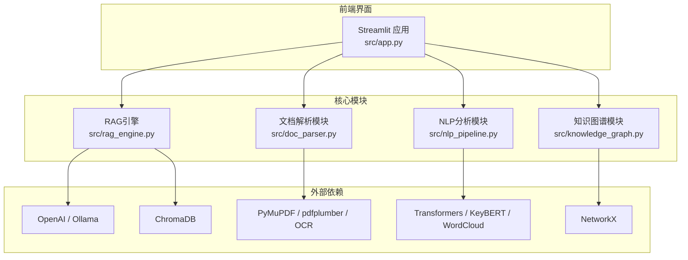
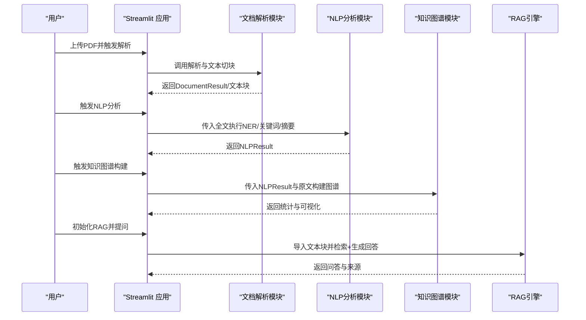
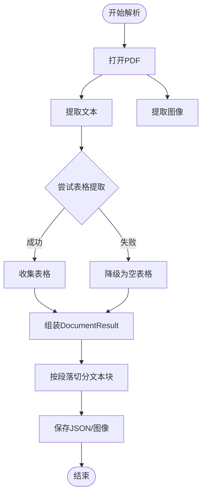
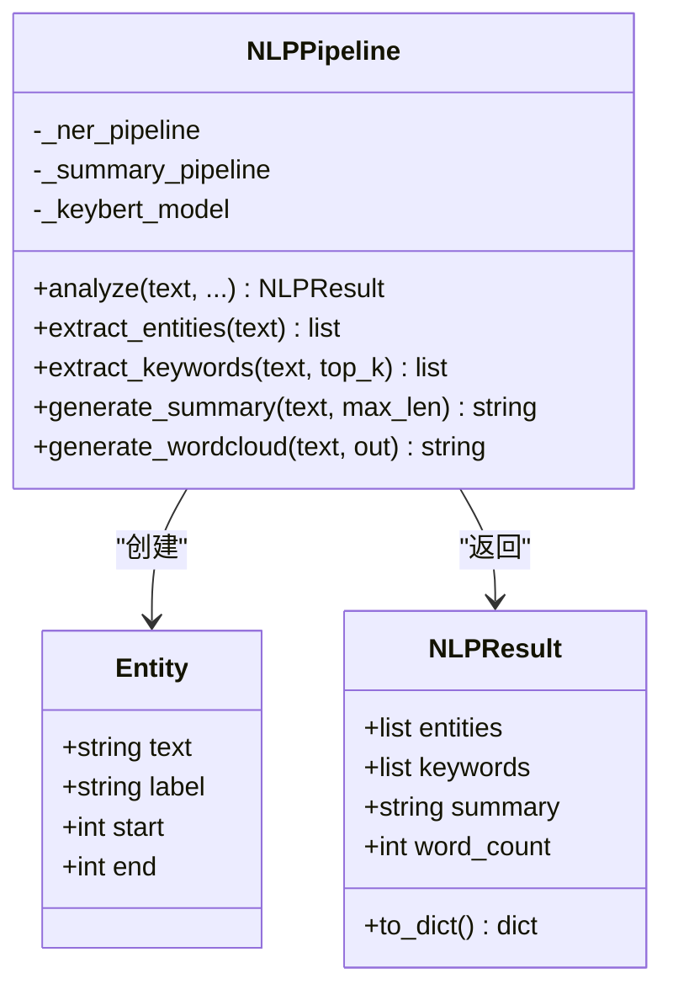
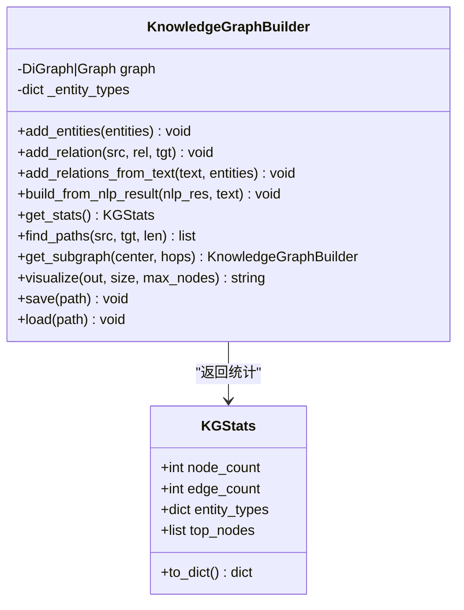
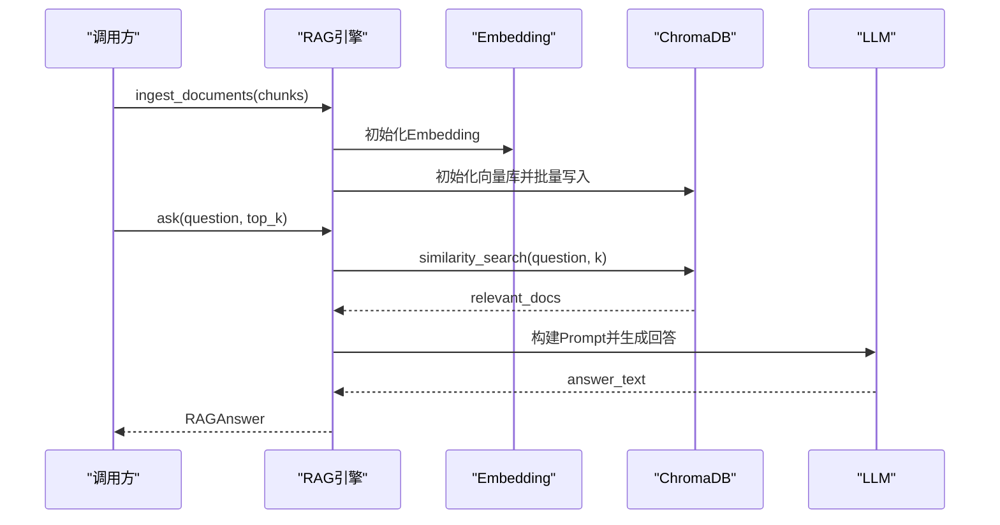
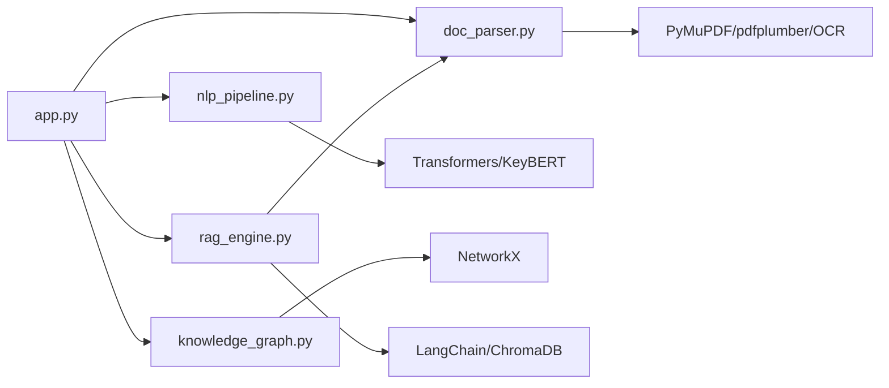

# 核心模块

<cite>
**本文引用的文件**
- [doc_parser.py](file://zhixi/src/doc_parser.py)
- [nlp_pipeline.py](file://zhixi/src/nlp_pipeline.py)
- [knowledge_graph.py](file://zhixi/src/knowledge_graph.py)
- [rag_engine.py](file://zhixi/src/rag_engine.py)
- [app.py](file://zhixi/src/app.py)
- [requirements.txt](file://zhixi/requirements.txt)
- [test_core.py](file://zhixi/tests/test_core.py)
</cite>

## 目录
1. [简介](#简介)
2. [项目结构](#项目结构)
3. [核心组件](#核心组件)
4. [架构总览](#架构总览)
5. [详细组件分析](#详细组件分析)
6. [依赖分析](#依赖分析)
7. [性能考虑](#性能考虑)
8. [故障排查指南](#故障排查指南)
9. [结论](#结论)
10. [附录](#附录)

## 简介
本文件面向“智析平台”的核心模块，系统性阐述四大模块的功能定位、数据流与协作模式、模块化架构设计与优势，并提供扩展与定制指导。四大模块分别为：
- 文档解析模块（CV层）：负责从PDF中提取文本、表格与图像，提供文本切块能力，支撑后续NLP与RAG。
- NLP分析模块：提供命名实体识别（NER）、关键词提取、自动摘要、词云生成等智能文本分析能力。
- 知识图谱模块（数据挖掘层）：从实体与共现关系构建知识图谱，支持统计分析、路径查找、可视化与持久化。
- RAG引擎（LLM应用层）：基于检索增强生成（RAG），支持OpenAI API与本地Ollama两种模式，实现智能问答与溯源。

## 项目结构
项目采用“模块化+分层”组织方式：
- 层次划分：CV层（文档解析）、NLP层（智能分析）、数据挖掘层（知识图谱）、LLM应用层（RAG）
- 文件组织：每个功能模块独立为一个Python文件，便于复用与测试
- 入口与界面：Streamlit Web应用统一调度四大模块，提供交互式工作流

图表来源
- [app.py:1-492](file://zhixi/src/app.py#L1-L492)
- [doc_parser.py:1-319](file://zhixi/src/doc_parser.py#L1-L319)
- [nlp_pipeline.py:1-312](file://zhixi/src/nlp_pipeline.py#L1-L312)
- [knowledge_graph.py:1-412](file://zhixi/src/knowledge_graph.py#L1-L412)
- [rag_engine.py:1-362](file://zhixi/src/rag_engine.py#L1-L362)

章节来源
- [app.py:1-492](file://zhixi/src/app.py#L1-L492)
- [requirements.txt:1-45](file://zhixi/requirements.txt#L1-L45)

## 核心组件
- 文档解析模块（CV层）
  - 功能：从PDF提取文本、表格、图像；生成全量文本；按段落切分为重叠文本块
  - 技术特点：PyMuPDF提取文本与图像；pdfplumber提取表格；可选图像OCR；输出标准化结构化结果
- NLP分析模块
  - 功能：NER、关键词提取、自动摘要、词云生成
  - 技术特点：延迟加载模型（Transformers、KeyBERT、WordCloud）；支持英文文本摘要；可生成词云
- 知识图谱模块（数据挖掘层）
  - 功能：实体节点与关系构建、统计分析、路径查找、子图提取、可视化与持久化
  - 技术特点：NetworkX图结构；基于句子共现关系；支持有向/无向图；可视化支持中文
- RAG引擎（LLM应用层）
  - 功能：文档块向量化导入、相似检索、Prompt构建、LLM生成回答、溯源
  - 技术特点：支持OpenAI与Ollama双模式；ChromaDB向量存储；批导入与错误降级

章节来源
- [doc_parser.py:64-144](file://zhixi/src/doc_parser.py#L64-L144)
- [nlp_pipeline.py:45-145](file://zhixi/src/nlp_pipeline.py#L45-L145)
- [knowledge_graph.py:44-173](file://zhixi/src/knowledge_graph.py#L44-L173)
- [rag_engine.py:47-92](file://zhixi/src/rag_engine.py#L47-L92)

## 架构总览
四大模块通过“数据驱动”的流水线协作：文档解析产出结构化文本与块，NLP分析提炼实体与关键词，知识图谱构建实体关系，RAG引擎基于向量检索与LLM生成最终问答。Streamlit应用作为统一入口，串联各模块并提供可视化反馈。

图表来源
- [app.py:176-461](file://zhixi/src/app.py#L176-L461)
- [doc_parser.py:98-144](file://zhixi/src/doc_parser.py#L98-L144)
- [nlp_pipeline.py:106-145](file://zhixi/src/nlp_pipeline.py#L106-L145)
- [knowledge_graph.py:137-151](file://zhixi/src/knowledge_graph.py#L137-L151)
- [rag_engine.py:154-263](file://zhixi/src/rag_engine.py#L154-L263)

## 详细组件分析

### 文档解析模块（CV层）
- 数据结构
  - PageContent：单页文本、表格、图像列表
  - DocumentResult：文档元信息、页列表、全文
- 核心流程
  - 使用PyMuPDF提取文本与图像；pdfplumber提取表格；组装DocumentResult；按段落切分为重叠文本块
- 错误处理
  - 表格提取异常时降级为空表；页数获取失败时回退
- 性能特性
  - 进度条显示；图像按页导出；文本块大小与重叠可调

图表来源
- [doc_parser.py:98-203](file://zhixi/src/doc_parser.py#L98-L203)
- [doc_parser.py:212-268](file://zhixi/src/doc_parser.py#L212-L268)

章节来源
- [doc_parser.py:32-61](file://zhixi/src/doc_parser.py#L32-L61)
- [doc_parser.py:98-144](file://zhixi/src/doc_parser.py#L98-L144)
- [doc_parser.py:146-203](file://zhixi/src/doc_parser.py#L146-L203)
- [doc_parser.py:212-268](file://zhixi/src/doc_parser.py#L212-L268)

### NLP分析模块
- 数据结构
  - Entity：实体文本、标签、位置
  - NLPResult：实体列表、关键词、摘要、词数
- 核心流程
  - 延迟加载NER、摘要、KeyBERT；按开关执行实体识别、关键词提取、摘要生成；可生成词云
- 错误处理
  - 模型加载失败或推理异常时降级为空结果或短文本摘要
- 性能特性
  - 输入长度限制避免显存溢出；关键词提取支持停用词过滤

图表来源
- [nlp_pipeline.py:24-43](file://zhixi/src/nlp_pipeline.py#L24-L43)
- [nlp_pipeline.py:45-145](file://zhixi/src/nlp_pipeline.py#L45-L145)

章节来源
- [nlp_pipeline.py:24-43](file://zhixi/src/nlp_pipeline.py#L24-L43)
- [nlp_pipeline.py:106-145](file://zhixi/src/nlp_pipeline.py#L106-L145)
- [nlp_pipeline.py:147-234](file://zhixi/src/nlp_pipeline.py#L147-L234)
- [nlp_pipeline.py:235-262](file://zhixi/src/nlp_pipeline.py#L235-L262)

### 知识图谱模块（数据挖掘层）
- 数据结构
  - KGStats：节点数、边数、实体类型分布、度最高节点
- 核心流程
  - 批量添加实体（去重与权重累加）；添加关系；从文本提取共现关系；统计分析；路径查找；子图提取；可视化与持久化
- 错误处理
  - 可视化失败时返回None；节点不存在抛出异常
- 性能特性
  - 支持有向/无向图；可视化限制节点数量；实体类型映射颜色

图表来源
- [knowledge_graph.py:27-42](file://zhixi/src/knowledge_graph.py#L27-L42)
- [knowledge_graph.py:44-329](file://zhixi/src/knowledge_graph.py#L44-L329)

章节来源
- [knowledge_graph.py:27-42](file://zhixi/src/knowledge_graph.py#L27-L42)
- [knowledge_graph.py:67-108](file://zhixi/src/knowledge_graph.py#L67-L108)
- [knowledge_graph.py:109-151](file://zhixi/src/knowledge_graph.py#L109-L151)
- [knowledge_graph.py:152-173](file://zhixi/src/knowledge_graph.py#L152-L173)
- [knowledge_graph.py:175-222](file://zhixi/src/knowledge_graph.py#L175-L222)
- [knowledge_graph.py:224-313](file://zhixi/src/knowledge_graph.py#L224-L313)
- [knowledge_graph.py:314-329](file://zhixi/src/knowledge_graph.py#L314-L329)

### RAG引擎（LLM应用层）
- 数据结构
  - RAGAnswer：问题、答案、来源、模型名
- 核心流程
  - 初始化LLM与Embedding（OpenAI或Ollama）；初始化ChromaDB向量库；批量导入文本块；相似检索+构建Prompt；调用LLM生成回答；返回答案与来源
- 错误处理
  - LLM调用异常时降级返回错误提示；未检索到相关块时返回提示
- 性能特性
  - 批量导入；可配置top_k；支持清空集合

图表来源
- [rag_engine.py:154-191](file://zhixi/src/rag_engine.py#L154-L191)
- [rag_engine.py:192-263](file://zhixi/src/rag_engine.py#L192-L263)

章节来源
- [rag_engine.py:30-45](file://zhixi/src/rag_engine.py#L30-L45)
- [rag_engine.py:69-92](file://zhixi/src/rag_engine.py#L69-L92)
- [rag_engine.py:154-191](file://zhixi/src/rag_engine.py#L154-L191)
- [rag_engine.py:192-263](file://zhixi/src/rag_engine.py#L192-L263)
- [rag_engine.py:265-281](file://zhixi/src/rag_engine.py#L265-L281)
- [rag_engine.py:282-303](file://zhixi/src/rag_engine.py#L282-L303)
- [rag_engine.py:305-312](file://zhixi/src/rag_engine.py#L305-L312)

## 依赖分析
- 内部依赖
  - app.py统一调度四大模块；RAG引擎在一键RAG场景中直接调用文档解析模块
- 外部依赖
  - 文档解析：PyMuPDF、pdfplumber、OpenCV、Pillow、PaddleOCR
  - NLP分析：Transformers、KeyBERT、WordCloud、spaCy
  - 知识图谱：NetworkX、Scikit-learn
  - RAG引擎：LangChain、ChromaDB、OpenAI/Ollama、tiktoken

图表来源
- [app.py:176-461](file://zhixi/src/app.py#L176-L461)
- [rag_engine.py:332-343](file://zhixi/src/rag_engine.py#L332-L343)
- [requirements.txt:13-36](file://zhixi/requirements.txt#L13-L36)

章节来源
- [requirements.txt:13-36](file://zhixi/requirements.txt#L13-L36)
- [app.py:176-461](file://zhixi/src/app.py#L176-L461)
- [rag_engine.py:332-343](file://zhixi/src/rag_engine.py#L332-L343)

## 性能考虑
- 文档解析
  - 使用进度条与分页处理，避免一次性加载大文件导致内存压力
  - 表格提取失败时快速降级，保证流程可用性
- NLP分析
  - 模型延迟加载，减少冷启动开销；输入长度限制避免显存溢出
- 知识图谱
  - 可视化限制节点数量，优先展示高连接度节点
- RAG引擎
  - 批量导入向量库；相似检索top_k可调；LLM调用异常时降级返回提示

## 故障排查指南
- 文档解析
  - 若表格提取报错，检查pdfplumber版本与PDF结构；确认输出目录权限
- NLP分析
  - 首次运行需下载模型，网络环境不佳时可离线准备缓存；若NER/摘要失败，检查输入文本长度
- 知识图谱
  - 可视化失败通常因Matplotlib字体或依赖缺失；节点过多时降低max_nodes
- RAG引擎
  - OpenAI模式需正确设置API Key；Ollama模式需确认服务地址与模型名称；未导入文档时无法回答

章节来源
- [doc_parser.py:198-203](file://zhixi/src/doc_parser.py#L198-L203)
- [nlp_pipeline.py:161-175](file://zhixi/src/nlp_pipeline.py#L161-L175)
- [knowledge_graph.py:241-312](file://zhixi/src/knowledge_graph.py#L241-L312)
- [rag_engine.py:109-115](file://zhixi/src/rag_engine.py#L109-L115)

## 结论
智析平台通过“文档解析—NLP分析—知识图谱—RAG引擎”的流水线式架构，实现了从原始PDF到结构化知识再到智能问答的完整闭环。模块化设计使各层职责清晰、耦合可控，既便于独立演进，又能在上层应用中无缝衔接。依托Streamlit的交互界面，用户可直观体验端到端流程，适合研究与业务场景的快速落地。

## 附录
- 模块扩展与定制指导
  - 文档解析模块
    - 新增解析器：在现有解析流程中插入新方法，保持DocumentResult接口一致
    - 图像OCR：可替换为其他OCR引擎，注意输出图像路径与元数据
  - NLP分析模块
    - 新算法接入：新增方法并返回NLPResult兼容字段；注意输入长度限制
    - 模型切换：通过构造参数或环境变量切换模型；确保延迟加载策略
  - 知识图谱模块
    - 新关系抽取：实现基于规则或模型的关系抽取函数；统一为边属性
    - 可视化增强：调整布局、颜色映射与节点筛选策略
  - RAG引擎
    - 新嵌入模型：替换Embedding初始化；确保与向量库兼容
    - 新LLM：适配不同SDK；统一Prompt模板与错误处理
- 测试建议
  - 使用单元测试验证数据结构与关键流程；对依赖外部资源的模块进行Mock或离线测试