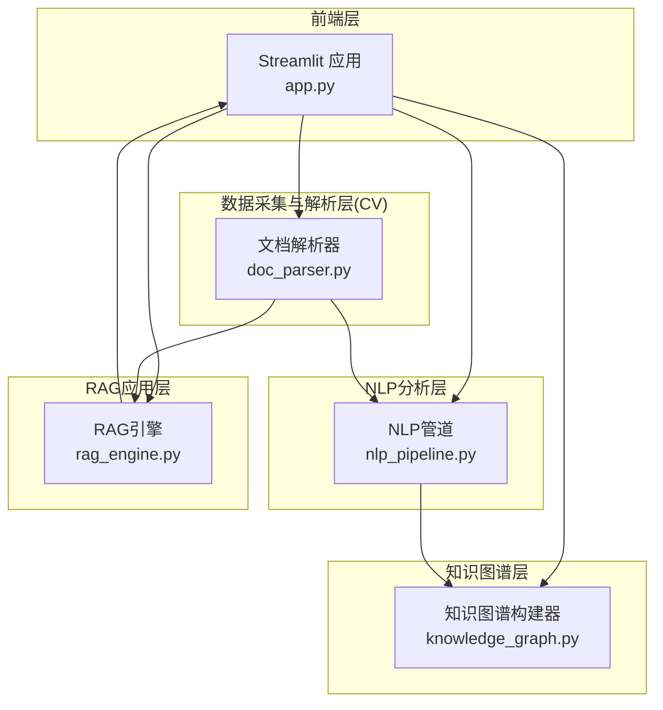
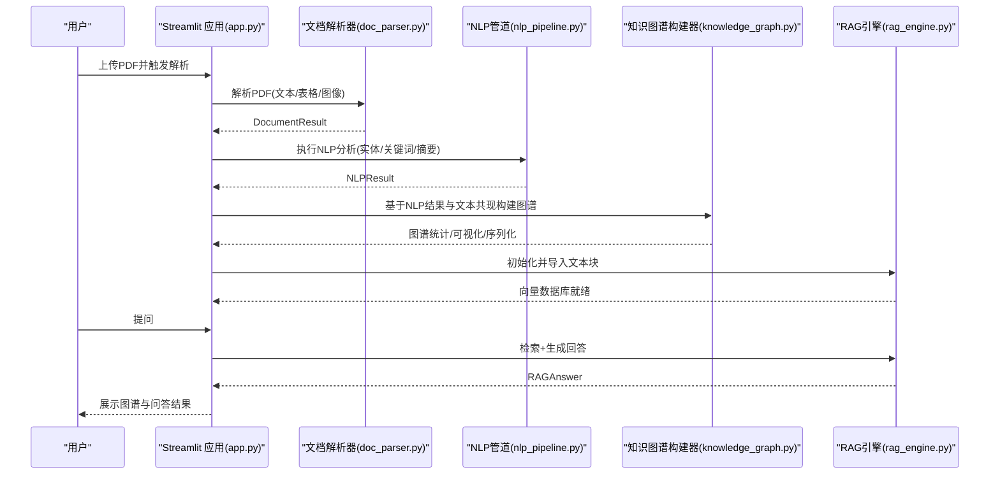
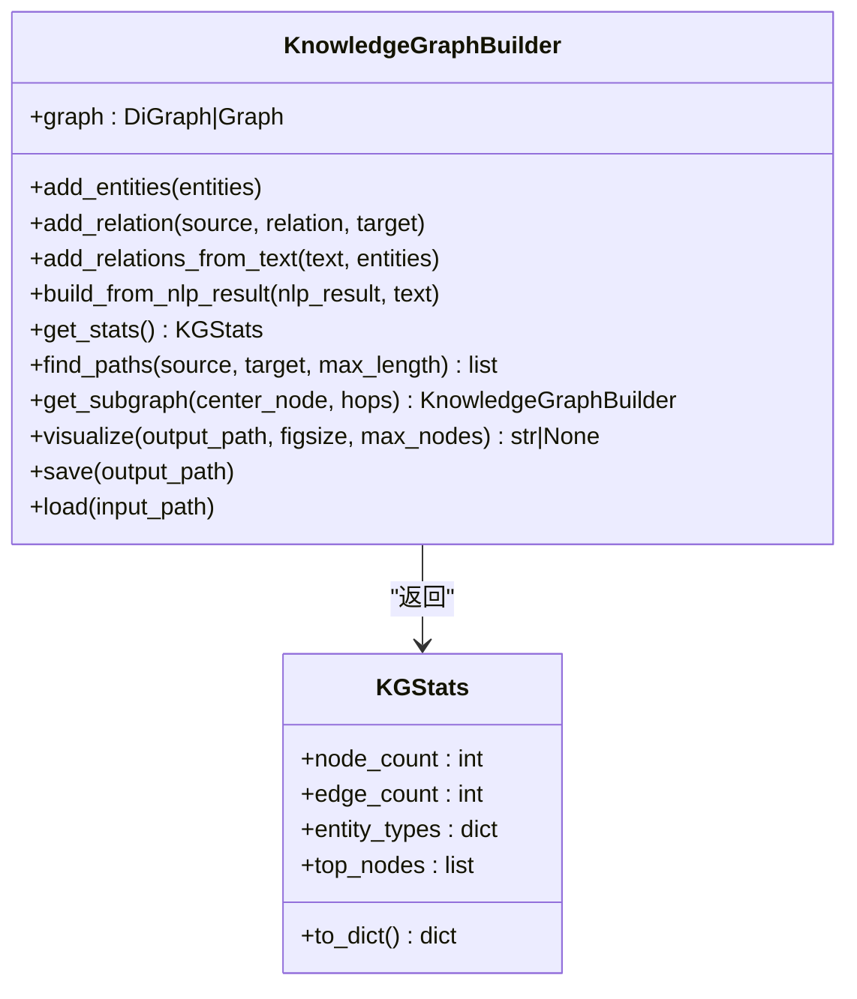
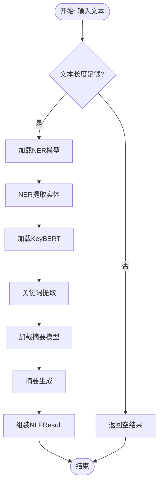
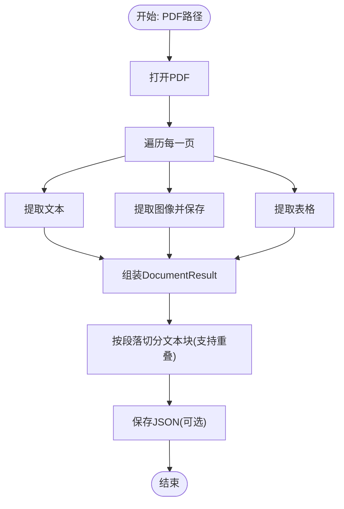
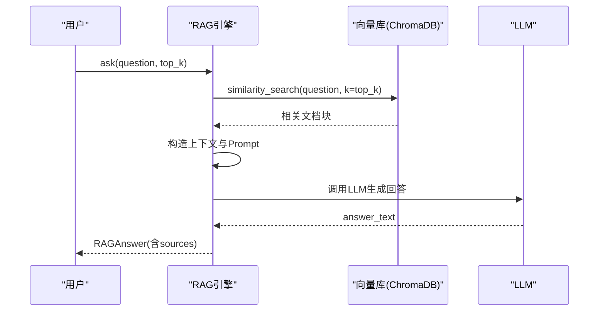
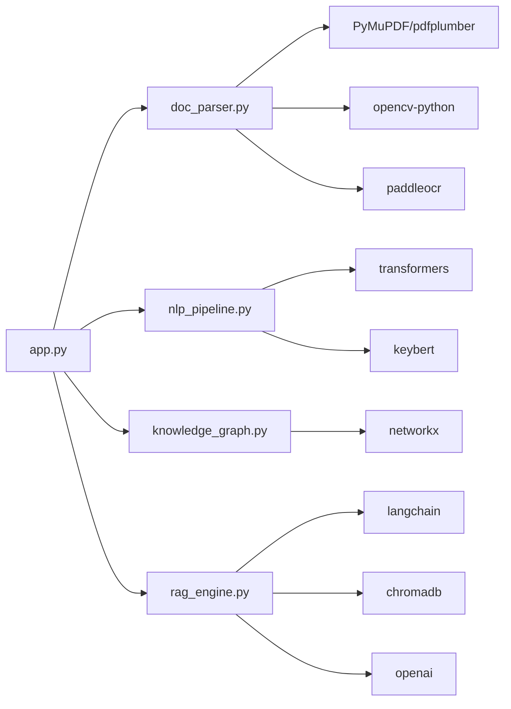

# 知识图谱模块

<cite>
**本文引用的文件**
- [knowledge_graph.py](file://zhixi/src/knowledge_graph.py)
- [nlp_pipeline.py](file://zhixi/src/nlp_pipeline.py)
- [doc_parser.py](file://zhixi/src/doc_parser.py)
- [rag_engine.py](file://zhixi/src/rag_engine.py)
- [app.py](file://zhixi/src/app.py)
- [requirements.txt](file://zhixi/requirements.txt)
- [test_core.py](file://zhixi/tests/test_core.py)
</cite>

## 目录
1. [简介](#简介)
2. [项目结构](#项目结构)
3. [核心组件](#核心组件)
4. [架构总览](#架构总览)
5. [详细组件分析](#详细组件分析)
6. [依赖关系分析](#依赖关系分析)
7. [性能考量](#性能考量)
8. [故障排查指南](#故障排查指南)
9. [结论](#结论)
10. [附录](#附录)

## 简介
本文件面向“知识图谱模块”的专业技术人员与产品使用者，系统阐述从文档到知识图谱的完整流程：实体识别、关系抽取、图结构构建与可视化展示，并深入讲解NetworkX图论库的应用（节点创建、边连接、图算法与统计分析）、实体类型分类与关系语义标注、图查询优化策略、数据模型设计（实体节点属性、关系边权重、图结构表示），以及与RAG引擎的集成与数据共享机制。同时提供可视化组件实现思路、交互式图表与动态更新机制，并给出文档实体关系分析、知识发现与智能推荐的实际应用场景示例。

## 项目结构
该项目采用分层架构：
- 数据采集与解析层（CV层）：负责从PDF中提取文本、表格与图像，提供文本切块接口供RAG使用。
- NLP分析层：提供命名实体识别、关键词提取、自动摘要与词云生成。
- 知识图谱层：基于NLP结果与文本共现规则构建实体-关系图谱，提供统计、路径查询、子图裁剪与可视化。
- RAG应用层：基于向量检索与LLM生成，提供智能问答能力。
- Web前端层：Streamlit界面，串联上述能力，支持交互式操作与动态更新。

**图表来源**
- [app.py](file://zhixi/src/app.py)
- [doc_parser.py](file://zhixi/src/doc_parser.py)
- [nlp_pipeline.py](file://zhixi/src/nlp_pipeline.py)
- [knowledge_graph.py](file://zhixi/src/knowledge_graph.py)
- [rag_engine.py](file://zhixi/src/rag_engine.py)

**章节来源**
- [app.py](file://zhixi/src/app.py)
- [doc_parser.py](file://zhixi/src/doc_parser.py)
- [nlp_pipeline.py](file://zhixi/src/nlp_pipeline.py)
- [knowledge_graph.py](file://zhixi/src/knowledge_graph.py)
- [rag_engine.py](file://zhixi/src/rag_engine.py)

## 核心组件
- 知识图谱构建器（KnowledgeGraphBuilder）
  - 负责实体节点批量添加、实体间关系添加、从NLP结果与文本共现自动抽取关系、图统计、路径查找、子图裁剪、可视化与序列化。
- NLP分析管道（NLPPipeline）
  - 提供NER、关键词提取、摘要生成、词云生成，输出标准化的NLPResult数据结构。
- 文档解析器（DocumentParser）
  - 提供PDF文本、表格、图像提取，以及文本切块接口，供RAG使用。
- RAG引擎（RAGEngine）
  - 基于LangChain与ChromaDB，支持OpenAI与本地Ollama两种模式，提供检索增强生成问答能力。
- Streamlit应用（app.py）
  - 提供统一的Web界面，串联文档解析、NLP分析、知识图谱构建与RAG问答。

**章节来源**
- [knowledge_graph.py](file://zhixi/src/knowledge_graph.py)
- [nlp_pipeline.py](file://zhixi/src/nlp_pipeline.py)
- [doc_parser.py](file://zhixi/src/doc_parser.py)
- [rag_engine.py](file://zhixi/src/rag_engine.py)
- [app.py](file://zhixi/src/app.py)

## 架构总览
下图展示了端到端的知识图谱构建与应用流程，从PDF文档到知识图谱再到RAG问答的完整链路。

**图表来源**
- [app.py](file://zhixi/src/app.py)
- [doc_parser.py](file://zhixi/src/doc_parser.py)
- [nlp_pipeline.py](file://zhixi/src/nlp_pipeline.py)
- [knowledge_graph.py](file://zhixi/src/knowledge_graph.py)
- [rag_engine.py](file://zhixi/src/rag_engine.py)

## 详细组件分析

### 知识图谱构建器（NetworkX）
- 节点与边
  - 节点属性：实体文本、实体类型、节点权重（重复实体累加权重）。
  - 边属性：关系类型（relation）。
- 关系抽取策略
  - 显式关系：add_relation(source, relation, target)。
  - 共现关系：add_relations_from_text(text, entities)，基于句子内实体共现建立“related_to”关系。
- 图算法与统计
  - 统计信息：节点数、边数、实体类型分布、度最高节点Top-N。
  - 路径查询：find_paths(source, target, max_length)。
  - 子图裁剪：get_subgraph(center_node, hops)。
- 可视化
  - spring_layout力导向布局，节点颜色按实体类型映射，节点大小按度数缩放，边半透明箭头，图例与标题。
  - 输出PNG图片，支持最大节点数截断以提升性能。
- 序列化
  - 保存为JSON（node-link格式），便于跨模块共享与加载。

**图表来源**
- [knowledge_graph.py](file://zhixi/src/knowledge_graph.py)

**章节来源**
- [knowledge_graph.py](file://zhixi/src/knowledge_graph.py)

### NLP分析管道（实体识别、关键词、摘要、词云）
- 实体识别（NER）
  - 使用HuggingFace Transformers bert-base-NER，聚合策略为simple，限制输入长度避免显存溢出。
  - 输出实体列表（Entity），包含文本、标签、起止位置。
- 关键词提取（KeyBERT）
  - 基于语义相似度提取关键词/短语，支持1-2词组合，去停用词，返回（关键词，分数）列表。
- 摘要生成（BART）
  - 基于facebook/bart-large-cnn抽取式/生成式摘要，限制输入长度，异常时降级返回前200字符。
- 词云生成
  - 清洗短词后生成词云，保存为PNG。
- 结果封装
  - NLPResult包含实体、关键词、摘要、词数，提供to_dict()。

**图表来源**
- [nlp_pipeline.py](file://zhixi/src/nlp_pipeline.py)

**章节来源**
- [nlp_pipeline.py](file://zhixi/src/nlp_pipeline.py)

### 文档解析器（PDF文本/表格/图像提取与文本切块）
- 文本与图像
  - 使用PyMuPDF提取每页文本与嵌入图像，保存到独立目录。
- 表格
  - 使用pdfplumber提取表格，转为包含表头与行的结构化数据。
- 文本切块
  - 按段落优先切分，支持重叠，输出包含文本、页码、块ID的列表，供RAG导入。

**图表来源**
- [doc_parser.py](file://zhixi/src/doc_parser.py)

**章节来源**
- [doc_parser.py](file://zhixi/src/doc_parser.py)

### RAG引擎（检索增强生成）
- 模型与向量库
  - 支持OpenAI与本地Ollama两种模式；Embedding与LLM分别按模式初始化。
  - 向量库使用ChromaDB，持久化目录可配置。
- 文档导入
  - 将文本块转换为LangChain Document，分批写入向量库。
- 问答流程
  - 检索top_k相关文档块，构造上下文与Prompt，调用LLM生成回答，返回包含来源的RAGAnswer。
- 搜索接口
  - search(query, top_k)仅检索不生成回答。

**图表来源**
- [rag_engine.py](file://zhixi/src/rag_engine.py)

**章节来源**
- [rag_engine.py](file://zhixi/src/rag_engine.py)

### Web界面（Streamlit）
- 功能分区
  - 文档解析：上传PDF、解析、指标卡片、文本预览。
  - NLP分析：执行分析、关键词、实体、摘要、词云展示。
  - 知识图谱：构建图谱、统计指标、可视化展示。
  - 智能问答：初始化引擎、聊天历史、来源查看。
- 交互与动态更新
  - 使用st.session_state维护中间状态，按钮触发后st.rerun()刷新界面。
  - 侧边栏切换LLM模式（OpenAI/Ollama），调整RAG参数（块大小、重叠、检索数量）。

**章节来源**
- [app.py](file://zhixi/src/app.py)

## 依赖关系分析
- Python包依赖
  - 知识图谱：networkx
  - NLP：transformers、torch、spacy、keybert、wordcloud
  - RAG：langchain、langchain-community、langchain-openai、chromadb、openai、tiktoken
  - CV层：PyMuPDF、pdfplumber、opencv-python、paddleocr、paddlepaddle
  - 可视化与Web：matplotlib、seaborn、numpy、pandas、streamlit、Pillow、tqdm
- 模块耦合
  - app.py耦合doc_parser、nlp_pipeline、knowledge_graph、rag_engine。
  - knowledge_graph依赖networkx；nlp_pipeline依赖transformers/keybert；rag_engine依赖langchain/chromadb/openai/ollama。
- 外部接口
  - OpenAI API（可选）与Ollama服务（可选），通过环境变量控制。

**图表来源**
- [requirements.txt](file://zhixi/requirements.txt)
- [app.py](file://zhixi/src/app.py)
- [knowledge_graph.py](file://zhixi/src/knowledge_graph.py)
- [nlp_pipeline.py](file://zhixi/src/nlp_pipeline.py)
- [doc_parser.py](file://zhixi/src/doc_parser.py)
- [rag_engine.py](file://zhixi/src/rag_engine.py)

**章节来源**
- [requirements.txt](file://zhixi/requirements.txt)

## 性能考量
- 知识图谱可视化
  - 当节点数超过阈值时，仅展示度最高的节点子集，降低渲染开销。
  - 力导向布局迭代次数与k参数可调，平衡布局质量与性能。
- NLP分析
  - 对输入文本长度做限制，避免模型超长输入导致显存溢出。
  - 关键词提取与摘要生成均有限制，异常时降级返回。
- RAG导入
  - 文档块分批写入向量库，减少单次内存压力。
- Web界面
  - 使用st.rerun()按需刷新，避免不必要的重计算。

[本节为通用性能建议，无需特定文件引用]

## 故障排查指南
- 知识图谱构建
  - 若节点不存在或关系无法添加，检查实体是否已添加或文本是否匹配大小写。
  - 可视化失败时检查matplotlib依赖与字体设置。
- NLP分析
  - 首次运行需下载模型，网络不佳时可能超时；可离线准备模型缓存。
  - NER/关键词/摘要报错时，确认输入文本长度与编码。
- RAG引擎
  - OpenAI模式需正确配置API Key；Ollama模式需确保服务可达且模型可用。
  - 向量库持久化目录权限不足会导致导入失败。
- Web界面
  - 上传文件过大或格式不符可能导致解析失败；检查浏览器控制台错误信息。

**章节来源**
- [knowledge_graph.py](file://zhixi/src/knowledge_graph.py)
- [nlp_pipeline.py](file://zhixi/src/nlp_pipeline.py)
- [rag_engine.py](file://zhixi/src/rag_engine.py)
- [app.py](file://zhixi/src/app.py)

## 结论
本知识图谱模块以NetworkX为核心，结合NLP与RAG能力，实现了从PDF到实体关系图谱再到智能问答的闭环。模块具备良好的扩展性与可维护性：数据模型清晰、接口稳定、可视化直观、与RAG无缝集成。建议在生产环境中进一步引入图算法（如社区检测、中心性分析）与查询优化（索引、缓存、增量更新），以支撑更大规模的知识图谱场景。

[本节为总结性内容，无需特定文件引用]

## 附录

### 实际应用场景示例
- 文档实体关系分析
  - 上传研究报告，执行NLP分析与知识图谱构建，快速定位关键人物、组织、技术术语及其关系。
- 知识发现
  - 利用图谱统计与路径查询，发现隐含关联与潜在知识节点。
- 智能推荐
  - 基于图谱与RAG问答，为用户提供相关文档、研究方向或技术路线的推荐。

[本节为概念性描述，无需特定文件引用]

### 与RAG引擎的集成与数据共享机制
- 数据共享
  - 文档解析阶段的文本切块（包含页码与块ID）直接作为RAG的输入，保证问答溯源。
- 流程衔接
  - app.py中先解析文档并切块，再初始化RAG引擎并导入；问答时检索相关文档块并生成回答。
- 模式切换
  - 侧边栏支持OpenAI API与本地Ollama两种模式，满足不同部署需求。

**章节来源**
- [app.py](file://zhixi/src/app.py)
- [doc_parser.py](file://zhixi/src/doc_parser.py)
- [rag_engine.py](file://zhixi/src/rag_engine.py)

### 知识图谱数据模型设计
- 节点
  - 属性：text（实体文本）、entity_type（实体类型）、weight（权重，重复实体累加）。
- 边
  - 属性：relation（关系类型）。
- 图结构
  - 默认为有向图（DiGraph），支持无向图（Graph）可扩展。
- 统计与查询
  - 统计实体类型分布与Top节点；支持路径查找与子图裁剪。

**章节来源**
- [knowledge_graph.py](file://zhixi/src/knowledge_graph.py)

### 可视化组件实现要点
- 力导向布局
  - 使用spring_layout，参数k与迭代次数控制节点间距与收敛。
- 交互与动态更新
  - Streamlit中通过按钮触发构建与可视化，st.session_state保存状态，st.rerun()刷新界面。
- 动态更新机制
  - 新增实体或关系后，重新保存与可视化，确保界面与数据一致。

**章节来源**
- [knowledge_graph.py](file://zhixi/src/knowledge_graph.py)
- [app.py](file://zhixi/src/app.py)

### 测试与验证
- 单元测试覆盖
  - 知识图谱：实体添加、关系添加、统计、路径查找、序列化/反序列化、重复实体权重、共现关系。
  - 文档解析：文本切块结构验证。
  - NLP与RAG：数据结构to_dict验证。
- 运行方式
  - 在zhixi目录下执行pytest tests/ -v。

**章节来源**
- [test_core.py](file://zhixi/tests/test_core.py)