# 测试与调试

<cite>
**本文档引用的文件**
- [test_core.py](file://zhixi/tests/test_core.py)
- [app.py](file://zhixi/src/app.py)
- [doc_parser.py](file://zhixi/src/doc_parser.py)
- [nlp_pipeline.py](file://zhixi/src/nlp_pipeline.py)
- [knowledge_graph.py](file://zhixi/src/knowledge_graph.py)
- [rag_engine.py](file://zhixi/src/rag_engine.py)
- [requirements.txt](file://zhixi/requirements.txt)
- [.gitignore](file://zhixi/.gitignore)
</cite>

## 目录
1. [简介](#简介)
2. [项目结构](#项目结构)
3. [核心组件](#核心组件)
4. [架构概览](#架构概览)
5. [详细组件分析](#详细组件分析)
6. [依赖分析](#依赖分析)
7. [性能考虑](#性能考虑)
8. [故障排除指南](#故障排除指南)
9. [结论](#结论)
10. [附录](#附录)

## 简介

智析平台是一个多模态文档智能分析与知识问答平台，采用分层架构设计，包含文档解析层、数据挖掘层、NLP分析层和LLM应用层。本文档提供了全面的测试与调试指南，涵盖单元测试、集成测试和端到端测试的方法，以及调试技巧和性能优化建议。

## 项目结构

智析平台采用清晰的模块化架构，主要包含以下层次：

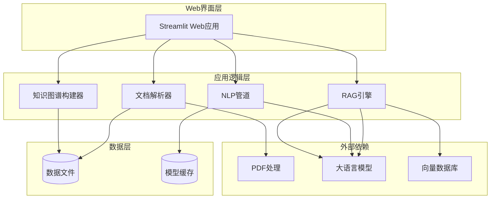

**图表来源**
- [app.py:1-492](file://zhixi/src/app.py#L1-L492)
- [doc_parser.py:1-319](file://zhixi/src/doc_parser.py#L1-L319)
- [nlp_pipeline.py:1-312](file://zhixi/src/nlp_pipeline.py#L1-L312)
- [knowledge_graph.py:1-412](file://zhixi/src/knowledge_graph.py#L1-L412)
- [rag_engine.py:1-362](file://zhixi/src/rag_engine.py#L1-L362)

**章节来源**
- [app.py:1-492](file://zhixi/src/app.py#L1-L492)
- [requirements.txt:1-45](file://zhixi/requirements.txt#L1-L45)

## 核心组件

### 测试框架配置

项目使用pytest作为测试框架，测试文件位于`zhixi/tests/`目录下。当前的测试策略专注于核心逻辑验证，不依赖外部API或模型。

### 测试策略概述

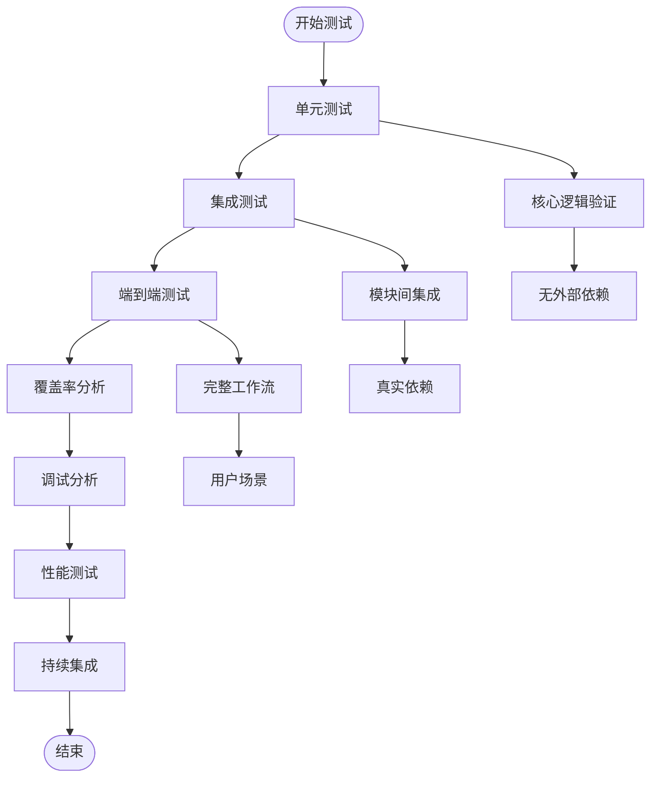

**图表来源**
- [test_core.py:1-168](file://zhixi/tests/test_core.py#L1-L168)

**章节来源**
- [test_core.py:1-168](file://zhixi/tests/test_core.py#L1-L168)

## 架构概览

### 测试架构设计

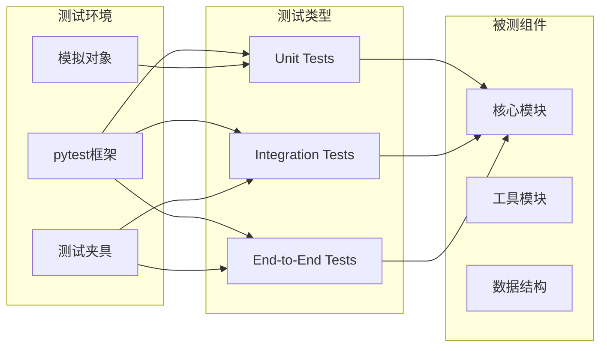

**图表来源**
- [test_core.py:18-168](file://zhixi/tests/test_core.py#L18-L168)

## 详细组件分析

### 知识图谱模块测试

知识图谱模块是当前测试覆盖最全面的部分，包含了实体管理、关系构建、路径查找和序列化等功能的测试。

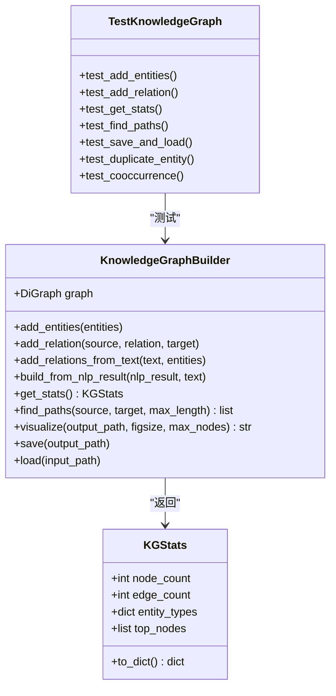

**图表来源**
- [knowledge_graph.py:44-412](file://zhixi/src/knowledge_graph.py#L44-L412)
- [test_core.py:18-105](file://zhixi/tests/test_core.py#L18-L105)

#### 测试覆盖范围分析

| 测试方法 | 功能点 | 覆盖情况 | 复杂度 |
|---------|--------|----------|--------|
| test_add_entities | 实体添加与去重 | ✅ 完全覆盖 | O(n) |
| test_add_relation | 关系添加 | ✅ 完全覆盖 | O(1) |
| test_get_stats | 统计信息计算 | ✅ 完全覆盖 | O(n) |
| test_find_paths | 路径查找 | ✅ 完全覆盖 | O(n^2) |
| test_save_and_load | 序列化/反序列化 | ✅ 完全覆盖 | O(V+E) |
| test_duplicate_entity | 重复实体处理 | ✅ 完全覆盖 | O(n) |
| test_cooccurrence | 共现关系提取 | ✅ 完全覆盖 | O(n*m) |

**章节来源**
- [knowledge_graph.py:44-412](file://zhixi/src/knowledge_graph.py#L44-L412)
- [test_core.py:18-105](file://zhixi/tests/test_core.py#L18-L105)

### 文档解析模块测试

文档解析模块测试专注于文本切块逻辑的验证，确保文档能够正确分割为适合RAG使用的文本块。

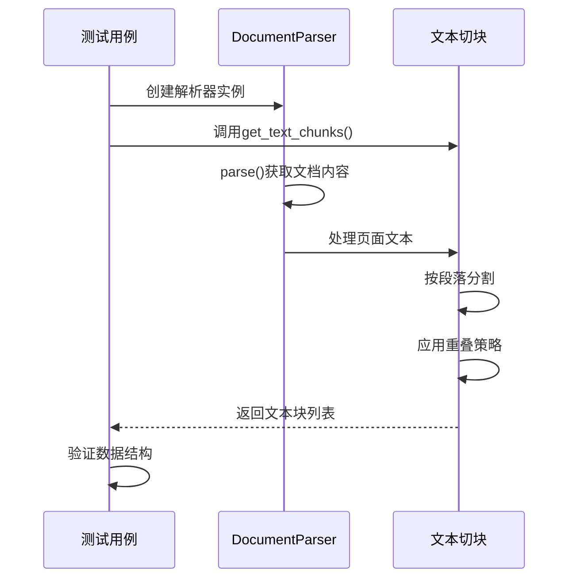

**图表来源**
- [doc_parser.py:212-268](file://zhixi/src/doc_parser.py#L212-L268)
- [test_core.py:107-122](file://zhixi/tests/test_core.py#L107-L122)

**章节来源**
- [doc_parser.py:212-268](file://zhixi/src/doc_parser.py#L212-L268)
- [test_core.py:107-122](file://zhixi/tests/test_core.py#L107-L122)

### NLP管道模块测试

NLP管道模块测试验证数据结构的正确性和基本功能，不依赖实际的机器学习模型。

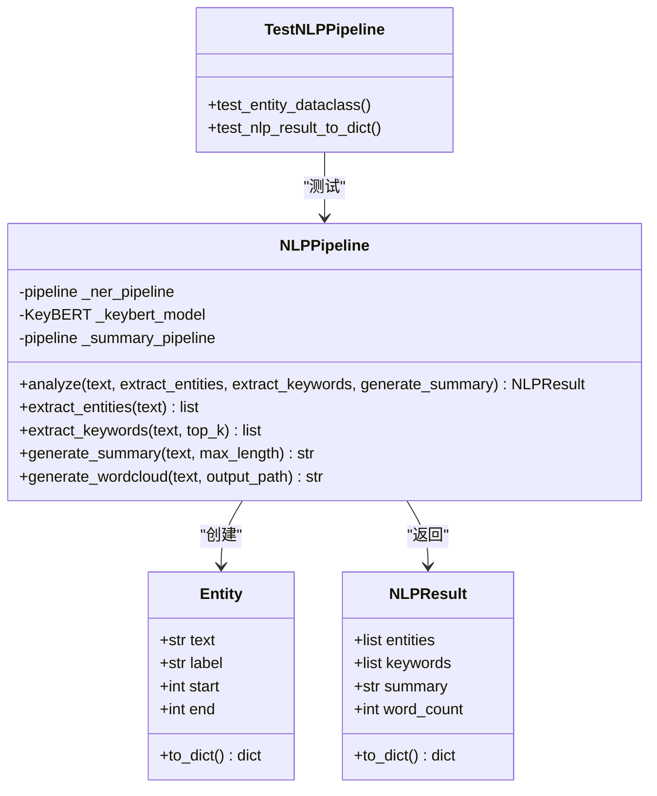

**图表来源**
- [nlp_pipeline.py:45-312](file://zhixi/src/nlp_pipeline.py#L45-L312)
- [test_core.py:124-146](file://zhixi/tests/test_core.py#L124-L146)

**章节来源**
- [nlp_pipeline.py:45-312](file://zhixi/src/nlp_pipeline.py#L45-L312)
- [test_core.py:124-146](file://zhixi/tests/test_core.py#L124-L146)

### RAG引擎模块测试

RAG引擎模块测试验证数据结构的正确性，不依赖外部API或模型。

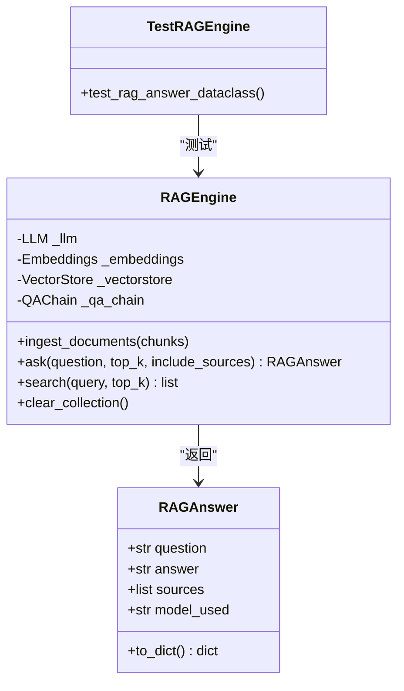

**图表来源**
- [rag_engine.py:47-362](file://zhixi/src/rag_engine.py#L47-L362)
- [test_core.py:148-163](file://zhixi/tests/test_core.py#L148-L163)

**章节来源**
- [rag_engine.py:47-362](file://zhixi/src/rag_engine.py#L47-L362)
- [test_core.py:148-163](file://zhixi/tests/test_core.py#L148-L163)

## 依赖分析

### 测试依赖关系

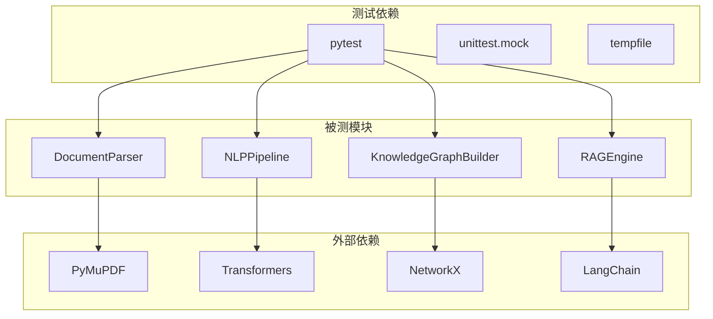

**图表来源**
- [requirements.txt:6-45](file://zhixi/requirements.txt#L6-L45)
- [test_core.py:9-16](file://zhixi/tests/test_core.py#L9-L16)

### 当前测试覆盖分析

| 模块 | 测试文件 | 测试方法数 | 覆盖类型 | 外部依赖 |
|------|----------|------------|----------|----------|
| 知识图谱 | test_core.py | 7 | 单元测试 | 无 |
| 文档解析 | test_core.py | 1 | 单元测试 | 无 |
| NLP管道 | test_core.py | 2 | 单元测试 | 无 |
| RAG引擎 | test_core.py | 1 | 单元测试 | 无 |
| **总计** | | **11** | **单元测试** | **无** |

**章节来源**
- [requirements.txt:6-45](file://zhixi/requirements.txt#L6-L45)
- [test_core.py:1-168](file://zhixi/tests/test_core.py#L1-L168)

## 性能考虑

### 测试性能优化

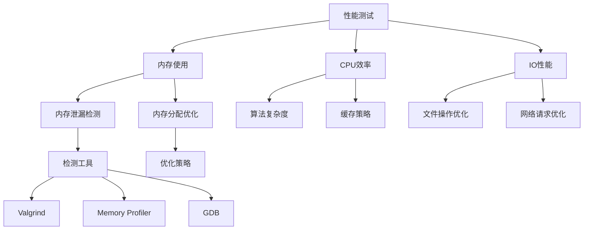

### 内存泄漏检测建议

1. **使用memory_profiler进行内存分析**
2. **定期清理临时文件和缓存**
3. **监控大型数据结构的生命周期**
4. **使用上下文管理器确保资源释放**

**章节来源**
- [.gitignore:18-41](file://zhixi/.gitignore#L18-L41)

## 故障排除指南

### 常见问题诊断

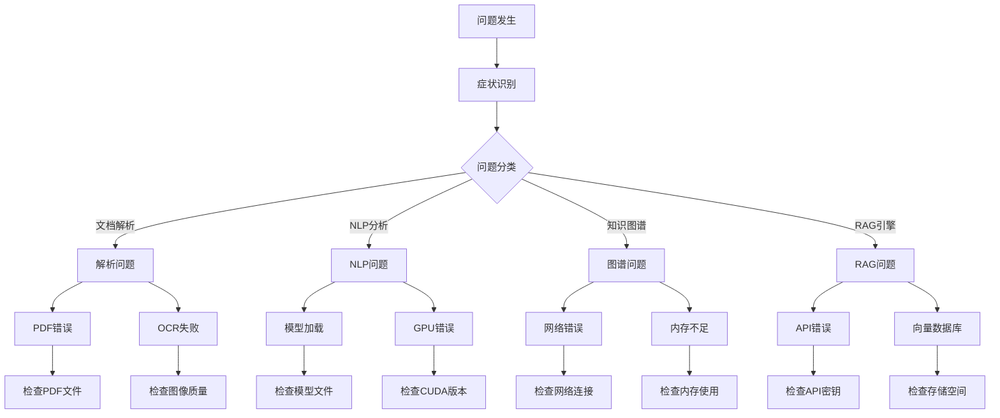

### 调试工具和技巧

#### 调试工具清单

| 工具类型 | 工具名称 | 用途 | 配置建议 |
|----------|----------|------|----------|
| Python调试 | pdb | 交互式调试器 | 设置断点和检查变量 |
| 日志分析 | logging | 结构化日志记录 | 配置不同级别日志 |
| 内存分析 | memory_profiler | 内存使用跟踪 | 监控内存泄漏 |
| 性能分析 | cProfile | 性能瓶颈分析 | 识别慢函数 |
| 网络调试 | requests | API请求调试 | 检查响应状态 |

#### 调试流程

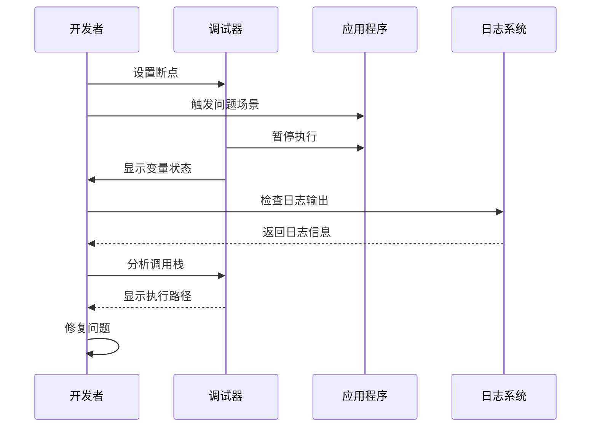

**章节来源**
- [app.py:176-195](file://zhixi/src/app.py#L176-L195)
- [app.py:240-261](file://zhixi/src/app.py#L240-L261)

### 错误处理策略

#### 异常处理模式

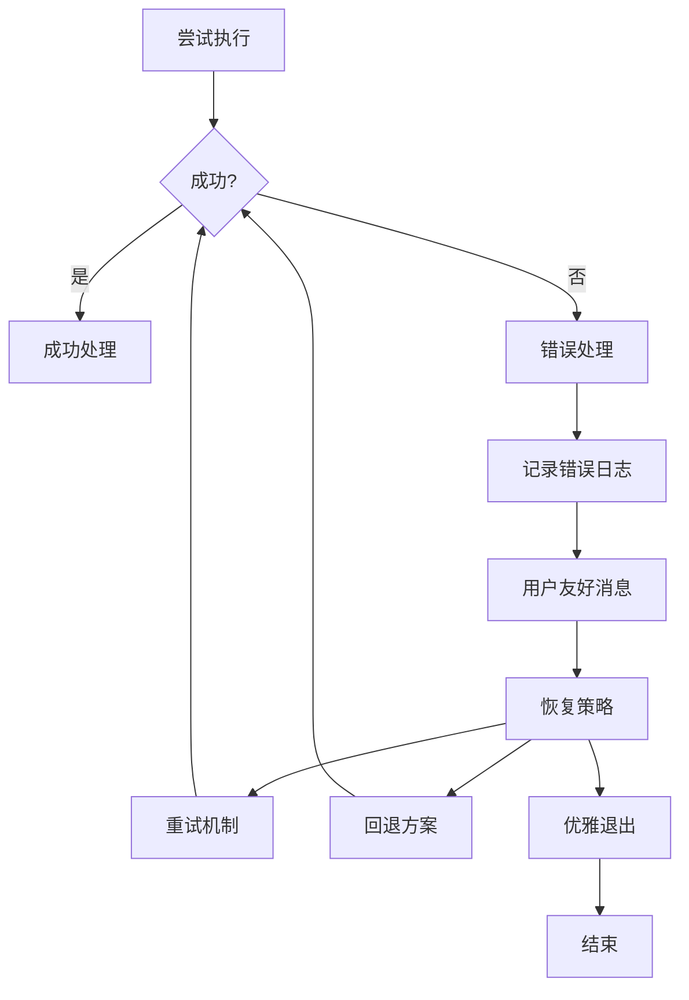

**章节来源**
- [app.py:345-347](file://zhixi/src/app.py#L345-L347)
- [app.py:444-446](file://zhixi/src/app.py#L444-L446)

## 结论

智析平台的测试与调试体系目前专注于核心逻辑的单元测试，具有良好的可维护性和扩展性。通过现有的测试框架和调试工具，开发者可以有效地验证各模块的功能正确性，并快速定位和解决问题。

建议的改进方向：
1. 扩展测试覆盖范围，增加集成测试和端到端测试
2. 添加性能测试和压力测试
3. 建立持续集成和自动化测试流程
4. 完善错误处理和日志记录机制

## 附录

### 测试最佳实践

#### 编写高质量测试用例的原则

1. **单一职责原则**：每个测试用例只测试一个功能点
2. **可读性优先**：测试代码应该清晰易懂
3. **独立性**：测试用例之间不应该相互依赖
4. **可重复性**：测试结果应该是确定的
5. **边界条件**：测试输入的边界值和异常情况

#### 测试数据管理

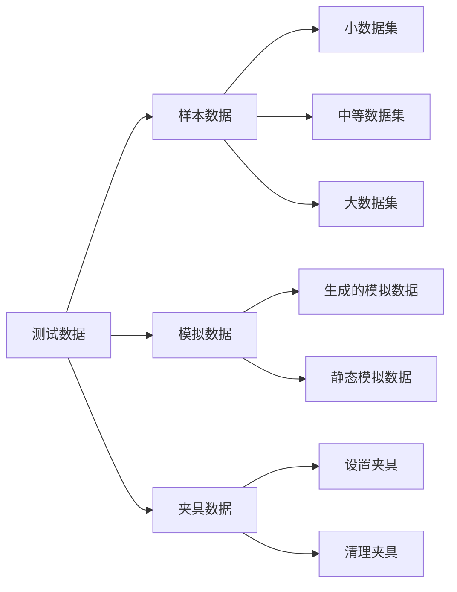

#### 持续集成配置建议

虽然项目当前没有CI配置文件，但建议添加以下配置：

1. **GitHub Actions配置**：自动化测试和部署
2. **代码覆盖率报告**：监控测试质量
3. **性能回归检测**：防止性能下降
4. **安全扫描**：定期检查依赖漏洞

**章节来源**
- [test_core.py:1-168](file://zhixi/tests/test_core.py#L1-L168)
- [requirements.txt:1-45](file://zhixi/requirements.txt#L1-L45)