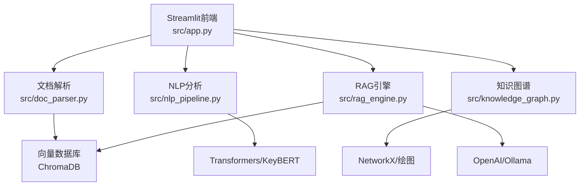
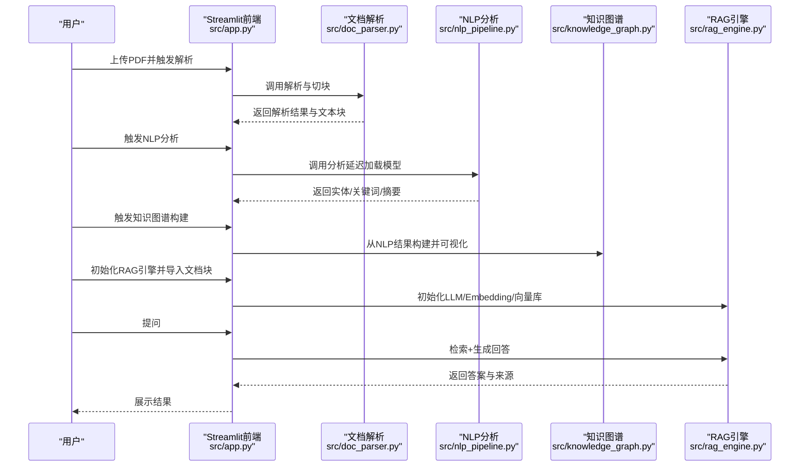

# 部署与运维

<cite>
**本文引用的文件**
- [requirements.txt](file://zhixi/requirements.txt)
- [app.py](file://zhixi/src/app.py)
- [doc_parser.py](file://zhixi/src/doc_parser.py)
- [nlp_pipeline.py](file://zhixi/src/nlp_pipeline.py)
- [rag_engine.py](file://zhixi/src/rag_engine.py)
- [knowledge_graph.py](file://zhixi/src/knowledge_graph.py)
</cite>

## 目录
1. [简介](#简介)
2. [项目结构](#项目结构)
3. [核心组件](#核心组件)
4. [架构总览](#架构总览)
5. [详细组件分析](#详细组件分析)
6. [依赖分析](#依赖分析)
7. [性能考虑](#性能考虑)
8. [故障排查指南](#故障排查指南)
9. [结论](#结论)
10. [附录](#附录)

## 简介
本文件面向运维与开发团队，提供“智析平台”的部署与运维指南。内容覆盖生产环境部署步骤（服务器配置、依赖安装、环境变量）、Docker容器化与Kubernetes集群部署思路、性能优化策略（模型加载、缓存、并发）、监控与日志、备份与恢复、安全与访问控制、以及常见问题排查与系统维护升级指导。

## 项目结构
项目采用模块化设计，前端通过Streamlit提供交互界面，后端由文档解析、NLP分析、知识图谱、RAG引擎四层组成，各模块职责清晰、耦合度低，便于独立扩展与部署。

图表来源
- [app.py:463-492](file://zhixi/src/app.py#L463-L492)
- [doc_parser.py:64-144](file://zhixi/src/doc_parser.py#L64-L144)
- [nlp_pipeline.py:45-145](file://zhixi/src/nlp_pipeline.py#L45-L145)
- [knowledge_graph.py:44-173](file://zhixi/src/knowledge_graph.py#L44-L173)
- [rag_engine.py:47-92](file://zhixi/src/rag_engine.py#L47-L92)

章节来源
- [app.py:17-35](file://zhixi/src/app.py#L17-L35)
- [requirements.txt:1-45](file://zhixi/requirements.txt#L1-L45)

## 核心组件
- Streamlit前端：提供上传、解析、NLP分析、知识图谱、RAG问答的可视化界面，并通过会话状态管理流程与参数。
- 文档解析：基于PyMuPDF/PDFPlumber提取文本、表格与图像，支持将结果保存为JSON并切分为RAG可用的文本块。
- NLP分析：延迟加载NER、摘要与关键词提取模型，按需初始化以降低内存占用。
- 知识图谱：基于实体与共现关系构建图谱，支持统计、路径查找与可视化。
- RAG引擎：支持OpenAI与Ollama双模式，使用ChromaDB作为向量数据库，实现检索增强问答。

章节来源
- [app.py:63-132](file://zhixi/src/app.py#L63-L132)
- [doc_parser.py:64-268](file://zhixi/src/doc_parser.py#L64-L268)
- [nlp_pipeline.py:45-262](file://zhixi/src/nlp_pipeline.py#L45-L262)
- [knowledge_graph.py:44-329](file://zhixi/src/knowledge_graph.py#L44-L329)
- [rag_engine.py:47-312](file://zhixi/src/rag_engine.py#L47-L312)

## 架构总览
下图展示了从用户上传到最终问答的关键流程与外部依赖：

图表来源
- [app.py:176-461](file://zhixi/src/app.py#L176-L461)
- [doc_parser.py:98-268](file://zhixi/src/doc_parser.py#L98-L268)
- [nlp_pipeline.py:106-234](file://zhixi/src/nlp_pipeline.py#L106-L234)
- [knowledge_graph.py:137-173](file://zhixi/src/knowledge_graph.py#L137-L173)
- [rag_engine.py:154-263](file://zhixi/src/rag_engine.py#L154-L263)

## 详细组件分析

### Streamlit前端与会话状态
- 页面配置与样式：统一标题、布局与侧边栏配置项。
- 会话状态：集中管理PDF路径、解析结果、NLP结果、知识图谱状态、RAG准备状态与聊天历史。
- 功能分区：文档上传、NLP分析、知识图谱、RAG问答四个Tab，每个区域独立渲染与交互。
- LLM模式：支持OpenAI API与本地Ollama，动态注入API Key与模型参数。

章节来源
- [app.py:29-132](file://zhixi/src/app.py#L29-L132)
- [app.py:63-76](file://zhixi/src/app.py#L63-L76)
- [app.py:78-132](file://zhixi/src/app.py#L78-L132)
- [app.py:144-195](file://zhixi/src/app.py#L144-L195)
- [app.py:223-262](file://zhixi/src/app.py#L223-L262)
- [app.py:306-368](file://zhixi/src/app.py#L306-L368)
- [app.py:370-421](file://zhixi/src/app.py#L370-L421)
- [app.py:423-461](file://zhixi/src/app.py#L423-L461)

### 文档解析（CV层）
- 技术栈：PyMuPDF提取文本与图像；pdfplumber提取表格；Pillow处理图像；进度条与日志。
- 输出：PageContent与DocumentResult数据结构，支持保存为JSON。
- 文本切分：按段落与重叠窗口切分为RAG输入块，支持批量导入向量库。

章节来源
- [doc_parser.py:64-144](file://zhixi/src/doc_parser.py#L64-L144)
- [doc_parser.py:178-203](file://zhixi/src/doc_parser.py#L178-L203)
- [doc_parser.py:212-268](file://zhixi/src/doc_parser.py#L212-L268)

### NLP分析（语言理解层）
- 延迟加载：NER、摘要、KeyBERT在首次使用时按需初始化，减少内存占用。
- 输入限制：对模型输入长度做截断，避免超限错误。
- 结果：实体、关键词、摘要与词云，支持可视化输出。

章节来源
- [nlp_pipeline.py:76-104](file://zhixi/src/nlp_pipeline.py#L76-L104)
- [nlp_pipeline.py:147-234](file://zhixi/src/nlp_pipeline.py#L147-L234)
- [nlp_pipeline.py:235-262](file://zhixi/src/nlp_pipeline.py#L235-L262)

### 知识图谱（数据挖掘层）
- 构建：从实体列表与文本共现关系构建有向图，支持统计、路径查找与子图裁剪。
- 可视化：按实体类型着色与节点大小映射度数，输出PNG图片。
- 持久化：支持JSON序列化与加载。

章节来源
- [knowledge_graph.py:44-173](file://zhixi/src/knowledge_graph.py#L44-L173)
- [knowledge_graph.py:224-312](file://zhixi/src/knowledge_graph.py#L224-L312)
- [knowledge_graph.py:314-329](file://zhixi/src/knowledge_graph.py#L314-L329)

### RAG引擎（LLM应用层）
- 双模式：OpenAI API与Ollama本地模型，按需初始化LLM与Embedding。
- 向量库：ChromaDB持久化，支持批量导入与相似度检索。
- Prompt工程：构造严格约束的Prompt，确保答案基于文档内容。
- 错误处理：对LLM调用异常进行降级处理并返回提示信息。

章节来源
- [rag_engine.py:69-92](file://zhixi/src/rag_engine.py#L69-L92)
- [rag_engine.py:95-135](file://zhixi/src/rag_engine.py#L95-L135)
- [rag_engine.py:154-191](file://zhixi/src/rag_engine.py#L154-L191)
- [rag_engine.py:212-263](file://zhixi/src/rag_engine.py#L212-L263)
- [rag_engine.py:265-281](file://zhixi/src/rag_engine.py#L265-L281)

## 依赖分析
- Python基础与科学计算：NumPy、Pandas、Matplotlib、Seaborn、Scikit-learn。
- 文档解析：PyMuPDF、pdfplumber、OpenCV、Pillow、PaddleOCR/PaddlePaddle。
- NLP与LLM：Transformers、torch、spaCy、KeyBERT、WordCloud。
- LLM应用：LangChain、LangChain-Community、LangChain-OpenAI、ChromaDB、OpenAI、tiktoken。
- Web界面：Streamlit。
- 工具：python-dotenv、tqdm、NetworkX。

章节来源
- [requirements.txt:6-45](file://zhixi/requirements.txt#L6-L45)

## 性能考虑
- 模型加载优化
  - NLP模块采用延迟加载，仅在首次分析时初始化NER、摘要与KeyBERT，显著降低初始内存占用。
  - 输入长度限制：对NER与摘要输入做截断，避免超长文本导致的内存与时间开销。
- 缓存机制
  - ChromaDB持久化：向量库默认持久化目录，重启后无需重新导入。
  - 词云与图谱可视化：结果文件缓存，避免重复生成。
- 并发处理
  - Streamlit为单进程Web应用，适合演示与小规模使用；生产场景建议通过反向代理或容器编排实现多实例与负载均衡。
- I/O与磁盘
  - 文档解析与可视化输出写入data/processed目录，建议挂载高性能持久卷并定期清理旧文件。

章节来源
- [nlp_pipeline.py:76-104](file://zhixi/src/nlp_pipeline.py#L76-L104)
- [nlp_pipeline.py:162-227](file://zhixi/src/nlp_pipeline.py#L162-L227)
- [rag_engine.py:93-94](file://zhixi/src/rag_engine.py#L93-L94)
- [app.py:299-303](file://zhixi/src/app.py#L299-L303)
- [knowledge_graph.py:302-305](file://zhixi/src/knowledge_graph.py#L302-L305)

## 故障排查指南
- 首次运行模型下载缓慢或失败
  - 现象：NLP分析或RAG初始化时提示模型下载或加载失败。
  - 排查：检查网络连通性与代理设置；确认Transformers与KeyBERT版本兼容；必要时离线准备模型缓存目录。
  - 参考路径：[nlp_pipeline.py:76-104](file://zhixi/src/nlp_pipeline.py#L76-L104)、[rag_engine.py:95-135](file://zhixi/src/rag_engine.py#L95-L135)
- OpenAI API调用失败
  - 现象：RAG问答返回API错误或无响应。
  - 排查：确认OPENAI_API_KEY与模型名称正确；检查配额与速率限制；验证网络可达性。
  - 参考路径：[app.py:91-117](file://zhixi/src/app.py#L91-L117)、[rag_engine.py:110-114](file://zhixi/src/rag_engine.py#L110-L114)
- Ollama不可达
  - 现象：使用本地模型时提示连接失败。
  - 排查：确认Ollama服务地址与端口；检查防火墙与容器网络；验证模型是否已拉取。
  - 参考路径：[app.py:107-117](file://zhixi/src/app.py#L107-L117)、[rag_engine.py:100-107](file://zhixi/src/rag_engine.py#L100-L107)
- 文档解析失败或表格缺失
  - 现象：PDF表格为空或解析报错。
  - 排查：确认pdfplumber可用；尝试降级到纯文本解析；检查PDF质量与加密情况。
  - 参考路径：[doc_parser.py:178-203](file://zhixi/src/doc_parser.py#L178-L203)
- 向量库导入失败或检索为空
  - 现象：导入文档块后无法检索到答案。
  - 排查：确认ChromaDB持久化目录权限；检查文档块格式与长度；尝试重建集合。
  - 参考路径：[rag_engine.py:154-191](file://zhixi/src/rag_engine.py#L154-L191)、[rag_engine.py:305-312](file://zhixi/src/rag_engine.py#L305-L312)

## 结论
本指南提供了从单机到生产的部署与运维实践，强调了模型延迟加载、向量库持久化与可视化缓存等性能优化手段，并给出了针对常见问题的排查路径。生产部署建议结合容器化与Kubernetes编排，配合监控与日志体系，持续迭代以满足业务增长需求。

## 附录

### 生产环境部署步骤（通用Linux服务器）
- 系统与依赖
  - 安装Python 3.10+与pip；准备虚拟环境；安装系统依赖（如libgl1、libglib2.0-0等）。
- 项目安装
  - 克隆仓库后，在项目根目录执行依赖安装命令。
- 环境变量
  - OPENAI_API_KEY：OpenAI API密钥（若使用OpenAI模式）。
  - CHAT_MODEL：默认使用的OpenAI模型名称。
  - EMBEDDING_MODEL：默认使用的Embedding模型名称。
  - 参考路径：[rag_engine.py:82-83](file://zhixi/src/rag_engine.py#L82-L83)
- 启动方式
  - 在zhixi目录下使用Streamlit运行入口文件。
  - 参考路径：[app.py:6-9](file://zhixi/src/app.py#L6-L9)
- 数据目录
  - data/processed：用于保存解析结果、图像、词云、知识图谱与ChromaDB持久化目录。
  - 参考路径：[doc_parser.py:82-96](file://zhixi/src/doc_parser.py#L82-L96)、[knowledge_graph.py:314-320](file://zhixi/src/knowledge_graph.py#L314-L320)、[rag_engine.py:77-85](file://zhixi/src/rag_engine.py#L77-L85)

### Docker容器化部署方案
- 镜像构建要点
  - 基于Python官方镜像，安装系统依赖与Python包。
  - 将项目代码复制进镜像，暴露HTTP端口（Streamlit默认端口）。
  - 设置工作目录与入口命令为Streamlit运行入口。
- 卷挂载
  - 挂载data/processed目录到宿主机持久卷，保障ChromaDB与可视化产物持久化。
- 环境变量
  - 通过镜像构建参数或运行时环境变量注入OPENAI_API_KEY等敏感配置。
- 健康检查
  - 配置HTTP健康检查端点，确保容器启动后服务可用。

### Kubernetes集群部署指导
- Deployment
  - 定义副本数与资源请求/限制；挂载持久卷；设置环境变量。
- Service
  - 暴露ClusterIP或Ingress，提供稳定访问入口。
- ConfigMap/Secret
  - 将非敏感配置放入ConfigMap，敏感信息放入Secret。
- HPA/资源调度
  - 根据CPU/内存与QPS指标配置HPA；合理分配GPU资源（如需）。
- 日志与监控
  - 配置标准输出日志采集；Prometheus/Grafana监控指标；ELK/EFK收集日志。

### 监控与日志记录
- 日志
  - Streamlit应用的标准输出即为应用日志；建议接入集中式日志系统。
- 指标
  - 可通过第三方库导出关键指标（如请求耗时、队列长度、模型加载次数），并接入Prometheus。
- 告警
  - 设定阈值告警（如RAG响应时间超限、ChromaDB写入失败、模型加载异常）。

### 备份与恢复策略
- 备份范围
  - ChromaDB持久化目录、知识图谱JSON、词云与图谱图片。
- 备份频率
  - 增量备份每日执行，全量每周执行。
- 恢复流程
  - 停止服务；替换目标目录为备份文件；启动服务并验证功能。

### 安全配置与访问控制
- 网络隔离
  - 将服务置于内网VPC；仅开放必要端口；启用WAF与DDoS防护。
- 认证与授权
  - 使用反向代理或Ingress层实现Basic Auth或OIDC认证；限制API访问频次。
- 密钥管理
  - 使用KMS或Vault管理OPENAI_API_KEY等敏感信息；最小权限原则。
- 数据脱敏
  - 对日志中的敏感字段进行脱敏处理；限制日志留存周期。

### 系统维护与升级
- 升级策略
  - 采用蓝绿/金丝雀发布；灰度流量验证；回滚预案。
- 维护窗口
  - 规划维护窗口，提前通知用户；在低峰时段执行升级。
- 版本管理
  - 固定依赖版本；使用requirements锁定文件；定期扫描漏洞并修复。