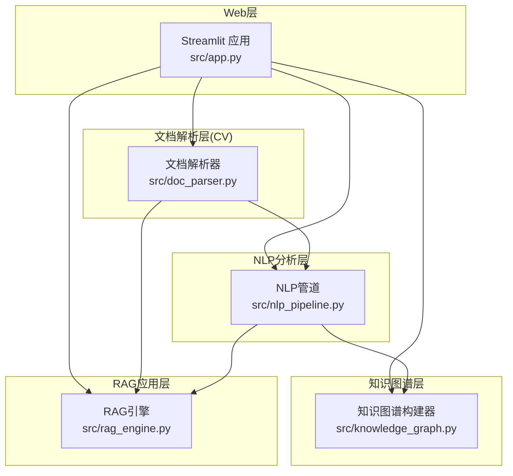
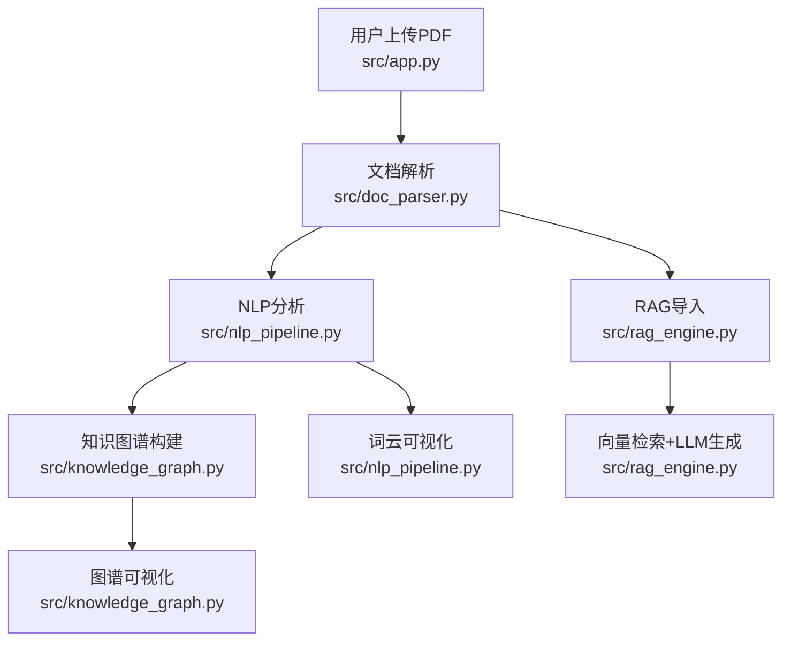
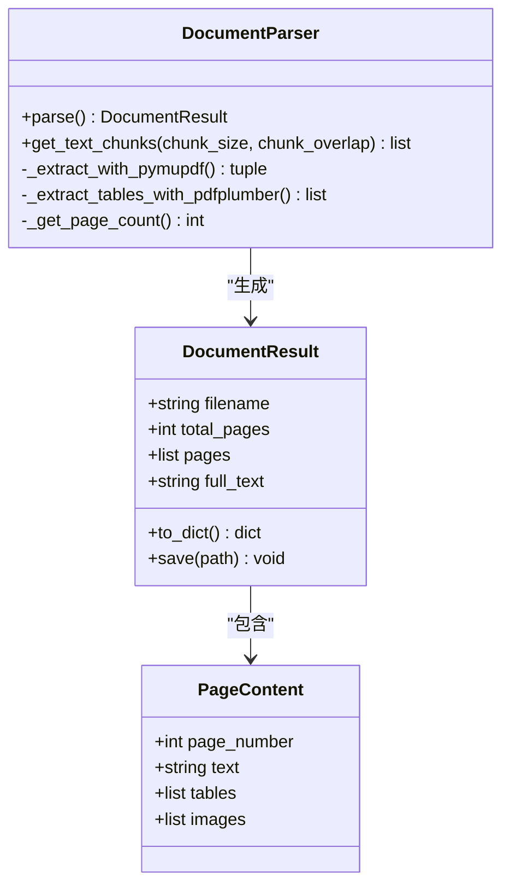
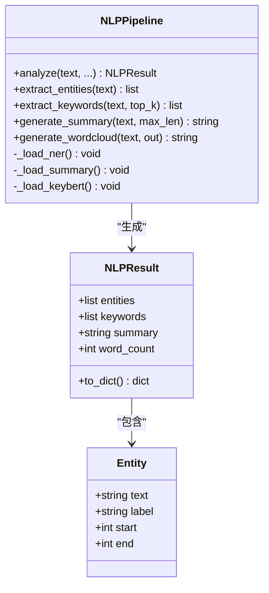
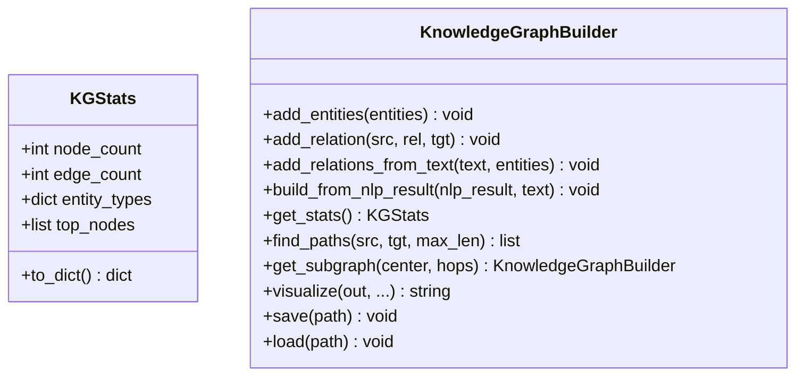
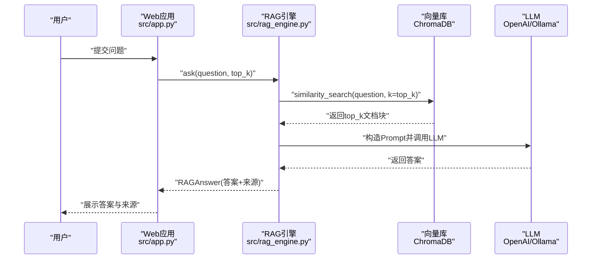
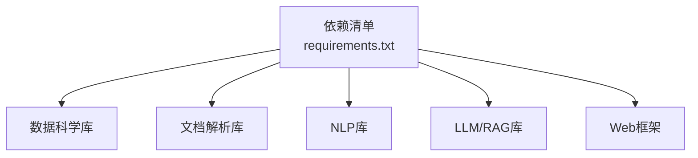

# 项目概述

<cite>
**本文引用的文件**
- [app.py](file://zhixi/src/app.py)
- [doc_parser.py](file://zhixi/src/doc_parser.py)
- [nlp_pipeline.py](file://zhixi/src/nlp_pipeline.py)
- [knowledge_graph.py](file://zhixi/src/knowledge_graph.py)
- [rag_engine.py](file://zhixi/src/rag_engine.py)
- [requirements.txt](file://zhixi/requirements.txt)
- [test_core.py](file://zhixi/tests/test_core.py)
</cite>

## 目录
1. [引言](#引言)
2. [项目结构](#项目结构)
3. [核心组件](#核心组件)
4. [架构总览](#架构总览)
5. [详细组件分析](#详细组件分析)
6. [依赖关系分析](#依赖关系分析)
7. [性能考虑](#性能考虑)
8. [故障排查指南](#故障排查指南)
9. [结论](#结论)
10. [附录](#附录)

## 引言
智析（ZhiXi）是一个面向文档处理与智能问答的多模态平台，旨在通过Streamlit Web应用提供从PDF文档解析、NLP智能分析、知识图谱构建到RAG智能问答的一体化体验。项目采用模块化设计，围绕“文档解析（CV层）—NLP分析（NLP层）—知识图谱（数据挖掘层）—RAG问答（LLM应用层）”的分层架构，帮助用户快速实现文档内容的结构化理解与智能化检索问答。

项目核心价值与目标：
- 降低文档智能处理门槛：提供开箱即用的Web界面与一键式工作流。
- 多模态内容提取：支持PDF文本、表格、图像的统一解析与结构化输出。
- 智能NLP分析：提供实体识别、关键词提取、自动摘要与词云可视化。
- 知识图谱构建：从实体与共现关系出发，形成可探索的知识网络。
- RAG智能问答：结合向量检索与LLM生成，实现精准、可溯源的问答体验。

## 项目结构
项目采用“src/”作为核心代码目录，“tests/”提供基础单元测试，“data/”用于存放中间产物（如解析结果、图像、图谱与向量数据库）。主要文件与职责如下：
- src/app.py：Streamlit Web应用入口，负责UI布局、流程编排与各模块交互。
- src/doc_parser.py：文档解析模块（CV层），负责PDF文本、表格、图像提取与文本切块。
- src/nlp_pipeline.py：NLP分析模块，提供NER、关键词提取、摘要生成与词云。
- src/knowledge_graph.py：知识图谱模块，负责实体与关系构建、统计分析与可视化。
- src/rag_engine.py：RAG问答引擎，封装向量检索与LLM问答流程。
- requirements.txt：依赖清单，覆盖数据科学、文档解析、NLP、LLM与Web框架。
- tests/test_core.py：核心数据结构与逻辑的基础测试。

图表来源
- [app.py:463-492](file://zhixi/src/app.py#L463-L492)
- [doc_parser.py:64-144](file://zhixi/src/doc_parser.py#L64-L144)
- [nlp_pipeline.py:45-145](file://zhixi/src/nlp_pipeline.py#L45-L145)
- [knowledge_graph.py:44-173](file://zhixi/src/knowledge_graph.py#L44-L173)
- [rag_engine.py:47-94](file://zhixi/src/rag_engine.py#L47-L94)

章节来源
- [app.py:1-492](file://zhixi/src/app.py#L1-L492)
- [requirements.txt:1-45](file://zhixi/requirements.txt#L1-L45)

## 核心组件
- 文档解析（CV层）
  - 功能：从PDF中提取文本、表格、图像；将全文切分为重叠文本块，供RAG使用。
  - 关键数据结构：PageContent、DocumentResult。
  - 典型接口：parse()、get_text_chunks()。
- NLP分析（NLP层）
  - 功能：命名实体识别（NER）、关键词提取（KeyBERT）、自动摘要（BART）、词云生成。
  - 关键数据结构：Entity、NLPResult。
  - 典型接口：analyze()、extract_entities()、extract_keywords()、generate_summary()、generate_wordcloud()。
- 知识图谱（数据挖掘层）
  - 功能：从实体与文本共现关系构建图谱；统计分析与可视化；路径查找与子图提取。
  - 关键数据结构：KGStats。
  - 典型接口：add_entities()、add_relation()、add_relations_from_text()、visualize()、find_paths()、get_subgraph()。
- RAG问答（LLM应用层）
  - 功能：文档块向量化导入ChromaDB；相似检索；构造Prompt并调用LLM生成答案；返回可溯源来源。
  - 关键数据结构：RAGAnswer。
  - 典型接口：ingest_documents()、ask()、search()、clear_collection()。

章节来源
- [doc_parser.py:32-144](file://zhixi/src/doc_parser.py#L32-L144)
- [nlp_pipeline.py:24-145](file://zhixi/src/nlp_pipeline.py#L24-L145)
- [knowledge_graph.py:27-173](file://zhixi/src/knowledge_graph.py#L27-L173)
- [rag_engine.py:30-94](file://zhixi/src/rag_engine.py#L30-L94)

## 架构总览
智析采用四层架构，从底层的文档解析到顶层的RAG问答，层层递进、数据驱动：
- 文档解析层：负责结构化提取与文本切分。
- NLP分析层：对文本进行语义层面的结构化标注与摘要。
- 知识图谱层：将实体与关系可视化，支撑探索式分析。
- RAG应用层：结合向量检索与LLM生成，提供可溯源的智能问答。

图表来源
- [app.py:144-421](file://zhixi/src/app.py#L144-L421)
- [doc_parser.py:98-144](file://zhixi/src/doc_parser.py#L98-L144)
- [nlp_pipeline.py:106-145](file://zhixi/src/nlp_pipeline.py#L106-L145)
- [knowledge_graph.py:137-173](file://zhixi/src/knowledge_graph.py#L137-L173)
- [rag_engine.py:154-263](file://zhixi/src/rag_engine.py#L154-L263)

## 详细组件分析

### 文档解析模块（CV层）
- 设计要点
  - 使用PyMuPDF提取文本与图像，pdfplumber提取表格，具备降级策略（表格提取失败时返回空表）。
  - 输出结构化结果DocumentResult，包含每页PageContent（文本、表格、图像路径）与全文。
  - 提供文本切块方法，支持可配置的块大小与重叠，便于后续RAG导入。
- 数据结构与复杂度
  - PageContent：O(1)访问字段；DocumentResult：序列化为字典，便于保存为JSON。
  - 文本切块算法按段落优先，时间复杂度近似O(N)，空间复杂度O(N_chunks)。
- 错误处理
  - 文件不存在抛出异常；表格提取异常时返回与页数匹配的空表列表，保证流程稳定。
- 性能与优化
  - 使用进度条与延迟关闭文档句柄，减少资源占用。
  - 图像提取可开关，避免不必要的IO。

图表来源
- [doc_parser.py:32-144](file://zhixi/src/doc_parser.py#L32-L144)
- [doc_parser.py:64-268](file://zhixi/src/doc_parser.py#L64-L268)

章节来源
- [doc_parser.py:1-319](file://zhixi/src/doc_parser.py#L1-L319)

### NLP分析模块
- 设计要点
  - 延迟加载模型（NER、摘要、KeyBERT），按需初始化，降低内存占用。
  - analyze()统一入口，支持按需启用实体识别、关键词提取与摘要生成。
  - 词云生成支持清理停用词与短词，提升可视化质量。
- 数据结构与复杂度
  - Entity与NLPResult均为轻量数据类，便于序列化与传递。
  - NER与KeyBERT均对输入长度有限制，内部做了截断处理。
- 错误处理
  - 模型加载与推理异常时返回空结果或降级摘要，保证流程可用。
- 性能与优化
  - 限制输入长度避免显存溢出；关键词提取支持1-2词短语组合，兼顾语义代表性。

图表来源
- [nlp_pipeline.py:24-145](file://zhixi/src/nlp_pipeline.py#L24-L145)
- [nlp_pipeline.py:45-262](file://zhixi/src/nlp_pipeline.py#L45-L262)

章节来源
- [nlp_pipeline.py:1-312](file://zhixi/src/nlp_pipeline.py#L1-L312)

### 知识图谱模块
- 设计要点
  - 支持有向/无向图，批量添加实体与关系；从NLP结果与原文本中提取共现关系。
  - 提供统计分析（节点/边数、实体类型分布、度中心性排序）与可视化（Matplotlib）。
  - 支持路径查找与子图提取，便于深入探索。
- 数据结构与复杂度
  - 使用NetworkX图结构，节点属性包含实体类型与权重；边属性包含关系标签。
  - 可视化时若节点过多，自动选取度最高的节点子集，避免渲染压力。
- 错误处理
  - 节点不存在时抛出异常；可视化失败时返回None并打印错误日志。
- 性能与优化
  - 子图提取采用BFS邻居扩展，复杂度近似O(V+E)；可视化布局参数可调。

图表来源
- [knowledge_graph.py:27-173](file://zhixi/src/knowledge_graph.py#L27-L173)
- [knowledge_graph.py:44-329](file://zhixi/src/knowledge_graph.py#L44-L329)

章节来源
- [knowledge_graph.py:1-412](file://zhixi/src/knowledge_graph.py#L1-L412)

### RAG问答引擎
- 设计要点
  - 支持OpenAI API与本地Ollama两种模式，按环境变量动态切换。
  - 文档块导入ChromaDB（嵌入函数可选OpenAI或Ollama），相似检索后构造Prompt并调用LLM生成答案。
  - 结果包含答案与来源（可溯源），便于验证与回溯。
- 数据结构与复杂度
  - RAGAnswer包含问题、答案、来源列表与所用模型；向量检索复杂度取决于向量库实现与维度。
- 错误处理
  - LLM调用异常时返回错误提示；未检索到相关文档时返回提示信息。
- 性能与优化
  - 批量导入文档块，分批写入向量库；Prompt构造清晰，便于控制上下文长度。

图表来源
- [app.py:423-461](file://zhixi/src/app.py#L423-L461)
- [rag_engine.py:192-263](file://zhixi/src/rag_engine.py#L192-L263)

章节来源
- [rag_engine.py:1-362](file://zhixi/src/rag_engine.py#L1-L362)

## 依赖关系分析
项目依赖覆盖数据科学、文档解析、NLP、LLM与Web框架，关键依赖包括：
- 数据科学：numpy、pandas、matplotlib、seaborn、scikit-learn。
- 文档解析：PyMuPDF、pdfplumber、opencv-python、PaddleOCR、Pillow。
- NLP：transformers、torch、spacy、keybert、wordcloud。
- LLM/RAG：langchain、langchain-community、langchain-openai、chromadb、openai、tiktoken。
- Web：streamlit、python-dotenv、tqdm。

图表来源
- [requirements.txt:6-45](file://zhixi/requirements.txt#L6-L45)

章节来源
- [requirements.txt:1-45](file://zhixi/requirements.txt#L1-L45)

## 性能考虑
- 模型延迟加载：NLP与RAG模块均采用延迟初始化，避免启动时占用大量内存。
- 输入长度限制：NER、KeyBERT、摘要生成均对输入长度做截断，防止显存溢出。
- 向量库批处理：RAG导入文档块采用批量写入，提高吞吐。
- 可视化降采样：知识图谱可视化时自动筛选度高的节点，避免渲染性能问题。
- 缓存与持久化：向量库与图谱数据持久化，避免重复计算与导入。

## 故障排查指南
- 文档解析失败
  - 症状：解析报错或表格为空。
  - 排查：确认PDF路径有效；检查pdfplumber是否正常；观察降级行为（表格提取失败时返回空表列表）。
- NLP分析报错
  - 症状：首次运行模型加载缓慢或报错。
  - 排查：确保已安装transformers、torch、keybert、wordcloud；首次运行需下载模型权重。
- 知识图谱可视化失败
  - 症状：图谱未生成或报错。
  - 排查：确认matplotlib字体设置；检查输出路径权限；节点过多时自动降采样。
- RAG问答无结果
  - 症状：未检索到相关文档块。
  - 排查：确认已成功导入文档块；检查向量库是否持久化；适当增大top_k；检查LLM连接（OpenAI API Key或Ollama服务）。

章节来源
- [doc_parser.py:178-203](file://zhixi/src/doc_parser.py#L178-L203)
- [nlp_pipeline.py:76-104](file://zhixi/src/nlp_pipeline.py#L76-L104)
- [knowledge_graph.py:241-312](file://zhixi/src/knowledge_graph.py#L241-L312)
- [rag_engine.py:212-223](file://zhixi/src/rag_engine.py#L212-L223)

## 结论
智析（ZhiXi）通过清晰的分层架构与模块化设计，将PDF文档解析、NLP智能分析、知识图谱构建与RAG问答有机整合，既适合初学者快速上手，也为有经验的开发者提供了可扩展的技术基座。依托Streamlit的直观界面与强大的生态组件，项目在易用性与功能性之间取得了良好平衡，能够广泛应用于学术研究、企业文档管理与知识服务等领域。

## 附录
- 实际使用场景与价值主张
  - 学术研究：快速解析论文PDF，提取关键词与摘要，构建知识图谱辅助阅读与写作。
  - 企业文档：将合同、报告、白皮书等结构化，支持RAG问答与知识检索。
  - 知识服务：对海量文档进行实体抽取与关系发现，形成可探索的知识网络。
- 快速开始
  - 安装依赖：pip install -r requirements.txt
  - 启动Web应用：cd zhixi && streamlit run src/app.py
  - 配置LLM：在侧边栏选择OpenAI API或本地Ollama模式，并设置相应参数。
  - 上传PDF并依次执行：解析文档 → NLP分析 → 知识图谱 → RAG问答。